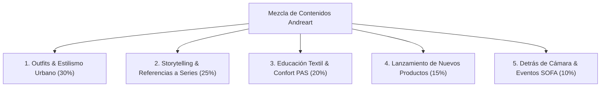
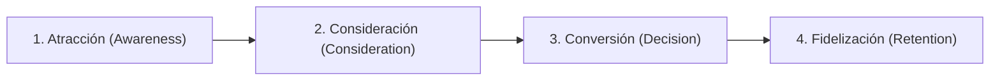

# Master Content Strategy: Andreart Vestuario

> [Por definir]

---

## 📌 Índice de Contenidos

- [Por definir]
- [Por definir]
- [Por definir]
- [Por definir]
- [Por definir]
- [Por definir]

---

## 1. MARCO GENERAL & ALINEACIÓN DE NEGOCIO

### 1.1 Propósito Estratégico

### 1.2 Atributos del Producto & Propuesta de Valor
- **Categoría Reclamada: [Por definir]
- **Diseñadora Principal: [Por definir]
- **Atributos Clave: [Por definir]
- **Tono Comercial: [Por definir]

---

## 2. MATRIZ DE LOS 5 TIPOS DE PUBLICACIONES (CONTENT MIX)

---

### TIPO 1: Outfits & Estilismo Urbano (30% de la Producción)
- **Objetivo: [Por definir]
- **Ángulos de Contenido: [Por definir]
- [Por definir]
- [Por definir]
- [Por definir]

---

### TIPO 2: Storytelling & Referencias a Series/Anime (25% de la Producción)
- **Objetivo: [Por definir]
- **Ángulos de Contenido: [Por definir]
- [Por definir]
- [Por definir]
- [Por definir]

---

### TIPO 3: Educación Textil & Confort PAS (20% de la Producción)
- **Objetivo: [Por definir]
- **Ángulos de Contenido: [Por definir]
- [Por definir]
- [Por definir]
- [Por definir]

---

### TIPO 4: Lanzamiento de Nuevos Productos (15% de la Producción)
- **Objetivo: [Por definir]
- **Ángulos de Contenido: [Por definir]
- [Por definir]
- [Por definir]
- [Por definir]

---

### TIPO 5: Detrás de Cámara & Eventos (SOFA/ComicCon) (10% de la Producción)
- **Objetivo: [Por definir]
- **Ángulos de Contenido: [Por definir]
- [Por definir]
- [Por definir]
- [Por definir]

---

## 3. MATRIZ DE CONTENIDO SEARCHABLE VS. SHAREABLE

### 3.1 Contenido Searchable (Captura de Demanda Existente - Web & SEO)

| [Por definir] | [Por definir] | [Por definir] | [Por definir] |
|---|---|---|---|
| [Por definir] | [Por definir] | [Por definir] | [Por definir] |
| [Por definir] | [Por definir] | [Por definir] | [Por definir] |
| [Por definir] | [Por definir] | [Por definir] | [Por definir] |
| [Por definir] | [Por definir] | [Por definir] | [Por definir] |
| [Por definir] | [Por definir] | [Por definir] | [Por definir] |

### 3.2 Contenido Shareable (Creación de Demanda - Instagram & TikTok)

| [Por definir] | [Por definir] | [Por definir] | [Por definir] |
|---|---|---|---|
| [Por definir] | [Por definir] | [Por definir] | [Por definir] |
| [Por definir] | [Por definir] | [Por definir] | [Por definir] |
| [Por definir] | [Por definir] | [Por definir] | [Por definir] |

---

## 4. MAPEO DE CONTENIDOS POR ETAPA DEL COMPRADOR (BUYER JOURNEY)

### Etapa 1: Atracción (Awareness)
- **Formato: [Por definir]
- **Mensaje: [Por definir]

### Etapa 2: Consideración (Consideration)
- **Formato: [Por definir]
- **Mensaje: [Por definir]

### Etapa 3: Conversión (Decision)
- **Formato: [Por definir]
- **Mensaje: [Por definir]

### Etapa 4: Fidelización (Retention)
- **Formato: [Por definir]
- **Mensaje: [Por definir]

---

## 5. ESTRATEGIA POR CANAL & REDES SOCIALES

### 5.1 Instagram (`@andreartvestuario`)
- **Frecuencia Sostenible: [Por definir]
- **Enfoque: [Por definir]

### 5.2 TikTok
- **Frecuencia: [Por definir]
- **Enfoque: [Por definir]

### 5.3 Blog & E-Commerce D2C
- **Frecuencia: [Por definir]
- **Enfoque: [Por definir]

---

## 6. PLAN DE EJECUCIÓN & HOJA DE RUTA

