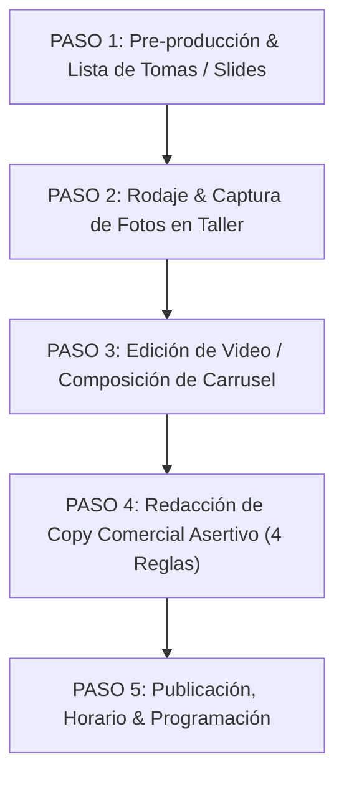

---
- [Por definir]
- [Por definir]
- [Por definir]
- [Por definir]
- [Por definir]
- [Por definir]
- [Por definir]
---

# Guía Técnica & Manual de Producción de Contenido (SOP)


> [Por definir]

---

## 📌 Índice del Manual Técnico

- [Por definir]
- [Por definir]
- [Por definir]
- [Por definir]
- [Por definir]
- [Por definir]
- [Por definir]
- [Por definir]
- [Por definir]
- [Por definir]
- [Por definir]
- [Por definir]
- [Por definir]
- [Por definir]

---

## 1. ESPECIFICACIONES TÉCNICAS DE GRABACIÓN (CÁMARA & AUDIO)

| [Por definir] | [Por definir] | [Por definir] |
|---|---|---|
| **Relación de Aspecto (Video)** | [Por definir] | [Por definir] |
| **Relación de Aspecto (Carruseles)** | [Por definir] | [Por definir] |
| **Resolución de Video** | [Por definir] | [Por definir] |
| **Iluminación** | [Por definir] | [Por definir] |
| **Lente** | [Por definir] | [Por definir] |
| **Audio** | [Por definir] | [Por definir] |

---

## 2. PROTOCOLO DE PRODUCCIÓN EN 5 PASOS (FLUJO ORDENADO)



---

### PASO 1: PRE-PRODUCCIÓN & PREPARACIÓN (Antes de grabar)

---

### PASO 2: RODAJE & CAPTURA EN TALLER (Durante la grabación)
- [Por definir]
- [Por definir]
- [Por definir]
- [Por definir]

---

### PASO 3: EDICIÓN & POST-PRODUCCIÓN (Montaje de video / Carrusel)

---

### PASO 4: REDACCIÓN DE COPY COMERCIAL ASERTIVO (Aplicar Voz Andreart)

---

### PASO 5: PUBLICACIÓN & DISTRIBUCIÓN

---

## 3. GUÍA DIRECTORIAL DE RODAJE & REQUERIMIENTOS TÉCNICOS POR ESCENA

---

### 🎬 ESCENA 1: EL GANCHO VISUAL & AUDITIVO (HOOK - 00:00 A 00:03)
- **¿Qué se graba exactamente?: [Por definir]
- **Requerimientos de Producción: [Por definir]
- **Ángulo de Cámara: [Por definir]
- **Por qué este ángulo: [Por definir]
- **Iluminación: [Por definir]
- **Captura de Audio: [Por definir]
- **Justificación Técnica: [Por definir]

---

### 🎬 ESCENA 2: DESARROLLO TÉCNICO & ARTESANÍA (00:03 A 00:10)
- **¿Qué se graba exactamente?: [Por definir]
- **Requerimientos de Producción: [Por definir]
- **Ángulo de Cámara: [Por definir]
- **Por qué este ángulo: [Por definir]
- **Iluminación: [Por definir]
- **Captura de Audio: [Por definir]
- **Justificación Técnica: [Por definir]

---

### 🎬 ESCENA 3: DEMOSTRACIÓN DE DENSIDAD & CONFORT PAS (00:10 A 00:18)
- **¿Qué se graba exactamente?: [Por definir]
- **Requerimientos de Producción: [Por definir]
- **Ángulo de Cámara: [Por definir]
- **Por qué este ángulo: [Por definir]
- **Iluminación: [Por definir]
- **Captura de Audio: [Por definir]
- **Justificación Técnica: [Por definir]

---

### 🎬 ESCENA 4: EL CIERRE COMERCIAL & ACTITUD HEROICA (00:18 A 00:25)
- **¿Qué se graba exactamente?: [Por definir]
- **Requerimientos de Producción: [Por definir]
- **Ángulo de Cámara: [Por definir]
- **Por qué este ángulo: [Por definir]
- **Iluminación: [Por definir]
- **Captura de Audio: [Por definir]
- **Justificación Técnica: [Por definir]

---

## 4. MATRIZ DE TOMAS REQUERIDAS POR TIPO DE CONTENIDO

| [Por definir] | [Por definir] | [Por definir] | [Por definir] | [Por definir] |
|---|---|---|---|---|
| [Por definir] | [Por definir] | [Por definir] | [Por definir] | [Por definir] |
| [Por definir] | [Por definir] | [Por definir] | [Por definir] | [Por definir] |
| [Por definir] | [Por definir] | [Por definir] | [Por definir] | [Por definir] |
| [Por definir] | [Por definir] | [Por definir] | [Por definir] | [Por definir] |

---

## 5. ESTRUCTURA DE EDICIÓN DE VIDEO (REELS & TIKTOK)

```
[00:00 - 00:03] HOOK VISUAL (Escena 1): Toma macro de impacto (corte de tela / tiza).
[00:03 - 00:10] DESARROLLO TÉCNICO (Escena 2): 3 tomas cenitales rápidas mostrando artesanía en Bogotá.
[00:10 - 00:18] DEMOSTRACIÓN (Escena 3): Caída pesada en slow-motion + marquilla estampada PAS.
[00:18 - 00:25] CTA HEROICO (Escena 4): Contrapicado con actitud + Texto "Pide el tuyo en la bio. Sé tu propio héroe".
```

---

## 6. MANUAL DE PRODUCCIÓN DE CARRUSELES VISUALES (4 SLIDES 4:5)

### 📐 Anatomía de los 4 Slides de Alta Conversión

```
┌────────────────────────────────────────────────────────────────────────────────────────┐
│                        ESTRUCTURA DE LOS 4 SLIDES DE CARRUSEL                          │
├────────────────────────────────────────────────────────────────────────────────────────┤
│ SLIDE 1: PORTADA HERO (Atracción Visual Inmediata)                                     │
│ • Fotografía de la prenda en modelo o maniquí con iluminación de contraste.           │
│ • Titular gancho integrado: "No naciste para vestir ropa aburrida."                    │
├────────────────────────────────────────────────────────────────────────────────────────┤
│ SLIDE 2: FIGURÍN TÉCNICO EN LÍNEAS (Diseño de Autor & Moldería)                        │
│ • Ilustración técnica estilo croquis arquitectónico en líneas finas sobre fondo neutro │
│ • Cotas y anotaciones de autor: Moldería inteligente XS a XL, silueta deconstruida.    │
├────────────────────────────────────────────────────────────────────────────────────────┤
│ SLIDE 3: PLANOS DETALLE & CONFORT PAS (Prueba de Calidad Textil)                       │
│ • Close-ups a la textura de alto gramaje y marquilla estampada (cero picazón táctil).  │
│ • Micro-copy: "Telas de caída pesada. Marquilla estampada sin roce (Confort PAS)."     │
├────────────────────────────────────────────────────────────────────────────────────────┤
│ SLIDE 4: CIERRE COMERCIAL CTA (Conversión & Actitud Heroica)                           │
│ • Composición gráfica con la prenda, badges de confección en Bogotá y botón directo.   │
│ • Copy de cierre: "Pide el tuyo hoy en la bio. Sé tu propio héroe. 🛡️"                 │
└────────────────────────────────────────────────────────────────────────────────────────┘
```

### 📁 Pipeline de Generación de Activos & Organización en Obsidian
- **Carpeta de Activos: [Por definir]
- [Por definir]
- [Por definir]
- [Por definir]
- [Por definir]
- **Nota Entregable en Obsidian: [Por definir]

---

## 7. CHECKLIST TÉCNICO DE VERIFICACIÓN

### 📋 Antes de Salir a Grabar / Fotografiar:
- [Por definir]
- [Por definir]
- [Por definir]

### 📋 Durante el Rodaje:
- [Por definir]
- [Por definir]
- [Por definir]
- [Por definir]

### 📋 Antes de Dar "Publicar":
- [Por definir]
- [Por definir]
- [Por definir]

---

## 8. Historial de Revisiones (Changelog)

- **v1.2 (2026-08-09): [Por definir]
- **v1.1 (2026-08-08): [Por definir]
- **v1.0 (2026-08-08): [Por definir]

---

## 🔗 Referencias Cruzadas
- [Por definir]
- [Por definir]
