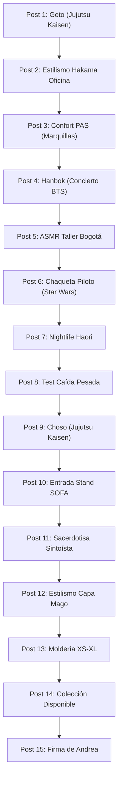

# Parrilla Estratégica de Publicaciones para Instagram (15 Días)

*Matriz Maestra Intercalada y Sincronizada para @andreartvestuario*  
*Folder: 07 Paid, Social & Community / Social Content*  
*Last updated: 2026-08-20*

> 🛡️ **Eslogan Oficial de Marca:** *"Sé tu propio héroe"*

---

## 📊 TABLA MAESTRA DE ALINEACIÓN & ESTADO (15 DÍAS)

Esta tabla mantiene la **alineación 1-a-1** entre la planificación estratégica, los ganchos comerciales, los llamados a la acción (CTA), los textos alternativos accesibles (Alt Text), los hashtags de posicionamiento, las notas de contenido en Obsidian y las carpetas de activos visuales:

| # | Fecha | Prenda / Concepto | Referencia Cultural | Gancho Principal (Hook) | Subtexto (CTA) | Texto Alt (SEO & Accesibilidad) | Hashtags | Copy Completo (Listo para Copiar) | Formato | Estado | ¿Publicado? | Link Publicación | Nota Entregable | Activos Visuales |
|---|---|---|---|---|---|---|---|---|---|---|---|---|---|---|
| **1** | `2026-08-10` | **Hanbok Reinterpretado de Autor** | *BTS / Eventos K-Pop* | *"El outfit perfecto y elegante para el próximo concierto de BTS ya está aquí."* | 👉 Pide el tuyo en el link de la bio o escríbenos por DM antes de agotar la tanda del taller. | *Fotografía de moda de autor mostrando un Hanbok reinterpretado en Jeogori corto negro y falda morada jacquard sobre fondo urbano.* | `#Andreart #ModaDeAutor #UrbanFantasy #BogotaModa #SeTuPropioHeroe #HanbokUrbano #BTSColombia #KpopBogota #BTSOutfit` | `El outfit perfecto y elegante para el próximo concierto de BTS ya está aquí.  👉 Pide el tuyo en el link de la bio o escríbenos por DM antes de agotar la tanda del taller.  Sé tu propio héroe. 🛡️  #Andreart #ModaDeAutor #UrbanFantasy #BogotaModa #SeTuPropioHeroe #HanbokUrbano #BTSColombia #KpopBogota #BTSOutfit` | 🖼️ Carrusel (4:5) | 🟡 NOTA CREADA | [x] | *(Sin link)* | [[07 Paid, Social & Community/Social Content/2026-08-10-instagram-carrusel-hanbok-reinterpretado-concierto-bts.md|📄 Ver Nota]] | *(Sin assets)* |
| **2** | `2026-08-11` | **Prenda Suguru Geto de Autor** | *Jujutsu Kaisen — Suguru Geto* | *"Camina por la ciudad con la presencia imponente de Suguru Geto."* | 👉 Comenta 'GETO' para enviarte la ficha técnica y disponibilidad por mensaje directo. | *Chaqueta y silueta de autor inspirada en Suguru Geto de Jujutsu Kaisen con caída pesada y abrigo oscuro urbano.* | `#Andreart #ModaDeAutor #UrbanFantasy #BogotaModa #SeTuPropioHeroe #SuguruGeto #JujutsuKaisenColombia #AnimeFashion #CosplayUrbano` | `Camina por la ciudad con la presencia imponente de Suguru Geto.  👉 Comenta 'GETO' para enviarte la ficha técnica y disponibilidad por mensaje directo.  Sé tu propio héroe. 🛡️  #Andreart #ModaDeAutor #UrbanFantasy #BogotaModa #SeTuPropioHeroe #SuguruGeto #JujutsuKaisenColombia #AnimeFashion #CosplayUrbano` | 🎬 Reel (9:16) | 🟢 LISTO | [ ] | *(Sin link)* | [[07 Paid, Social & Community/Social Content/2026-08-10-instagram-jujutsu-kaisen-suguru-geto.md|📄 Ver Nota]] | *(Video directo)* |
| **3** | `2026-08-12` | **Prendas con Marquilla Estampada** | *Sensibilidad Táctil PAS* | *"Si tienes piel sensible, esta marquilla te va a cambiar la vida."* | 👉 Descubre el confort PAS en nuestra tienda web. Enlace directo en la bio. | *Acercamiento macro a la marquilla estampada suave sin costuras ni etiquetas molestas sobre tela de algodón peruano de alto gramaje.* | `#Andreart #ModaDeAutor #ConfortPAS #PielSensible #BogotaModa #SeTuPropioHeroe #RopaSinEtiquetas #SensibilidadTactil` | `Si tienes piel sensible, esta marquilla te va a cambiar la vida.  👉 Descubre el confort PAS en nuestra tienda web. Enlace directo en la bio.  Sé tu propio héroe. 🛡️  #Andreart #ModaDeAutor #ConfortPAS #PielSensible #BogotaModa #SeTuPropioHeroe #RopaSinEtiquetas #SensibilidadTactil` | 🎬 Reel (9:16) | 🟢 LISTO | [ ] | *(Sin link)* | [[07 Paid, Social & Community/Social Content/2026-08-12-instagram-confort-pas-marquilla-fantasma.md|📄 Ver Nota]] | *(Video directo)* |
| **4** | `2026-08-13` | **Pantalón Hakama Unisex** | *Samurái Urbano / Oficina Tech* | *"3 formas de llevar tu Hakama a la oficina sin parecer disfraz."* | 👉 Guarda este carrusel para tu próximo outfit y pide el tuyo en el enlace de la bio. | *Pantalón Hakama unisex de corte ancho combinando estilismo samurái urbano con blazer casual de oficina.* | `#Andreart #ModaDeAutor #UrbanFantasy #HakamaUrbano #SamuraiUrbano #OficinaTech #EstilismoUrbano #SeTuPropioHeroe` | `3 formas de llevar tu Hakama a la oficina sin parecer disfraz.  👉 Guarda este carrusel para tu próximo outfit y pide el tuyo en el enlace de la bio.  Sé tu propio héroe. 🛡️  #Andreart #ModaDeAutor #UrbanFantasy #HakamaUrbano #SamuraiUrbano #OficinaTech #EstilismoUrbano #SeTuPropioHeroe` | 🖼️ Carrusel (4:5) | 🟡 NOTA CREADA | [ ] | *(Sin link)* | [[07 Paid, Social & Community/Social Content/2026-08-09-instagram-carrusel-pantalon-hakama-oficina-tech.md|📄 Ver Nota]] | *(Sin assets)* |
| **5** | `2026-08-14` | **Corte de Telas Pesadas** | *Taller Bogotá / ASMR Textil* | *"15 segundos de satisfacción pura cortando tela en nuestro taller."* | 👉 Apoya el diseño de autor hecho en Bogotá guardando y compartiendo este Reel. | *Tijera profesional de confección cortando tela textil pesada sobre la mesa de patronaje del taller en Bogotá.* | `#Andreart #ModaDeAutor #TallerBogota #ASMRTextil #ConfeccionEtica #DiseñoColombiano #SeTuPropioHeroe #Craftsmanship` | `15 segundos de satisfacción pura cortando tela en nuestro taller.  👉 Apoya el diseño de autor hecho en Bogotá guardando y compartiendo este Reel.  Sé tu propio héroe. 🛡️  #Andreart #ModaDeAutor #TallerBogota #ASMRTextil #ConfeccionEtica #DiseñoColombiano #SeTuPropioHeroe #Craftsmanship` | 🎬 Reel (9:16) | 🟢 LISTO | [ ] | *(Sin link)* | [[07 Paid, Social & Community/Social Content/2026-08-14-instagram-asmr-taller-bogota-corte-tijera.md|📄 Ver Nota]] | *(Video directo)* |
| **6** | `2026-08-15` | **Chaqueta de Piloto Galáctico** | *Star Wars — Escuadrones Galácticos* | *"Siente la mística de un Piloto Galáctico en tu abrigo de todos los días."* | 👉 Pide tu Chaqueta de Piloto en la web antes de cerrar pedidos del mes. | *Chaqueta de abrigo de autor inspirada en escuadrones de cazas galácticos con detalles de moldería técnica.* | `#Andreart #ModaDeAutor #UrbanFantasy #StarWarsColombia #ChaquetaPiloto #SciFiFashion #SeTuPropioHeroe #BogotaModa` | `Siente la mística de un Piloto Galáctico en tu abrigo de todos los días.  👉 Pide tu Chaqueta de Piloto en la web antes de cerrar pedidos del mes.  Sé tu propio héroe. 🛡️  #Andreart #ModaDeAutor #UrbanFantasy #StarWarsColombia #ChaquetaPiloto #SciFiFashion #SeTuPropioHeroe #BogotaModa` | 🎬 Reel (9:16) | 🟢 LISTO | [ ] | *(Sin link)* | [[07 Paid, Social & Community/Social Content/2026-08-15-instagram-star-wars-chaqueta-piloto.md|📄 Ver Nota]] | *(Video directo)* |
| **7** | `2026-08-16` | **Haori de Autor** | *Cyberpunk Edgerunners* | *"Basta de buzos aburridos para salir de fiesta los viernes."* | 👉 Haz tu pedido directo por WhatsApp o en el link de nuestro perfil. | *Haori urbano deconstruido en tono negro profundo para salidas nocturnas sobre ropa casual.* | `#Andreart #ModaDeAutor #UrbanFantasy #HaoriUrbano #NightlifeBogota #CyberpunkEdgerunners #SeTuPropioHeroe #OutfitsNoche` | `Basta de buzos aburridos para salir de fiesta los viernes.  👉 Haz tu pedido directo por WhatsApp o en el link de nuestro perfil.  Sé tu propio héroe. 🛡️  #Andreart #ModaDeAutor #UrbanFantasy #HaoriUrbano #NightlifeBogota #CyberpunkEdgerunners #SeTuPropioHeroe #OutfitsNoche` | 🖼️ Carrusel (4:5) | 🟡 NOTA CREADA | [ ] | *(Sin link)* | [[07 Paid, Social & Community/Social Content/2026-08-09-instagram-carrusel-haori-urbano-nightlife.md|📄 Ver Nota]] | *(Sin assets)* |
| **8** | `2026-08-17` | **Textiles de Alto Gramaje** | *Calidad de Autor vs Fast-Fashion* | *"Por qué la ropa barata se ve transparente y deforme a la primera lavada."* | 👉 Invierte en piezas de autor duraderas. Revisa la colección en la bio. | *Prueba visual comparando la caída limpia de una tela textil de alto gramaje versus una prenda fast fashion.* | `#Andreart #ModaDeAutor #EducacionTextil #AltoGramaje #CalidadDeAutor #SlowFashionColombia #SeTuPropioHeroe` | `Por qué la ropa barata se ve transparente y deforme a la primera lavada.  👉 Invierte en piezas de autor duraderas. Revisa la colección en la bio.  Sé tu propio héroe. 🛡️  #Andreart #ModaDeAutor #EducacionTextil #AltoGramaje #CalidadDeAutor #SlowFashionColombia #SeTuPropioHeroe` | 🎬 Reel (9:16) | 🟢 LISTO | [ ] | *(Sin link)* | [[07 Paid, Social & Community/Social Content/2026-08-17-instagram-test-caida-pesada-telas-autor.md|📄 Ver Nota]] | *(Video directo)* |
| **9** | `2026-08-18` | **Silueta Choso de Autor** | *Jujutsu Kaisen — Choso* | *"Llegó la prenda inspirada en la intensidad y nobleza de Choso."* | 👉 Edición limitada. Escribe 'CHOSO' por DM para reservar tu talla. | *Prenda de autor con la silueta mística e intensa inspirada en Choso de Jujutsu Kaisen.* | `#Andreart #ModaDeAutor #UrbanFantasy #ChosoJujutsuKaisen #JujutsuKaisen #SeTuPropioHeroe #AnimeBogota` | `Llegó la prenda inspirada en la intensidad y nobleza de Choso.  👉 Edición limitada. Escribe 'CHOSO' por DM para reservar tu talla.  Sé tu propio héroe. 🛡️  #Andreart #ModaDeAutor #UrbanFantasy #ChosoJujutsuKaisen #JujutsuKaisen #SeTuPropioHeroe #AnimeBogota` | 🖼️ Carrusel (4:5) | 🟡 NOTA CREADA | [ ] | *(Sin link)* | [[07 Paid, Social & Community/Social Content/2026-08-18-instagram-carrusel-jujutsu-kaisen-choso-autor.md|📄 Ver Nota]] | *(Sin assets)* |
| **10** | `2026-08-19` | **Experiencia Stand Andreart** | *SOFA 2026 Corferias* | *"En SOFA no queremos que entres a un stand común; cruza el portal hacia tu historia."* | 👉 Visítanos en SOFA Corferias. ¡Te esperamos en nuestro stand! | *Stand de experiencia inmersiva Andreart Vestuario en Corferias durante el evento SOFA.* | `#Andreart #ModaDeAutor #SOFA2026 #Corferias #SOFABogota #UrbanFantasy #SeTuPropioHeroe #StandAndreart` | `En SOFA no queremos que entres a un stand común; cruza el portal hacia tu historia.  👉 Visítanos en SOFA Corferias. ¡Te esperamos en nuestro stand!  Sé tu propio héroe. 🛡️  #Andreart #ModaDeAutor #SOFA2026 #Corferias #SOFABogota #UrbanFantasy #SeTuPropioHeroe #StandAndreart` | 🎬 Reel (9:16) | 🟢 LISTO | [ ] | *(Sin link)* | [[07 Paid, Social & Community/Social Content/2026-08-19-instagram-montaje-stand-portal-sofa-corferias.md|📄 Ver Nota]] | *(Video directo)* |
| **11** | `2026-08-20` | **Conjunto Sacerdotisa Sintoísta** | *Tradición Oriental & Anime Místico* | *"La serenidad y mística del templo oriental traducida en moda urbana de autor."* | 👉 Compra la prenda en la tienda web con envíos a toda Colombia. | *Conjunto urbano de autor reinterpretando la estética tradicional de sacerdotisa sintoísta en clave moderna.* | `#Andreart #ModaDeAutor #UrbanFantasy #SacerdotisaSintoista #MisticaOriental #ModaJaponesa #SeTuPropioHeroe` | `La serenidad y mística del templo oriental traducida en moda urbana de autor.  👉 Compra la prenda en la tienda web con envíos a toda Colombia.  Sé tu propio héroe. 🛡️  #Andreart #ModaDeAutor #UrbanFantasy #SacerdotisaSintoista #MisticaOriental #ModaJaponesa #SeTuPropioHeroe` | 🖼️ Carrusel (4:5) | 🟡 NOTA CREADA | [ ] | *(Sin link)* | [[07 Paid, Social & Community/Social Content/2026-08-20-instagram-carrusel-sacerdotisa-sintoista-oriental.md|📄 Ver Nota]] | *(Sin assets)* |
| **12** | `2026-08-21` | **Capa de Mago Contemporáneo** | *Dune / Fantasía Épica* | *"Cómo llevar una Capa de abrigo sobre tu ropa diaria sin parecer disfraz."* | 👉 Asegura tu Capa de Mago en el enlace de la bio. | *Capa de abrigo contemporánea con capota amplia sobre prenda de uso diario en Bogotá.* | `#Andreart #ModaDeAutor #UrbanFantasy #CapaDeMago #DuneStyle #AbrigosBogota #SeTuPropioHeroe` | `Cómo llevar una Capa de abrigo sobre tu ropa diaria sin parecer disfraz.  👉 Asegura tu Capa de Mago en el enlace de la bio.  Sé tu propio héroe. 🛡️  #Andreart #ModaDeAutor #UrbanFantasy #CapaDeMago #DuneStyle #AbrigosBogota #SeTuPropioHeroe` | 🎬 Reel (9:16) | 🟢 LISTO | [ ] | *(Sin link)* | [[07 Paid, Social & Community/Social Content/2026-08-21-instagram-capa-mago-abrigo-invierno-urbano.md|📄 Ver Nota]] | *(Video directo)* |
| **13** | `2026-08-22` | **Moldería Adaptable XS a XL** | *Diseño Unisex & Adaptabilidad* | *"Una sola prenda que abraza con elegancia de la talla XS a la XL."* | 👉 Pide la tuya con asesoría personalizada de talla por DM. | *Demostración de moldería inteligente adaptativa ajustándose de forma estética en tallas desde la XS a la XL.* | `#Andreart #ModaDeAutor #MolderiaInteligente #Multitalla #ModaUnisex #DiseñoInclusivo #SeTuPropioHeroe` | `Una sola prenda que abraza con elegancia de la talla XS a la XL.  👉 Pide la tuya con asesoría personalizada de talla por DM.  Sé tu propio héroe. 🛡️  #Andreart #ModaDeAutor #MolderiaInteligente #Multitalla #ModaUnisex #DiseñoInclusivo #SeTuPropioHeroe` | 🎬 Reel (9:16) | 🟢 LISTO | [ ] | *(Sin link)* | [[07 Paid, Social & Community/Social Content/2026-08-22-instagram-molduria-inteligente-prueba-xs-xl.md|📄 Ver Nota]] | *(Video directo)* |
| **14** | `2026-08-23` | **Colección Cápsula Andreart** | *Despachos Nacionales Colombia* | *"Todas tus prendas favoritas listas para despacho a tu ciudad."* | 👉 Haz tu pedido hoy mismo en la web con envío gratis nacional. | *Mosaico de 5 prendas de la colección cápsula Andreart disponibles para envío inmediato a nivel nacional.* | `#Andreart #ModaDeAutor #UrbanFantasy #ColeccionCapsula #EnDefaultColombia #DespachosNacionales #SeTuPropioHeroe` | `Todas tus prendas favoritas listas para despacho a tu ciudad.  👉 Haz tu pedido hoy mismo en la web con envío gratis nacional.  Sé tu propio héroe. 🛡️  #Andreart #ModaDeAutor #UrbanFantasy #ColeccionCapsula #EnDefaultColombia #DespachosNacionales #SeTuPropioHeroe` | 🖼️ Carrusel (4:5) | 🟡 NOTA CREADA | [ ] | *(Sin link)* | [[07 Paid, Social & Community/Social Content/2026-08-23-instagram-carrusel-recap-coleccion-5-prendas-disponibles.md|📄 Ver Nota]] | *(Sin assets)* |
| **15** | `2026-08-24` | **Diseño y Patronaje por Andrea** | *Taller Bogotá / Sé Tu Propio Héroe* | *"Detrás de cada costura hay una diseñadora que ama las mismas historias que tú."* | 👉 Conoce más sobre nuestro manifiesto y prendas en el link de la bio. | *Andrea, diseñadora de Andreart Vestuario, trabajando en el trazado de patrones y costuras en el taller.* | `#Andreart #ModaDeAutor #DiseñadoraColombiana #TallerBogota #BehindTheScenes #SeTuPropioHeroe` | `Detrás de cada costura hay una diseñadora que ama las mismas historias que tú.  👉 Conoce más sobre nuestro manifiesto y prendas en el link de la bio.  Sé tu propio héroe. 🛡️  #Andreart #ModaDeAutor #DiseñadoraColombiana #TallerBogota #BehindTheScenes #SeTuPropioHeroe` | 🎬 Reel (9:16) | 🟢 LISTO | [ ] | *(Sin link)* | [[07 Paid, Social & Community/Social Content/2026-08-24-instagram-andrea-creadora-firma-de-autor.md|📄 Ver Nota]] | *(Video directo)* |

---

## 📌 Inventario de Productos Clave Incorporados

1. 🌸 **Hanbok Reinterpretado** (Conexión especial con el próximo concierto de BTS / Eventos K-pop).
2. 🩸 **Jujutsu Kaisen — Choso** (Silueta con carácter y mística de personaje de culto).
3. ⛩️ **Sacerdotisa Sintoísta** (Deconstrucción de indumentaria tradicional oriental en moda urbana de autor).
4. 🕶️ **Jujutsu Kaisen — Suguru Geto** (Arquetipo de hechicero oscuro urbano con presencia imponente).
5. 🚀 **Star Wars — Chaqueta de Piloto** (Chaqueta de abrigo galáctico para la vida urbana).

---

## 🗓️ MATRIZ DE 15 PUBLICACIONES INTERCALADAS (DIAGRAMA DE FLUJO)

---

## 🔄 Historial de Revisiones (Changelog)
- **v2.0 (2026-08-20):** Sincronización completa con el Sistema de Alineación Programática: tabla maestra interactiva con enlaces bidireccionales a cada nota entregable y carpeta de activos.
- **v1.0 (2026-08-08):** Creación inicial de la parrilla intercalada de 15 publicaciones.

---

## 🔗 Referencias Cruzadas
- Guía Técnica SOP: [[07 Paid, Social & Community/Social Content/Guia Tecnica de Produccion de Contenido.md]]
- Manual de Identidad Visual: [[01 Brand Context/Brand Visual Style Guide.md]]
- Estrategia Maestra de Contenidos: [[02 Strategy & Research/Content Strategy/Master Content Strategy.md]]
- Contexto de Marca: [[01 Brand Context/product-marketing-context.md]]
