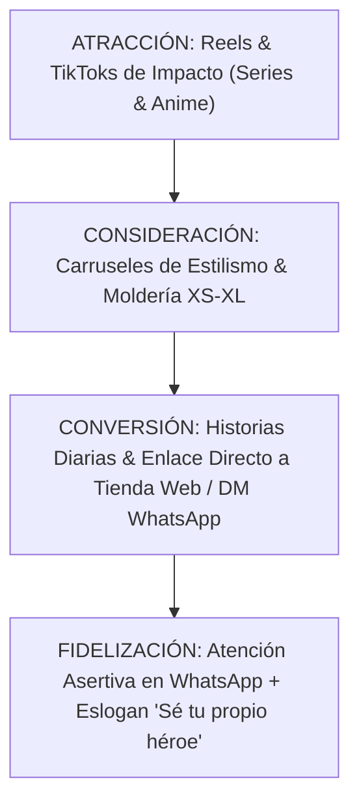

# Propuesta Estratégica de Redes Sociales: Andreart Vestuario

---

## 📌 Índice de Contenidos

- [Por definir]
- [Por definir]
- [Por definir]
- [Por definir]
- [Por definir]
- [Por definir]

---

## 1. OBJETIVO ESTRATÉGICO & DIAGNÓSTICO

### 1.1 Meta Principal

### 1.2 El Giro de Enfoque
- [Por definir]
- [Por definir]
- [Por definir]

---

## 2. MATRIZ DE CANALES & ROLES DE REDES SOCIALES

| [Por definir] | [Por definir] | [Por definir] | [Por definir] |
|---|---|---|---|
| [Por definir] | **Canal Principal de Marca & Conversión** | [Por definir] | [Por definir] |
| [Por definir] | **Alcance Orgánico & Viralidad de Nicho** | [Por definir] | [Por definir] |
| [Por definir] | **Canal de Cierre Comercial Directo** | [Por definir] | [Por definir] |

---

## 3. LOS 4 PILARES DE CONTENIDO

---

### PILAR 1: Outfits & Estilismo Urbano (40% del Contenido)
- **Concepto: [Por definir]
- **Contenidos: [Por definir]
- [Por definir]
- [Por definir]
- [Por definir]

### PILAR 2: Referencias a Series, Anime & Cine (30% del Contenido)
- **Concepto: [Por definir]
- **Contenidos: [Por definir]
- [Por definir]
- [Por definir]
- [Por definir]

### PILAR 3: Moldería Inteligente & Confort PAS (20% del Contenido)
- **Concepto: [Por definir]
- **Contenidos: [Por definir]
- [Por definir]
- [Por definir]
- [Por definir]

### PILAR 4: Taller en Bogotá & Firma de Andrea (10% del Contenido)
- **Concepto: [Por definir]
- **Contenidos: [Por definir]
- [Por definir]
- [Por definir]

---

## 4. FORMATOS, FRECUENCIA Y CALENDARIO SEMANAL

### 4.1 Frecuencia Recomendada
- **Instagram Feed / Reels: [Por definir]
- **Instagram Stories: [Por definir]
- **TikTok: [Por definir]

### 4.2 Esquema Semanal Tipo

| [Por definir] | [Por definir] | [Por definir] | [Por definir] |
|---|---|---|---|
| **Lunes** | [Por definir] | [Por definir] | [Por definir] |
| **Martes** | [Por definir] | [Por definir] | [Por definir] |
| **Miércoles** | [Por definir] | [Por definir] | [Por definir] |
| **Jueves** | [Por definir] | [Por definir] | [Por definir] |
| **Viernes** | [Por definir] | [Por definir] | [Por definir] |
| **Sábado** | [Por definir] | [Por definir] | [Por definir] |

---

## 5. EMBUDO DE CONVERSIÓN EN REDES SOCIALES

---

## 6. PLAN DE ACCIÓN & SIGUIENTES PASOS

