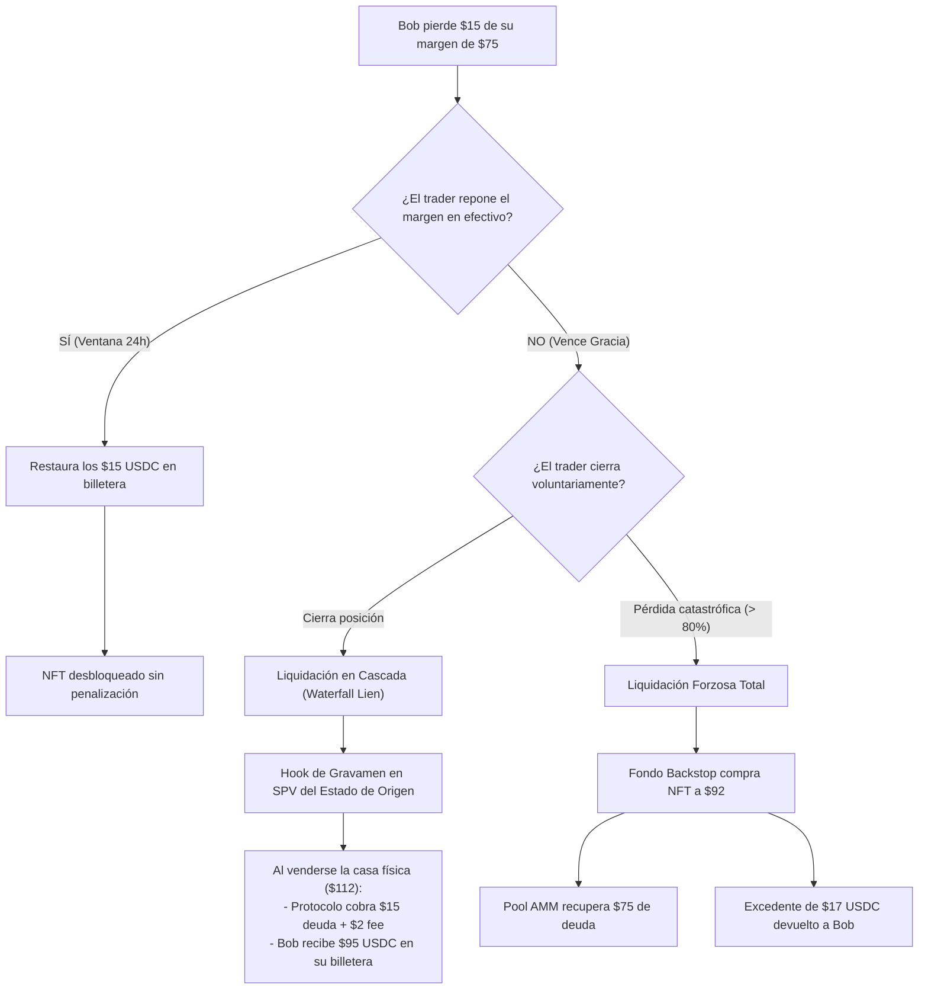

# RFC EPIC-015: Colateral de Margen RWA Fix & Flip, Casos Límite y Modelado de Amenazas

> [!NOTE] Resumen Ejecutivo & Estado de Propuesta (v1.1.0)
> **Estado de Implementación:** Propuesta técnica avanzada para la fase futura de expansión DeFi institucional (Roadmap v2.0).  
> **Actualización Crítica:** Incorpora el diseño del **Motor de Liquidación Parcial (*Partial Liquidation & Equity Restitution*)**, el tratamiento de pérdidas fraccionadas sin confiscación abusiva del título, y el **Modelado Formal de Amenazas (*Threat Model*)** con cuatro vectores de ataque y sus contramedidas criptográficas y jurídicas en Solana.

---

## 1. Conexión con la Tesis de Negocio y Arquitectura
- [[01 Negocio/01 Estrategia & Modelo/master-business-concepts.md|Conceptos Maestros de Negocio (Concepto C9)]]
- [[01 Negocio/02 Producto & Ingenieria/rfcs-tecnicos/index.md|Catálogo Maestro de RFCs]]
- [[01 Negocio/01 Estrategia & Modelo/Business Concepts/concept-real-estate-investment-models.md|Modelos de Inversión (Fix & Flip)]]
- [[01 Negocio/01 Estrategia & Modelo/market-research/rwa-real-estate-competitor-benchmark.md|Benchmark Competitivo RWA]]

---

## 2. El Problema de la Pérdida Parcial: ¿Qué pasa si el trader no pierde todo?

Un error fatal en sistemas de colateralización rígidos es la **confiscación desproporcionada**: si Bob deposita un NFT de \$100 USD, toma un margen de \$75 USDC y cierra su trade con una pérdida de solo \$15 USDC (conservando \$60 de saldo libre), **sería confiscatorio e ineficiente quitarle el inmueble completo de \$100 por una deuda de \$15**.

EPIC-015 implementa una **Arquitectura de Liquidación Parcial en Tres Niveles**:

### Nivel 1: Ventana de Gracia y Reintegro en Efectivo (*Margin Cure Window*)
* Si Bob cierra un trade con pérdida parcial (-\$15 USDC), su NFT permanece bloqueado temporalmente en la bóveda escrow.
* Bob dispone de un período de gracia (ej. 24 a 48 horas) para depositar \$15 USDC desde su billetera.
* Al reponer el efectivo, la deuda se cancela inmediatamente y el NFT de Metaplex Core se desbloquea al 100%.

### Nivel 2: Gravamen sobre la Liquidación Final (*Waterfall Lien Settlement*)
* Si Bob no cuenta con liquidez para cubrir los \$15 USDC de pérdida, **no pierde el inmueble**.
* El contrato de la bóveda anota un gravamen de deuda on-chain (*Encumbrance Hook*) sobre el NFT.
* Al concluir la obra física del Fix & Flip (mes 8) y vender la propiedad por \$112 USDC por título:
  1. El contrato inteligente de dispersión de Squads deduce automáticamente los \$15 USDC de deuda + una tasa de penalización del 2% (\$0.30 USDC) a favor del pool del AMM.
  2. Los **\$96.70 USDC restantes se transfieren automáticamente a la billetera de Bob**.
* **Resultado:** Bob absorbió su pérdida de trading sin perder su plusvalía inmobiliaria remanente.

### Nivel 3: Reembolso del Excedente de Equidad (*Excess Equity Refund*) en Liquidación Forzosa
* Si la pérdida supera el ratio crítico de mantenimiento (pérdida > \$70 USDC) y Bob no responde al margin call:
* La bóveda confisca el NFT de \$100 y lo transfiere al **Fondo de Tesorería Backstop de BRIDS** con un descuento preacordado de \$92 USDC.
* La deuda de \$75 USDC con el AMM se salda al instante.
* **El remanente de equidad:** \$92 (valor de venta rápida) menos \$75 (deuda saldada) = **\$17 USDC se acreditan inmediatamente a la billetera de Bob**.
* El protocolo nunca retiene injustamente el capital no endeudado del usuario.

---

## 3. Modelado de Amenazas y Vectores de Manipulación (*Threat Model*)

Para que los proveedores de liquidez (LPs) y los oficiales de riesgo confíen capital en este sistema, EPIC-015 analiza y neutraliza cuatro vectores de ataque malicioso:

| Vector de Ataque | Mecánica del Exploit Intentado | Contramedida Técnica y Legal de BRIDS |
| :--- | :--- | :--- |
| **1. Ataque de Inflación de Tasación (*Appraisal Inflation Attack*)** | Un promotor o usuario coludido con un perito infla artificialmente la valuación de una casa en ruinas a \$500,000 USD, mintea NFTs, extrae \$375,000 USDC en margen de trading y abandona las posiciones para quedarse con el dinero prestado. | **Anclaje en Costo Real de Adquisición + Doble Oráculo:** El LTV de margen **NUNCA** se calcula sobre la plusvalía proyectada futura, sino estrictamente sobre el **precio de compra real escriturado en la escritura pública de compraventa en Delaware**. Además, se exige doble certificación pericial independiente auditada por el Sponsor B2B antes de habilitar el activo en la bóveda de margen. |
| **2. Ataque de Retraso de Obra y Costo de Acarreo (*Duration Extension Exploit*)** | La obra de remodelación se estanca o retrasa 18 meses adicionales. El trader mantiene su margen abierto a costo cero mientras el AMM sufre iliquidez prolongada. | **Tasa de Acarreo Flotante (*Dynamic Carry Interest Rate*):** El uso del NFT como margen devenga una tasa de interés continua amortizable contra las rentas o plusvalías del SPV. Si el proyecto supera el cronograma estipulado en el prospecto estatutario del SPV, la tasa de penalización escala dinámicamente, incentivando al trader a liquidar o reponer el margen. |
| **3. Cisne Negro Inmobiliario (*Underlying Physical Asset Destruction*)** | La casa sufre un incendio total, defecto estructural oculto o siniestro no previsto, reduciendo el valor del inmueble de \$100 a \$40 USD mientras el usuario tiene \$75 USDC de margen abierto. | **Póliza *Builder's Risk* Obligatoria + Tramo de Primera Pérdida (*First-Loss Capital*):** Cada SPV en su estado de origen tiene como requisito estatutario una póliza de seguro de construcción a todo riesgo con beneficiario preferente al SPV. Además, los Sponsors B2B deben aportar un tramo de capital subordinado (10%-15%) que absorbe las primeras pérdidas antes de que el valor del NFT retail se degrade. |
| **4. Colusión de Liquidación en Pares Ilíquidos (*Wash Liquidation Attack*)** | El atacante usa una cuenta A (con el NFT) y una cuenta B (con USDC en un par sin liquidez). Manipula el precio artificialmente en un bloque para que la cuenta B gane y la cuenta A sea liquidada intencionalmente, extrayendo USDC del fondo Backstop. | **Confinamiento de Pares de Margen a Alta Liquidez:** El margen respaldado por NFTs de BRIDS **SOLO** se puede utilizar para operar contra pares institucionales ultra-líquidos (SOL/USDC, BTC/USDC) con oráculos de precios de baja latencia con tolerancia de desvío (*Pyth Confidence Intervals*). Queda estrictamente prohibido usar el margen en tokens de baja capitalización o pools internos manipulables. |

---

## 4. Arquitectura de Gobernanza en Cascada de Liquidación

```mermaid
graph LR
    subgraph Oraculo_Riesgo["Capa de Verificación & Oráculos"]
        Pyth["Oráculo Pyth (SOL/USDC)"]
        DeedDoc["Oráculo Registral Delaware (Precio Escritura)"]
        Inspection["Hito Certificado de Remodelación"]
    end

    subgraph Motor_Margen["Motor de Margen en Solana (EPIC-015)"]
        Vault["Bóveda Escrow Metaplex Core"]
        LienEngine["Motor de Gravámenes Parciales"]
        RiskEngine["Monitor de Ratio de Liquidación (LTV 75%)"]
    end

    subgraph Liquidacion_Respaldo["Resolución Financiera"]
        BackstopVault["BRIDS Backstop Vault (Squads Multi-Sig)"]
        StripeID["Filtro KYC Stripe Identity (Whitelist)"]
        SPV_Distribution["Dispersión Notarial SPV LLC"]
    end

    Oraculo_Riesgo --> Motor_Margen
    Motor_Margen --> Liquidacion_Respaldo
```

---

## 5. Criterios de Aceptación Actualizados (v1.1.0)

- [ ] Lógica de contrato que permita registrar gravámenes de deuda parcial (*Encumbrance Hook*) sobre el NFT sin confiscar la propiedad completa.
- [ ] Regla algorítmica de reembolso automático de equidad remanente (*Excess Equity Refund*) cuando un activo es subastado.
- [ ] Restricción de margen estrictamente parametrizada a pares con oráculos de Pyth de alta liquidez.
- [ ] Validación de póliza *Builder's Risk* en el registro on-chain antes de habilitar un proyecto para colateral de margen.
- [ ] Auditoría de seguridad contra ataques de reentrancia en llamadas de liquidación de margen atómico.

---

## 6. Próximos Pasos de Hoja de Ruta y Validación Comercial (CTA)

Esta propuesta ampliada constituye la base de modelado de riesgo para el Roadmap v2.0 de BRIDS. Mesas de riesgo financiero, desarrolladores de protocolos DeFi y promotores inmobiliarios pueden revisar los modelos de estrés:

* **Mesa de Arquitectura de Producto:** `dev@brids.io`
* **Relación con Inversores y Fondos DeFi:** `investors@brids.io`
* **Acción sugerida:** Agendar sesión técnica de simulación financiera sobre liquidaciones parciales y fondos Backstop.
