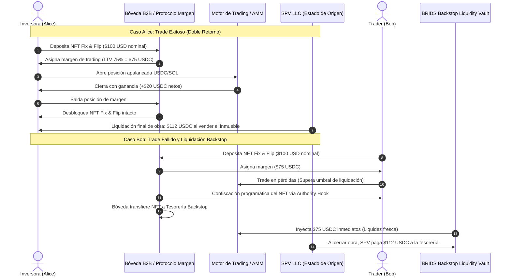

# RFC EPIC-016: Colateral de Margen RWA Fix & Flip y Motor de Liquidación Backstop

> [!NOTE] Resumen Ejecutivo & Estado de Propuesta
> **Estado de Implementación:** Propuesta técnica para la fase futura de expansión DeFi institucional (Roadmap v2.0).  
> **Objetivo de Ingeniería:** Permitir que los títulos fraccionados de proyectos **Fix & Flip** (emitidos bajo el estándar Metaplex Core en Solana) sirvan como colateral de margen en protocolos de trading y AMMs descentralizados. Resolvemos el costo de oportunidad del capital estático: los inversionistas pueden operar en mercados spot o perpetuos en USDC sin desprenderse de sus activos inmobiliarios, mientras que un motor de liquidación respaldado por un fondo de tesorería (*Backstop Liquidity Vault*) neutraliza el riesgo de insolvencia y el desfase de plazos (*duration mismatch*).

---

## 1. Conexión con la Tesis de Negocio y Arquitectura
- [[01 Negocio/01 Estrategia & Modelo/master-business-concepts.md|Conceptos Maestros de Negocio (Concepto C9)]]
- [[01 Negocio/02 Producto & Ingenieria/rfcs-tecnicos/index.md|Catálogo Maestro de RFCs]]
- [[01 Negocio/01 Estrategia & Modelo/Business Concepts/concept-real-estate-investment-models.md|Modelos de Inversión (Fix & Flip)]]
- [[01 Negocio/01 Estrategia & Modelo/market-research/rwa-real-estate-competitor-benchmark.md|Benchmark Competitivo RWA]]

---

## 2. Definición del Problema Financiero (El Capital Ocioso)

En los modelos inmobiliarios tradicionales y en plataformas RWA de primera generación (RealT, Lofty AI), el capital del inversionista permanece completamente congelado durante el ciclo de vida de la obra:
1. Un inversionista adquiere una fracción de \$100 a \$5,000 USD en un proyecto de compra, renovación y venta (*Fix & Flip*).
2. La remodelación y comercialización toma entre 6 y 12 meses.
3. Durante ese período, el inversionista no puede disponer de su liquidez ni aprovechar oportunidades del mercado sin malvender su título en mercados secundarios ilíquidos con descuentos predatorios del 15% al 25%.

**La Solución BRIDS:** Tratar la participación de Fix & Flip como un **activo financiero productivo con fecha de vencimiento cierta (*Yield-Bearing Zero-Coupon Commercial Paper*)**, utilizable como aval de margen de trading en Solana.

---

## 3. Dinámica Operativa: Casos de Uso Alice y Bob

### 3.1. Caso Alice (El Trader Exitoso)
* Alice posee un NFT de Fix & Flip con valor nominal de **\$100 USD**.
* Deposita el activo en la bóveda de margen de BRIDS.
* El protocolo aplica un *haircut* de riesgo prudente del 25% (LTV máximo del 75%), otorgándole **\$75 USDC de margen**.
* Alice abre una posición de compra en el par SOL/USDC.
* Obtiene un beneficio neto de **+\$20 USDC**.
* Cierra su posición de trading, retira sus \$20 USDC de ganancia líquida a su billetera de Solana y libera su NFT.
* **Resultado:** Alice generó \$20 hoy y mantiene su derecho societario en el SPV para cobrar \$112 USDC cuando la casa se venda.

### 3.2. Caso Bob (El Trader Liquidado)
* Bob abre la misma posición pero el mercado se mueve en su contra y consume su margen de garantía.
* Al tocar el umbral de liquidación (80% del valor prestado), el contrato de riesgo ejecuta una **liquidación forzosa**.
* El NFT de Bob se transfiere automáticamente a la bóveda del protocolo mediante los plugins de autoridad de Metaplex Core.
* Bob pierde su título inmobiliario, pero el sistema absorbe la posición sin pérdidas crediticias.

---

## 4. Arquitectura de Mitigación de Riesgos y "Duration Mismatch"

El mayor obstáculo en la colateralización inmobiliaria es que el trader ganador exige retirar sus ganancias en USDC hoy, mientras que la casa se liquida en 6 meses. EPIC-016 resuelve este desfase con dos mecanismos complementarios:

### 4.1. Ratio de Préstamo-Valor (LTV) y Colchón de Sobrecolateralización
* **LTV Máximo:** 70% a 75%.
* **Ratio de Liquidación:** 85%.
* Un NFT de \$100 nunca respalda más de \$75 de deuda. Ese diferencial del 25% al 30% absorbe cualquier volatilidad del mercado inmobiliario o desvío en los presupuestos de remodelación.

### 4.2. Motor de Respaldo de Liquidez (*BRIDS Backstop Liquidity Vault*)
Para evitar que los proveedores de liquidez del AMM queden atrapados con activos ilíquidos:
1. Cuando ocurre una liquidación, el **Fondo de Tesorería Backstop de BRIDS** compra inmediatamente el NFT confiscado con un descuento institucional predeterminado (ej. a \$92 USD).
2. El AMM recibe **USDC fresco de inmediato** para respaldar las salidas de capital de los traders ganadores.
3. BRIDS retiene el NFT en su balance y cobra los **\$112 USD completos** al término de la obra, generando un rendimiento anualizado superior al 30% para el fondo de reserva.

---

## 5. Especificaciones Técnicas en la Red de Solana

| Componente Técnico | Implementación Propuesta | Función en EPIC-016 |
| :--- | :--- | :--- |
| **Estándar de Token** | Metaplex Core (`MPL-Core`) | Registro del activo en cuenta única (Single PDA) con costo mínimo de renta. |
| **Plugin de Autoridad** | `Authority / Lifecycle Hook` | Habilita la transferencia o quema forzosa del NFT en caso de liquidación sin intervención manual. |
| **Plugin de Transferencia** | `Transfer Hook` | Restringe el traspaso del colateral exclusivamente a billeteras con KYC validado por Stripe Identity. |
| **Oráculo de Tasación** | Oráculo Interno de Hitos de Obra | Actualiza el valor nominal on-chain según los informes periciales y avances de remodelación certificados. |
| **Custodia de Margen** | Contrato de Bóveda Escrow | Bloquea el NFT durante la vigencia de la posición de trading apalancada. |
| **Gobernanza de Tesorería** | Squads Multi-Sig v4 | Administra el capital del Fondo Backstop y aprueba las recompras de activos liquidados. |

---

## 6. Criterios de Aceptación (Definición de Hecho para el Futuro)

- [ ] Contrato de Bóveda Escrow en Solana capaz de bloquear NFTs Metaplex Core como garantía de margen.
- [ ] Integración con el motor de riesgo con LTV dinámico parametrizable (65% - 75%).
- [ ] Mecanismo de margin call con ejecución en bloque de liquidación subsegundo.
- [ ] Canal de compra automática desde el fondo Backstop Liquidity de Squads hacia el pool de liquidación.
- [ ] Mantenimiento irrestricto de la regla KYC: ningún NFT liquidado puede terminar en una billetera sin verificación previa en Stripe Identity.
- [ ] Pruebas exhaustivas de estrés financiero simulando caídas de mercado de 50% en pares de trading sin insolvencia en el pool.

---

## 7. Próximos Pasos de Hoja de Ruta y Validación Comercial (CTA)

Esta especificación queda registrada como propuesta de arquitectura para el Roadmap v2.0 de BRIDS. Promotores inmobiliarios, operadores de pools DeFi y mesas de riesgo institucional pueden coordinar mesas técnicas de retroalimentación:

* **Mesa de Arquitectura de Producto:** `dev@brids.io`
* **Relación con Inversores y Fondos DeFi:** `investors@brids.io`
* **Acción sugerida:** Revisar simulaciones matemáticas de solvencia del fondo Backstop en el repositorio de ingeniería.
