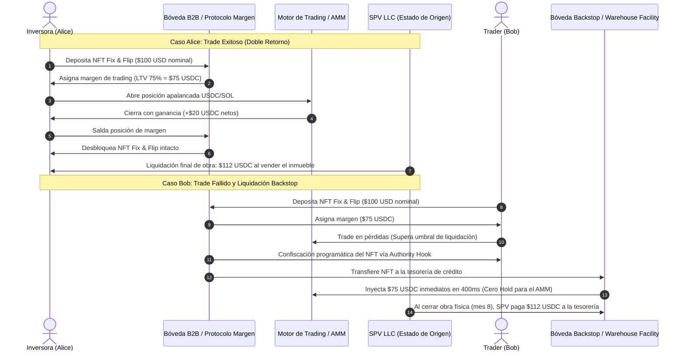
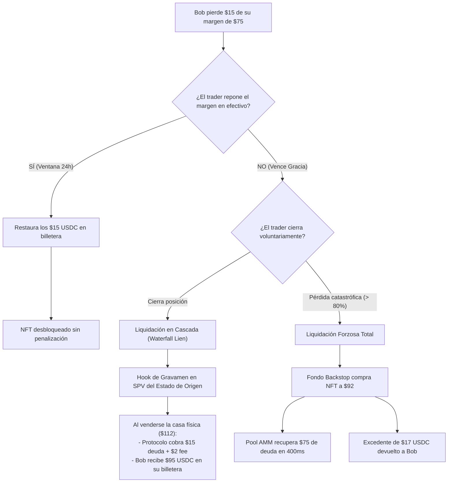
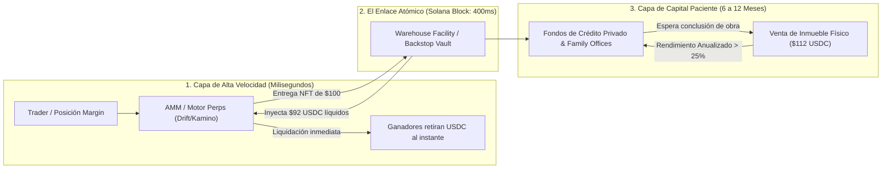

# RFC EPIC-016: Colateral de Margen RWA Fix & Flip, Casos Límite y Desacoplamiento de Liquidez AMM

> [!NOTE] Resumen Ejecutivo & Estado de Propuesta (v1.2.0)
> **Estado de Implementación:** Propuesta técnica de vanguardia para la fase futura de expansión DeFi institucional (Roadmap v2.0).  
> **Actualización Crítica (v1.2.0):** Incorpora la resolución del **dilema del *hold* prolongado (6 a 12 meses) en los AMMs**. Establece el principio arquitectónico del **Desacoplamiento Temporal (*Time-Decoupled Liquidity*)**: el AMM minorista liquida en 400 milisegundos sin asumir activos ilíquidos en su balance, mientras que una **Línea de Almacén Institucional (*Warehouse Facility / Backstop Vault*)** absorbe el activo a plazo fijo para capturar rendimientos anualizados superiores al 25%.

---

## 1. Conexión con la Tesis de Negocio y Arquitectura
- [[01 Negocio/01 Estrategia & Modelo/master-business-concepts.md|Conceptos Maestros de Negocio (Concepto C9)]]
- [[01 Negocio/02 Producto & Ingenieria/rfcs-tecnicos/index.md|Catálogo Maestro de RFCs]]
- [[01 Negocio/01 Estrategia & Modelo/Business Concepts/concept-real-estate-investment-models.md|Modelos de Inversión (Fix & Flip)]]
- [[01 Negocio/01 Estrategia & Modelo/market-research/rwa-real-estate-competitor-benchmark.md|Benchmark Competitivo RWA]]

---

## 2. Definición del Problema Financiero (El Capital Ocioso)

En los modelos inmobiliarios tradicionales y en plataformas RWA de primera generación (RealT, Lofty AI), el capital del inversionista permanece completamente congelado durante el ciclo de vida de la obra:
1. Un inversionista adquiere una fracción de \$100 a \$5,000 USD en un proyecto de compra, renovación y venta (*Fix & Flip*).
2. La remodelación y comercialización toma entre 6 y 12 meses.
3. Durante ese período, el inversionista no puede disponer de su liquidez ni aprovechar oportunidades del mercado sin malvender su título en mercados secundarios ilíquidos con descuentos predatorios del 15% al 25%.

**La Solución BRIDS:** Tratar la participación de Fix & Flip como un **activo financiero productivo con fecha de vencimiento cierta (*Yield-Bearing Zero-Coupon Commercial Paper*)**, utilizable como aval de margen de trading en Solana.

---

## 3. Dinámica Operativa: Casos de Uso Alice y Bob

### 3.1. Caso Alice (El Trader Exitoso)
* Alice posee un NFT de Fix & Flip con valor nominal de **\$100 USD**.
* Deposita el activo en la bóveda de margen de BRIDS.
* El protocolo aplica un *haircut* de riesgo prudente del 25% (LTV máximo del 75%), otorgándole **\$75 USDC de margen**.
* Alice abre una posición de compra en el par SOL/USDC.
* Obtiene un beneficio neto de **+\$20 USDC**.
* Cierra su posición de trading, retira sus \$20 USDC de ganancia líquida a su billetera de Solana y libera su NFT.
* **Resultado:** Alice generó \$20 hoy y mantiene su derecho societario en el SPV para cobrar \$112 USDC cuando la casa se venda.

### 3.2. Caso Bob (El Trader Liquidado)
* Bob abre la misma posición pero el mercado se mueve en su contra y consume su margen de garantía.
* Al tocar el umbral de liquidación (80% del valor prestado), el contrato de riesgo ejecuta una **liquidación forzosa**.
* El NFT de Bob se transfiere automáticamente a la bóveda del protocolo mediante los plugins de autoridad de Metaplex Core.
* Bob pierde su título inmobiliario, pero el sistema absorbe la posición sin pérdidas crediticias.

---

## 4. El Problema de la Pérdida Parcial: ¿Qué pasa si el trader no pierde todo?

Un error fatal en sistemas de colateralización rígidos es la **confiscación desproporcionada**: si Bob deposita un NFT de \$100 USD, toma un margen de \$75 USDC y cierra su trade con una pérdida de solo \$15 USDC (conservando \$60 de saldo libre), **sería confiscatorio e ineficiente quitarle el inmueble completo de \$100 por una deuda de \$15**.

EPIC-016 implementa una **Arquitectura de Liquidación Parcial en Tres Niveles**:

### Nivel 1: Ventana de Gracia y Reintegro en Efectivo (*Margin Cure Window*)
* Si Bob cierra un trade con pérdida parcial (-\$15 USDC), su NFT permanece bloqueado temporalmente en la bóveda escrow.
* Bob dispone de un período de gracia (ej. 24 a 48 horas) para depositar \$15 USDC desde su billetera.
* Al reponer el efectivo, la deuda se cancela inmediatamente y el NFT de Metaplex Core se desbloquea al 100%.

### Nivel 2: Gravamen sobre la Liquidación Final (*Waterfall Lien Settlement*)
* Si Bob no cuenta con liquidez para cubrir los \$15 USDC de pérdida, **no pierde el inmueble**.
* El contrato de la bóveda anota un gravamen de deuda on-chain (*Encumbrance Hook*) sobre el NFT.
* Al concluir la obra física del Fix & Flip (mes 8) y vender la propiedad por \$112 USDC por título:
  1. El contrato inteligente de dispersión de Squads deduce automáticamente los \$15 USDC de deuda + una tasa de penalización del 2% (\$0.30 USDC) a favor del pool del AMM.
  2. Los **\$96.70 USDC restantes se transfieren automáticamente a la billetera de Bob**.
* **Resultado:** Bob absorbió su pérdida de trading sin perder su plusvalía inmobiliaria remanente.

### Nivel 3: Reembolso del Excedente de Equidad (*Excess Equity Refund*) en Liquidación Forzosa
* Si la pérdida supera el ratio crítico de mantenimiento (pérdida > \$70 USDC) y Bob no responde al margin call:
* La bóveda confisca el NFT de \$100 y lo transfiere a la Línea de Almacén / Fondo Backstop con un descuento preacordado de \$92 USDC.
* La deuda de \$75 USDC con el AMM se salda al instante.
* **El remanente de equidad:** \$92 (valor de venta rápida) menos \$75 (deuda saldada) = **\$17 USDC se acreditan inmediatamente a la billetera de Bob**.
* El protocolo nunca retiene injustamente el capital no endeudado del usuario.

---

## 5. El Dilema del "Hold" en AMMs: Por qué el AMM no debe retener el activo

Un análisis riguroso de microestructura de mercado en DeFi revela una tensión fundamental:
* **Los AMMs minoristas (Orca, Raydium) operan con liquidez de alta frecuencia:** Sus depositantes (*Liquidity Providers*) exigen disponibilidad inmediata de su capital. Si un pool retiene un NFT durante 8 meses, incurre en un riesgo crítico de **corrida de liquidez (*bank run*)**.
* **La Regla de Oro:** **El AMM nunca debe realizar el *hold* del activo.** El AMM solo debe actuar como motor de cálculo y ejecución de márgenes.

### El Principio del Desacoplamiento Temporal (*Time-Decoupled Liquidity*)

Para resolver esta incompatibilidad, dividimos el sistema en dos capas especializadas:

### Segmentación de Protocolos DeFi Candidatos

| Tipo de Protocolo | ¿Acepta el NFT directamente en su balance? | Mecánica de Integración en BRIDS |
| :--- | :--- | :--- |
| **DEXs Minoristas Abiertos** *(Raydium, Orca)* | ❌ **No directamente.** | Solo operan si la **Bóveda de Respaldo (*Warehouse Facility*)** garantiza la recompra instantánea del NFT liquidado en el mismo bloque en USDC. |
| **Protocolos de Préstamo con Bóvedas Aisladas** *(Kamino, Morpho, Drift)* | ✅ **SÍ, de forma nativa.** | Crean un *"Isolated Market"* donde los depositantes de USDC entran conscientemente para capturar altos rendimientos fijos respaldados por bienes raíces institucionales. |

### La Tesis del "Capital Paciente": ¿Quién asume el *hold* y por qué?
El *hold* de 6 a 12 meses es asumido por **Fondos de Crédito Privado Institucional (tipo Maple Finance, Clearpool) y Family Offices**:
* Estos actores **no buscan hacer trading diario**: buscan rentabilidad predecible y segura en dólares.
* Al comprar el NFT liquidado de Bob a **\$92 USDC** y esperar 6 meses a que la propiedad se liquide en **\$112 USDC**, obtienen un **rendimiento bruto del 21.7% en 6 meses (equivalente a más de un 40% APY anualizado)** respaldado por una hipoteca real en Delaware.
* Es una operación de arbitraje de liquidez donde todos ganan: el AMM queda solvente en 400 milisegundos, Bob recupera su excedente y el capital paciente maximiza su rendimiento.

---

## 6. Modelado de Amenazas y Vectores de Manipulación (*Threat Model*)

Para que los proveedores de liquidez (LPs) y los oficiales de riesgo confíen capital en este sistema, EPIC-016 analiza y neutraliza cuatro vectores de ataque malicioso:

| Vector de Ataque | Mecánica del Exploit Intentado | Contramedida Técnica y Legal de BRIDS |
| :--- | :--- | :--- |
| **1. Ataque de Inflación de Tasación (*Appraisal Inflation Attack*)** | Un promotor o usuario coludido con un perito infla artificialmente la valuación de una casa en ruinas a \$500,000 USD, mintea NFTs, extrae \$375,000 USDC en margen de trading y abandona las posiciones para quedarse con el dinero prestado. | **Anclaje en Costo Real de Adquisición + Doble Oráculo:** El LTV de margen **NUNCA** se calcula sobre la plusvalía proyectada futura, sino estrictamente sobre el **precio de compra real escriturado en la escritura pública de compraventa en el registro del estado de origen**. Además, se exige doble certificación pericial independiente auditada por el Sponsor B2B antes de habilitar el activo en la bóveda de margen. |
| **2. Ataque de Retraso de Obra y Costo de Acarreo (*Duration Extension Exploit*)** | La obra de remodelación se estanca o retrasa 18 meses adicionales. El trader mantiene su margen abierto a costo cero mientras el AMM sufre iliquidez prolongada. | **Tasa de Acarreo Flotante (*Dynamic Carry Interest Rate*):** El uso del NFT como margen devenga una tasa de interés continua amortizable contra las rentas o plusvalías del SPV. Si el proyecto supera el cronograma estipulado en el prospecto estatutario del SPV, la tasa de penalización escala dinámicamente, incentivando al trader a liquidar o reponer el margen. |
| **3. Cisne Negro Inmobiliario (*Underlying Physical Asset Destruction*)** | La casa sufre un incendio total, defecto estructural oculto o siniestro no previsto, reduciendo el valor del inmueble de \$100 a \$40 USD mientras el usuario tiene \$75 USDC de margen abierto. | **Póliza *Builder's Risk* Obligatoria + Tramo de Primera Pérdida (*First-Loss Capital*):** Cada SPV en su estado de origen tiene como requisito estatutario una póliza de seguro de construcción a todo riesgo con beneficiario preferente al SPV. Además, los Sponsors B2B deben aportar un tramo de capital subordinado (10%-15%) que absorbe las primeras pérdidas antes de que el valor del NFT retail se degrade. |
| **4. Colusión de Liquidación en Pares Ilíquidos (*Wash Liquidation Attack*)** | El atacante usa una cuenta A (con el NFT) y una cuenta B (con USDC en un par sin liquidez). Manipula el precio artificialmente en un bloque para que la cuenta B gane y la cuenta A sea liquidada intencionalmente, extrayendo USDC del fondo Backstop. | **Confinamiento de Pares de Margen a Alta Liquidez:** El margen respaldado por NFTs de BRIDS **SOLO** se puede utilizar para operar contra pares institucionales ultra-líquidos (SOL/USDC, BTC/USDC) con oráculos de precios de baja latencia con tolerancia de desvío (*Pyth Confidence Intervals*). Queda estrictamente prohibido usar el margen en tokens de baja capitalización o pools internos manipulables. |

---

## 7. Arquitectura de Gobernanza y Especificaciones Técnicas

| Componente Técnico | Implementación Propuesta | Función en EPIC-016 |
| :--- | :--- | :--- |
| **Estándar de Token** | Metaplex Core (`MPL-Core`) | Registro del activo en cuenta única (Single PDA) con costo mínimo de renta. |
| **Plugin de Autoridad** | `Authority / Lifecycle Hook` | Habilita la transferencia forzosa del NFT en caso de liquidación sin intervención manual. |
| **Plugin de Transferencia** | `Transfer Hook` | Restringe el traspaso del colateral exclusivamente a billeteras con KYC validado por Stripe Identity. |
| **Bóveda de Almacén** | *Warehouse Facility Escrow* | Contrato que provisiona liquidez instantánea en USDC al AMM al recibir un NFT confiscado. |
| **Oráculo de Tasación** | Oráculo Registral del Estado de Origen | Lee el precio de adquisición de la escritura pública legalmente registrada en EE.UU. |
| **Gobernanza de Tesorería** | Squads Multi-Sig v4 | Administra los desembolsos de la Warehouse Facility y la custodia de títulos en hold largo. |

---

## 8. Criterios de Aceptación (Definición de Hecho para el Futuro)

- [ ] Contrato de Bóveda Escrow en Solana capaz de bloquear NFTs Metaplex Core como garantía de margen.
- [ ] Mecánica de liquidación parcial: soporte para ventanas de gracia de 24h y anotación de gravámenes sobre liquidación final (*Waterfall Lien*).
- [ ] Regla algorítmica de reembolso automático de equidad remanente (*Excess Equity Refund*) en subastas forzosas.
- [ ] Desacoplamiento temporal verificado: inyección de USDC desde la Bóveda de Almacén al AMM en el mismo bloque transaccional (<500ms).
- [ ] Confinamiento estricto de margen a pares institucionales con oráculos Pyth validados.
- [ ] Validación de seguro *Builder's Risk* y tramo de primera pérdida del Sponsor antes de habilitar el activo.

---

## 9. Próximos Pasos de Hoja de Ruta y Validación Comercial (CTA)

Esta propuesta ampliada constituye la base de modelado de riesgo para el Roadmap v2.0 de BRIDS. Mesas de riesgo financiero, desarrolladores de protocolos DeFi y promotores inmobiliarios pueden revisar los modelos de estrés:

* **Mesa de Arquitectura de Producto:** `dev@brids.io`
* **Relación con Inversores y Fondos DeFi:** `investors@brids.io`
* **Acción sugerida:** Agendar sesión técnica de simulación financiera sobre liquidaciones parciales y fondos Backstop.
