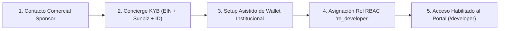
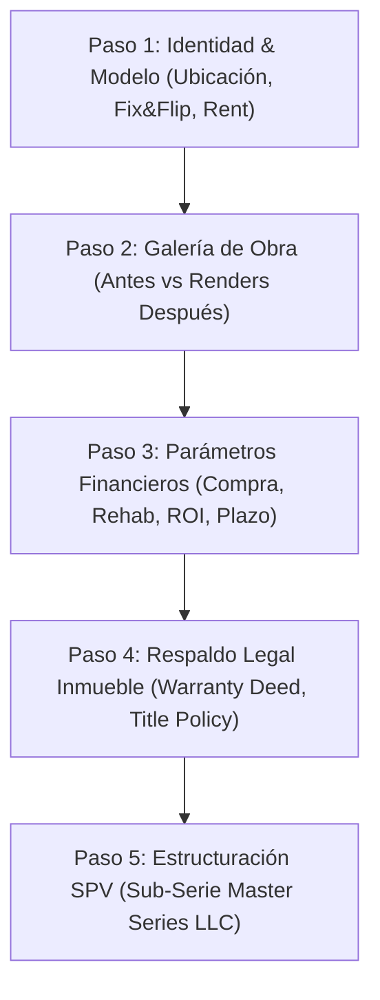
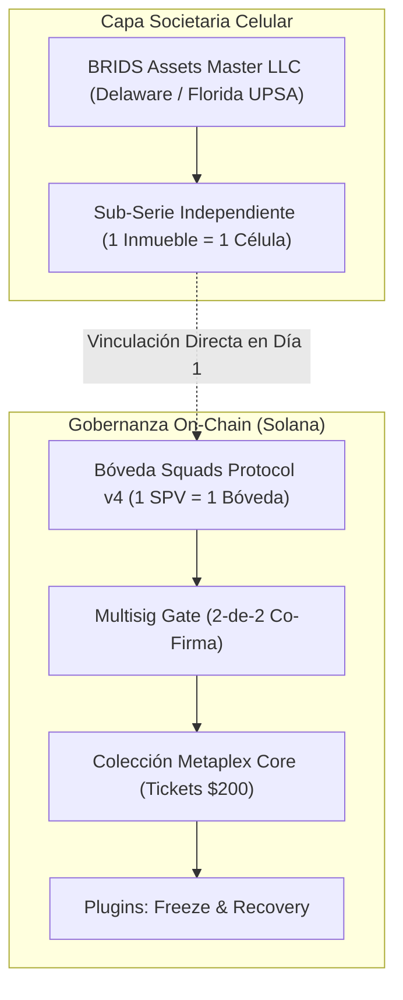

# Módulo del Desarrollador Inmobiliario y SPV Engine

> [!NOTE]
> **Arquitectura Funcional y Técnica de Originación B2B**  
> **Subagentes Autores:** `business-consultant`, `b2b-sponsor-lead`, `compliance-officer` | **Revisión:** `sdd-reviewer`  
> **Destinatarios:** Real Estate Sponsors, Developers Inmobiliarios, General Partners (GPs) y Operadores de Capital.  
> **Alcance:** Modela la integración integral entre el onboarding societario (KYB Concierge), el control de acceso RBAC (`re_developer`), la ingesta ágil de proyectos (wizard de 5 pasos sincronizado al marketplace con tickets de $200 USD), la estructuración celular sobre Master Series LLC y la gobernanza on-chain con Bóvedas Squads Protocol v4 y guardrail multisig de co-firma para minting en Metaplex Core.

---

## 1. Visión de Producto: La Capa de Distribución y Sindicación para Desarrolladores

Para los promotores y desarrolladores inmobiliarios (Sponsors y General Partners), levantar capital privado mediante métodos analógicos tradicionales implica una fricción estructural severa:
- Honorarios legales de $40,000 a $80,000 USD por cada sindicación individual.
- Tiempos muertos de 90 a 180 días persiguiendo compromisos de capital uno a uno.
- Gestión manual y caótica de cap tables con decenas de hojas de cálculo, dispersión bancaria individual de rentas y reportes manuales.

En BRIDS resolvemos este cuello de botella consolidando la infraestructura de software que opera como el **Stripe + Carta + AngelList** de los bienes raíces sobre Solana. Nuestra plataforma permite al desarrollador convertir un inmueble o lote de construcción en un vehículo de sindicación digital estructurado, con segregación patrimonial estatutaria y acceso inmediato a liquidez retail global, recortando los tiempos de estructuración de meses a menos de dos semanas.

---

## 2. Módulo 1: Onboarding KYB Concierge & Control de Acceso RBAC

Para erradicar la fricción burocrática y blindar la integridad del marketplace, desacoplamos la verificación corporativa de la carga recurrente de proyectos. La identidad de la empresa promotora se valida una sola vez mediante un proceso asistido de guante blanco (*white-glove concierge*) operado por nuestro equipo de Customer Success y Compliance.



### A. Protocolo de Verificación Societaria (One-Time KYB)
1. **Validación de Entidad:** Customer Success audita la inscripción de la empresa promotora ante la división corporativa estatal correspondiente (ej. División de Corporaciones de Florida - Sunbiz, o Secretaría de Estado de Texas/Delaware).
2. **Registro Fiscal:** Verificación directa del Employer Identification Number (EIN) emitido por el IRS.
3. **KYC del Representante Legal:** Verificación biométrica de identidad del Manager o firmante autorizado mediante Stripe Identity.
4. **Documentos Constitutivos:** Custodia y revisión del Operating Agreement de la empresa desarrolladora y certificados de cumplimiento (*Certificate of Good Standing*).

### B. Playbook de Customer Success para Onboarding de Wallets
Los desarrolladores inmobiliarios operan en el mundo de las finanzas tradicionales y la construcción; someterlos a la gestión empírica de frases de recuperación genera fricción y riesgos de custodia. El especialista de Customer Success ejecuta un protocolo guiado:
1. **Configuración de Custodia Segura:** Asistencia técnica para configurar un dispositivo físico (Ledger) o una wallet institucional compatible con Solana.
2. **Registro de Clave Pública:** Asociación de la clave pública verificada del desarrollador a su registro en la base de datos corporativa (`developers.wallet_address`).
3. **Simulación de Firma (*Dry-Run*):** Prueba guiada en entorno de pruebas (devnet/staging) donde el desarrollador firma una transacción simulada para familiarizarse con el flujo de gobernanza de Squads.

### C. Arquitectura de Control de Acceso RBAC y Variables de Estado
El sistema incorpora un nuevo rol específico dentro de la matriz de permisos de BRIDS: `re_developer`.

* **Identificador de Rol:** `re_developer` (asociado a `developer_entity_id`).
* **Variables de Estado en Sesión:**
  * `session.role = 're_developer'`
  * `is_developer_verified: true`
  * `developer_entity_id: UUID`
* **Políticas de Protección de Rutas (*Defense-in-Depth*):**
  * **Proxy / Middleware Gate:** Las rutas bajo `/developer/**` interceptan la petición en el borde; si el usuario no cuenta con una sesión activa con rol `re_developer` y verificación aprobada, se genera una redirección inmediata a `/403`.
  * **Page-Level Verification:** Cada Server Component en el portal valida las variables de estado en base de datos antes de renderizar la interfaz.
  * **API Handlers:** Los endpoints bajo `/api/developer/*` exigen el rol `re_developer` a nivel de controlador, respondiendo con código HTTP `403 Forbidden` en formato JSON ante cualquier discrepancia.

---

## 3. Módulo 2: Portal del Desarrollador e Ingesta de Proyectos (Wizard de 5 Pasos)

Una vez autenticado bajo el rol `re_developer`, el promotor accede a su panel de control para originar oportunidades de inversión. Toda la información corporativa de su empresa (antigua Sección 5) queda completamente excluida de la carga manual, inyectándose automáticamente desde su perfil verificado.

El formulario de ingesta se estructura en **5 pasos especializados orientados exclusivamente al activo inmobiliario**:



### Paso 1: Identidad del Inmueble y Modelo de Negocio
- Nombre comercial del proyecto.
- Dirección física completa (calle, ciudad, estado, código postal).
- Clasificación del inmueble: Residencial (subtipos: *Single Family, Multifamily, Duplex, Fourplex*) o Comercial.
- Modelo de negocio operativo: *Fix & Flip*, *New Construction*, *Fix & Hold*, o *Rent*.

### Paso 2: Galería de Obra (Trazabilidad Visual)
- Carga de fotografías de estado actual: imágenes del lote o de la propiedad deteriorada previa a intervención (*Antes*).
- Carga de renders arquitectónicos profesionales: visualización técnica del proyecto terminado y remodelado (*Después*).

### Paso 3: Parámetros Financieros y Motor de Fórmulas Automáticas
El desarrollador introduce únicamente cuatro variables de entrada financieras del proyecto. El sistema computa y fija de forma determinista la estructura de capital, el fondo de activación y la emisión de participaciones en tickets de **$200 USD**:

```
[ Inputs del Desarrollador ]
 ├── Precio de compra del inmueble ($)
 ├── Valor de rehab / presupuesto de obra ($)
 ├── ROI anualizado ofrecido al inversionista (%)
 └── Timing del ciclo de ejecución (6, 7, 8 o 9 meses)
              │
              ▼ [ Motor de Cálculo BRIDS ]
 ├── Valor Total del Proyecto   = Compra + Rehab
 ├── Capital de Activación (30%) = Valor Total × 0.30 (Redondeado a múltiplos de $200)
 ├── Valor por Ticket            = $200 USD (Constante)
 ├── Cantidad Total de Tickets   = Capital de Activación / $200
 └── Desglose Unitario Ticket    = $196 Capital Serie SPV + $4 Fee Infraestructura BRIDS (2%)
```

#### Regla de Redondeo Canónica
Si el 30% del valor del proyecto no arroja un múltiplo exacto de $200 USD, el sistema aplica la función techo matemático:
$$\text{Cantidad de Tickets} = \left\lceil \frac{\text{Valor Total} \times 0.30}{200} \right\rceil$$
$$\text{Capital Real a Recaudar} = \text{Cantidad de Tickets} \times 200$$

*Ejemplo de Referencia:*
- Precio de Compra: $185,000 USD.
- Valor de Rehab: $95,000 USD.
- Valor Total del Proyecto: $280,000 USD.
- Capital de Activación Requerido (30%): $84,000 USD.
- Valor por Ticket: $200 USD.
- Cantidad Total de Tickets: 420 tickets.

### Paso 4: Respaldo Legal de la Propiedad
- Escritura traslativa de dominio (*Warranty Deed* o contrato ejecutado de compraventa).
- Compromiso de póliza de seguro de título (*Title Commitment / Title Insurance* emitido por Title Company autorizada).
- Licencias municipales y permisos de construcción vigentes.

### Paso 5: Términos de Inversión y Constitución del SPV
- Confirmación de las condiciones de liquidación de rendimientos.
- Generación automática del paquete de adhesión: *Joint Venture Agreement*, *Promissory Note*, *Project Summary* y *Memorando de Joint Venture*.
- Firma electrónica del desarrollador como Administrador Operativo (*Operating Manager*) de la sub-serie.

---

## 4. Módulo 3: La Máquina de SPVs y Gobernanza On-Chain (Solana & Squads v4)

La estructuración societaria y la gobernanza criptográfica operan de forma simbiótica y sin intermediarios fiduciarios centralizados.



### A. Despliegue de la Serie bajo Master Series LLC
En lugar de constituir una LLC tradicional desde cero para cada obra, el motor legal de BRIDS genera una nueva **Serie Protegida** bajo nuestra estructura paraguas (*Master Series LLC*), aprovechando las legislaciones avanzadas de Florida (Uniform Protected Series Act - CS/SB 316), Texas (TBOC Capítulo 101 Subcapítulo M) o Delaware:
- **Aislamiento Horizontal:** Los activos y pasivos de la Serie A quedan blindados estatutariamente frente a litigios, deudas o reclamaciones de contratistas que afecten a la Serie B o a la Master LLC.
- **Reducción de Costes:** Despliegue legal y formal en cuestión de segundos, reduciendo el coste de estructuración a una fracción marginal.

### B. Aprovisionamiento de Bóveda Squads v4 en Día 1
En el instante en que el desarrollador inicia el borrador del proyecto (`status: 'borrador'`), el backend interactúa con **Squads Protocol v4** en Solana y aprovisiona una bóveda multifirma dedicada:
- La dirección on-chain de la bóveda queda anclada como atributo inmutable del SPV en el contrato de designación de la serie (*Series Designation*).
- **Estructura de Sub-Cuentas Internas:**
  1. *Sub-cuenta 0 (Construcción & Adquisición):* Custodia el 90% del capital para liberación contra hitos de obra certificados.
  2. *Sub-cuenta 1 (Statutory Retainage):* Fondo del 10% de retención legal obligatoria hasta la firma de finiquito de gravámenes (*Final Lien Waiver*).
  3. *Sub-cuenta 2 (Dispersión de Rentas):* Recibe el flujo generado para distribución a los titulares de tickets.

### C. Guardrail Multisig de Co-Firma para Minting (Gate de Seguridad)
La autoridad para inicializar la colección en **Metaplex Core** y abrir la venta pública de tickets no reside en una clave privada individual ni en un proceso automático sin supervisión:
1. **Autoridad en la Bóveda:** La Bóveda Squads es la propietaria exclusiva de la *Update Authority* y *Mint Authority* del contrato de la colección.
2. **Co-Firma Mandatoria:** Para transicionar el proyecto del estado `en_revision` al estado `publicado`, se emite una propuesta multifirma en Squads:
   - **Firma 1:** Desarrollador Inmobiliario (solicita apertura de ronda y valida sus datos).
   - **Firma 2:** BRIDS Compliance Officer (audita previamente la validez del título, la póliza de la Title Company y la consistencia financiera).
3. **Inyección de Plugins Metaplex Core:**
   - **Freeze Plugin:** Permite congelar transferencias ante requerimientos judiciales o revocación de KYC.
   - **Recovery Plugin:** Habilita la reasignación segura del título si un inversionista acreditado pierde el control de su clave privada, previa verificación biométrica en Stripe Identity.

---

## 5. Módulo 4: Trazabilidad y Reglas de Visibilidad en el Marketplace

Cada campo capturado a lo largo del flujo se proyecta con precisión en la interfaz del inversionista según las reglas definidas en las especificaciones de diseño:

```
┌─────────────────────────────────────────────────────────────────────────────┐
│                      MAPEO DE VISIBILIDAD MARKETPLACE                       │
├─────────────────────────────────────────────────────────────────────────────┤
│ 1. Card de Listado (Grid):                                                  │
│    • Portada: Render arquitectónico (Paso 2).                               │
│    • Identidad: Nombre del proyecto, Ciudad y Estado (Paso 1).              │
│    • Modelo: Etiqueta de negocio (Fix & Flip / Rent) (Paso 1).              │
│    • Métricas: Valor total, ROI ofrecido, ciclo en meses (Paso 3).          │
│    • Barra de Fondeo: Tickets vendidos vs. tickets totales ($200 USD).      │
│                                                                             │
│ 2. Ficha Técnica (Pestaña Resumen):                                         │
│    • Galería: Comparador interactivo Foto Antes vs. Render Después.         │
│    • Presupuesto: Desglose Precio de Compra vs. Rehab y 30% de Activación.  │
│    • Disponibilidad: Tickets totales emitidos y saldo disponible en vivo.   │
│                                                                             │
│ 3. Tab "Desarrollador" (Ficha de Empresa):                                  │
│    • Nombre del Manager y Estado de Registro Societario.                    │
│    • Badges Públicos: "Registro Sunbiz Verificado", "EIN Activo", "KYC OK". │
│    • Regla de Seguridad: Documentos personales e identificaciones no se     │
│      exponen al público abierto para resguardar privacidad corporativa.     │
│                                                                             │
│ 4. Tab "Propiedad" (Respaldo Inmobiliario):                                 │
│    • Badges de Verificación: "Título Registrado", "Contrato Validado",       │
│      "Póliza Title Company Confirmada". Documentos descargables post-compra.│
│                                                                             │
│ 5. Tab "Documentación de Inversión":                                        │
│    • Pre-Inversión: Lista informativa de contratos que recibe el socio.    │
│    • Post-Inversión: Acceso a descarga directa de contratos ejecutados     │
│      (Operating Agreement de la Serie, Promissory Note y Seguro de Obra).   │
└─────────────────────────────────────────────────────────────────────────────┘
```

---

## 6. Módulo 5: Operación Diaria Post-Fondeo

El portal del desarrollador provee herramientas continuas de administración de activos y tesorería:

1. **Gestión de Cap Table en Tiempo Real:** Visualización transparente de la nómina de inversionistas, número de tickets adquiridos, porcentaje de participación pasiva en la serie y estado KYC.
2. **Solicitudes de Desembolso de Obra (*Draw Requests*):**
   - El desarrollador sube los certificados de avance físico firmados por el arquitecto inspector (formulario estándar AIA G702 / G703) junto con las facturas de contratistas y renuncias de gravámenes (*Lien Waivers*).
   - Se crea automáticamente la propuesta de desembolso en la Bóveda Squads.
   - Tras la aprobación del comité de supervisión, los fondos se transfieren en USDC desde la sub-cuenta de construcción a la cuenta operativa de obra.
3. **Dispersión Automatizada de Dividendos y Rentas:**
   - El desarrollador ingresa el importe neto a distribuir en la sub-cuenta de rentas.
   - Con un único clic, la transacción de Squads dispersa los fondos de forma proporcional a las billeteras titulares de los tickets en Solana.
4. **Automatización Fiscal (K-1 Ready):** El sistema genera reportes estandarizados de ingresos y gastos de la serie para que el contador del SPV emita los formularios fiscales IRS Schedule K-1 a los socios con mínimo esfuerzo administrativo.

---

## 7. Integración con el Esquema SQL Existente en GitHub (brids.io)

Para garantizar consistencia y reutilización de infraestructura, el Módulo del Desarrollador no reinventa modelos ni crea tablas aisladas. Se fundamenta y extiende el esquema real de PostgreSQL existente en el repositorio institucional (`apps/web/src/features/shared/infrastructure/db/migrations/`), aprovechando las tablas consolidadas del sistema:

```
┌─────────────────────────────────────────────────────────────────────────────┐
│             MAPA DE TABLAS SQL EXISTENTES EN EL REPOSITORIO GITHUB          │
├─────────────────────────────────────────────────────────────────────────────┤
│ • 006, 019, 021, 030, 032: marketplace_entries                              │
│   (Catálogo central: ubicación, geo, imágenes, economics_json, project_json)│
│ • 012, 015, 016: user_profiles & kyc_cases                                  │
│   (KYC biométrico con Stripe Identity, wallet_public_key, compliance_status)│
│ • 017: authority_lifecycle_registry                                         │
│   (Historial de autoridades de colección y rotación de claves)              │
│ • 037: project_candy_machine_sources & asset_project_origins                │
│   (Vínculo canónico entre proyecto, Candy Machine en Metaplex Core y NFTs)  │
│ • 041: squads_payout_batches & squads_payout_batch_items                    │
│   (Gobernanza de tesorería on-chain en Solana y dispersión de rentas)       │
└─────────────────────────────────────────────────────────────────────────────┘
```

### A. Mapeo de Ingesta sobre `marketplace_entries`
Los 5 pasos del Wizard del Desarrollador persisten directamente en los campos y columnas JSONB estructuradas de `marketplace_entries`:

1. **Identidad y Ubicación (Paso 1):**
   - Columnas directas: `title`, `city`, `country`, `state_province`, `postal_code`, `detailed_location`, `location_label`, `geo_lat`, `geo_lng`.
   - `project_json`:
     ```json
     {
       "name": "Oak Street Modern Duplex",
       "propertyCategory": "residential",
       "residentialSubtype": "duplex",
       "businessModel": "fix_flip",
       "description": "Rehabilitación integral y modernización energética."
     }
     ```
2. **Galería Visual (Paso 2):**
   - Portada: `image_url` (render principal).
   - Fotos Antes (lote/deterioro): `property_images_json` (`[{"url": "...", "caption": "Estado inicial", "order": 1}]`).
   - Renders Después: `gallery_images_json` (`[{"url": "...", "caption": "Render fachada posterior", "order": 1}]`).
3. **Parámetros Financieros (Paso 3):**
   - Columnas directas: `nft_price_usd = 200.00`, `annual_roi_pct = 14.50`, `supply_total = ticket_count`, `minted_or_sold = 0`.
   - `economics_json`:
     ```json
     {
       "purchasePriceUsd": 185000.00,
       "rehabValueUsd": 95000.00,
       "totalProjectValueUsd": 280000.00,
       "activationCapitalUsd": 84000.00,
       "ticketPriceUsd": 200.00,
       "ticketSupply": 420,
       "spvCapitalPerTicket": 196.00,
       "platformFeePerTicket": 4.00,
       "cycleMonths": 8,
       "expectedYieldBps": 1450,
       "yieldMode": "cap",
       "distributionFrequency": "quarterly"
     }
     ```
4. **Respaldo Legal de Inmueble e Inversión (Pasos 4 y 5):**
   - `documents_json`:
     ```json
     [
       { "name": "Warranty Deed", "category": "property_legal", "docType": "title_deed", "url": "...", "verified": true },
       { "name": "Title Commitment", "category": "property_legal", "docType": "title_certificate", "url": "...", "verified": true },
       { "name": "Series Operating Agreement", "category": "investment_legal", "docType": "spv_series_doc", "url": "...", "verified": true },
       { "name": "Promissory Note", "category": "investment_legal", "docType": "promissory_note", "url": "...", "verified": true }
     ]
     ```
   - `governance_json`:
     ```json
     {
       "spvLegalStructure": "Master Series LLC (Florida UPSA CS/SB 316)",
       "seriesDesignation": "BRIDS Assets Master LLC - Series 104 Oak St",
       "squadsVaultPda": "7Xy...squadsVaultAddress",
       "multisigThreshold": "2-de-2",
       "signers": ["DevWalletPubKey...", "BridsCompliancePubKey..."]
     }
     ```

### B. Migración SQL Propuesta: `043_developer_entities.sql`
Para soportar el Módulo de Onboarding KYB sin alterar las tablas existentes, se introduce la entidad promotora y su enlace relacional con `marketplace_entries`:

```sql
-- Migración 043: Developer Entities & RBAC Linkage
-- Conecta empresas promotoras verificadas con user_profiles y marketplace_entries

CREATE TABLE IF NOT EXISTS developer_entities (
  id                        TEXT        PRIMARY KEY DEFAULT gen_random_uuid()::text,
  business_name             TEXT        NOT NULL,
  state_of_registration     TEXT        NOT NULL,
  ein_encrypted             TEXT        NOT NULL,
  manager_wallet            TEXT        NOT NULL REFERENCES user_profiles(wallet_public_key) ON DELETE RESTRICT,
  manager_name              TEXT        NOT NULL,
  sunbiz_document_url       TEXT,
  operating_agreement_url   TEXT,
  verification_status       TEXT        NOT NULL DEFAULT 'verified'
    CONSTRAINT dev_entities_status_check
    CHECK (verification_status IN ('pending', 'verified', 'suspended')),
  verified_by               TEXT        NOT NULL,
  verified_at               TIMESTAMPTZ NOT NULL DEFAULT NOW(),
  created_at                TIMESTAMPTZ NOT NULL DEFAULT NOW(),
  updated_at                TIMESTAMPTZ NOT NULL DEFAULT NOW()
);

CREATE INDEX IF NOT EXISTS developer_entities_manager_wallet_idx
  ON developer_entities (manager_wallet);

-- Enlace de relación en marketplace_entries
ALTER TABLE marketplace_entries
  ADD COLUMN IF NOT EXISTS developer_entity_id TEXT
    REFERENCES developer_entities(id) ON DELETE RESTRICT,
  ADD COLUMN IF NOT EXISTS squads_vault_address TEXT;

CREATE INDEX IF NOT EXISTS marketplace_entries_developer_entity_idx
  ON marketplace_entries (developer_entity_id);
```

### C. Ciclo de Estados del Proyecto

```sql
-- Entidades Promotoras (Gestionadas exclusivamente por Customer Success)
CREATE TABLE developers (
    id UUID PRIMARY KEY DEFAULT gen_random_uuid(),
    business_name VARCHAR(255) NOT NULL,
    manager_name VARCHAR(255) NOT NULL,
    state_of_registration VARCHAR(50) NOT NULL,
    ein_encrypted BYTEA NOT NULL,
    wallet_address VARCHAR(44) NOT NULL, -- Clave pública Solana de firma
    sunbiz_verified_at TIMESTAMPTZ,
    operating_agreement_url TEXT,
    manager_id_document_url TEXT,
    verification_status VARCHAR(30) DEFAULT 'verified' -- verified | pending | suspended
);

-- Proyectos Inmobiliarios (Originados por el Desarrollador en el Wizard)
CREATE TABLE projects (
    id UUID PRIMARY KEY DEFAULT gen_random_uuid(),
    developer_entity_id UUID REFERENCES developers(id),
    name VARCHAR(255) NOT NULL,
    address VARCHAR(255) NOT NULL,
    city VARCHAR(100) NOT NULL,
    state VARCHAR(50) NOT NULL,
    zip VARCHAR(20) NOT NULL,
    property_category VARCHAR(50) NOT NULL, -- commercial | residential
    residential_subtype VARCHAR(50),        -- single_family | multifamily | duplex | fourplex
    business_model VARCHAR(50) NOT NULL,    -- fix_flip | new_construction | fix_hold | rent
    purchase_price NUMERIC(12,2) NOT NULL,
    rehab_value NUMERIC(12,2) NOT NULL,
    total_project_value NUMERIC(12,2) GENERATED ALWAYS AS (purchase_price + rehab_value) STORED,
    activation_capital NUMERIC(12,2) NOT NULL, -- 30% redondeado a múltiplos de 200
    ticket_price NUMERIC(8,2) DEFAULT 200.00,  -- Constante canónica BRIDS
    ticket_count INTEGER NOT NULL,             -- activation_capital / 200
    roi_offered NUMERIC(5,2) NOT NULL,
    cycle_months INTEGER NOT NULL CHECK (cycle_months IN (6, 7, 8, 9)),
    squads_vault_address VARCHAR(44) NOT NULL, -- Bóveda Squads v4 creada en Día 1
    metaplex_collection_mint VARCHAR(44),      -- Mint de la colección Metaplex Core
    status VARCHAR(30) DEFAULT 'borrador'      -- Ciclo de vida del proyecto
);

-- Tickets Fraccionales
CREATE TABLE tickets (
    id UUID PRIMARY KEY DEFAULT gen_random_uuid(),
    project_id UUID REFERENCES projects(id),
    ticket_index INTEGER NOT NULL,
    unit_price NUMERIC(8,2) DEFAULT 200.00,
    status VARCHAR(20) DEFAULT 'available', -- available | reserved | sold
    owner_wallet VARCHAR(44),
    nft_core_asset_address VARCHAR(44)
);
```


| Estado | Evento Desencadenante | Operación en Solana / Squads | Guardrail de Validación |
| :--- | :--- | :--- | :--- |
| `borrador` | El desarrollador crea el proyecto en el portal. | Despliegue de Bóveda Squads v4 dedicada. | Verificación de rol `re_developer`. |
| `en_revision` | El desarrollador completa los 5 pasos y envía a revisión. | Creación de propuesta de apertura de colección en Squads. | Auditoría legal y técnica por BRIDS Compliance. |
| `publicado` | Co-firma completada en Squads. | Habilitación de minting en Metaplex Core. | **Multisig Gate:** Firma conjunta Sponsor + BRIDS. |
| `fondeado` | 100% de tickets vendidos. | Fondos en custodia en la sub-cuenta de obra. | Conciliación de tesorería y cierre de ronda. |
| `en_ejecucion` | Inicio de trabajos de obra / remodelación. | Liberación de fondos contra hitos (2-de-3). | Certificación física con formulario AIA G702. |
| `cerrado` | Venta o refinanciamiento completado. | Dispersión de capital final y rendimientos. | Liquidación de la serie y emisión de K-1. |

---

## 8. Próximos Pasos y Llamado a la Acción

La estandarización de este módulo proporciona a BRIDS una ventaja competitiva decisiva en la captación de promotores inmobiliarios. Convertimos un proceso burocrático y costoso en una experiencia ágil, segura y plenamente transparente sobre la red de Solana.

Invitamos a sponsors inmobiliarios, desarrolladores y operadores de capital a sumarse a nuestra infraestructura:
- **Desarrolladores y Sponsors Inmobiliarios:** Agenda una sesión técnica de estructuración para evaluar tu próximo desarrollo, configurar tu bóveda de tesorería y acelerar tu captación de capital.
- **Inversionistas y Fondos:** Accede a nuestro Data Room técnico para consultar los modelos de Master Series LLC, los contratos inteligentes de Metaplex Core y los registros de auditoría de Squads Protocol.
