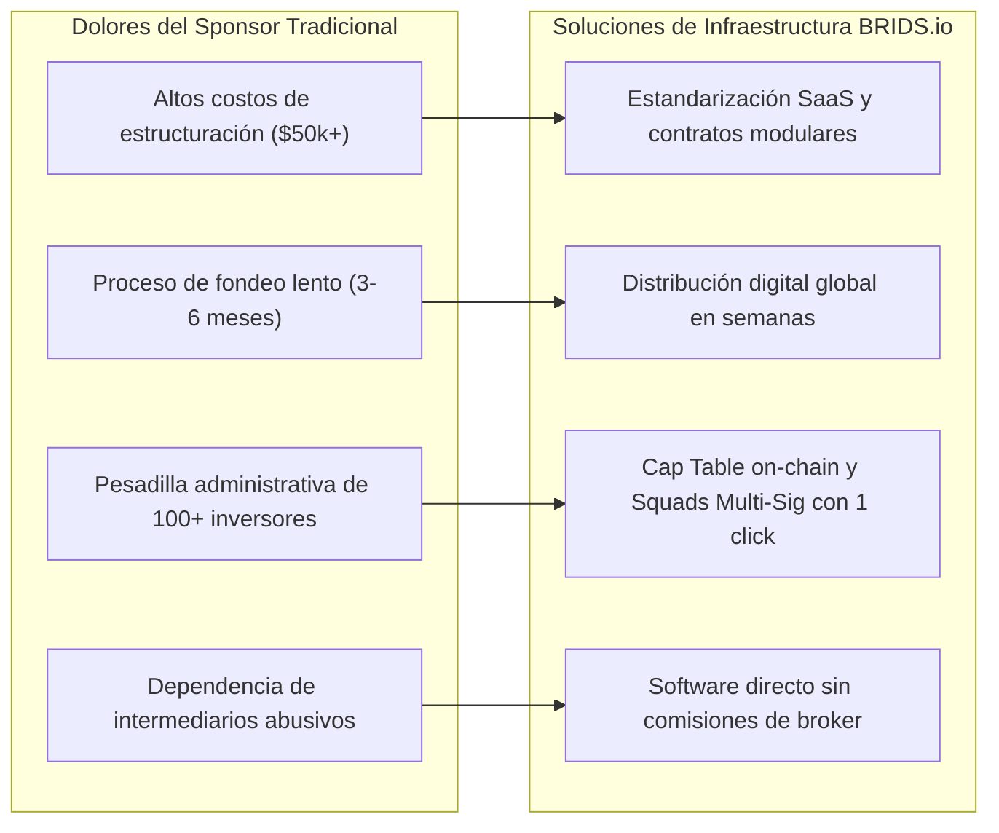

# Concepto Maestro: Propuesta de Valor para Desarrolladores Inmobiliarios (B2B Sponsors & GPs)

> [!NOTE] Resumen Ejecutivo
> Para los desarrolladores inmobiliarios (*Sponsors* y *General Partners / GPs*), levantar capital privado mediante sindicación tradicional es un proceso analógico, costoso ($40k-$80k en abogados y estructuración) y lento (3 a 6 meses de colocación con decenas de llamadas individuales). BRIDS.io se posiciona como su **software institucional de distribución y administración de sindicaciones**. Al estandarizar el despliegue técnico sobre SPVs de Delaware y automatizar la gestión de inversionistas en Solana, BRIDS reduce el tiempo de cierre a semanas, disminuye el costo de capital y elimina la carga operativa manual de contabilidad, reportes y dispersión de dividendos.

---

## 1. One-Liner Canónico (B2B Outreach & One-Pager)

> *"BRIDS es la infraestructura de software que permite a los desarrolladores inmobiliarios sindicar capital hasta 5 veces más rápido, reduciendo sus costos de colocación y automatizando su cap table en Solana."*

---

## 2. Los 4 Dolores Críticos del Desarrollador Tradicional y Cómo BRIDS los Resuelve

### 1. Fricción y Costos Legales de Estructuración
- **Realidad Tradicional:** Cada sindicación requiere redactar *Private Placement Memorandums (PPM)* desde cero, contratos de suscripción manuales y coordinación notarial costosa ($40,000 a $80,000 USD).
- **Solución BRIDS:** Plantillas societarias estandarizadas para SPVs de Delaware e integración de smart contracts llave en mano con tarifa fija de software.

### 2. Ciclos Extensos de Captación de Capital
- **Realidad Tradicional:** Los desarrolladores pasan meses persiguiendo cheques individuales de $50,000 o negociando condiciones leoninas con fondos de deuda privada.
- **Solución BRIDS:** Acceso a liquidez digital global en stablecoins (USDC en Solana) y liquidación instantánea, permitiendo completar rondas de co-inversión en una fracción del tiempo.

### 3. Carga Operativa de Gestión de Inversionistas (Cap Table Management)
- **Realidad Tradicional:** Gestionar 50 o 200 inversores individuales implica hojas de Excel propensas a errores, llamadas constantes de consulta de estado y transferencias bancarias manuales una a una.
- **Solución BRIDS:** Dashboards públicos de obra donde los inversores ven fotos y avances en tiempo real. La dispersión de rentas se ejecuta mediante un único depósito en la bóveda de **Squads Multi-Sig**, la cual dispersa proporcionalmente a todas las wallets registradas.

### 4. Preservación del Control del Proyecto
- **Realidad Tradicional:** Los fondos institucionales imponen cláusulas agresivas de control operativo o penalizaciones de retornos preferentes.
- **Solución BRIDS:** Los inversores sindicados son socios pasivos de la LLC de Delaware administrada por el Sponsor. El desarrollador mantiene el 100% de la gestión operativa de la obra y la toma de decisiones.

---

## 3. Matriz de Retorno de Inversión para el Sponsor (ROI)

| Parámetro | Sindicación Analógica Tradicional | Sindicación Digital con BRIDS.io | Ahorro / Beneficio |
| :--- | :--- | :--- | :--- |
| **Tiempo de Colocación** | 90 – 180 días | 15 – 30 días | **75% a 85% más rápido** |
| **Costo Legal & Configuración** | $40,000 – $80,000 USD | $10,000 – $25,000 USD | **Ahorro neto de $30k–$55k USD** |
| **Comisión de Intermediarios** | 5% – 10% del capital | 1.0% de fee de software | **Hasta 80% de ahorro en comisiones** |
| **Tiempo Mensual de Dispersión** | 15 – 25 horas hombre | 2 minutos (Transacción Squads) | **Automatización 100% auditable** |
| **Atención a Inversionistas** | Reportes por email y WhatsApp | Dashboard público 24/7 | **Cero fricción de consultas manuales** |

---

## 4. Alianza Ancla con Blue Brick Capital

Para demostrar la robustez del modelo y proveer un historial comprobable (*track record*):
- **Blue Brick Capital** funge como operador inmobiliario institucional y socio de originación preferente.
- Valida la selección de propiedades, la estimación de presupuestos de obra y la gestión en el terreno.
- Sirve como caso de estudio demostrable para otros sponsors institucionales que buscan digitalizar su cartera.

---

## 5. Snippets Reutilizables (Ready-to-Cite)

### Snippet 5.1: Para Cold Email y Prospección Outbound a Desarrolladores
> *"Hola [Nombre], vemos que están desarrollando [Nombre del Proyecto]. Muchos promotores pierden entre 3 y 5 meses y más de $50,000 dólares en estructuración legal persiguiendo inversionistas privados. En BRIDS les proporcionamos la infraestructura de software para digitalizar su sindicación en SPVs de Delaware, automatizar su cap table y cerrar rondas en semanas con un fee tecnológico de solo el 1.0%. ¿Tendrías 15 minutos este jueves para ver cómo funciona el dashboard?"*

### Snippet 5.2: Para One-Pager Institucional (Executive Summary B2B)
> *"BRIDS.io no es un intermediario financiero ni compite con los desarrolladores inmobiliarios. Somos la capa de software que automatiza la sindicación privada: convertimos procesos burocráticos de meses en flujos digitales transparentes sobre la red de Solana, permitiendo a los promotores concentrarse en lo que mejor saben hacer: construir y generar valor inmobiliario."*

---

## 6. Directrices Léxicas (Do's & Don'ts)

- **Obligatorio Usar:** Software de sindicación privada, aceleración de colocación de capital, automatización de cap table, dispersión de rentas con un click, preservación del control del sponsor, reducción del costo de capital.
- **Prohibido Terminantemente:** Captamos tu dinero, somos tu broker de cabecera, fondo inmobiliario garantizado, financiamiento puente riesgoso.

---

## Historial de Revisiones

| Versión | Fecha | Autor / Agente | Resumen de Modificaciones |
| :--- | :--- | :--- | :--- |
| **1.0.0** | 2026-09-11 | `b2b-sponsor-lead` & SDD Loop | Formulación inicial de la propuesta de valor para desarrolladores B2B. |
