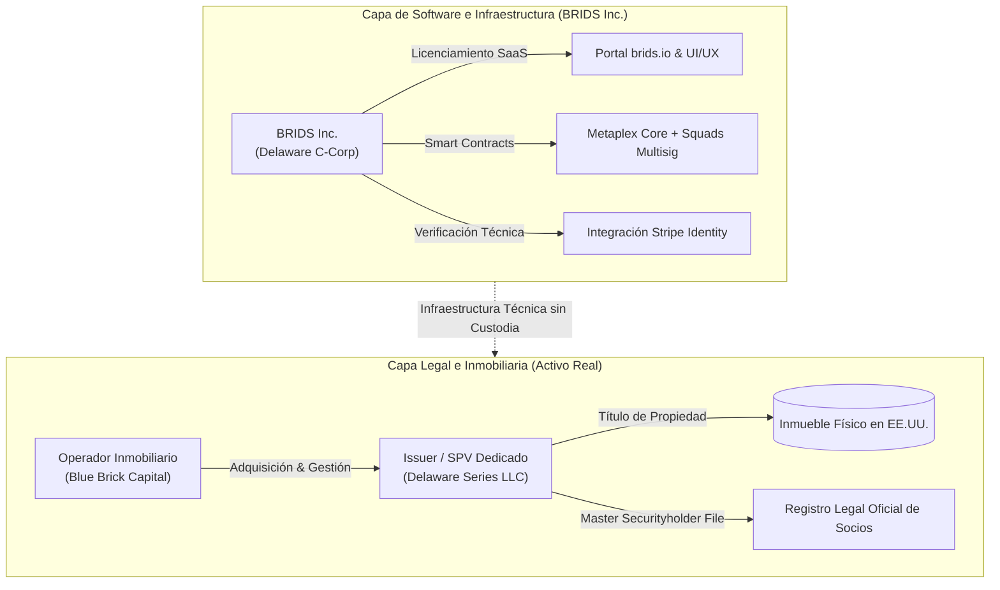

# Concepto Maestro: Estructuración Dual-Entity y Blindaje Regulatorio Non-Broker-Dealer

> [!NOTE] Resumen Ejecutivo
> BRIDS.io opera bajo una estricta separación institucional de entidades: **BRIDS Inc. (Delaware C-Corp)** actúa exclusivamente como proveedor de software e infraestructura tecnológica, mientras que cada propiedad inmobiliaria es adquirida y administrada por una **Sociedad de Propósito Especial independiente (Delaware Series LLC / SPV)**. Este diseño garantiza que BRIDS no califique como broker-dealer, portal de financiamiento fiduciario ni asesor de inversión bajo la Sección 15(a)(1) del Securities Exchange Act de 1934, blindando la escalabilidad del negocio frente a contingencias regulatorias.

---

## 1. One-Liner Canónico (Pitch & Website)

> *"BRIDS es el proveedor de software e infraestructura en Solana que digitaliza la sindicación inmobiliaria; no custodiamos fondos ni intermediamos valores, cada propiedad pertenece a un SPV legal independiente en Delaware."*

---

## 2. Tesis y Fundamentación Conceptual

El mayor riesgo de los proyectos de tokenización de activos del mundo real (RWA) radica en la mezcla promiscua de tres funciones que el marco regulatorio financiero considera incompatibles sin licencias bancarias o de corretaje:
1. **La custodia de fondos o valores:** Administrar dinero fiduciario o llaves privadas de terceros.
2. **La intermediación con cobro de comisiones de éxito:** Cobrar porcentajes sobre la venta de títulos de inversión como broker-dealer.
3. **El asesoramiento y recomendación fiduciaria:** Recomendar al inversor la conveniencia de adquirir determinado activo.

BRIDS.io resuelve este dilema mediante el **desacoplamiento dual-entity**:

---

## 3. Anclajes Técnicos y Normativos Verificables

1. **Securities Exchange Act of 1934 (Sección 15(a)(1)):**
   - BRIDS no recibe compensación basada en transacciones de valores (*transaction-based compensation* que constituya comisión de éxito por colocación de valores). Su modelo de cobro es por uso de infraestructura de software (SaaS y procesamiento técnico de datos).
2. **Delaware Limited Liability Company Act (Section 18-215 / Series LLC):**
   - Cada inmueble cuenta con contabilidad, activos y pasivos jurídicamente segregados. La insolvencia eventual de un SPV no afecta a los demás ni a la empresa de software matriz.
3. **Primatía del Master Securityholder File:**
   - La titularidad jurídica del socio emana del libro legal de socios de la LLC de Delaware. El NFT de Metaplex Core en Solana es la **representación digital trazable** de dicha participación, no un título al portador anónimo.
4. **Regulación D 506(c) y Regulación S (SEC Frameworks):**
   - Emisiones privadas destinadas a inversionistas acreditados en EE.UU. o inversionistas internacionales no estadounidenses, implementando verificación KYC/AML estricta con Stripe Identity.

---

## 4. Matriz Comparativa de Enfoque

| Dimensión | Plataformas Cripto Sin Regulación | Crowdfunding Tradicional Web2 | Estructuración Dual-Entity BRIDS |
| :--- | :--- | :--- | :--- |
| **Entidad Emisora** | DAO anónima o token sin respaldo legal | Plataforma centralizada con licencias locales rígidas | **SPV LLC dedicada en Delaware por propiedad** |
| **Rol de la Plataforma** | Especulación sin registro de socios | Intermediario financiero fiduciario | **Proveedor de software SaaS e infraestructura** |
| **Libro de Socios** | Ledger on-chain sin personería jurídica | Base de datos privada analógica | **Master Securityholder File respaldado en Delaware** |
| **Riesgo Regulatorio** | Alto (Sanciones SEC, freeze de tokens) | Alto costo operativo y licencias por país | **Protegido por separación de funciones y software puro** |

---

## 5. Snippets Reutilizables (Ready-to-Cite)

### Snippet 5.1: Para Pitch Decks y Preguntas de Inversionistas (YC Q&A)
> *"BRIDS.io opera bajo un modelo puro de infraestructura de software constituido como Delaware C-Corp. Cada activo inmobiliario reside en un SPV independiente bajo la legislación de Delaware, operado por desarrolladores calificados. Nosotros no somos broker-dealers ni ejercemos custodia fiduciaria: cobramos licenciamiento SaaS y tarifas de infraestructura técnica por habilitar la sindicación automatizada en Solana."*

### Snippet 5.2: Para Términos Legales, Footer y Documentos Públicos
> *"BRIDS.io es una plataforma de software e infraestructura tecnológica desarrollada en la red de Solana. BRIDS.io no es un corredor de bolsa (broker-dealer), portal de financiamiento regulado ni asesor de inversiones. Los activos inmobiliarios fraccionados son emitidos por Sociedades de Propósito Especial (SPVs) independientes bajo las leyes aplicables de EE.UU."*

---

## 6. Directrices Léxicas (Do's & Don'ts)

- **Obligatorio Usar:** Infraestructura de software, plataforma tecnológica, SPV dedicado en Delaware, representación digital de participaciones, Master Securityholder File, proveedor tecnológico independiente.
- **Prohibido Terminantemente:** Broker-dealer, captación de ahorros, custodia de fondos de clientes, comisión de venta de acciones, fondo de inversión colectivo propio.

---

## Historial de Revisiones

| Versión | Fecha | Autor / Agente | Resumen de Modificaciones |
| :--- | :--- | :--- | :--- |
| **1.0.0** | 2026-09-11 | `compliance-officer` & SDD Loop | Creación inicial de la nota conceptual atómica bajo estándares de gobernanza. |
