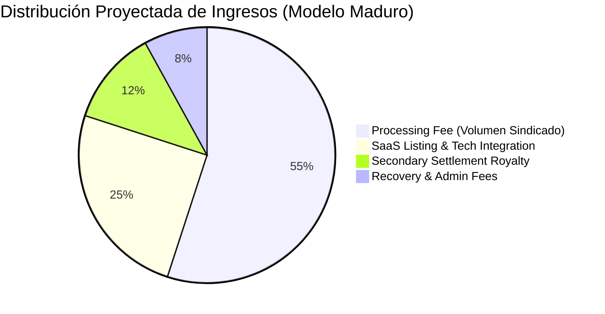

# Concepto Maestro: Arquitectura de Monetización, Estructura de Tarifas y Unit Economics

> [!NOTE] Resumen Ejecutivo
> El modelo de negocio de BRIDS.io combina la recurrencia y altos márgenes brutos de una plataforma **SaaS B2B** con la escalabilidad transaccional de una infraestructura tecnológica de procesamiento. Al estructurarse estrictamente como proveedor de software y no como intermediario de valores, los ingresos provienen de cuatro corrientes transparentes: **(1) SaaS Listing Fee** cobrado a los desarrolladores/SPVs, **(2) Processing & Infrastructure Fee** sobre el volumen primario sindicado (0.5% a 1.5%), **(3) Recovery Execution Fee** por soporte administrativo y biométrico, y **(4) Secondary Settlement Royalty** en transferencias P2P autorizadas. Este esquema ofrece un margen bruto superior al 80% y un unit economics altamente rentable.

---

## 1. One-Liner Canónico (Business Model Slide & YC Memo)

> *"Monetizamos como el Shopify de la sindicación inmobiliaria: cobramos una tarifa de software al desarrollador por desplegar su proyecto y una tasa de procesamiento tecnológico sobre el volumen liquidado en Solana."*

---

## 2. Las 4 Corrientes de Ingresos de BRIDS.io

### 1. B2B Sponsor Listing & Tech Integration Fee (SaaS de Configuración)
- **A quién se cobra:** Al desarrollador inmobiliario o al SPV emisor.
- **Monto:** $5,000 a $25,000 USD por proyecto sindicado (según el volumen y complejidad de la emisión).
- **Qué cubre:** Parametrización técnica de smart contracts en Metaplex Core, configuración de la bóveda Squads Multi-Sig, despliegue del dashboard público de obra y setup de la pasarela Stripe Identity.
- **Naturaleza:** Ingreso de software de alto margen bruto (>90%).

### 2. Processing & Technology Infrastructure Fee (Tasa de Procesamiento)
- **A quién se cobra:** Retenido transparentemente en la emisión primaria.
- **Tasa:** **0.5% a 1.5%** sobre el volumen total de capital sindicado (GMV).
- **Justificación:** Uso de la infraestructura de contratos, cálculo on-chain de derechos, emisión de NFTs y enrutamiento en Solana.
- **Comparativa de mercado:** Las bancas de inversión y brokers tradicionales cobran entre 5% y 10% por intermediación analógica; BRIDS reduce ese costo a software puro.

### 3. Fee de Recuperación Administrativa y Reemisión (Lost-Key Recovery)
- **A quién se cobra:** Al inversor que extravía sus claves y solicita revalidación.
- **Monto:** $50 a $100 USD por evento.
- **Qué cubre:** Costo de la sesión biométrica en Stripe Identity, revisión legal con el SPV y ejecución técnica de quemado/reemisión del NFT.

### 4. Secondary Market Settlement Royalty (Regalía de Liquidación Secundaria)
- **A quién se cobra:** Tasa sobre transferencias directas o secundarias entre inversores verificados.
- **Tasa:** **0.5% a 1.0%** sobre el monto transferido, ejecutada automáticamente mediante smart contract.

---

## 3. Unit Economics & Métricas Clave

### A. Sponsor / Desarrollador Inmobiliario (B2B):
- **Sponsor CAC (Costo de Adquisición):** ~$3,500 – $6,000 USD (mediante canal B2B outbound y alianzas como Blue Brick Capital).
- **Tamaño de Proyecto Típico:** $1,000,000 – $3,000,000 USD.
- **Revenue Promedio por Proyecto:**
  - Setup SaaS Fee: ~$10,000 USD.
  - Processing Fee (1.0% de $1.5M): ~$15,000 USD.
  - Total por Emisión: **$25,000 USD**.
- **LTV del Sponsor (Promedio 3 proyectos en 24 meses):** **$75,000 USD**.
- **Ratio LTV / CAC:** **>12x** (Excelente viabilidad económica institucional).

### B. Inversionista Retail:
- **Ticket Promedio Inicial:** $250 USD (mínimo $100 USD).
- **Tasa de Reinversión (Reinvestment Rate proyectada):** >45% del rendimiento de rentas es reinvertido en nuevos SPVs.
- **Retail CAC:** ~$25 – $40 USD (canales orgánicos, SEO de nicho, comunidad Solana).
- **Retail LTV:** ~$180 USD a 24 meses (por comisiones acumuladas de procesamiento y volumen recurrente).

---

## 4. Comparativa de Márgenes vs Alternativas del Mercado

| Métrica | Corredor / Sindicación Tradicional | Crowdfunding Web2 Centralizado | Plataforma de Software BRIDS.io |
| :--- | :--- | :--- | :--- |
| **Comisión de Intermediación** | 6.0% – 10.0% (Broker-dealer fee) | 3.0% – 7.0% plataforma | **0.5% – 1.5% Processing Fee** |
| **Costos Fijos de Setup Legal/IT** | $40,000 – $80,000 USD analógicos | $15,000 – $30,000 USD | **$5,000 – $25,000 USD (SaaS puro)** |
| **Margen Bruto de la Plataforma** | 30% – 45% (Alta carga de personal) | 50% – 60% (Soporte manual) | **>80% (Automatización on-chain)** |
| **Escalabilidad Operativa** | Lineal (Más personas por transacción) | Semi-lineal | **Exponencial (Software en Solana)** |

---

## 5. Snippets Reutilizables (Ready-to-Cite)

### Snippet 5.1: Para Slide de Modelo de Negocio en Investor Decks (YC)
> *"BRIDS opera con un modelo híbrido de software SaaS y fee de infraestructura: cobramos entre $5k y $25k a los desarrolladores por parametrizar técnicamente su sindicación, sumado a un processing fee del 1.0% sobre el volumen procesado en Solana. Con un take-rate eficiente de bajo porcentaje, reducimos los costos tradicionales de colocación en más de un 70% mientras mantenemos márgenes brutos de software superiores al 80%."*

### Snippet 5.2: Para One-Pagers B2B Dirigidos a Desarrolladores Inmobiliarios
> *"Reemplaza las costosas estructuras de sindicación privada y los honorarios leoninos de intermediarios con una suscripción tecnológica transparente. Con BRIDS, colocas tu proyecto frente a una base de capital global con una tarifa de setup fija y una tasa de procesamiento de solo el 1.0%, manteniendo el control total de tu activo."*

---

## 6. Directrices Léxicas (Do's & Don'ts)

- **Obligatorio Usar:** SaaS listing fee, processing fee sobre infraestructura tecnológica, software take-rate, margen bruto, LTV/CAC, tarifa de recuperación técnica.
- **Prohibido Terminantemente:** Comisión por venta de acciones, porcentaje de éxito sobre colocación de valores, cobro de corretaje inmobiliario, intermediación financiera.

---

## Historial de Revisiones

| Versión | Fecha | Autor / Agente | Resumen de Modificaciones |
| :--- | :--- | :--- | :--- |
| **1.0.0** | 2026-09-11 | `business-consultant` & SDD Loop | Formulación integral de la arquitectura de tarifas y unit economics. |
