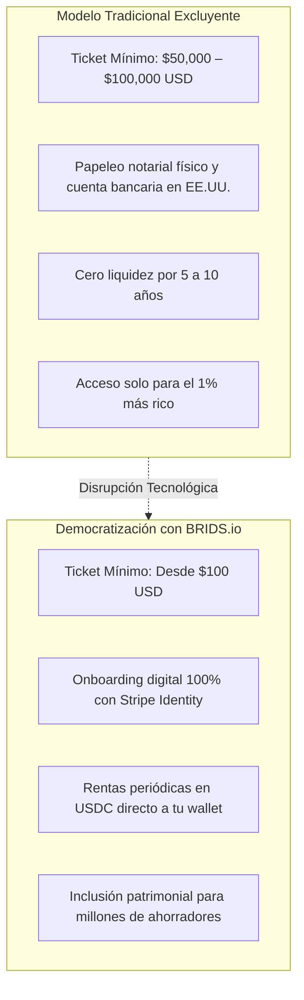

# Concepto Maestro: Tesis de Democratización y Fraccionamiento Retail ($100 USD)

> [!NOTE] Resumen Ejecutivo
> Históricamente, el acceso a la inversión inmobiliaria en los Estados Unidos ha estado restringido a individuos de ultra alto patrimonio neto (UHNWI) e instituciones debido a tickets mínimos de entrada prohibitivos ($50,000 a $100,000 USD) y complejas barreras burocráticas bancarias internacionales. BRIDS.io derriba esta asimetría histórica al permitir la **participación fraccionada desde $100 USD**. Mediante la infraestructura de Solana y stablecoins (USDC), ofrecemos a la clase media global y a la comunidad nativa Web3 la oportunidad de dolarizar su patrimonio en activos tangibles que generan flujo de caja real, protegidos contra la inflación y desvinculados de la volatilidad especulativa de las criptomonedas.

---

## 1. One-Liner Canónico (Landing Page Hero & Social Tagline)

> *"Infraestructura Web3 segura, accesible y trazable para invertir en bienes raíces estructurados en EE.UU. desde $100 USD."*

---

## 2. Tesis Fundamental: La Asimetría del Mercado Inmobiliario

El sector inmobiliario es la clase de activo más grande del mundo (~$380 billones de dólares), pero también una de las más excluyentes:
- **La trampa del capital mínimo:** Un ahorrador promedio en América Latina, Asia o Europa con $1,000 o $5,000 USD no puede comprar un inmueble en EE.UU., quedando relegado a cuentas de ahorro de bajo interés o activos locales sometidos a devaluación cambiaria.
- **La trampa de la especulación cripto:** Los usuarios de criptomonedas y DeFi que buscan rentabilidad a menudo caen en esquemas de altcoins volátiles o memecoins sin colateral real, donde el riesgo de pérdida total es extremo.
- **El puente RWA de BRIDS:** Combina lo mejor de dos mundos: la **estabilidad, tangibilidad y respaldo legal** del real estate estadounidense con la **liquidez, agilidad y bajo ticket de entrada** de la tecnología descentralizada en Solana.

---

## 3. Los 3 Pilares de la Experiencia Retail en BRIDS

### 1. Accesibilidad Extrema ($100 USD)
- Elimina la necesidad de hipotecas, avales bancarios o historial crediticio en EE.UU.
- Permite construir un portafolio inmobiliario diversificado con pequeñas aportaciones periódicas (estrategia Dollar-Cost Averaging aplicada a Real Estate).

### 2. Trazabilidad Total y Transparencia en Tiempo Real
- Cada inversor accede a un dashboard público donde puede ver la ficha catastral de la propiedad, fotografías satelitales y de obra, contratos de arrendamiento y reportes financieros mensuales.
- Cero "cajas negras" o intermediarios opacos que retienen información.

### 3. Cobro Transparente de Rendimientos en USDC
- Los ingresos por rentas o ventas de remodelación se liquidan en **USDC nativo en Solana**.
- El inversor recibe sus fondos directamente en su billetera sin deducciones ocultas ni comisiones bancarias internacionales de transferencias SWIFT.

---

## 4. Perfiles del Inversionista Retail (Buyer Personas)

| Perfil | Buyer Persona Representativa | Mayor Dolor Actual | Propuesta de Valor de BRIDS |
| :--- | :--- | :--- | :--- |
| **Ahorrador Global / Anti-Inflación** | **Sofia (35 años, Gerente)** | Devaluación de su moneda local y falta de $100k para invertir en EE.UU. | Dolarización de ahorros desde $100 USD con respaldo en un SPV de Delaware. |
| **Nativo Cripto / DeFi Investor** | **Alex (28 años, Dev Web3)** | Cansancio de la volatilidad extrema y rug pulls en protocolos DeFi. | Rendimiento real y sostenible respaldado por ladrillos en EE.UU. a velocidad Solana. |
| **Micro-Inversor Frecuente** | **David (42 años, Consultor)** | Falta de tiempo para gestionar inquilinos o mantener propiedades. | Inversión pasiva 100% manos libres operada por Blue Brick Capital. |

---

## 5. Snippets Reutilizables (Ready-to-Cite)

### Snippet 5.1: Para Copy de Conversión en Landing Pages (Hero Section)
> *"Por primera vez, no necesitas $100,000 dólares ni visa estadounidense para ser dueño de una fracción de un inmueble en EE.UU. En BRIDS.io, inviertes desde $100 USD, recibes rendimientos mensuales en dólares digitales (USDC) y monitoreas tu inversión con total transparencia on-chain."*

### Snippet 5.2: Para Discurso de Visión del Fundador (YC Why Now?)
> *"El sueño de invertir en bienes raíces ha estado roto para nuestra generación: los precios de la vivienda se han disparado y los vehículos tradicionales están diseñados solo para millonarios. En BRIDS usamos la velocidad y los costos casi nulos de Solana para hacer económicamente viable lo que antes era imposible: que cualquier persona en el mundo pueda construir patrimonio inmobiliario dolarizado dólar a dólar, comenzando con solo $100."*

---

## 6. Directrices Léxicas (Do's & Don'ts)

- **Obligatorio Usar:** Democratización del acceso, inversión fraccionada desde $100 USD, respaldo en activos tangibles, dolarización de patrimonio, rendimientos reales por rentas en USDC, transparencia on-chain.
- **Prohibido Terminantemente:** Dinero fácil, rentabilidad 100% garantizada, memecoins, especulación cripto, hacerte rico de la noche a la mañana.

---

## Historial de Revisiones

| Versión | Fecha | Autor / Agente | Resumen de Modificaciones |
| :--- | :--- | :--- | :--- |
| **1.0.0** | 2026-09-11 | `founder-ghostwriter` & SDD Loop | Creación y fundamentación de la tesis de democratización retail. |
