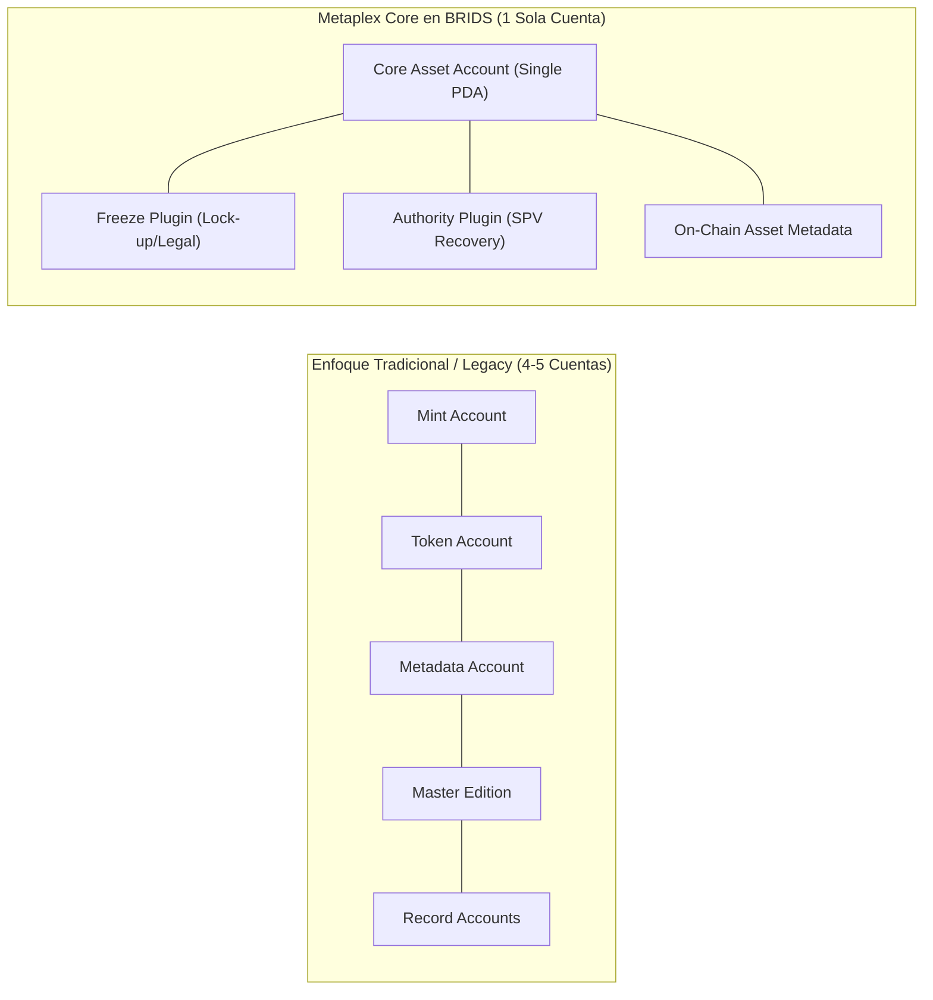

# Concepto Maestro: Infraestructura RWA en Solana y Estándar Metaplex Core

> [!NOTE] Resumen Ejecutivo
> La viabilidad económica de democratizar la inversión inmobiliaria con tickets desde **$100 USD** es técnicamente imposible en redes de alto costo computacional como Ethereum o sus capas L2 fragmentadas. BRIDS.io utiliza la red de **Solana** combinada con el estándar de nueva generación **Metaplex Core**. Con tarifas por transacción inferiores a **$0.0005 USD**, finalización en **400 milisegundos**, arquitectura de cuenta única (*Single Account Architecture*) y plugins programáticos nativos (*Freeze* y *Authority*), Solana es el único ecosistema capaz de soportar la dispersión masiva de dividendos en USDC y la trazabilidad on-chain a escala institucional.

---

## 1. One-Liner Canónico (Pitch & YC Application)

> *"BRIDS corre sobre Solana porque es la única red donde liquidar una inversión inmobiliaria de $100 USD o dispersar dividendos a miles de usuarios cuesta fracciones de centavo y toma menos de un segundo."*

---

## 2. Tesis y Fundamentación Conceptual: ¿Por qué Solana para RWA?

El fraccionamiento de activos del mundo real (RWA) requiere procesar micro-transacciones financieras frecuentes:
1. Compra inicial de participaciones fraccionadas ($100 a $5,000 USD).
2. Distribución mensual de rentas por alquiler en USDC.
3. Actualización periódica de metadatos de obra y valuación del inmueble.
4. Transferencias secundarias entre inversionistas autorizados.

En Ethereum L1, una sola transacción puede costar entre $3 y $45 USD en gas fees, lo que devora instantáneamente la rentabilidad de un ticket de $100 USD. Las soluciones Layer 2 (Arbitrum, Optimism, Base), aunque más baratas, sufren de fragmentación de liquidez, puentes vulnerables (cross-chain bridges) y latencias de retiro.

Solana ofrece una máquina de estado unificada y global con:
- **Throughput real masivo:** Capacidad de miles de transacciones por segundo sin subastas de gas predatorias.
- **Tarifas deterministas y subcéntimo:** Costes promedio de ~0.000005 SOL (~$0.0005 USD).
- **Finalidad instantánea:** Confirmación de bloques en ~400ms, proporcionando una experiencia de usuario idéntica a una aplicación Web2 de alta gama.

---

## 3. Innovación Técnica: El Estándar Metaplex Core

A diferencia del estándar histórico de NFTs en Solana (Token Metadata Legacy) o los contratos ERC-721/ERC-3643 en EVM, BRIDS adopta **Metaplex Core**:

### Ventajas de Metaplex Core para BRIDS:
1. **Reducción del 85% en Renta de Almacenamiento:** Concentra todos los datos en un único PDA on-chain, abaratando drásticamente el coste de despliegue de colecciones inmobiliarias masivas.
2. **Plugins de Ciclo de Vida Nativos:**
   - **Freeze Plugin:** Permite congelar programáticamente transferencias para implementar periodos de permanencia (*lock-up* estatutarios de la SEC) o medidas cautelares sin desplegar lógica compleja.
   - **Authority / Lifecycle Hooks:** Facilita el protocolo de recuperación de billeteras extraviadas mediante la quema y reemisión autorizada por el SPV.
3. **Indexación Directa:** Facilita la consulta en tiempo real desde exploradores de bloques y dashboards de inversionistas.

---

## 4. Matriz Comparativa de Infraestructura Blockchain

| Atributo Técnico | Ethereum Mainnet (L1) | Capas 2 EVM (L2) | Red Solana (Metaplex Core) |
| :--- | :--- | :--- | :--- |
| **Costo por Transacción** | $3.00 – $50.00 USD | $0.05 – $0.50 USD | **<$0.0005 USD (Fracciones de centavo)** |
| **Tiempo de Confirmación** | 12 – 15 segundos | 1 – 3 segundos | **~400 milisegundos (Subsegundo)** |
| **Viabilidad Ticket $100** | Inviable (Gas excede rentabilidad) | Regular (Fricción de bridges) | **100% Viable y Rentable** |
| **Cuentas por Activo** | Múltiples contratos proxy | Múltiples contratos proxy | **Cuenta Única (Single PDA optimizado)** |
| **Moneda de Liquidación** | USDC en Ethereum | USDC en L2 puenteado | **USDC nativo en Solana con dispersión Squads** |

---

## 5. Snippets Reutilizables (Ready-to-Cite)

### Snippet 5.1: Para Slide de Tecnología en Pitch Decks (YC / Sequoia)
> *"Construir RWA para el usuario retail requiere micro-liquidaciones viables. En Solana, una distribución de rentas a 5,000 inversionistas cuesta menos de $2.50 USD en total, frente a miles de dólares en Ethereum. Con el estándar Metaplex Core, reducimos los costos de almacenamiento on-chain en un 85% y habilitamos controles estatutarios de congelamiento y recuperación de grado institucional."*

### Snippet 5.2: Para Artículos de Liderazgo de Pensamiento (Founder Voice)
> *"Muchos proyectos de RWA se equivocan de red eligiendo blockchains caras por mero prestigio histórico. Si tu modelo de negocio busca democratizar el acceso a bienes raíces desde $100 dólares, no puedes cobrar $15 dólares en comisiones de red por cobrar una renta mensual de $0.80 centavos. En BRIDS elegimos Solana por ingeniería y sentido común financiero: velocidad subsegundo, costo casi cero y arquitectura limpia con Metaplex Core."*

---

## 6. Directrices Léxicas (Do's & Don'ts)

- **Obligatorio Usar:** Red Solana, estándar Metaplex Core, arquitectura de cuenta única, tarifas subcéntimo, finalización subsegundo, plugins de ciclo de vida, USDC nativo en Solana.
- **Prohibido Terminantemente:** Red barata (usar *eficiente y de bajo costo*), criptomoneda especulativa, gas descontrolado, puentes inseguros.

---

## Historial de Revisiones

| Versión | Fecha | Autor / Agente | Resumen de Modificaciones |
| :--- | :--- | :--- | :--- |
| **1.0.0** | 2026-09-11 | `founder-ghostwriter` & SDD Loop | Creación y fundamentación técnica de la ventaja de infraestructura Solana. |
