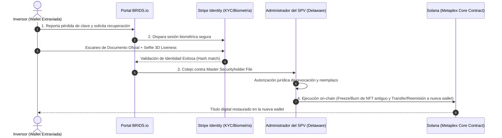

# Concepto Maestro: Protocolo Institucional de Recuperación de Llaves Privadas (Lost-Key Recovery)

> [!NOTE] Resumen Ejecutivo
> El mayor obstáculo para la adopción masiva de la inversión inmobiliaria en Web3 es el dogma cripto de que *"la pérdida de la llave privada equivale a la pérdida irreversible del patrimonio"*. En BRIDS.io, la propiedad jurídica del inmueble emana del registro societario del SPV de Delaware, no de la posesión efímera de una clave privada. Mediante la integración de **Stripe Identity** (biometría y pasaporte oficial) y los plugins de autoridad y congelamiento de **Metaplex Core en Solana**, BRIDS implementa un flujo institucional de 4 pasos para revalidar la identidad del inversor y reemitir/transferir su título digital a una nueva billetera, eliminando el riesgo de pérdida patrimonial.

---

## 1. One-Liner Canónico (Pitch & FAQs)

> *"En BRIDS, perder tu billetera no significa perder tu propiedad: tu derecho legal está respaldado en Delaware y recuperas tu título digital mediante verificación biométrica en Stripe Identity y Metaplex Core."*

---

## 2. Tesis y Fundamentación Conceptual

En los criptoactivos nativos no respaldados (Bitcoin, memecoins), el token *es* el activo; si la clave privada se extravía, no hay instancia terrenal que pueda revertir la transacción.

En los Activos del Mundo Real (RWA) institucionales, esta lógica es inaceptable tanto para inversores patrimoniales como para los reguladores:
- El activo subyacente es un inmueble físico con escritura pública registrada en un condado de EE.UU.
- El titular de la inversión es una persona natural o jurídica verificada con nombre, documento de identidad y domicilio.
- El título de propiedad sobre la fracción reside estatutariamente en el **Master Securityholder File** del SPV.

Por lo tanto, la tecnología blockchain en BRIDS cumple el rol de **registro dinámico de representación y liquidación**, no de fuente exclusiva del derecho de propiedad. Si una wallet es hackeada o se extravían las 12 palabras semilla, el protocolo entra en acción.

---

## 3. Protocolo Operativo en 4 Pasos

1. **Notificación y Solicitud:** El inversor notifica el extravío o compromiso de su billetera antes de la fecha de corte de dividendos (Snapshot Date).
2. **Re-verificación Biométrica en Stripe Identity:** El usuario completa una sesión de verificación biométrica documental con reconocimiento facial activo (Liveness Check) cotejada contra su KYC original.
3. **Validación Estatutaria del SPV:** El administrador legal del SPV verifica que los datos coincidan con el titular inscrito en el *Master Securityholder File* y autoriza la actualización registral.
4. **Ejecución Técnica en Solana:** Mediante la autoridad delegada del contrato de Metaplex Core, se congela (*Freeze Plugin*) y quema/invalida el NFT alojado en la wallet perdida, y se emite o transfiere un NFT idéntico a la nueva wallet verificada del usuario.

---

## 4. Matriz de Diferenciación Técnica

| Escenario | Cripto Tradicional (Ethereum ERC-20) | Protocolos RWA Anónimos | Protocolo BRIDS.io (Metaplex Core + Stripe) |
| :--- | :--- | :--- | :--- |
| **Pérdida de Llaves** | Pérdida definitiva irreversible del 100% | Sin soporte legal; fondos confiscados o perdidos | **Recuperación completa del título y derechos de renta** |
| **Hackeo / Robo de Wallet** | El atacante drena y vende los tokens | Bloqueo manual complejo sin sustento judicial | **Freeze Plugin programático inmediato + reasignación legal** |
| **Protección de Datos** | PII almacenada en servidores vulnerables | Sin verificación de identidad (alto riesgo AML) | **Cero almacenamiento de PII: Stripe Identity procesa y encripta** |

---

## 5. Snippets Reutilizables (Ready-to-Cite)

### Snippet 5.1: Para Preguntas Frecuentes (FAQ / Help Center)
> *"**¿Si pierdo el acceso a mi billetera Web3, pierdo mi inversión en el inmueble?**  
> No. A diferencia de las criptomonedas especulativas, en BRIDS.io tu derecho legal emana del contrato de sociedad del SPV en Delaware. Si pierdes tus claves privadas, activamos nuestro Protocolo de Recuperación Institucional: verificas tu identidad mediante biometría en Stripe Identity y, una vez validado por el SPV, invalidamos el NFT anterior y emitimos un nuevo título digital en tu billetera de reemplazo."*

### Snippet 5.2: Para Discurso de Venta a Inversionistas Tradicionales
> *"Eliminamos la mayor barrera psicológica de Web3. Con BRIDS no tienes que vivir con el terror de olvidar tus contraseñas o perder tu frase semilla: cuentas con el respaldo legal de una entidad corporativa en EE.UU. y la tecnología de recuperación biométrica más avanzada del mercado."*

---

## 6. Directrices Léxicas (Do's & Don'ts)

- **Obligatorio Usar:** Protocolo de recuperación institucional, re-verificación biométrica en Stripe Identity, plugins de Metaplex Core, Master Securityholder File, titularidad societaria inalienable.
- **Prohibido Terminantemente:** Pérdida irreversible, wallet irrecuperable, token sin dueño, bypass legal, rescate arbitrario sin verificación.

---

## Historial de Revisiones

| Versión | Fecha | Autor / Agente | Resumen de Modificaciones |
| :--- | :--- | :--- | :--- |
| **1.0.0** | 2026-09-11 | `compliance-officer` & SDD Loop | Formalización canónica del protocolo de recuperación de billeteras. |
