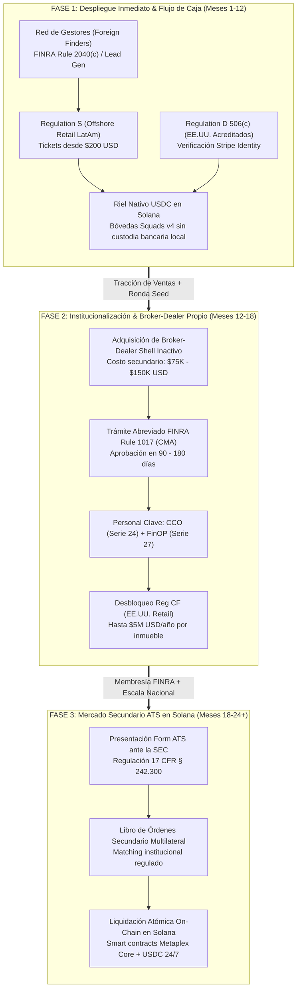

# C10: Marco Regulatorio Transfronterizo y Licenciamiento en 3 Fases (Reg S/D, BD Shell y ATS)

> [!NOTE] Resumen Ejecutivo
> BRIDS.io resuelve la tensión histórica entre velocidad de comercialización y cumplimiento financiero mediante una **estrategia secuencial en 3 fases**. En la Fase 1, elimina la fricción regulatoria de FINRA operando bajo **Regulation S** para colocar fracciones inmobiliarias de **$200 USD** en América Latina (Colombia, Ecuador, Chile y Argentina) y **Regulation D 506(c)** para inversores acreditados en EE.UU., apalancado en una red de gestores bajo el marco de **Foreign Finders (FINRA Rule 2040(c))**. En la Fase 2, utiliza el flujo de caja y capital institucional para **adquirir un Broker-Dealer shell inactivo (FINRA Rule 1017)**, desbloqueando **Regulation Crowdfunding (Reg CF)** para el público minorista masivo en EE.UU. En la Fase 3, activa un **Sistema Alternativo de Negociación (ATS)** registrado ante la SEC para proveer liquidez secundaria 24/7 sobre Solana mediante Metaplex Core.

---

## 1. One-Liner Canónico (Pitch Decks, YC Memo & Outbound)

> *"BRIDS escala su distribución en tres horizontes regulados: inicia monetizando retail en América Latina bajo Regulation S y capital acreditado en EE.UU. bajo Regulation D, adquiere un Broker-Dealer shell mediante FINRA Rule 1017 para abrir Regulation Crowdfunding en territorio estadounidense, y culmina operando un ATS institucional sobre Solana para dotar de liquidez 24/7 a los bienes raíces."*

---

## 2. Tesis de Escalamiento Institucional en 3 Fases

El error crítico de los proyectos de tokenización inmobiliaria ha sido intentar registrar un Broker-Dealer desde cero antes de vender un solo ticket (demorando de 14 a 24 meses y consumiendo más de $250,000 USD sin ingresos) o eludir por completo a la SEC operando de manera clandestina. BRIDS ejecuta un despliegue por etapas donde cada fase financia y valida a la siguiente:

---

## 3. El Corredor Transfronterizo de América Latina (4 Países)

La venta en América Latina no se efectúa como una oferta pública local de valores (reservada por ley a entidades financieras locales vigiladas), sino como una **inversión privada transfronteriza (*cross-border private investment*)** en títulos societarios de una LLC constituida en Estados Unidos, canalizada en **USDC sobre Solana**:

1. **Colombia (Gran Volumen y Red de Gestores):**
   - **Blindaje Penal de Captación (Decreto 4334 de 2008 y Art. 316 Código Penal):** La captación masiva e ilegal sanciona a quienes reciben dinero del público sin contraprestación real o prometiendo rendimientos fijos garantizados. BRIDS opera en estricta legalidad porque entrega cuotas sociales en una LLC dueña de un inmueble físico, distribuye dividendos variables según arriendo real y no capta pesos en cuentas bancarias colombianas.
   - **Estatus Jurídico de USDC:** La Superintendencia de Sociedades (*Oficio 100-237701*) reconoce que las stablecoins son **bienes intangibles susceptibles de valoración económica**, cuya entrega por participaciones societarias foráneas es un negocio privado legítimo.
   - **Flujo:** El usuario convierte COP a USDC mediante rampas privadas (DolarApp, Littio, Binance) y transfiere directamente a la bóveda Squads de la SPV en EE.UU.

2. **Ecuador (Entorno 100% Dolarizado):**
   - **Moneda Oficial y Normativa:** Regulado bajo el Código Orgánico Monetario y Financiero (COMF). Al carecer de moneda propia devaluada, el riesgo cambiario es nulo.
   - **Garantía Constitucional:** El Artículo 321 de la Constitución de la República del Ecuador consagra el derecho de propiedad y la libre contratación e inversión en el extranjero. Los usuarios suscriben tickets de $200 USD directamente vía tarjeta internacional o USDC.

3. **Chile (Inversor Institucional y Régimen FinTech NCG 336):**
   - **Marco Normativo (Ley 21.521 y CMF):** La Ley FinTech regula la custodia de activos digitales y plataformas colectivas.
   - **Amparo de la NCG 336:** La Comisión para el Mercado Financiero (CMF) autoriza la oferta privada de valores extranjeros no inscritos siempre que se incluya el *disclaimer* obligatorio:
     > *"Los valores ofrecidos no están inscritos en el Registro de Valores de la CMF y se rigen por la legislación de EE.UU., no estando sujetos a la fiscalización de la CMF ni existiendo obligación de divulgar información pública en Chile."*
   - **Perfil:** Tickets promedio elevados ($500 a $1,500 USD) para diversificación en renta residencial en Florida.

4. **Argentina (Adopción Cripto Masiva y Dolarización Contractual):**
   - **Principio de Pago Específico (DNU 70/2023):** Modificó los Arts. 765 y 766 del Código Civil y Comercial, obligando a saldar las obligaciones en la moneda o activo pactado (USDC o dólares) sin conversión judicial a pesos.
   - **Registro PSAV de la CNV (RG 994/2024):** BRIDS no opera como intermediario o custodio local domiciliado, sino como plataforma tecnológica transfronteriza no custodial donde el inversor interactúa desde su propia billetera hacia la bóveda en Solana.

---

## 4. Matriz Estratégica: Las 4 Reglas de Oro de Blindaje Transfronterizo

| Regla | Implementación Operativa en BRIDS | Fundamento de Protección Jurídica |
|---|---|---|
| **1. Cero Retorno Garantizado** | Se anuncian dividendos estimados basados en la renta efectiva de alquiler, nunca tasas fijas de interés ni pagarés. | Desactiva las figuras de intermediación bancaria y captación ilegal de ahorro público. |
| **2. Jurisdicción Foránea Exclusiva** | El Operating Agreement de la LLC emisora estipula arbitraje y fuero exclusivo en tribunales de Delaware o Florida. | Mantiene el contrato de inversión bajo el régimen corporativo de EE.UU. |
| **3. Cero Recaudación Bancaria Local** | Ningún fondo pasa por cuentas bancarias corporativas de BRIDS en bancos de LatAm. Todo entra vía USDC on-chain o pasarelas internacionales. | Impide embargos o congelamientos de cuentas por superintendencias financieras locales. |
| **4. Red de Gestores como Lead Gen** | Los promotores locales reciben honorarios por prospección comercial de clientes calificados, nunca por corretaje bursátil. | Se ampara en la figura de *Foreign Finders* (FINRA Rule 2040(c)) evitando el corretaje no autorizado. |

---

## 5. Estructura Legal de los Gestores (Foreign Finders)

Para movilizar redes de promotores inmobiliarios, contadores y asesores patrimoniales locales:
- **FINRA Rule 2040(c):** Autoriza el pago de compensación económica a personas no residentes en EE.UU. que refieran clientes foráneos para ofertas bajo Regulation S, sin requerir licencia de broker-dealer en EE.UU.
- **Formato Contractual:** Se suscribe un **Contrato de Servicios de Marketing y Generación de Leads Calificados (*Lead Generation & Marketing Referral Agreement*)** con la entidad tecnológica (Delaware C-Corp).
- **Prohibiciones Operativas:** El gestor jamás recibe dinero de los clientes, no custodia llaves privadas y no firma contratos a nombre de las SPVs. Su labor es puramente divulgativa y referencial.

---

## 6. Anclajes Técnicos y Normativos Verificables

1. **SEC Regulation S (17 CFR § 230.901):** Safe harbor para transacciones extraterritoriales dirigidas exclusivamente a no residentes en EE.UU.  
   🔗 [eCFR Title 17 § 230.901](https://www.ecfr.gov/current/title-17/chapter-II/part-230/subject-group-ECFR8df3d85834ad5ee/section-230.901)
2. **SEC Regulation D, Rule 506(c):** General solicitation permitida para inversionistas acreditados con verificación razonable de estatus.  
   🔗 [SEC.gov Rule 506(c)](https://www.sec.gov/resources-small-businesses/exempt-offerings/rule-506c)
3. **FINRA Rule 2040(c) (Foreign Finders):** Exención expresa de compensación a personas extranjeras no registradas.  
   🔗 [FINRA Rule 2040](https://www.finra.org/rules-guidance/rulebooks/finra-rules/2040)
4. **FINRA Rule 1017 (Continuing Membership Application):** Procedimiento de cambio de control para la adquisición de un Broker-Dealer inactivo.  
   🔗 [FINRA Rule 1017](https://www.finra.org/rules-guidance/rulebooks/finra-rules/1017)
5. **SEC Regulation Crowdfunding (17 CFR Part 227):** Venta masiva a minoristas de EE.UU. hasta $5,000,000 USD anuales por proyecto.  
   🔗 [SEC.gov Reg CF Overview](https://www.sec.gov/resources-small-businesses/exempt-offerings/regulation-crowdfunding)
6. **SEC Regulation ATS (17 CFR § 242.300):** Plataforma multilateral para emparejamiento secundario de valores.  
   🔗 [SEC.gov Alternative Trading Systems](https://www.sec.gov/divisions/marketreg/mreg-ats)
7. **Colombia (Decreto 4334/2008 y Art. 316 C.P.):** Régimen de intervención por captación masiva.  
   🔗 [Función Pública - Decreto 4334 de 2008](https://www.funcionpublica.gov.co/eva/gestornormativo/norma.php?i=33785)
8. **Chile (Ley 21.521 y NCG 336 CMF):** Régimen FinTech y oferta privada de valores extranjeros.  
   🔗 [Biblioteca del Congreso Nacional - Ley 21.521](https://www.bcn.cl/leychile/navegar?idNorma=1186714) y [CMF NCG 336](https://www.cmfchile.cl/normativa/ncg_336_2012.pdf)
9. **Argentina (DNU 70/2023):** Principio de pago específico en moneda pactada (Arts. 765 y 766 CCyC).  
   🔗 [Boletín Oficial de la República Argentina - DNU 70/2023](https://www.boletinoficial.gob.ar/detalleAviso/primera/301124/20231221)

---

## 7. Sinergia con Otros Conceptos del Negocio

- **[[01 Negocio/01 Estrategia & Modelo/Business Concepts/concept-dual-entity-compliance.md|C1: Dual-Entity Compliance]]:** C1 establece la separación corporativa base (Delaware C-Corp vs SPVs); C10 proyecta la hoja de ruta de comercialización transfronteriza y la futura evolución hacia Broker-Dealer propio.
- **[[01 Negocio/01 Estrategia & Modelo/Business Concepts/concept-fee-architecture-unit-economics.md|C4: Fee Architecture & Unit Economics]]:** Articula cómo la Fase 1 monetiza el 1.5% - 2.5% de setup y $4/fracción, mientras que la Fase 2 captura el 100% de los fees de colocación bajo Reg CF que antes cobraban intermediarios externos.
- **[[01 Negocio/01 Estrategia & Modelo/Business Concepts/concept-retail-fractionalization-thesis.md|C6: Retail Fractionalization Thesis]]:** C10 habilita legalmente los tickets de $200 USD para retail en LatAm (Fase 1) y en EE.UU. (Fase 2).
- **[[01 Negocio/01 Estrategia & Modelo/Business Concepts/concept-rwa-identity-vc-thesis.md|C9: RWA Identity vs Crypto Trap]]:** C10 constituye el núcleo del foso defensivo regulatorio (*regulatory moat*) presentado ante fondos de Venture Capital y comités de Y Combinator.

---

## 8. Documento Canónico de Referencia

Para el desglose exhaustivo de los cronogramas, planes de auditoría, textos íntegros de leyes y checklist de implementación de cada fase:
👉 Ver documento maestro en la bóveda: **[[01 Negocio/03 Legal & Cumplimiento/hoja-ruta-regulatoria-3-fases-broker-dealer-ats.md|Hoja de Ruta Regulatoria y Comercial en 3 Fases: Reg S/D, Broker-Dealer Shell y ATS en Solana]]**.

---

## 🔄 Historial de Revisiones (Changelog)

- **v1.0 (2026-09-18):** Creación del concepto maestro C10 para codificar la estrategia regulatoria transfronteriza en 3 fases (Reg S/D, FINRA BD Shell Rule 1017 y ATS en Solana) y el blindaje del corredor LatAm (Colombia, Ecuador, Chile, Argentina).
