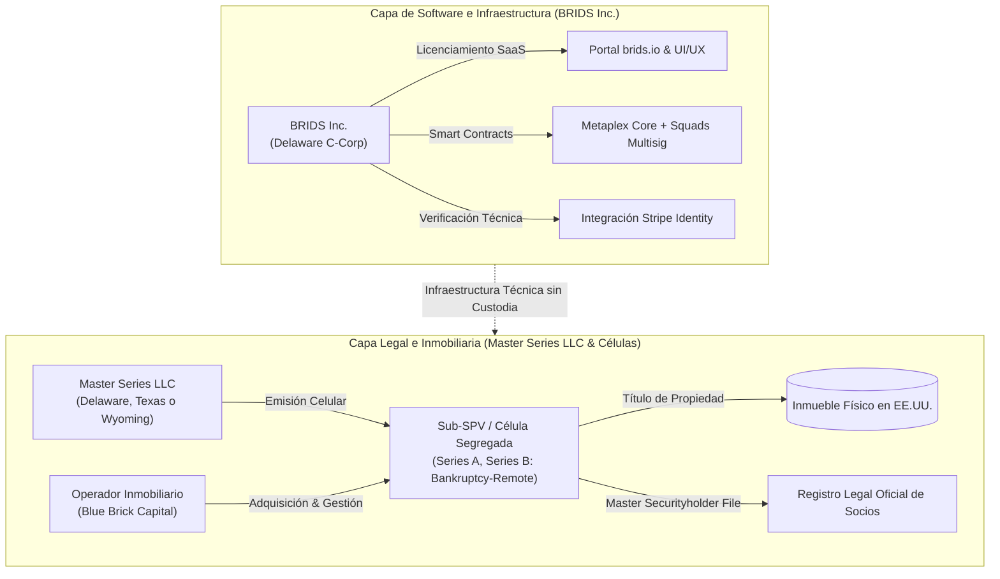

# C1: Estructuración Dual-Entity y Blindaje Non-Broker-Dealer

> [!NOTE] Resumen Ejecutivo
> BRIDS.io opera bajo una estricta separación institucional de entidades: **BRIDS Inc. (Delaware C-Corp)** actúa exclusivamente como proveedor de software e infraestructura tecnológica, mientras que cada proyecto inmobiliario es adquirido y administrado por una **Sociedad de Propósito Especial independiente (LLC constituida en la jurisdicción correspondiente a cada inmueble, ej. Florida, Texas, Delaware, etc.)**. Este diseño garantiza que BRIDS no califique como broker-dealer, portal de financiamiento fiduciario ni asesor de inversión bajo la Sección 15(a)(1) del Securities Exchange Act de 1934, blindando la escalabilidad del negocio frente a contingencias regulatorias.

---

## 1. One-Liner Canónico (Pitch & Website)

> *"BRIDS es el proveedor de software e infraestructura en Solana que digitaliza la sindicación inmobiliaria; no custodiamos fondos ni intermediamos valores, cada propiedad pertenece a un SPV legal independiente constituido en la jurisdicción del inmueble."*

---

## 2. Tesis y Fundamentación Conceptual

El mayor riesgo de los proyectos de tokenización de activos del mundo real (RWA) radica en la mezcla promiscua de tres funciones que el marco regulatorio financiero considera incompatibles sin licencias bancarias o de corretaje:
1. **La custodia de fondos o valores:** Administrar dinero fiduciario o llaves privadas de terceros.
2. **La intermediación con cobro de comisiones de éxito:** Cobrar porcentajes sobre la venta de títulos de inversión como broker-dealer.
3. **El asesoramiento y recomendación fiduciaria:** Recomendar al inversor la conveniencia de adquirir determinado activo.

BRIDS.io resuelve este dilema mediante el **desacoplamiento dual-entity**:

---

## 3. Anclajes Técnicos y Normativos Verificables

1. **Securities Exchange Act of 1934 (Sección 15(a)(1) — Non-Broker-Dealer Status):**
   - BRIDS no recibe compensación basada en transacciones de valores (*transaction-based compensation* que constituya comisión de éxito por colocación de valores). Su modelo de cobro es por uso de infraestructura de software (SaaS y procesamiento técnico de datos fijas).  
   🔗 [SEC Broker-Dealers Division of Trading and Markets](https://www.sec.gov/about/divisions-offices/division-trading-markets/broker-dealers)
2. **Criterios de la SEC sobre Valores Tokenizados y Master Securityholder File:**
   - La titularidad jurídica del socio emana del libro legal de socios de la LLC correspondiente a cada activo. Conforme al criterio oficial de la SEC, **el NFT representa digitalmente una posición, pero no es el registro legal**: el registro legal lo lleva el actor legal correspondiente en el SPV.  
   🔗 [SEC Corp Fin Statement on Tokenized Securities](https://www.sec.gov/newsroom/speeches-statements/corp-fin-statement-tokenized-securities-012826-statement-tokenized-securities)
3. **Estructura Jurídica de Master Series LLC y Sub-SPVs Celulares (Delaware, Texas, Wyoming):**
   - BRIDS Inc. opera constituida como Delaware C-Corp conforme a la DGCL para su estructura corporativa y gobernanza de software. Los activos inmobiliarios se estructuran a través de una **Master Series LLC** constituida en estados amigables (*friendly states* como Delaware 6 Del. C. § 18-215 / § 18-218, Texas TBOC Cap. 101 Subcap. M, o Wyoming Wyo. Stat. § 17-29-211). Cada inmueble se aloja en una **Serie individual (Sub-SPV)** con contabilidad, activos, pasivos y socios jurídicamente segregados (*internal liability shield* y *bankruptcy-remote*).
   - Para inmuebles en estados sin estatuto de Series LLC (ej. Florida), la Serie se inscribe como entidad foránea (*foreign qualification*) o constituye una LLC tradicional subsidiaria poseída al 100% por la Serie. La insolvencia eventual de una serie no afecta a las demás células ni a la C-Corp tecnológica.
4. **Reglas AML/CIP y No Intermediación Bancaria (FinCEN & 31 CFR 1023.220):**
   - BRIDS no toca dinero y no hace KYC por sí mismo: la verificación de identidad se delega en partners especializados como Stripe Identity conforme a [31 CFR 1023.220](https://www.ecfr.gov/current/title-31/subtitle-B/chapter-X/part-1023/subpart-B/section-1023.220) y la [Guía de FinCEN sobre Monedas Virtuales Convertibles](https://www.fincen.gov/sites/default/files/2019-05/FinCEN%20Guidance%20CVC%20FINAL%20508.pdf).
5. **No Recomendación de Inversiones (Investment Advisers Act of 1940):**
   - BRIDS no recomienda inversiones ni gestiona fondos privados de terceros.  
   🔗 [SEC Private Fund Adviser Overview](https://www.sec.gov/about/divisions-offices/division-investment-management/private-fund-adviser-overview)
6. **Seguridad de la Información (FTC Safeguards Rule):**
   - Cero almacenamiento de PII sensible sin encriptación.  
   🔗 [FTC Safeguards Rule](https://www.ftc.gov/legal-library/browse/rules/safeguards-rule)

---

## 4. Matriz Comparativa de Enfoque

| Dimensión | Plataformas Cripto Sin Regulación | Crowdfunding Tradicional Web2 | Estructuración Dual-Entity BRIDS |
| :--- | :--- | :--- | :--- |
| **Entidad Emisora** | DAO anónima o token sin respaldo legal | Plataforma centralizada con licencias locales rígidas | **SPV LLC dedicada en la jurisdicción del activo** |
| **Rol de la Plataforma** | Especulación sin registro de socios | Intermediario financiero fiduciario | **Proveedor de software SaaS e infraestructura** |
| **Libro de Socios** | Ledger on-chain sin personería jurídica | Base de datos privada analógica | **Master Securityholder File respaldado por la LLC del SPV** |
| **Riesgo Regulatorio** | Alto (Sanciones SEC, freeze de tokens) | Alto costo operativo y licencias por país | **Protegido por separación de funciones y software puro** |

---

## 5. Snippets Reutilizables (Ready-to-Cite)

### Snippet 5.1: Para Pitch Decks y Preguntas de Inversionistas (YC Q&A)
> *"BRIDS.io opera bajo un modelo puro de infraestructura de software constituido como Delaware C-Corp. Cada activo inmobiliario reside en un SPV independiente constituido en la jurisdicción correspondiente a cada desarrollo inmobiliario (Florida, Texas, Delaware, etc.), operado por desarrolladores calificados. Nosotros no somos broker-dealers ni ejercemos custodia fiduciaria: cobramos licenciamiento SaaS y tarifas de infraestructura técnica por habilitar la sindicación automatizada en Solana."*

### Snippet 5.2: Para Términos Legales, Footer y Documentos Públicos
> *"BRIDS.io es una plataforma de software e infraestructura tecnológica desarrollada en la red de Solana. BRIDS.io no es un corredor de bolsa (broker-dealer), portal de financiamiento regulado ni asesor de inversiones. Los activos inmobiliarios fraccionados son emitidos por Sociedades de Propósito Especial (SPVs) independientes bajo las leyes aplicables de EE.UU."*

---

## 6. Directrices Léxicas (Do's & Don'ts)

- **Obligatorio Usar:** Infraestructura de software, plataforma tecnológica, SPV independiente por inmueble (LLC local), representación digital de participaciones, Master Securityholder File, proveedor tecnológico independiente, Delaware C-Corp (BRIDS Inc.).
- **Prohibido Terminantemente:** Broker-dealer, captación de ahorros, custodia de fondos de clientes, comisión de venta de acciones, fondo de inversión colectivo propio.

---

## 7. Apéndice Breve: Versión Simplificada de Principios de Plataforma

- **sec.gov:** [Private Fund Adviser Overview (SEC)](https://www.sec.gov/about/divisions-offices/division-investment-management/private-fund-adviser-overview)
- **BRIDS no toca dinero.**
- **BRIDS no hace KYC por sí mismo y no recomienda inversiones:** [ecfr.gov — 31 CFR 1023.220](https://www.ecfr.gov/current/title-31/subtitle-B/chapter-X/part-1023/subpart-B/section-1023.220).
- **BRIDS no ejecuta la parte inmobiliaria y no reemplaza documentos legales:** [fincen.gov — FinCEN Guidance on Convertible Virtual Currency](https://www.fincen.gov/sites/default/files/2019-05/FinCEN%20Guidance%20CVC%20FINAL%20508.pdf).
- **El NFT representa digitalmente una posición, pero no es el registro legal:** [sec.gov — SEC Corp Fin Statement on Tokenized Securities](https://www.sec.gov/newsroom/speeches-statements/corp-fin-statement-tokenized-securities-012826-statement-tokenized-securities). El registro legal lo lleva el actor legal correspondiente en el SPV.
- **Protección de Datos y Seguridad de Información:** [ftc.gov — FTC Safeguards Rule](https://www.ftc.gov/legal-library/browse/rules/safeguards-rule).
- **Los partners hacen la parte especializada; BRIDS hace la infraestructura.**
- **BRIDS no debe cobrar como intermediario financiero por funciones que no asume.**
- **BRIDS debe comunicar siempre su rol real como plataforma tecnológica.**

### 7.1. Articulación con la Hoja de Ruta Regulatoria en 3 Fases y Venta Internacional
- La separación dual-entity es la base estructural que habilita la **Fase 1 (Regulation S en LatAm y Regulation D en EE.UU.)** sin requerir licencia de broker-dealer.
- Para el escalamiento hacia la adquisición de un Broker-Dealer shell (Fase 2) y el despliegue de un ATS secundario sobre Solana (Fase 3), consultar el concepto maestro complementario:
  👉 **[[01 Negocio/01 Estrategia & Modelo/Business Concepts/concept-cross-border-regulatory-roadmap.md|C10: Marco Regulatorio Transfronterizo y Licenciamiento en 3 Fases (Reg S/D, BD Shell y ATS)]]** y el documento rector **[[01 Negocio/03 Legal & Cumplimiento/hoja-ruta-regulatoria-3-fases-broker-dealer-ats.md|Hoja de Ruta Regulatoria y Comercial en 3 Fases]]**.

---

## 8. Apéndice Orientativo de Normas y Referencias a Revisar con Counsel

1. **Securities Exchange Act of 1934 (Broker-Dealer Regulations):**  
   🔗 [https://www.sec.gov/about/divisions-offices/division-trading-markets/broker-dealers](https://www.sec.gov/about/divisions-offices/division-trading-markets/broker-dealers)
2. **Securities Act of 1933, incluyendo Section 4(a)(6) para Crowdfunding:**  
   🔗 [https://www.sec.gov/rules-regulations/2015/10/crowdfunding](https://www.sec.gov/rules-regulations/2015/10/crowdfunding)
3. **Regulation Crowdfunding (Reg CF):**  
   🔗 [https://www.sec.gov/resources-small-businesses/exempt-offerings/regulation-crowdfunding](https://www.sec.gov/resources-small-businesses/exempt-offerings/regulation-crowdfunding)
4. **Investment Advisers Act of 1940 y exenciones aplicables para advisers de private funds:**  
   🔗 [https://www.sec.gov/about/divisions-offices/division-investment-management/private-fund-adviser-overview](https://www.sec.gov/about/divisions-offices/division-investment-management/private-fund-adviser-overview)
5. **Reglas AML/CIP aplicables a broker-dealers bajo 31 CFR 1023.220:**  
   🔗 [https://www.ecfr.gov/current/title-31/subtitle-B/chapter-X/part-1023/subpart-B/section-1023.220](https://www.ecfr.gov/current/title-31/subtitle-B/chapter-X/part-1023/subpart-B/section-1023.220)
6. **Guía de FinCEN sobre modelos con convertible virtual currency (CVC):**  
   🔗 [https://www.fincen.gov/sites/default/files/2019-05/FinCEN%20Guidance%20CVC%20FINAL%20508.pdf](https://www.fincen.gov/sites/default/files/2019-05/FinCEN%20Guidance%20CVC%20FINAL%20508.pdf)
7. **Criterios sobre tokenized securities y Master Securityholder File:**  
   🔗 [https://www.sec.gov/newsroom/speeches-statements/corp-fin-statement-tokenized-securities-012826-statement-tokenized-securities](https://www.sec.gov/newsroom/speeches-statements/corp-fin-statement-tokenized-securities-012826-statement-tokenized-securities)
8. **Referencias de seguridad de información y FTC Safeguards Rule:**  
   🔗 [https://www.ftc.gov/legal-library/browse/rules/safeguards-rule](https://www.ftc.gov/legal-library/browse/rules/safeguards-rule)

> [!IMPORTANT]
> Este apéndice es solo de referencia institucional y debe ser validado y ampliado por asesores legales en la jurisdicción correspondiente.

---

## Historial de Revisiones
- **v1.4 (2026-09-18):** Vinculación bidireccional con el Concepto Maestro C10 (Marco Regulatorio Transfronterizo y Licenciamiento en 3 Fases: Reg S/D, BD Shell y ATS) y la hoja de ruta regulatoria.
- **v1.3 (2026-09-16):** Integración de la arquitectura de Master Series LLC con sub-SPVs celulares y gobernanza en estados friendly (Delaware, Texas, Wyoming) vs no-friendly.

| Versión | Fecha | Autor / Agente | Resumen de Modificaciones |
| :--- | :--- | :--- | :--- |
| **1.4.0** | 2026-09-18 | `compliance-officer` | Vinculación y articulación bidireccional con el nuevo Concepto C10 y la hoja de ruta comercial en 3 fases. |
| **1.3.0** | 2026-09-16 | `compliance-officer` | Integración de la arquitectura de Master Series LLC con sub-SPVs celulares y gobernanza en estados friendly. |
| **1.2.0** | 2026-09-13 | `compliance-officer`, `business-consultant` | Desacoplamiento de jurisdicción de los SPVs inmobiliarios: BRIDS Inc. opera como Delaware C-Corp (SaaS tech), mientras que cada SPV se constituye como LLC independiente en la jurisdicción local donde se ubica y licencia el inmueble (Florida, Texas, Delaware, etc.). |
| **1.1.0** | 2026-09-13 | `compliance-officer`, `business-consultant` | Integración de los 7 principios institucionales de BRIDS, enlaces oficiales (SEC, FinCEN, eCFR, FTC) y Apéndices 16 y 17 para counsel legal. |
| **1.0.0** | 2026-09-11 | `compliance-officer` & SDD Loop | Creación inicial de la nota conceptual atómica bajo estándares de gobernanza. |
