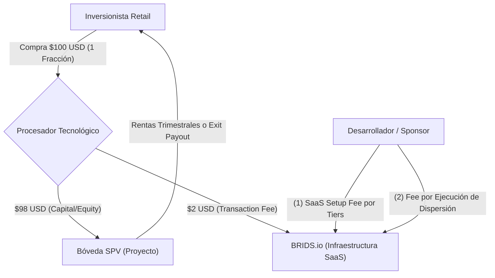

# Concepto Maestro: Arquitectura de Monetización, Estructura de Tarifas y Unit Economics

> [!NOTE] Resumen Ejecutivo
> El modelo de negocio de BRIDS.io opera bajo un modelo de **SaaS puro e infraestructura tecnológica**, estructurado exclusivamente sobre **fees de transacción fijos** por el uso y cómputo de la plataforma, eliminando por completo cualquier cobro porcentual de intermediación o corretaje de valores. Este enfoque garantiza un blindaje legal absoluto frente a la regulación de Broker-Dealer de la SEC (Securities Exchange Act Sec. 15(a)) y justifica múltiplos de valoración de Venture Capital de **15x a 25x ARR**. Los ingresos se dividen en un trípode de fees transaccionales: **(1) Fee de Procesamiento y Emisión de $2 USD por fracción de $100** (al usuario en la compra, deducido de la transacción), **(2) SaaS Listing & Setup Fee escalonado por tiers** (al desarrollador al desplegar su proyecto), **(3) Fee de Transacción de Dispersión Tecnológica** (al desarrollador al distribuir rendimientos: trimestral en Fix & Hold vs al cierre en Fix & Flip y Greenfield), y **(4) Fee de Recuperación Administrativa** ante extravío de llaves privadas.

---

## 1. One-Liner Canónico (Business Model Slide & YC Memo)

> *"Monetizamos como infraestructura SaaS: cobramos un setup de software fijo al desarrollador por desplegar su proyecto, un fee de transacción de $2 USD por fracción emitida y tarifas de procesamiento por ejecución de dispersión en Solana."*

---

## 2. Las Corrientes de Fees de Transacción de BRIDS.io (El Trípode SaaS)

### 1. Fee de Transacción de Procesamiento y Emisión (Al Usuario Retail)
- **A quién se cobra:** Al inversionista en el momento de la adquisición / minteo.
- **Monto y Mecánica:** **$2.00 USD por cada fracción de $100 USD**. En el checkout digital, el usuario aporta $100 USD; **$98 USD** se depositan en la bóveda del SPV para el activo inmobiliario y **$2 USD** se retienen como tarifa de uso de la infraestructura digital y emisión on-chain de BRIDS.
- **Análisis de Pros y Contras del Split $98 / $2:**
  - **Pros:**
    1. *Conversión Psicológica y Cero Fricción:* El usuario paga un número redondo y limpio ($100 USD), eliminando el abandono de carrito generado por recargos sorpresa (como pagar $102 USD).
    2. *Veracidad Literal de Marketing:* El reclamo *"Invierte en bienes raíces desde $100 USD"* es exacto, sin letras chicas ni asteriscos.
    3. *Paridad con Comercio Electrónico / Tarjetas:* Replica la mecánica donde el comprador paga el valor facial y el comercio absorbe la tasa de procesamiento tecnológico.
  - **Contras y Mitigación:**
    1. *Neto para el Desarrollador:* Por cada fracción de $100, el SPV recibe $98 USD de capital neto. 
    2. *Solución:* El desarrollador incorpora esta tasa dentro de sus costos suaves de estructuración (*soft costs*), emitiendo la cantidad proporcional de fracciones para cubrir la meta neta del inmueble.
- **Naturaleza:** Tarifa tecnológica de procesamiento y cómputo de contrato Metaplex Core en Solana.

### 2. SaaS Listing & Setup Fee por Tiers (Al Desarrollador Inmobiliario)
- **A quién se cobra:** Al desarrollador o gestor del proyecto (Sponsor / GP).
- **Monto:** Tarifa fija escalonada por volumen objetivo sindicado:

| Tier de Proyecto | Valor Objetivo del Proyecto | SaaS Setup & Listing Fee | Alcance Tecnológico Incluido |
| :--- | :--- | :--- | :--- |
| **Tier Starter** | Menos de $500,000 USD | **$1,000 USD** | Smart contracts Metaplex Core, setup de SPV en dashboard, bóveda Squads Multi-Sig. |
| **Tier Scale** | $500,000 – $1,000,000 USD | **$1,500 USD** | Todo lo anterior + integración Stripe Identity y dashboard público de hitos de obra. |
| **Tier Institutional** | $1,000,001 – $2,500,000 USD | **$2,500 USD** | Todo lo anterior + soporte prioritario de onboarding y arquitectura multi-tranche. |
| **Tier Enterprise** | Más de $2,500,000 USD | **$3,500 USD** + $500 por cada $1M adicional | Despliegue personalizado, data room privado y auditoría técnica dedicada. |

- **Ventaja Competitiva B2B:** Mientras las bancas de inversión y colocadores privados cobran entre $30,000 y $60,000 USD en estructuración y honorarios legales iniciales, BRIDS ofrece una entrada de software desde $1,000 USD.

### 3. Fee de Transacción de Dispersión Tecnológica (Al Desarrollador)
- **A quién se cobra:** Al desarrollador inmobiliario cada vez que ejecuta una distribución de fondos a los tenedores de tokens vía smart contract.
- **Diferenciación Crítica por Modelo Inmobiliario:**
  - **Fix & Hold (Renta Pasiva / 3 a 5+ años):** La dispersión de rentas de alquiler se realiza de forma **trimestral (cada 3 meses)**. El desarrollador abona el fee de transacción fijo por cada corrida batch trimestral (4 veces al año) ejecutada en la plataforma.
  - **Fix & Flip (Rotación Rápida / 6 a 12 meses):** La dispersión se realiza **única y exclusivamente al término del proyecto (bullet exit payout)**, al vender la propiedad remodelada. Se cobra un único fee de transacción de liquidación final del SPV.
  - **Greenfield / Desarrollo Integral (18 a 36 meses):** La dispersión se ejecuta **al término del desarrollo o por fases de venta de unidades concluidas**, cobrando el fee por cada corrida de liquidación autorizada.
- **Monto de la tarifa:** Tarifa plana por lote procesado ($150 – $300 USD por evento de dispersión batch en Solana).

### 4. Fee de Recuperación Administrativa y Reemisión (Lost-Key Recovery)
- **A quién se cobra:** Al inversionista que extravía sus claves y solicita revalidación de identidad.
- **Monto:** **$50 a $100 USD** por evento.
- **Qué cubre:** Costo de la sesión biométrica en Stripe Identity, revisión legal con el SPV y ejecución técnica de quemado y reemisión del NFT Metaplex Core.

---

## 3. Unit Economics & Métricas Clave

### A. Sponsor / Desarrollador Inmobiliario (B2B):
- **Sponsor CAC (Costo de Adquisición):** ~$2,500 – $4,500 USD (mediante canal B2B outbound y alianzas estratégicas como Blue Brick Capital).
- **Tamaño de Proyecto Típico:** $1,000,000 USD (10,000 fracciones de $100 USD).
- **Ingreso Bruto de BRIDS por Proyecto de $1,000,000 USD:**
  - **SaaS Setup & Listing Fee (Tier Scale):** **$1,500 USD**.
  - **Minting & Processing Transaction Fee:** $2.00 USD × 10,000 fracciones = **$20,000 USD**.
  - **Fee de Transacción de Dispersión:**
    - En *Fix & Hold* (trimestral): $200 USD × 4 corridas/año = **$800 USD / año**.
    - En *Fix & Flip* (cierre único a 9 meses): **$300 USD** al liquidar.
  - **Total Ingresos Año 1:** **$21,800 – $22,300 USD por emisión**.
- **Costo Tecnológico Directo (COGS en Solana):**
  - Despliegue de contratos y bóveda: < $5 USD.
  - Minteo de 10,000 NFTs en Metaplex Core: < $10 USD.
  - Corridas de dispersión batch en Solana: < $2 USD.
- **Margen Bruto de la Plataforma:** **> 95%** (Modelo de infraestructura pura de software).
- **LTV del Sponsor (Promedio 3 proyectos en 24 meses):** **~$65,000 USD**.
- **Ratio LTV / CAC Institucional:** **> 15x** (Economía unitaria excepcional).

### B. Inversionista Retail:
- **Ticket Promedio Inicial:** $200 – $300 USD (2 a 3 fracciones nominales de $100 USD).
- **Mecánica de Cobro:** Paga $100 USD por fracción ($98 van al inmueble, $2 a BRIDS). Cero fricción en el checkout.
- **Tasa de Reinversión Proyectada:** > 45% del capital liberado o rentas trimestrales es reinvertido en nuevos SPVs del catálogo.
- **Retail CAC:** ~$20 – $35 USD (tráfico orgánico, SEO institucional, ecosistema Solana).
- **Retail LTV:** ~$150 USD a 24 meses por volumen transaccionado recurrente.

---

## 4. Notas Estratégicas y Fundamentos de Arquitectura

> [!NOTE] Nota 4.1: Perspectiva de Blue Brick Capital (Juan Pablo) y Apalancamiento en Producto
> **Cómo lo evalúa el operador inmobiliario (Juan Pablo):**
> 1. **Ahorro Radical frente a Intermediarios:** En la sindicación tradicional estadounidense, los colocadores privados o broker-dealers cobran entre **5% y 8% de comisión**, más $30,000–$50,000 USD en gastos legales y contables. Con BRIDS, pagar únicamente un setup de software de $1,000–$1,500 USD y un fee de $2 por fracción representa para Blue Brick un **ahorro superior al 60% en costos de colocación**.
> 2. **Apalancamiento en Fix & Flip y Fix & Hold:**
>    - En **Fix & Flip (6 a 12 meses):** Blue Brick incorpora el fee de $2 como un costo suave de software en el presupuesto de obra, ganando velocidad crítica de fondeo (cerrar rondas en 10-15 días en lugar de meses). La dispersión única al final del proyecto simplifica la administración.
>    - En **Fix & Hold (3 a 5+ años):** Blue Brick automatiza el cap table de cientos de pequeños inversionistas y distribuye dividendos cada 3 meses de manera transparente, eliminando la pesadilla operativa de procesar transferencias bancarias manuales.

> [!IMPORTANT] Nota 4.2: Blindaje Legal: Por qué NUNCA Cobrar Porcentajes y las Ventajas del Fee de Transacción
> **1. El Riesgo de Broker-Dealer ante la SEC y FINRA:**
> - Conforme a la Sección 15(a)(1) del *Securities Exchange Act of 1934*, la compensación basada en transacciones (*transaction-based compensation*) calculada como un **porcentaje sobre el capital levantado o sobre las ganancias del activo** es la prueba principal que utiliza la SEC para catalogar a una empresa como un corredor de valores (*Broker-Dealer*) no registrado.
> - Cobrar un porcentaje del capital recaudado generaría contingencias regulatorias graves.
>
> **2. La Solución: Fees Fijos por Uso de Infraestructura Tecnológica:**
> - Facturar un **precio fijo por transacción** (un precio unitario por fracción/NFT emitida, una tarifa fija por setup de software y un fee por lote de dispersión de smart contracts) sitúa a BRIDS en la categoría legal de **proveedor de software puro (SaaS)**, análogo a Stripe, AWS o Shopify.
>
> **3. Ventaja de Valoración para VCs e Y Combinator:**
> - Las corredurías financieras y empresas inmobiliarias tradicionales transan a múltiplos deprimidos de **1x a 3x EBITDA**.
> - Las empresas de infraestructura tecnológica SaaS con ingresos por transacciones de software alcanzan múltiplos de **15x a 25x ARR**.

> [!TIP] Nota 4.3: Política de Pasarelas y On-Ramp Fiat (Pass-Through)
> - BRIDS no opera como procesador de pagos fiduciarios ni transmisor de dinero (MSB). Integramos pasarelas reguladas (Sphere, Stripe, Bridge).
> - **USDC en Solana:** 0% de recargo por conversión (gas < $0.001 USD).
> - **Tarjetas de Débito/Crédito y ACH:** Costos de la pasarela transferidos transparentemente como *pass-through* al usuario, incentivando el uso de stablecoins nativas en Solana.

---

## 5. Comparativa de Márgenes vs Alternativas del Mercado

| Métrica | Corredor / Sindicación Tradicional | Crowdfunding Web2 Centralizado | Plataforma SaaS BRIDS.io |
| :--- | :--- | :--- | :--- |
| **Esquema de Cobro** | 6.0% – 10.0% (Comisión de corretaje) | 3.0% – 7.0% comisión sobre fondos | **Fees fijos de transacción tecnológica** |
| **Costo al Desarrollador** | $40,000 – $80,000 USD analógicos | $15,000 – $30,000 USD | **$1,000 – $2,500 USD (Setup SaaS)** |
| **Fee por Fracción Retail** | N/A (Mínimos de $25k–$50k USD) | 2% – 5% recargo de plataforma | **$2 USD por fracción de $100 (deducido)** |
| **Margen Bruto** | 30% – 45% (Alta carga de personal) | 50% – 60% (Soporte manual) | **> 90% (Cómputo en Solana)** |
| **Riesgo Regulatorio** | Requiere licencia Broker-Dealer FINRA | Estructuras complejas Reg CF/A+ | **Blindaje SaaS Non-Broker-Dealer** |

---

## 6. Snippets Reutilizables (Ready-to-Cite)

### Snippet 6.1: Para Slide de Modelo de Negocio en Investor Decks (YC)
> *"BRIDS opera como una infraestructura SaaS pura para Real World Assets: cobramos a los desarrolladores una tarifa fija de setup de software ($1k–$2.5k) por parametrizar su emisión, sumada a un fee de transacción tecnológico de $2 USD por cada fracción emitida y tarifas por ejecución de dispersión en Solana. Este modelo de fees por transacción elimina riesgos de broker-dealer, protege márgenes brutos superiores al 90% y escala de forma exponencial."*

### Snippet 6.2: Para One-Pagers B2B Dirigidos a Desarrolladores Inmobiliarios
> *"Digitaliza tu sindicación inmobiliaria sin pagar honorarios leoninos a intermediarios. Con BRIDS, accedes a infraestructura institucional en Solana con un setup SaaS desde $1,000 USD y un fee transparente de solo $2 USD por fracción emitida, manteniendo el 100% de la gobernanza de tu activo y automatizando tus pagos de dividendos."*

---

## 7. Directrices Léxicas (Do's & Don'ts)

- **Obligatorio Usar:** Fee de transacción, tarifa de infraestructura de software, SaaS setup fee por tiers, fee por ejecución de dispersión tecnológica, margen bruto de software, LTV/CAC institucional.
- **Prohibido Terminantemente:** Comisión porcentual sobre capital levantado, porcentaje de éxito, corretaje inmobiliario, take-rate porcentual sobre valores, intermediación fiduciaria.

---

## Historial de Revisiones

| Versión | Fecha | Autor / Agente | Resumen de Modificaciones |
| :--- | :--- | :--- | :--- |
| **1.1.0** | 2026-09-13 | `business-consultant`, `compliance-officer` | Transición a modelo SaaS puro de fees de transacción fijos: $2/fracción ($98/$2), tiers por proyecto, dispersión trimestral en Fix&Hold vs cierre en Fix&Flip/Greenfield, nota Blue Brick y blindaje SEC. |
| **1.0.0** | 2026-09-11 | `business-consultant` & SDD Loop | Formulación integral de la arquitectura de tarifas y unit economics. |
