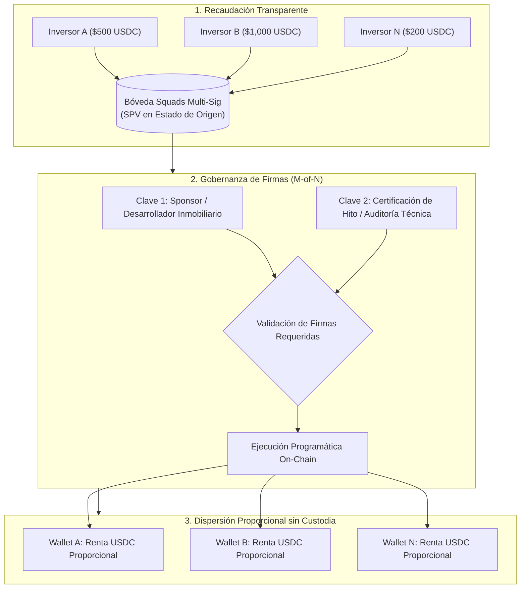

# C8: Tesorería Descentralizada, Squads Multi-Sig y Dispersión sin Custodia

> [!NOTE] Resumen Ejecutivo
> Uno de los mayores riesgos en la sindicación inmobiliaria tradicional es la falta de transparencia en la administración de los fondos ("cajas negras" de promotores que desvían capital hacia otros proyectos) y, en el mundo Web3, el peligro de la custodia centralizada o llaves privadas individuales vulnerables. BRIDS.io resuelve ambos problemas mediante la integración del protocolo **Squads Multi-Sig en Solana**. Cada SPV opera una bóveda multifirma no custodial con un esquema de firmas conjuntas (Desarrollador Inmobiliario + Verificación Técnica de Hitos). Esto asegura que los fondos de obra solo se liberen contra avance certificado y que las rentas se dispersen de manera automática y auditable directamente a los inversionistas, sin que BRIDS ejerza custodia fiduciaria discrecional en ningún momento.

---

## 1. One-Liner Canónico (Tech Slide & Compliance Pitch)

> *"Gobernanza financiera transparente en Solana: utilizamos bóvedas multifirma de Squads Protocol para dispersar dividendos y liberar fondos de obra sin custodia discrecional ni riesgo de contraparte."*

---

## 2. Tesis y Fundamentación Conceptual: El Fin de las Cajas Negras Inmobiliarias

En la sindicación tradicional, una vez que el inversionista transfiere su dinero a la cuenta bancaria del promotor, pierde visibilidad total:
- ¿Se usaron los fondos en la propiedad prometida o para tapar agujeros de otro desarrollo?
- ¿Por qué se retrasaron las rentas 45 días mientras el dinero estuvo estancado en la cuenta del operador?

En BRIDS.io, la relación financiera se vuelve **criptográficamente auditable**:
1. **Recaudación No Custodial:** El capital sindicado ingresa a una bóveda programada en **Squads Protocol (v4 Smart Contract en Solana)** a nombre exclusivo del SPV constituido en el estado de origen de la construcción.
2. **Firmas de Seguridad (M-of-N Multisig):** Ninguna transacción puede ejecutarse unilateralmente por una sola persona.
3. **Dispersión Automática de Dividendos (Rentas):** Al llegar el día de corte (*Snapshot Date*), el smart contract calcula matemáticamente la participación de cada wallet titular de los NFTs de Metaplex Core y dispersa los fondos en una sola transacción concurrente en Solana.

---

## 3. Arquitectura Técnica con Squads Protocol

BRIDS utiliza la infraestructura estándar de la industria en Solana:
- **Smart Contracts Auditados:** Squads Protocol es la solución de tesorería institucional que custodia miles de millones de dólares en el ecosistema Solana, con múltiples auditorías formales de seguridad (Neodyme, OtterSec).
- **Esquema Multifirma (2-of-3 o 3-of-5):**
  - **Firma 1 (Operador Inmobiliario):** Valida la necesidad del desembolso o la liquidación de rentas.
  - **Firma 2 (Verificador Técnico / Agente de Escrow):** Confirma que el hito de obra (factura de contratista, avance fotográfico) fue cumplido.
  - **Firma 3 (Respaldo de Gobernanza / Notarial):** Para resolución de contingencias o desbloqueos excepcionales autorizados por el SPV.
- **Trazabilidad Pública:** Cualquier inversor puede comprobar en tiempo real el saldo exacto de la bóveda de su propiedad en un explorador público de bloques de Solana (Solscan/SolanaFM) o en el dashboard de BRIDS.

---

## 4. Matriz Comparativa de Custodia y Gobernanza

| Dimensión | Sindicación Inmobiliaria Tradicional | Protocolos Cripto Centralizados | Arquitectura BRIDS (Squads Multi-Sig) |
| :--- | :--- | :--- | :--- |
| **Custodia de Fondos** | Cuenta bancaria del promotor (Riesgo moral) | Custodia privada en servidores de la plataforma | **Bóveda multifirma on-chain no custodial** |
| **Control de Desembolsos** | Decisión unilateral opaca del gestor | Llave privada única en un servidor Web2 | **Firmas múltiples requeridas (Operador + Auditoría)** |
| **Auditoría de Saldos** | Estados de cuenta enviados por PDF mensual | Confianza ciega en números de una base de datos | **Verificación en tiempo real en la blockchain de Solana** |
| **Dispersión de Dividendos** | Transferencias bancarias lentas y manuales | Proceso manual susceptible a retrasos | **Distribución concurrente instantánea en USDC** |

---

## 5. Snippets Reutilizables (Ready-to-Cite)

### Snippet 5.1: Para Sección de Seguridad y Compliance en Whitepaper / Pitch
> *"BRIDS.io no ejerce custodia fiduciaria sobre los fondos recaudados ni sobre los rendimientos generados. La tesorería de cada propiedad reside en una bóveda multifirma descentralizada operada mediante Squads Protocol en Solana, donde se requieren múltiples firmas independientes para autorizar cualquier desembolso. Las rentas por alquiler se dispersan de forma directa, matemática y simultánea a las billeteras de los inversionistas, eliminando el riesgo de intermediación y garantizando una auditoría on-chain 24/7."*

### Snippet 5.2: Para Manejo de Objeciones a Inversionistas Escépticos
> *"¿Cómo sé que el promotor no se escapará con el dinero de la obra?  
> Porque el capital no está en la cuenta personal del promotor ni en los servidores de BRIDS. Reside en una bóveda de smart contracts en Solana que requiere la firma conjunta del operador inmobiliario y la verificación técnica del hito de construcción para liberar cada tramo de capital."*

---

## 6. Directrices Léxicas (Do's & Don'ts)

- **Obligatorio Usar:** Bóveda Squads Multi-Sig, dispersión no custodial, gobernanza multifirma, trazabilidad on-chain de fondos, smart contracts auditados, distribución proporcional matemática.
- **Prohibido Terminantemente:** Custodia de dinero de clientes, cuenta bancaria compartida de BRIDS, control fiduciario discrecional, dispersión manual arbitraria.

---

## Historial de Revisiones

| Versión | Fecha | Autor / Agente | Resumen de Modificaciones |
| :--- | :--- | :--- | :--- |
| **1.2.0** | 2026-09-13 | `compliance-officer`, `founder-ghostwriter` | Desacoplamiento de jurisdicción: la bóveda Squads Multi-Sig opera a nombre exclusivo del SPV constituido en el estado de origen de la construcción. |
| **1.1.0** | 2026-09-13 | `compliance-officer`, `founder-ghostwriter` | Actualización del ticket de inversor a $200 USDC en diagrama de gobernanza. |
| **1.0.0** | 2026-09-11 | `compliance-officer` & SDD Loop | Creación inicial de la nota conceptual sobre gobernanza y Squads Multi-Sig. |
