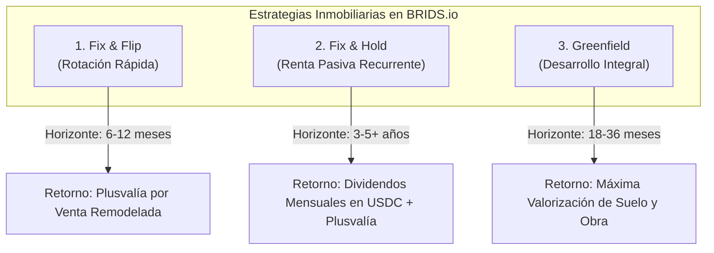

# Concepto Maestro: Modelos de Inversión Inmobiliaria y Estrategias de Retorno

> [!NOTE] Resumen Ejecutivo
> BRIDS.io estandariza y parametrizan tres arquetipos de inversión inmobiliaria de alto rendimiento en el mercado de EE.UU., operados en el terreno por socios profesionales como **Blue Brick Capital**: **(1) Fix & Flip** para rotación rápida de capital y apreciación en el corto plazo (6 a 12 meses); **(2) Fix & Hold** para generación de flujo de caja pasivo recurrente por rentas en el mediano/largo plazo (3 a 5+ años); y **(3) Desarrollo Integral (Greenfield)** para capturar el máximo margen sobre el suelo y la construcción desde cero. Cada modelo cuenta con una parametrización de smart contracts, calendarios de dispersión y métricas de riesgo adaptadas a su perfil de retorno.

---

## 1. One-Liner Canónico (Product Catalog & Marketplace)

> *"Desde rentas pasivas mensuales en USDC hasta proyectos de remodelación rápida: BRIDS ofrece tres modelos de inversión estructurados para ajustarse al horizonte y perfil de cada inversor."*

---

## 2. Catálogo Técnico de los 3 Modelos de Inversión

---

### Modelo 1: Fix & Flip (Rotación Rápida de Capital)
- **Horizonte de Inversión:** 6 a 12 meses.
- **Estrategia Operativa:** Adquisición de inmuebles residenciales con descuento por debajo del valor de mercado (distressed properties), remodelación integral rápida (arquitectura, acabados, climatización) y venta en el mercado abierto al mayor valor tasado (After Repair Value / ARV).
- **Perfil de Retorno:** Retorno sobre capital único al momento de la venta y liquidación final del SPV (bullet payout: capital inicial + plusvalía neta).
- **Cadencia de Dispersión:** **Única al término del proyecto** tras la venta formal del inmueble.
- **Perfil de Riesgo:** Moderado (riesgo de desfase temporal en ventas o sobrecostos de obra).
- **Monetización BRIDS:** SaaS Setup Fee por tiers + Fee de transacción de $4 USD por fracción emitida ($196/$4) y fee fijo de liquidación final.

---

### Modelo 2: Fix & Hold (Renta Pasiva y Flujo de Caja Trimestral)
- **Horizonte de Inversión:** Mediano a largo plazo (3 a 5+ años).
- **Estrategia Operativa:** Compra de unidades residenciales o multifamiliares, adecuación para maximizar el valor de arrendamiento, colocación de inquilinos calificados y administración profesional continuada.
- **Perfil de Retorno:** 
  1. Flujo de caja recurrente: dividendos trimestrales distribuidos directamente en USDC a las wallets titulares vía **Squads Multi-Sig**.
  2. Apreciación patrimonial acumulada del inmueble en el tiempo.
- **Cadencia de Dispersión:** **Trimestral (cada 3 meses)**. Permite consolidar ingresos por alquileres, amortiguar fluctuaciones de mantenimiento y entregar flujos predecibles.
- **Perfil de Riesgo:** Bajo a moderado (protegido por contratos de arrendamiento y diversificación multi-unidad).
- **Monetización BRIDS:** SaaS Setup Fee por tiers + Fee de transacción de $4 USD por fracción emitida ($196/$4) y fee fijo de transacción por cada corrida batch trimestral de dispersión.

---

### Modelo 3: Greenfield / Desarrollo Integral (Construcción desde Cero)
- **Horizonte de Inversión:** 18 a 36 meses.
- **Estrategia Operativa:** Adquisición de lote/terreno, tramitación de licencias urbanísticas, desarrollo arquitectónico, construcción y comercialización por etapas.
- **Perfil de Retorno:** Máximo multiplicador de capital (Equity Multiple) al capturar el margen de transformación del suelo urbano en producto inmobiliario terminado.
- **Cadencia de Dispersión:** **Al término del desarrollo o por fases de venta de unidades concluidas** (no trimestral continuo).
- **Perfil de Riesgo:** Alto / Especializado (sensible a plazos de licencias y costos de materiales).
- **Monetización BRIDS:** SaaS Setup Fee institucional por tiers + Fee de transacción de $4 USD por fracción emitida ($196/$4) y fees por corrida de liquidación de fase.

---

## 3. Matriz Comparativa de Modelos

| Dimensión | Fix & Flip (Remodelación) | Fix & Hold (Renta Pasiva) | Greenfield (Desarrollo) |
| :--- | :--- | :--- | :--- |
| **Horizonte Temporal** | 6 a 12 meses | 3 a 5+ años | 18 a 36 meses |
| **Frecuencia de Dispersión** | **Única al cierre de venta** | **Trimestral (cada 3 meses) en USDC** | **Al cierre o por fase entregada** |
| **Objetivo Principal** | Multiplicar capital rápido | **Generar renta pasiva trimestral** | Máxima plusvalía patrimonial |
| **Dispersión Squads** | Liquidación total final | Dispersión trimestral automatizada | Liquidación por hitos de entrega |
| **Perfil de Inversor Ideal** | Perfil dinámico / Reinversor | Ahorrador patrimonial / Retiro | Inversionista estratégico de largo plazo |

---

## 4. El Rol Operativo de Blue Brick Capital

La ejecución física de las obras y la gestión de propiedades no la realiza el equipo de software de BRIDS, sino nuestro partner inmobiliario estratégico:
- **Originación Curada:** Análisis exhaustivo de comparables de mercado, métricas de absorción y retorno esperado antes de listar cualquier propiedad.
- **Auditoría de Presupuestos:** Control estricto de costos de obra y contratistas locales en EE.UU.
- **Gestión Integral de Alquileres:** Selección y calificación de inquilinos, cobro de rentas y mantenimiento de las unidades.
- **Reporte Visual Continuo:** Carga periódica de fotografías de avance y reportes financieros directos al dashboard de BRIDS.

---

## 5. Snippets Reutilizables (Ready-to-Cite)

### Snippet 5.1: Para Ficha de Producto o Marketplace de Oportunidades
> *"Cada oportunidad en BRIDS está diseñada para responder a una meta financiera clara: si buscas ingresos mensuales en dólares sin preocuparte por inquilinos, nuestro modelo Fix & Hold deposita rentas en USDC en tu billetera cada mes. Si buscas potenciar tu capital en plazos cortos, el modelo Fix & Flip te permite beneficiarte de la plusvalía de inmuebles remodelados en 6 a 12 meses."*

### Snippet 5.2: Para Pitch Deck de Presentación a Inversores
> *"No dependemos de un único ciclo inmobiliario. Al ofrecer tanto proyectos de rotación corta (Fix & Flip) como activos generadores de renta a largo plazo (Fix & Hold), BRIDS captura capital en cualquier entorno macroeconómico: en periodos de tasas altas, el alquiler provee retornos seguros; en fases expansivas, la remodelación y el desarrollo greenfield maximizan la apreciación."*

---

## 6. Directrices Léxicas (Do's & Don'ts)

- **Obligatorio Usar:** Modelos de inversión parametrizados, Fix & Flip, Fix & Hold, Greenfield, rentas periódicas en USDC, plusvalía por remodelación, operador inmobiliario calificado (Blue Brick Capital).
- **Prohibido Terminantemente:** Rentabilidades fijas aseguradas, retornos exentos de riesgo, inversión especulativa, promesa contractual de recompra.

---

## Historial de Revisiones
- **v1.1 (2026-09-13):** Sincronización de cadencia de dispersión (trimestral en Fix&Hold vs cierre en Fix&Flip/Greenfield) y fees de transacción de infraestructura

| Versión | Fecha | Autor / Agente | Resumen de Modificaciones |
| :--- | :--- | :--- | :--- |
| **1.0.0** | 2026-09-11 | `business-consultant` & SDD Loop | Estandarización de los modelos de inversión y estrategias inmobiliarias. |
