# Concepto Maestro: Identidad RWA vs. Trampa Cripto (Tesis para VCs e Inversores)

> [!NOTE]
> **Aprobación Integral SDD + HITL:** Validado por el motor Evaluador-Optimizador (**9.0/9.0**) con doble aprobación humana (**HITL-1 Spec** y **HITL-2 Deliverable**).
> **Sub-Agentes Autores:** `pitch-deck-architect`, `founder-ghostwriter`, `business-consultant` | **Revisor:** `sdd-reviewer`

> [!NOTE] Resumen Ejecutivo
> Ante firmas de Venture Capital, socios de Y Combinator e inversionistas institucionales, **BRIDS.io se define categóricamente como Infraestructura de Software RWA en Solana**. Evitamos conscientemente la etiqueta de "gestora inmobiliaria" (que condena la empresa a múltiplos de 1x a 3x EBITDA) y la etiqueta de "protocolo cripto especulativo" (que asusta a la banca y atrae escrutinio regulatorio hostil). BRIDS opera bajo la tesis: **Crypto es el riel de liquidación, el Inmueble es el activo subyacente, y BRIDS es la plataforma SaaS de infraestructura**. Resolvemos los tres fallos estructurales que liquidaron la primera generación de RWA: los costos de transacción inviables de Ethereum, la pérdida irreversible de llaves privadas y la ausencia de separación legal corporativa.

---

## 1. One-Liner Canónico (Elevator Pitch para VCs)

> *"BRIDS es el Stripe + Carta para Real World Assets: la infraestructura de software sobre Solana que permite a desarrolladores sindicar capital y a inversores retail adquirir participaciones inmobiliarias en EE.UU. desde $100 USD con títulos recuperables y respaldo legal en Delaware."*

---

## 2. La Trampa de la Valuación: ¿Asset Manager o Software Infrastructure?

El posicionamiento ante fondos de venture capital determina directamente los múltiplos de valoración, la estructura del cap table y el apetito de los inversores líderes:

```mermaid
graph TD
    subgraph Posicionamiento_Erroneo["❌ Posicionamiento Erróneo: Gestora Inmobiliaria / Asset Manager"]
        A1["'Tokenizamos casas y compramos edificios'"] --> A2["Riesgo de balance intensivo en capital"]
        A2 --> A3["Dependencia de intermediación física local"]
        A3 --> A4["Múltiplo de Salida: 1x - 3x EBITDA (Baja valuación VC)"]
    end

    subgraph Posicionamiento_BRIDS["✅ Posicionamiento BRIDS: Infraestructura de Software RWA"]
        B1["'Infraestructura SaaS + Rieles de Liquidación en Solana'"] --> B2["Modelo asset-light con 80%+ margen bruto"]
        B2 --> B3["Efectos de red bilaterales: Sponsors B2B + Retail Global"]
        B3 --> B4["Múltiplo de Salida: 15x - 30x ARR (Múltiplo Silicon Valley / YC)"]
    end
```

### Tabla Comparativa de Múltiplos y Perfil de Inversión

| Dimensión Estratégica | Gestora Inmobiliaria Tradicional | Protocolo Cripto Degen (v1) | BRIDS.io (Infraestructura RWA) |
| :--- | :--- | :--- | :--- |
| **Categoría VC** | Real Estate Private Equity | Cripto Especulativo / Tokenomics | **Fintech Infrastructure / B2B SaaS** |
| **Múltiplo de Valuación** | 1x – 3x EBITDA | Cero tracción institucional / Volátil | **15x – 30x ARR (Software recurrente)** |
| **Uso de Balance** | Capital intensivo (compra directa de activos) | Fondos de tesorería opacos | **Asset-Light (Los inmuebles son de los SPVs)** |
| **Flujos de Ingreso** | Rentas inmobiliarias tradicionales | Especulación con token nativo | **SaaS Listing Fees + 1% Processing Fee** |
| **Riesgo Regulatorio** | Pesado, local y no escalable | Demanda inminente de la SEC | **Protegido: Dual-Entity y Non-Broker-Dealer** |

---

## 3. La Ruptura con RWA 1.0: Tres Problemas y Tres Soluciones de BRIDS

La primera ola de tokenización inmobiliaria (2018–2021) falló en escalar institucionalmente por tres barreras de arquitectura. BRIDS fue concebido desde el día uno para superar cada una de ellas:

### 3.1. Paradoja de los Costos de Transacción (Gas Fees)
* **El fallo de RWA 1.0:** Desplegar contratos inteligentes en Ethereum L1 donde una transferencia cuesta entre $5 y $40 USD. Si un usuario invierte $100 USD y genera $0.80 USD mensuales de renta, una sola transacción devora un año entero de rendimiento.
* **La solución BRIDS:** **Red Solana + Estándar Metaplex Core.** Con tarifas promedio de $0.0005 USD y finalización en 400 milisegundos, dispersamos dividendos en USDC a miles de billeteras simultáneamente mediante tesorerías Squads por fracciones de centavo. La micro-inversión retail es económicamente viable por primera vez.

### 3.2. Dogma Inviable de "Code is Law" vs. Propiedad Real
* **El fallo de RWA 1.0:** Si el inversor perdía su frase semilla o sufría un drenaje de billetera, perdía su derecho de propiedad de forma irreversible. Ningún inversor sensato ni regulador tolera que un patrimonio inmobiliario se esfume por un error tipográfico o pérdida de dispositivo.
* **La solución BRIDS:** **Primatía del Master Securityholder File y Protocolo de Recuperación.** La titularidad jurídica reside en el registro legal de socios del SPV de Delaware. El NFT de Metaplex Core es la representación digital transferible. Si una billetera se compromete, el inversor revalida su identidad mediante Stripe Identity, el SPV ejecuta el plugin de autoridad on-chain, congela el activo vulnerado, lo quema y reemite el título al nuevo wallet autorizado.

### 3.3. Confusión y Contagio Regulatorio
* **El fallo de RWA 1.0:** Crear estructuras donde la plataforma capturaba dinero, custodiaba claves privadas o prometía rendimientos especulativos sin licenciamiento, catalogándose como broker-dealer no registrado.
* **La solución BRIDS:** **Arquitectura Dual-Entity.** BRIDS Inc. (Delaware C-Corp) desarrolla y licencia software tecnológico sin custodia de fondos. Cada activo inmobiliario pertenece a un SPV independiente (Delaware Series LLC) gestionado por sponsors inmobiliarios profesionales bajo exenciones Reg D 506(c) y Reg S.

---

## 4. Las Tres Tesis de Inversión para Venture Capital

Cuando presentamos BRIDS a socios de fondos de inversión, estructuramos la oportunidad sobre tres pilares de convicción:

1. **Tesis de Mercado (El mayor TAM del planeta):** El sector inmobiliario global supera los $300 billones de dólares ($300T USD), pero permanece atrapado en procesos analógicos, ilíquidos y excluyentes con barreras de entrada de $25,000 a $100,000 USD. BRIDS abre este mercado al 99% restante de la población global mediante tickets de $100 USD.
2. **Tesis de Infraestructura (La ventaja de red de Solana):** Solana se ha consolidado como la red predilecta para la actividad financiera de alta frecuencia y pagos en el mundo real. BRIDS capitaliza este riel institucional para ofrecer una experiencia idéntica a una aplicación fintech Web2 de última generación.
3. **Tesis de Monetización (Doble Flywheel de Software):** Monetizamos con ingresos recurrentes de software B2B para desarrolladores inmobiliarios (licenciamiento SaaS por administración y sindicación) combinados con tarifas de procesamiento del 1% sobre flujos transaccionales y dispersiones de rentas.

---

## 5. Snippets Reutilizables (Ready-to-Cite)

### Snippet 5.1: Para Slide de Categoría y Tesis en Pitch Decks (YC / VCs)
> *"BRIDS no es una empresa inmobiliaria que compra casas: somos la infraestructura de software RWA en Solana que digitaliza la sindicación inmobiliaria institucional. Resolvemos la ecuación imposible de RWA 1.0 combinando costos subcéntimo en Solana, separación legal en Delaware y recuperación de títulos respaldada por verificación de identidad."*

### Snippet 5.2: Para Due Diligence Memo y Q&A con Inversionistas
> *"¿Somos un producto cripto? Crypto es nuestro riel de compensación y liquidación, no nuestro modelo de negocio. Nuestro activo subyacente es finca raíz comercial y residencial en EE.UU. constituida en SPVs independientes; nuestro negocio es software SaaS con márgenes brutos superiores al 80%. Operamos con la velocidad de Solana y el blindaje normativo de Delaware."*

### Snippet 5.3: Para Liderazgo de Pensamiento del Fundador (Founder Voice)
> *"El error de la primera ola de tokenización inmobiliaria fue confundir la ideología libertaria con la ingeniería financiera práctica. No puedes construir el futuro de las inversiones sobre redes lentas de $30 dólares por transacción ni exigirle a una familia que acepte perder su patrimonio si olvida 12 palabras. En BRIDS usamos Solana y Metaplex Core para abaratar costos a centavos, y anclamos cada título digital al registro societario de Delaware para que la ley del mundo real proteja tu capital."*

---

## 6. Directrices Léxicas para Reuniones con Inversores

* **Términos Obligatorios:** Infraestructura de software RWA, plataforma SaaS de sindicación, riel de liquidación en Solana, estándar Metaplex Core, tickets desde $100 USD, Delaware Series LLC, Master Securityholder File, protocolo de recuperación con Stripe Identity, modelo asset-light.
* **Términos Prohibidos:** Empresa de bienes raíces, gestora tradicional, tokenomics especulativo, criptomoneda de inversión, rendimientos 100% garantizados, custodia de dinero de usuarios, broker-dealer.

---

## 7. Próximos Pasos y Acceso para Inversionistas (CTA)

Los fondos de inversión y socios interesados en revisar nuestro Data Room, proyecciones unit economics y arquitectura técnica en devnet pueden contactar directamente al equipo fundador:

* **Data Room Institucional:** `https://brids.io/investors`
* **Contacto Directo con Fundadores:** `founders@brids.io`
* **Acción sugerida:** Agendar sesión técnica de estructuración y demostración de arquitectura en devnet.

## 🔄 Historial de Revisiones SDD (Changelog)
- **v1.0 (2026-09-13):** Aprobado por el usuario e integrado en el vault tras 1 ciclos de optimización con nota de 9/9.0.

## 🔗 Trazabilidad
- Artefacto de Especificación: [[00 Inbox/Specs/concept-rwa-identity-vc-thesis.spec.md]]
- Contexto de Marca: [[01 Brand Context/product-marketing-context.md]]
