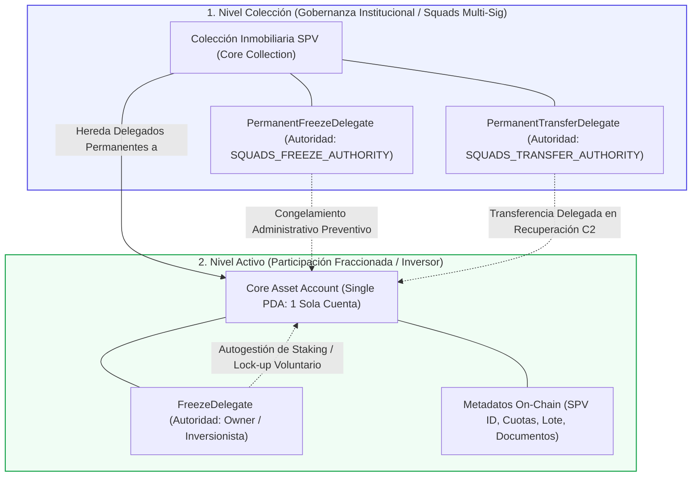

# C3: Solana RWA Advantage y Estándar Metaplex Core

> [!NOTE] Resumen Ejecutivo
> La democratización real de la inversión inmobiliaria exige que un ticket de entrada de **$200 USD** y la dispersión trimestral de micro-dividendos en USDC sean financieramente viables. En BRIDS.io, la infraestructura corre sobre **Solana** combinada con el estándar **Metaplex Core**. Gracias a una finalidad determinista de **~400 milisegundos**, costos por transacción inferiores a **$0.0005 USD**, un **estado global unificado sin fragmentación** y una **arquitectura de cuenta única (*Single Account Architecture*)**, Solana proporciona la velocidad y certidumbre operativa de una fintech de alto rendimiento con las garantías de auditoría y componibilidad de una blockchain institucional.

---

## 1. One-Liner Canónico (Pitch, YC Application & Whitepapers)

> *"BRIDS corre sobre Solana porque es la única red donde liquidar una inversión inmobiliaria de $200 USD o dispersar dividendos a miles de usuarios cuesta fracciones de centavo y toma menos de un segundo."*

---

## 2. Los Pilares Positivos de Solana para la Tokenización RWA

La tokenización de activos del mundo real (RWA) no es un ejercicio de coleccionismo especulativo; es infraestructura financiera transaccional. Para habilitar la participación de miles de inversionistas individuales en proyectos inmobiliarios institucionales, la red subyacente debe resolver simultáneamente costo, latencia, liquidez y gobernanza.

### 2.1. Las 5 Fortalezas Estructurales de Solana en BRIDS

1. **Velocidad y Experiencia de Usuario Subsegundo (~400 ms):**
   - La red procesa y confirma bloques en aproximadamente 400 milisegundos.
   - Para el inversionista, la adquisición de una participación inmobiliaria o la recepción de una distribución de rentas ocurre con la inmediatez de una aplicación Web2 moderna (como Stripe o Apple Pay), eliminando por completo las barras de espera, la congestión de mempools y la incertidumbre en la confirmación.

2. **Micro-Comisiones Predecibles y Subcéntimo (<$0.0005 USD):**
   - Cada interacción en red cuesta en promedio ~0.000005 SOL (menos de una vigésima de centavo de dólar).
   - Esta eficiencia permite que un inversionista con un ticket de $200 USD cobre $4 o $6 USD de rendimiento trimestral en USDC sin perder un solo porcentaje en tarifas de gas. En economías de bajo ticket, la comisión de red nunca debe penalizar el retorno del capital.

3. **Estado Global Unificado (Sin Fragmentación ni Riesgo de Puentes):**
   - Solana opera como una única máquina de estados global compartida.
   - A diferencia de los entornos multichain o ecosistemas divididos en múltiples capas, en Solana no existen *bridges* (puentes cross-chain) internos para mover liquidez entre contratos. Toda la infraestructura —los contratos de Metaplex Core, la bóveda multifirma de Squads Protocol y las cuentas de USDC— conviven en el mismo libro contable atómico, eliminando el vector histórico de mayor vulnerabilidad y hackeos de la industria cripto.

4. **USDC Nativo Emitido Directamente por Circle:**
   - Solana cuenta con emisión nativa de USDC respaldada y auditada directamente por Circle bajo los estándares SPL y Token-2022.
   - Las distribuciones de rentas no requieren tokens sintéticos, derivados ni activos envueltos (*wrapped*), facilitando la conciliación contable, auditorías bancarias y el traspaso directo a cuentas en moneda fiat.

5. **Capacidad de Dispersión Masiva Paralela:**
   - La arquitectura multicore y multithread de Solana (procesamiento paralelo mediante Sealevel) permite a la tesorería de BRIDS ejecutar dispersiones masivas de dividendos a miles de billeteras simultáneamente en una sola ventana temporal, sin saturar la red ni encarecer el costo para el resto de los participantes.

---

### 2.2. Breve Perspectiva Comparativa con Ethereum y Capas 2 (EVM)

Para dimensionar la elección de ingeniería de BRIDS, conviene examinar de forma sintética la alternativa en el ecosistema Ethereum:

- **Ethereum Mainnet (Capa 1):**
  - Es el estándar histórico para transacciones institucionales de gran volumen (liquidación de bonos soberanos o compraventas corporativas de decenas de millones de dólares).
  - **Inviabilidad en Retail:** Con tarifas de gas variables que oscilan entre $3 y más de $40 USD por transacción, resulta matemáticamente inviable operar tickets de $200 USD. Cobrar un dividendo trimestral de $5 USD costaría más en comisiones que el propio rendimiento generado.
- **Capas 2 EVM (Arbitrum, Optimism, Base):**
  - Reducen el costo de transacción frente a Ethereum L1, pero introducen una severa **fragmentación de liquidez y estado**.
  - Exigen al usuario fondear cuentas a través de puentes (*bridges*), lidiar con diferentes redes RPC, asumir periodos de retiro diferidos y gestionar interfaces desconectadas. Además, los contratos complejos como ERC-3643 dependen de múltiples capas de almacenamiento y proxies que incrementan la complejidad de auditoría y los costos de despliegue.

> ⚖️ **Criterio de Elección BRIDS:**  
> Ethereum resolvió la seguridad para capitales mayoristas institucionales; **Solana resolvió la infraestructura para la economía financiera masiva**. Al unificar micro-tarifas con una única capa de ejecución global, Solana ofrece lo mejor de ambos mundos: la componibilidad de una Capa 1 soberana con costos operativos inferiores a cualquier Capa 2.

---

## 3. Innovación Técnica: El Estándar Metaplex Core y su Sistema de Delegados

El estándar histórico de NFTs en Solana (Token Metadata Legacy) requería crear entre 4 y 5 cuentas separadas en la blockchain para representar un solo activo (Mint, Token Account, Metadata Account, Master Edition y Edition Records), encareciendo la renta on-chain y complicando la programabilidad.

BRIDS adopta **Metaplex Core**, la especificación de última generación diseñada específicamente para activos digitales de alto rendimiento con arquitectura de cuenta única (*Single Account Architecture*).

### 3.1. Arquitectura de Plugins: FreezeDelegate, PermanentFreezeDelegate y PermanentTransferDelegate

A diferencia de los contratos inteligentes en EVM (como ERC-721 o ERC-3643), donde implementar roles de congelamiento y transferencia forzada exige desplegar múltiples contratos proxy, storage layouts complejos y altos costos computacionales, **Metaplex Core integra un sistema nativo de plugins y delegados gestionados directamente por el runtime de Solana**.

En la arquitectura de BRIDS, los permisos y controles estatutarios se estructuran en dos niveles complementarios:

#### 1. `FreezeDelegate` (Nivel Activo / Autoridad: `Owner`)
- **Instalación:** Se adjunta a cada activo individual en el momento de la emisión (*marketplace mint*).
- **Autoridad:** Asignada estrictamente a la billetera del comprador (`Owner`).
- **Propósito en BRIDS:** Permite al propio inversionista autogestionar el congelamiento y descongelamiento (*freeze / thaw*) de su certificado digital. Es el mecanismo técnico que habilita módulos de *staking* voluntario o bloqueo de permanencia para maximizar rendimiento, sin ceder la custodia ni transferir el activo a bovedas de terceros (*non-custodial staking*).

#### 2. `PermanentFreezeDelegate` (Nivel Colección / Autoridad: `SQUADS_FREEZE_AUTHORITY`)
- **Instalación:** Se configura permanentemente en la colección durante su despliegue y se hereda a todas las fracciones emitidas bajo ella.
- **Autoridad:** Vinculada exclusivamente a la dirección multifirma institucional de **Squads Protocol** administrada por el SPV.
- **Propósito en BRIDS:** Confiere la autoridad administrativa para congelar o descongelar cualquier activo de la colección en casos normativos o de seguridad:
  - **Fase 1 del Protocolo de Recuperación (C2):** Al recibir el reporte de una billetera extraviada o comprometida, los administradores invocan de inmediato el `PermanentFreezeDelegate` sobre el NFT afectado, inmovilizándolo en la mempool y bloqueando transferencias, ventas en marketplaces o drenados ilícitos.
  - **Cumplimiento Estatutario:** Ejecución de medidas cautelares o ventanas de permanencia obligatoria (*lock-up periods* bajo Reg CF / Reg D de la SEC).

#### 3. `PermanentTransferDelegate` (Nivel Colección / Autoridad: `SQUADS_TRANSFER_AUTHORITY`)
- **Instalación:** Se adjunta a nivel de colección on-chain durante la creación inicial.
- **Autoridad:** Reservada para la tesorería multi-sig de Squads de los administradores del proyecto.
- **Propósito en BRIDS:** Otorga la facultad delegada de **transferir el activo directamente sin requerir la firma de la clave privada de la billetera origen**.
  - **Mecanismo Operativo de Restitución (C2, Fase 5):** Este plugin es la pieza determinante que resuelve el problema de las billeteras extraviadas. Una vez que el usuario completa su re-verificación biométrica en Stripe Identity (prueba de vida y coincidencia facial 1:1), confirma por canal secundario y transcurre la ventana de seguridad de 72 horas, la administración descongela el activo con el `PermanentFreezeDelegate` y ejecuta la transferencia inmediata hacia la nueva wallet verificada del inversionista mediante el `PermanentTransferDelegate`.
  - **Preservación Total del Activo (Sin Burn & Remint):** Elimina la necesidad de quemar y reemitir un nuevo token. El título digital mantiene intactos su identificador de activo, correlativo histórico, antigüedad de emisión y metadatos contractuales.

---

### 3.2. Ventajas Integrales de Metaplex Core en la Arquitectura de BRIDS

1. **Reducción del 85% en Costos de Almacenamiento (Single PDA):**
   - Todos los identificadores, balance, atributos y referencias contractuales residen en una única cuenta (*Program Derived Address*).
   - Esta optimización reduce en un 85% el depósito de renta en SOL requerido para registrar cada fracción inmobiliaria, permitiendo que los sponsors emitan miles de títulos fraccionados a una fracción mínima del costo tradicional.

2. **Seguridad Nativa sin Proxies Vulnerables:**
   - En EVM, estándares como ERC-3643 dependen de árboles de llamadas entre contratos externos para validar transferencias con identidad. En Metaplex Core sobre Solana, los delegados permanentes se evalúan a nivel de instrucción nativa en el runtime, garantizando costo computacional mínimo, ejecución atómica y cero riesgo de reentrancia.

3. **Lectura e Indexación Directa:**
   - La estructura de datos plana de Metaplex Core agiliza las consultas en tiempo real desde exploradores de bloques y dashboards de inversionistas, sin depender de intermediarios de indexación lentos o centralizados.

---

## 4. Matriz Comparativa de Infraestructura Blockchain

| Atributo Técnico | Ethereum Mainnet (L1) | Capas 2 EVM (L2) | Red Solana (Metaplex Core) |
| :--- | :--- | :--- | :--- |
| **Costo Promedio por Transacción** | $3.00 – $45.00+ USD | $0.05 – $0.40 USD | **<$0.0005 USD (Fracciones de centavo)** |
| **Tiempo de Confirmación** | 12 – 15 segundos | 1 – 3 segundos | **~400 milisegundos (Determinista)** |
| **Viabilidad Ticket Retail ($200)** | Inviable (Gas devora el capital) | Parcial (Fricción de depósitos) | **100% Viable y Rentable** |
| **Dispersión de Micro-Dividendos** | Prohibitivo ($10+ de gas por pago) | Costoso a escala masiva | **Masivo por centavos (Vía Squads Multi-Sig)** |
| **Arquitectura de Cuentas NFT** | Contrato ERC-721 / ERC-3643 | Contratos proxy complejos | **Single PDA (Metaplex Core, -85% renta)** |
| **Control Administrativo / Recuperación** | Funciones manuales en smart contract | Proxies dependientes de multi-sig EVM | **PermanentFreezeDelegate y PermanentTransferDelegate nativos** |
| **Riesgo de Puentes (Bridges)** | Nulo (L1 directa) | Alto (Dependencia de bridges) | **Nulo (Estado unificado global sin puentes)** |
| **Moneda de Liquidación** | USDC en Ethereum | USDC puenteado en L2 | **USDC nativo directo de Circle en Solana** |

---

## 5. Snippets Reutilizables (Ready-to-Cite)

### Snippet 5.1: Para Pitch Decks y Presentaciones a Inversores (YC / VCs)
> *"Construir inversión inmobiliaria para el retail requiere micro-liquidaciones económicamente viables. En Solana, distribuir dividendos a 5,000 inversionistas cuesta menos de $2.50 USD en total, mientras que en Ethereum superaría los miles de dólares. Con el estándar Metaplex Core reducimos en 85% los costos de almacenamiento on-chain y dotamos a cada activo de delegados permanentes (PermanentFreezeDelegate y PermanentTransferDelegate), permitiendo congelar administrativamente ante extravíos y transferir a nuevas billeteras verificadas sin quemar activos, logrando la agilidad de una fintech con el rigor del derecho societario."*

### Snippet 5.2: Para Artículos de Liderazgo de Pensamiento (Founder Voice)
> *"Muchos proyectos de RWA eligen redes blockchain por inercia o prestigio de marca, sin evaluar los números elementales del negocio. Si tu misión es democratizar bienes raíces con tickets accesibles desde $200 dólares, no puedes permitir que una comisión de red de $15 dólares devore la rentabilidad trimestral de un inversionista. Elegimos Solana y Metaplex Core por pura ingeniería: confirmación en 400 milisegundos, costo casi nulo, estado unificado sin puentes vulnerables y plugins nativos de delegación permanente que permiten descongelar y transferir activos con seguridad institucional."*

### Snippet 5.3: Para Preguntas Frecuentes de Desarrolladores y Sponsors B2B
> *"**¿Por qué BRIDS emite sobre Solana y no sobre Ethereum?**  
> Porque Solana permite a los desarrolladores inmobiliarios operar a escala masiva sin transferir costos abusivos a los compradores. Con Metaplex Core, los costos de estructurar miles de participaciones fraccionadas se reducen un 85%, los rendimientos se dispersan automáticamente en USDC nativo por fracciones de centavo y la administración cuenta con PermanentFreezeDelegate y PermanentTransferDelegate respaldados por la sociedad vehículo (SPV) para congelar y transferir títulos en caso de pérdida de llaves sin destruir el activo."*

---

## 6. Directrices Léxicas (Do's & Don'ts)

- **Obligatorio Usar:** Red Solana, estándar Metaplex Core, arquitectura de cuenta única (Single PDA), tarifas subcéntimo (<$0.0005 USD), finalidad subsegundo (~400 ms), estado global unificado, plugins de ciclo de vida, FreezeDelegate (Owner), PermanentFreezeDelegate (SPV/Squads), PermanentTransferDelegate (SPV/Squads), transferencia delegada sin quema, USDC nativo de Circle, tesorería Squads Multi-Sig.
- **Prohibido Terminantemente:** "Red barata" (usar siempre *eficiente, escalable o de micro-comisiones*), "criptomoneda volátil", "gas descontrolado", "quema y reemisión forzosa", "puentes inseguros", "el NFT reemplaza la escritura pública".

---

## Historial de Revisiones

| Versión | Fecha | Autor / Agente | Resumen de Modificaciones |
| :--- | :--- | :--- | :--- |
| **1.3.0** | 2026-09-13 | `founder-ghostwriter`, `compliance-officer` | Profundización técnica en la arquitectura de plugins y delegados de Metaplex Core: especificación detallada de FreezeDelegate (nivel activo/Owner para staking), PermanentFreezeDelegate (nivel colección/Squads para bloqueo preventivo y regulatorio) y PermanentTransferDelegate (nivel colección/Squads para ejecución de transferencia directa en el protocolo de recuperación C2 sin quema de tokens). |
| **1.2.0** | 2026-09-13 | `founder-ghostwriter`, `compliance-officer` | Reestructuración integral: profundización en los pilares positivos de Solana (velocidad subsegundo, comisiones subcéntimo, estado unificado, USDC nativo de Circle y paralelismo Sealevel), síntesis concisa de la comparativa frente a Ethereum y L2s, y sincronización del Authority Plugin de Metaplex Core con el flujo de recuperación de C2 (descongelamiento y transferencia sin quema obligatoria). |
| **1.1.0** | 2026-09-13 | `founder-ghostwriter`, `compliance-officer` | Actualización de ticket nominal a $200 USD y sincronización de dispersión trimestral. |
| **1.0.0** | 2026-09-11 | `founder-ghostwriter` & SDD Loop | Creación y fundamentación técnica de la ventaja de infraestructura Solana. |
