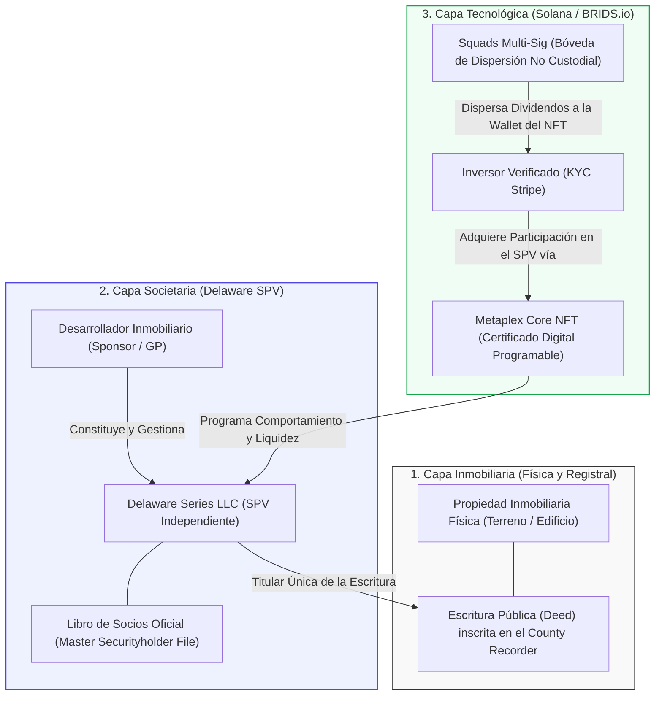
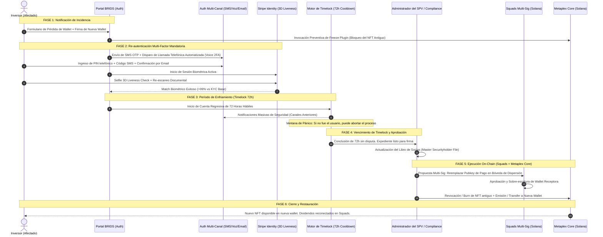

# C2: Protocolo de Recuperación de Llaves Privadas (Lost-Key Recovery)

> [!NOTE] Resumen Ejecutivo
> El mayor obstáculo para la adopción masiva de la inversión inmobiliaria en Web3 es el dogma cripto de que *"la pérdida de la llave privada equivale a la pérdida irreversible del patrimonio"*. En BRIDS.io, la propiedad jurídica del inmueble emana del registro societario del SPV de Delaware, no de la posesión efímera de una clave criptográfica. Respaldados por la doctrina regulatoria de la SEC y el derecho societario de Delaware, los NFTs en Solana actúan exclusivamente como **certificados digitales programables de derechos societarios**, facilitando la transaccionalidad y el cómputo sin sustituir las escrituras públicas (*deeds*) registradas en el condado. Mediante un protocolo institucional de 6 etapas con **re-verificación biométrica activa en Stripe Identity (3D Liveness), autenticación multi-canal (llamada telefónica, SMS OTP y correo), período de enfriamiento (Timelock de 72 horas), actualización de beneficiarios en Squads Protocol y plugins de Metaplex Core**, BRIDS garantiza que el extravío de una billetera solo requiera reasignar el NFT y la dirección de pago, manteniendo la titularidad societaria en el SPV y el inmueble 100% inmutables.

---

## 1. One-Liner Canónico (Pitch, FAQs & Legal Brief)

> *"En BRIDS, perder tu billetera no significa perder tu propiedad: tu derecho legal está respaldado en Delaware y recuperas tu título digital mediante verificación biométrica en Stripe Identity, timelock de seguridad y reasignación en Squads y Metaplex Core."*

---

## 2. Marco Regulatorio y Doctrina SEC (Citas, Links y Jurisprudencia)

### 2.1. Doctrina de la SEC: "Substance Over Form" y Títulos de Propiedad Inmobiliaria
La Comisión de Bolsa y Valores de EE.UU. (**Securities and Exchange Commission - SEC**) y la jurisprudencia federal han establecido de forma unánime que la tecnología de registro distribuido (*blockchain*) **no altera la naturaleza legal sustantiva de los derechos subyacentes**:

1. **Los NFTs no son escrituras de propiedad (*Deeds*):**  
   Bajo las leyes de propiedad inmobiliaria de los 50 estados de EE.UU., una escritura pública de propiedad (*Grant Deed*, *Warranty Deed* o *Quitclaim Deed*) debe ser otorgada, legalizada y formalmente inscrita en el registro público local de la jurisdicción donde radica el inmueble (**County Recorder's Office** / Registro de Títulos del Condado). La SEC ha reiterado en sus análisis sobre tokenización que un token criptográfico o NFT alojado en una billetera digital **no constituye ni reemplaza el título legal de dominio inmobiliario**, sino que representa únicamente un certificado digital o contrato de inversión que confiere derechos económicos y societarios sobre la entidad propietaria.
2. **Análisis de Contrato de Inversión (*SEC v. W.J. Howey Co.*, 328 U.S. 293):**  
   En el marco de la prueba *Howey*, la SEC analiza la realidad económica del acuerdo, no la etiqueta técnica. En su documento institucional *Framework for "Investment Contract" Analysis of Digital Assets*, la división FinHub de la SEC advierte:
   > *"El análisis sobre si un activo digital se ofrece o vende como un contrato de inversión no depende de la etiqueta asignada al activo... Los tokens que representan participaciones en activos subyacentes o entidades son instrumentos contractuales cuyos derechos dependen de la estructura legal y de gobernanza de la entidad emisora, no de la pura posesión del token en la red."*  
   > 🔗 **Fuente Oficial:** [SEC FinHub — Framework for 'Investment Contract' Analysis of Digital Assets (PDF)](https://www.sec.gov/files/dpsa-guidance-040319.pdf)
3. **Pronunciamiento de Comisionados de la SEC sobre NFTs (Impact Theory, 2023):**  
   En la resolución de la SEC sobre activos no fungibles (*In the Matter of Impact Theory, LLC*, Release No. 33-11226) y en la posterior declaración conjunta de los comisionados **Hester M. Peirce** y **Mark T. Uyeda**, se enfatizó que los NFTs pueden funcionar como comprobantes de membresía, certificados de derechos o arte digital, pero que su valor y titularidad jurídica descansan en los compromisos legales y contractuales asumidos por el emisor en el plano corporativo:
   > *"Los NFTs son fundamentalmente una tecnología de registro que puede asociarse a una multiplicidad de derechos... Cuando se vinculan a entidades comerciales, el token es la representación transmisible de una relación jurídica preexistente."*  
   > 🔗 **Fuente Oficial:** [SEC Statement of Commissioners Hester M. Peirce and Mark T. Uyeda on Impact Theory (Aug 28, 2023)](https://www.sec.gov/news/statement/peirce-uyeda-statement-impact-theory-082823)
4. **Declaraciones y Prospectos Registrados en SEC EDGAR (Reg D / Reg A+):**  
   En las presentaciones de tokenización inmobiliaria estructurada presentadas ante la SEC (formularios Form D y Form 1-A en EDGAR), se consagra la cláusula estándar de protección registral:
   > *"The digital tokens represent limited liability company membership interests. The tokens do not constitute direct title or deed to the real property; legal title to the property is held exclusively by the Company and recorded with the relevant municipal land registry."*  
   > 🔗 **Consulta Pública:** [SEC EDGAR Company Search System](https://www.sec.gov/edgar/searchedgar/companysearch)

### 2.2. Sustento en el Derecho Corporativo de Delaware
- **DGCL § 224 y Delaware LLC Act (6 Del. C. § 18-305 / § 18-101 et seq.):**  
  La ley del estado de Delaware permite expresamente que los libros de socios y registros societarios (*Stock Ledger* / *Membership Registry*) sean llevados en redes electrónicas o distribuidas (como Solana), siempre que puedan convertirse a un formato legible por humanos en caso de auditoría judicial.
- **Prevalencia del Libro de Socios (*Master Securityholder File*):**  
  Si existe discrepancia entre la posesión de una clave privada on-chain y el registro corporativo oficial del SPV, **el registro estatutario off-chain prevalece jurídicamente en cualquier tribunal**. La pérdida de la llave privada no extingue la condición de socio del inversor.

---

## 3. Arquitectura Estructural: Inversión en el SPV vs. Rol del NFT

Para comprender la viabilidad del protocolo de recuperación, es indispensable distinguir con precisión la arquitectura de tres capas que opera en cada proyecto de BRIDS:



### 3.1. ¿Qué Adquiere Realmente el Inversionista?
1. **El Desarrollador (Sponsor/GP) constituye un SPV:** Para cada proyecto específico, el desarrollador crea una Sociedad de Propósito Especial independiente en Delaware (ej. `BRIDS 123 Pine St Series LLC`).
2. **El SPV adquiere el inmueble:** El SPV es el titular exclusivo registrado en la escritura pública (*Deed*) en el condado correspondiente.
3. **El Inversor compra participación en el SPV:** Al fondear su inversión mediante BRIDS.io (desde $200 USD), el usuario suscribe el contrato de operación (*Operating Agreement*) y adquiere **unidades de membresía (*Membership Interests*) en el SPV**.
4. **El Rol del NFT:** El NFT emitido bajo el estándar **Metaplex Core en Solana** no es el inmueble ni una escritura paralela; es el **sistema operativo programable del activo**:
   - Codifica los metadatos contractuales, identificador del SPV, lote y número de cuota.
   - Habilita la facilidad transaccional instantánea (liquidación en sub-segundos a costo <$0.001 USD).
   - Automatiza la dispersión de rentas y dividendos en USDC desde la tesorería de Squads Multi-Sig.
   - Permite la ejecución de reglas de cumplimiento (congelamiento administrativo, restricción de transferencias y recuperación ante extravío).

> 💡 **Axioma Jurídico-Técnico de BRIDS:**  
> *"El NFT es transaccional, dinámico y reemplazable; el SPV, la escritura del inmueble y la condición societaria del inversionista son permanentes, inmutables e independientes de la clave privada."*

---

## 4. Protocolo Operativo Institucional de Recuperación (6 Fases)

Cuando un inversionista pierde el acceso a su billetera, olvida su frase semilla o es víctima de un compromiso de seguridad, se activa el protocolo formal con los siguientes requisitos mandatorios:



### Fase 1: Solicitud Criptográfica y Reporte de Incidencia
- El inversionista accede al portal institucional de BRIDS.io e inicia el flujo de *"Reporte de Billetera Extraviada o Comprometida"*.
- **Conexión de la Nueva Billetera:** El usuario debe conectar su nueva billetera de reemplazo (Phantom, Solflare, etc.) y firmar un mensaje criptográfico *off-chain* no custodial:
  ```text
  "BRIDS-RECOVERY-REQUEST | SPV_ID: [DE-LLC-UUID] | OLD_WALLET: [PUBKEY_A] | NEW_WALLET: [PUBKEY_B] | TIMESTAMP: [ISO_DATE]"
  ```
- **Pre-congelamiento On-Chain Inmediato:** De forma automática, el sistema invoca el plugin `Freeze` de Metaplex Core sobre el NFT ubicado en la wallet antigua. A partir de este segundo, el activo no puede ser transferido, listado en marketplaces ni drenado por terceros.

### Fase 2: Re-autenticación Multi-Factor Mandatoria (4 Capas de Verificación)
Considerando que el usuario ya aprobó su KYC inicial al registrarse, el protocolo exige acreditar que quien solicita la recuperación es indiscutiblemente la misma persona natural:
1. **Verificación Biométrica Activa en Stripe Identity (3D Liveness Match):**
   - El solicitante debe completar una sesión biométrica en vivo con análisis de profundidad (*3D Liveness Detection*) para evitar ataques de *deepfakes* o fotografías estáticas.
   - El motor de Stripe Identity ejecuta una comparación facial biométrica (*1:1 Face Match*) contra el documento oficial (pasaporte o ID estatal) almacenado de forma encriptada en su registro KYC original.
   - **Criterio de Aprobación:** Coincidencia biométrica de alta confianza (>99%). Cualquier discrepancia cancela el proceso y congela la cuenta.
2. **Autenticación por Llamada Telefónica Automatizada (Voice Call 2FA):**
   - El sistema realiza una llamada telefónica automatizada al número celular registrado y verificado en la apertura de cuenta.
   - Una voz interactiva encriptada dicta un código de seguridad efímero o solicita al usuario ingresar su PIN de seguridad previamente configurado.
3. **Desafío SMS OTP Out-of-Band:**
   - Envío simultáneo de un código OTP de 8 caracteres alfanuméricos vía SMS.
4. **Validación de Correo Electrónico Registrado:**
   - Confirmación explícita mediante un enlace criptográfico de un solo uso enviado a la dirección de correo oficial del titular.

### Fase 3: Período Preventivo de Enfriamiento y Timelock (72 Horas Hábiles)
El factor crítico para neutralizar el secuestro de cuentas (*account takeover*) y el fraude de identidad es el **factor tiempo**:
- Una vez aprobada la biometría y los factores 2FA, el sistema activa un **Timelock Mandatorio de 72 horas hábiles (3 días calendario)**.
- **Alertas de Pánico Redundantes:** Durante el transcurso de las 72 horas, se disparan alertas continuas por SMS, correo electrónico y notificaciones *push*:
  > *"ALERTA DE SEGURIDAD: Se ha solicitado el reemplazo de su billetera en BRIDS.io. La transferencia del título a su nueva dirección se ejecutará en 72 horas. Si usted solicitó este cambio, no requiere hacer nada. Si USTED NO REALIZÓ ESTA SOLICITUD, pulse de inmediato este enlace de emergencia para cancelar la operación y bloquear su cuenta."*
- Si en cualquier momento dentro de las 72 horas el usuario legítimo activa el botón de pánico, la operación se cancela de inmediato y el caso escala a arbitraje legal y revisión manual con compliance.

### Fase 4: Conciliación Estatutaria en Delaware
- Finalizado el timelock de 72 horas sin disputas, el oficial de cumplimiento (`compliance-officer`) o el agente administrativo del SPV valida el expediente generado.
- Se actualiza el **Master Securityholder File** de la Delaware Series LLC: se sustituye la dirección criptográfica asociada al socio por la nueva clave pública verificada.
- **Principio Invariable:** La titularidad de las participaciones del SPV nunca cambia de manos; únicamente se actualiza el identificador de su interfaz de cobro y tenencia digital.

### Fase 5: Ejecución On-Chain (Squads Multi-Sig + Metaplex Core)
La culminación del proceso ocurre a nivel técnico sin custodia manual:
1. **Sobre-escritura en SQUADS Protocol (Bóveda de Dispersión):**  
   El SPV opera su dispersión de rentas trimestrales a través de una tesorería multifirma de **Squads Protocol en Solana**. Se genera una propuesta interna para sobre-escribir la tabla de beneficiarios de rendimientos: la dirección de pago antigua es revocada y se registra la nueva wallet verificada. De esta forma, los futuros dividendos en USDC llegarán automáticamente a la nueva dirección.
2. **Revocación y Re-emisión en Metaplex Core:**  
   Mediante la autoridad delegada administrativa del contrato de la colección, se ejecuta la instrucción de quemado o invalidación permanente (*Burn / Revoke*) del NFT congelado en la billetera perdida y se transfiere/reemite un NFT con el mismo identificador de serie, metadatos y derechos a la nueva billetera del inversionista.

### Fase 6: Cierre y Restauración Completa
- El inversionista recibe la confirmación formal por correo y en su dashboard de BRIDS.io.
- Su nuevo NFT aparece visible en su billetera y en el portafolio de la plataforma.
- Los derechos de voto (si aplican) y el flujo de caja trimestral quedan perfectamente restablecidos.

---

## 5. Matriz de Requisitos Mandatorios para Solicitud de Recuperación

| Requisito / Protocolo | Mecanismo Operativo | Criterio de Aprobación | Acción ante Discrepancia o Fallo |
| :--- | :--- | :--- | :--- |
| **1. Reporte de Incidencia** | Formulario en portal autenticado de BRIDS.io | Firma criptográfica de la nueva wallet (`SignMessage`) | Solicitud rechazada; no se inicia el proceso. |
| **2. Pre-congelamiento On-Chain** | Invocación del *Freeze Plugin* de Metaplex Core | Confirmación de transacción en Solana sub-segundo | Reintento automático en RPC de respaldo. |
| **3. Re-KYC Biométrico** | Stripe Identity SDK (Captura facial 3D Liveness) | Coincidencia biométrica >99% vs. KYC base original | Bloqueo preventivo de cuenta por sospecha de usurpación. |
| **4. Llamada Telefónica (Voice 2FA)** | Gateway telefónico automatizado con IVR interactivo | Ingreso correcto de PIN de seguridad del inversor | Fallo registrado; máximo 3 llamadas de reintento. |
| **5. Desafío SMS OTP** | Código temporal de 8 dígitos al móvil verificado | Entrada exacta dentro de los 10 minutos de validez | Expiración de sesión; reintento tras 1 hora. |
| **6. Confirmación por Correo** | Enlace firmado con token SHA-256 de un solo uso | Clic de confirmación desde el buzón registrado | No se inicia la cuenta regresiva del Timelock. |
| **7. Timelock de Enfriamiento** | Motor cronometrado autónomo de 72 horas hábiles | 72 horas transcurridas sin reporte de fraude o pánico | Cancelación inmediata si el usuario presiona el botón de pánico. |
| **8. Registro Societario** | Actualización en el *Master Securityholder File* (Delaware) | Firma del Administrador Legal del SPV | Retención hasta aclaración documental. |
| **9. Sobre-escritura en Squads** | Modificación de pubkey receptora en contrato Squads | Firma multi-sig de autoridades del SPV | Dividendos retenidos en escrow hasta completar firma. |
| **10. Re-emisión Metaplex Core** | *Burn* de token antiguo y emisión a nueva wallet | Transacción final confirmada en mainnet Solana | Título digital restaurado y auditado on-chain. |

---

## 6. Matriz de Diferenciación Técnica y Legal

| Dimensión | Cripto Tradicional (Ethereum / ERC-20) | Protocolos RWA Anónimos (RWA 1.0) | Protocolo BRIDS.io (Metaplex Core + Squads + Stripe) |
| :--- | :--- | :--- | :--- |
| **Consecuencia de Pérdida de Llaves** | Pérdida patrimonial definitiva e irreversible (Dogma *Code-is-Law*). | Fondos confiscados o congelados en contratos sin soporte legal. | **Recuperación patrimonial garantizada al 100% mediante re-emisión.** |
| **Estatus del Token vs. Propiedad** | El token *es* el activo financiero. | Ambigüedad jurídica; tokens desvinculados del registro físico. | **El token es un certificado programable; la titularidad reside en el SPV.** |
| **Prevención de Suplantación (*Anti-Fraud*)** | Ninguna. Quien tiene la llave, tiene los fondos. | Procedimientos manuales arbitrarios y vulnerables a sobornos. | **Re-KYC biométrico 3D en Stripe Identity + Voice 2FA + Timelock 72h.** |
| **Gestión de Dividendos ante Pérdida** | Los fondos se acumulan en la wallet muerta para siempre. | Pérdida de rentas o apropiación indebida por el promotor. | **Sobre-escritura formal de wallet receptora en Squads Multi-Sig.** |
| **Alineación con la SEC** | Calificado como valor no registrado o token desregulado. | Riesgo inminente de orden de cese y desistimiento (*Cease & Desist*). | **Cumplimiento pleno: SPVs Delaware, non-broker-dealer y contratos formales.** |

---

## 7. Snippets Reutilizables (Ready-to-Cite)

### Snippet 7.1: Para Preguntas Frecuentes (FAQ / Help Center)
> *"**¿Si pierdo el acceso a mi billetera Web3, pierdo mi inversión en el inmueble?**  
> No. En BRIDS.io tu derecho de propiedad no depende de una clave privada, sino de tu condición de socio en la Delaware Series LLC propietaria del inmueble. Si pierdes tu billetera, activas nuestro Protocolo Institucional de Recuperación: verificas tu identidad mediante biometría facial en Stripe Identity, confirmas la llamada de seguridad, se activa una ventana de protección de 72 horas para blindar tu cuenta, y reasignamos tu título digital y tu dirección de cobro en Squads Protocol a tu nueva billetera. Tu participación en el SPV nunca se ve alterada."*

### Snippet 7.2: Para Pitch Decks de Y Combinator y Fondos de Venture Capital
> *"Eliminamos la mayor fricción de entrada para el inversor tradicional: el terror a perder la clave privada. En BRIDS, el NFT es únicamente el software de comportamiento y liquidación sobre Solana; el activo real está blindado en una Delaware Series LLC. Gracias a Metaplex Core y Squads Protocol, podemos revocar y reemitir activos con verificación biométrica en Stripe Identity y timelocks auditables, combinando la liquidez instantánea de Web3 con la seguridad jurídica del derecho corporativo estadounidense."*

### Snippet 7.3: Para el Memorando de Cumplimiento y Legal Data Room
> *"Conforme a la doctrina de la SEC ('Substance over Form') y las disposiciones de la Delaware General Corporation Law § 224, la titularidad de los títulos de inversión reside en el Master Securityholder File del SPV. Los NFTs de Metaplex Core operan como certificados digitales de participación. En caso de extravío o vulneración de llaves criptográficas, el emisor ejerce su derecho estatutario de conciliación registral, sustituyendo la clave pública en el registro societario y en el protocolo multifirma de Squads, sin alterar la titularidad legal del inmueble inscrito en el County Recorder."*

---

## 8. Directrices Léxicas (Do's & Don'ts)

- **Obligatorio Usar:** Certificado digital programable, membresía en Delaware Series LLC, titularidad societaria inalienable, re-verificación biométrica activa en Stripe Identity, llamada automatizada Voice 2FA, timelock de enfriamiento de 72 horas, sobre-escritura en Squads Protocol, Master Securityholder File, doctrina SEC de sustancia sobre forma.
- **Prohibido Terminantemente:** "El NFT es la escritura de la casa", "pérdida irreversible", "wallet irrecuperable", "code-is-law absoluto", "bypassear la ley estatal", "rescate manual discrecional sin timelock", "título de propiedad en la blockchain".

---

## Historial de Revisiones

| Versión | Fecha | Autor / Agente | Resumen de Modificaciones |
| :--- | :--- | :--- | :--- |
| **1.2.0** | 2026-09-13 | `compliance-officer`, `founder-ghostwriter` | Integración de doctrina regulatoria de la SEC (citas con links), diferenciación SPV vs NFT como software programable, y formalización del protocolo institucional de 6 fases con Re-KYC Stripe Identity (3D Liveness), Voice 2FA, Timelock de 72 horas y sobre-escritura en Squads Multi-Sig. |
| **1.1.0** | 2026-09-13 | BRIDS Core Architecture | Actualización del título a nomenclatura canónica C2. |
| **1.0.0** | 2026-09-11 | `compliance-officer` & SDD Loop | Formalización canónica inicial del protocolo de recuperación de billeteras. |
