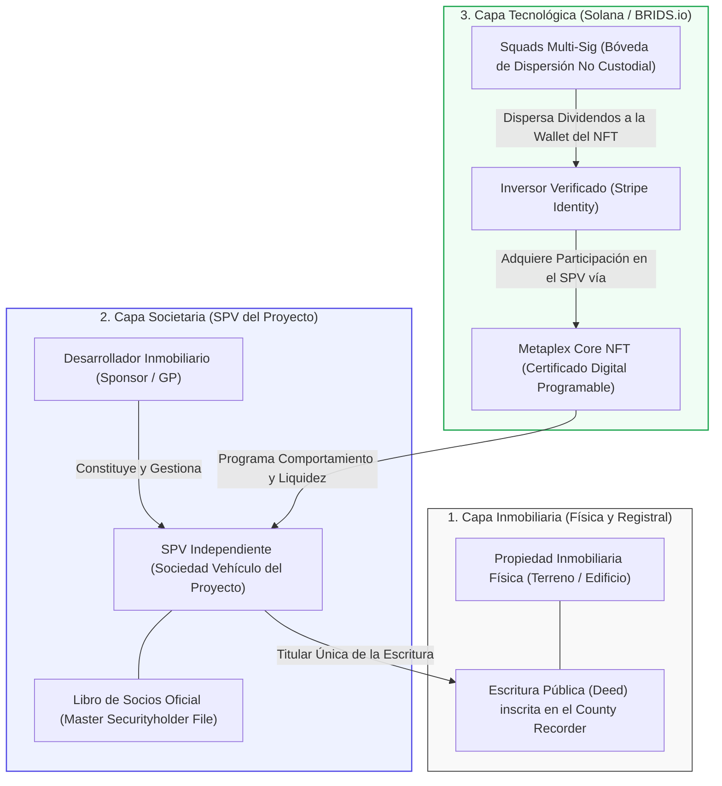

# C2: Protocolo de Recuperación de Llaves Privadas (Lost-Key Recovery)

> [!NOTE] Resumen Ejecutivo
> El mayor obstáculo para la adopción masiva de la inversión inmobiliaria en Web3 es el dogma cripto de que *"la pérdida de la llave privada equivale a la pérdida irreversible del patrimonio"*. En BRIDS.io, la propiedad jurídica del inmueble emana del registro societario del SPV del proyecto, no de la posesión efímera de una clave criptográfica. Siguiendo el criterio de la **SEC sobre valores tokenizados** (*Division of Corporation Finance Statement on Tokenized Securities*), **el NFT representa digitalmente una posición pero no es el registro legal**: el registro legal lo lleva el actor legal correspondiente en el *Master Securityholder File*.
> BRIDS opera como **infraestructura tecnológica pura**: no toca dinero, no hace KYC por sí mismo (delegado en partners certificados como Stripe Identity), no recomienda inversiones y no ejecuta la parte inmobiliaria ni reemplaza documentos legales. Ante el reporte de una billetera perdida, se ejecuta un protocolo institucional de 6 etapas: **congelamiento preventivo ejecutado exclusivamente por administradores mediante Metaplex Core, re-verificación biométrica en tiempo real con Stripe Identity (VerificationSession con re-escaneo de ID físico vigente y selfie con prueba de vida), validación secundaria (llamada telefónica, correo u OTP), período de enfriamiento (Timelock de 72 horas), sobre-escritura en Squads Protocol (sin alterar la estructura societaria del SPV) y descongelamiento/transferencia a la nueva wallet mediante el plugin de autoridad de Metaplex Core**. **Solo cambia la interfaz transaccional y la wallet de cobro; el SPV, la titularidad societaria y la escritura del inmueble en el condado permanecen 100% inmutables**.

---

## 1. One-Liner Canónico (Pitch, FAQs & Legal Brief)

> *"Inversión inmobiliaria con blindaje institucional: tu derecho está respaldado en el mundo real, donde perder una billetera jamás pondrá en riesgo tu patrimonio."*

---

> [!IMPORTANT] Criterio Regulatorio Central (SEC)
> **El NFT representa digitalmente una posición, pero no es el registro legal:**  
> Conforme al criterio oficial de la SEC en su pronunciamiento sobre valores tokenizados (*Division of Corporation Finance Statement on Tokenized Securities*), un NFT o token en blockchain es un vehículo de representación digital y cómputo transaccional, pero no sustituye el registro legal de la propiedad:  
> > *"Digital tokens represent a digital position, but do not constitute the official legal register. The official legal register is maintained by the designated legal entity in the Master Securityholder File."*  
> 
> 🔗 **Fuente Oficial SEC:** [SEC Division of Corporation Finance — Statement on Tokenized Securities](https://www.sec.gov/newsroom/speeches-statements/corp-fin-statement-tokenized-securities-012826-statement-tokenized-securities)
> 
> En BRIDS.io, el desarrollador constituye un SPV independiente para el desarrollo del inmueble. El inversionista accede e invierte directamente en el SPV a través de la plataforma, y el NFT opera exclusivamente como el sistema programable que gestiona el comportamiento del activo, la dispersión automatizada y la facilidad transaccional en Solana.

---

## 2. Arquitectura Estructural: Inversión en el SPV vs. Rol del NFT

Para comprender la viabilidad legal del protocolo de recuperación, es indispensable distinguir con precisión la arquitectura de tres capas que opera en cada proyecto de BRIDS:



### 2.1. ¿Qué Adquiere Realmente el Inversionista?
1. **El Desarrollador (Sponsor/GP) constituye un SPV:** Para cada proyecto específico, el desarrollador constituye una Sociedad de Propósito Especial (SPV) independiente adaptada a la estructuración jurídica del proyecto (ej. `BRIDS 123 Pine St LLC`).
2. **El SPV adquiere el inmueble:** El SPV es el titular exclusivo registrado en la escritura pública (*Deed*) en el condado correspondiente.
3. **El Inversor compra participación en el SPV:** Al fondear su inversión mediante BRIDS.io (desde $200 USD), el usuario suscribe el contrato de operación (*Operating Agreement*) y adquiere **unidades de membresía (*Membership Interests*) en el SPV**.
4. **El Rol del NFT:** El NFT emitido bajo el estándar **Metaplex Core en Solana** no es el inmueble ni una escritura paralela; es el **sistema operativo programable del activo**:
   - Codifica los metadatos contractuales, identificador del SPV, lote y número de cuota.
   - Habilita la facilidad transaccional instantánea (liquidación en sub-segundos a costo <$0.001 USD).
   - Automatiza la dispersión de rentas y dividendos en USDC desde la tesorería de Squads Multi-Sig.
   - Permite la ejecución de reglas de cumplimiento (congelamiento administrativo, restricción de transferencias y recuperación ante extravío).

> 💡 **Axioma Jurídico-Técnico de BRIDS:**  
> *"El NFT es transaccional, dinámico y reemplazable; el SPV, la escritura del inmueble y la condición societaria del inversionista son permanentes, inmutables e independientes de la clave privada."*

---

## 3. Protocolo Operativo Institucional de Recuperación (6 Fases)

Cuando un inversionista pierde el acceso a su billetera, olvida su frase semilla o es víctima de un compromiso de seguridad, se activa el protocolo formal con los siguientes requisitos mandatorios:

```mermaid
sequenceDiagram
    autonumber
    actor Inv as Inversor (Wallet Extraviada)
    participant Web as Portal BRIDS (Frontend / Auth)
    participant Stripe as Stripe Identity (VerificationSession)
    participant Auth as Canales Secundarios (Llamada/Email/OTP)
    participant Time as Motor de Timelock (72h Cooldown)
    participant Admin as Administradores BRIDS / Compliance
    participant Squads as Squads Multi-Sig (Solana)
    participant Sol as Metaplex Core (Solana)

    Note over Inv,Web: FASE 1: Notificación de Incidencia y Congelamiento
    Inv->>Web: Reporte de Incidencia (somete wallet a congelar si la tiene) + Firma Criptográfica de Nueva Wallet
    Web->>Admin: Notificación de solicitud de congelamiento preventivo
    Admin->>Sol: Invocación del Freeze Plugin (Administradores congelan el NFT preventivamente)

    Note over Inv,Stripe: FASE 2: Re-KYC Biométrico en Tiempo Real y Validación Secundaria
    Web->>Stripe: Frontend levanta nueva sesión KYC (VerificationSession)
    Inv->>Stripe: Re-escaneo de Documento Físico Vigente + Selfie en Vivo
    Stripe-->>Web: Validación en Tiempo Real (Prueba de Vida 3D + Match Facial con Documento)
    Web->>Auth: Disparo de Validación Secundaria (Llamada Telefónica / Correo / OTP)
    Inv->>Auth: Confirmación por Canal Secundario

    Note over Web,Time: FASE 3: Período Preventivo de Enfriamiento (Timelock 72h)
    Web->>Time: Inicio de Timelock Mandatorio de 72 Horas Hábiles
    Time-->>Auth: Notificaciones Masivas de Alerta a Todos los Canales
    Note over Time: Ventana de Pánico: Si no fue el usuario legítimo, puede abortar la operación

    Note over Time,Squads: FASE 4: Sobre-escritura en SQUADS Protocol
    Time->>Squads: Timelock concluido sin incidencias. Validación de expediente
    Note over Squads: No se cambia nada en el SPV; se actualiza la tesorería multi-sig
    Squads->>Squads: Propuesta Multi-Sig y sobre-escritura de Pubkey Receptora de Rentas

    Note over Admin,Sol: FASE 5: Descongelamiento y Transferencia (Plugin de Autoridad)
    Admin->>Sol: Plugin de Autoridad Metaplex Core: Descongelar NFT y Transferir a Nueva Wallet Autenticada

    Note over Sol,Inv: FASE 6: Cierre y Restauración Completa
    Sol-->>Inv: NFT transferido a nueva wallet. Cobro de dividendos restablecido en Squads.
```

### Fase 1: Solicitud Criptográfica y Reporte de Incidencia
- El inversionista accede al portal institucional de BRIDS.io e inicia el flujo de *"Reporte de Billetera Extraviada o Comprometida"*.
- **Declaración de la Dirección Afectada:** El usuario somete en el formulario la dirección pública de la billetera que desea congelar, en caso de tenerla disponible o recordarla.
- **Conexión y Firma Criptográfica de la Nueva Billetera:** El usuario conecta su nueva billetera de reemplazo (Phantom, Solflare, etc.) y firma criptográficamente (`SignMessage`) una declaración formal y estructurada emitida por el sistema para vincular su nueva clave pública con el expediente de recuperación, acreditando el control de la nueva wallet sin exponer claves privadas.
- **Congelamiento Administrativo On-Chain:** **El usuario no ejecuta ninguna acción de congelamiento.** El congelamiento del activo es potestad y ejecución exclusiva de los **administradores de la plataforma**, quienes, al recibir y validar preliminarmente el reporte de incidencia, invocan administrativamente el *Freeze Plugin* del estándar Metaplex Core sobre el NFT ubicado en la dirección comprometida. A partir de ese instante, el activo digital queda bloqueado contra cualquier intento de transferencia, venta en marketplaces o drenado de fondos mientras se procesa la verificación.

### Fase 2: Re-KYC Biométrico en Tiempo Real y Canales Secundarios
Considerando que el usuario ya aprobó su KYC inicial al registrarse, el protocolo exige autenticar que quien solicita la recuperación es indiscutiblemente la misma persona natural:
1. **Apertura de Sesión KYC (`VerificationSession`):** El usuario solicita recuperar su cuenta y el frontend de BRIDS.io levanta de inmediato una nueva sesión de verificación dedicada (`VerificationSession` mediante el SDK de Stripe Identity).
2. **Re-escaneo de Documento Físico Vigente y Captura de Selfie:** El usuario debe volver a escanear su documento de identidad físico vigente (pasaporte, licencia o ID gubernamental) y tomarse una selfie en vivo a través de la cámara del dispositivo.
3. **Biometría en Tiempo Real vía Stripe Identity:** La biometría la ejecuta Stripe en tiempo real: valida la prueba de vida (*3D Liveness Detection*) de la nueva selfie para descartar deepfakes o fotografías estáticas, y confirma que el rostro coincide tanto con el documento físico presentado como con el registro histórico validado de la cuenta.
4. **Validación Secundaria (Llamada Telefónica, Correo o Código OTP):** Tras la confirmación biométrica exitosa por parte de Stripe, el sistema activa una comprobación adicional por canales externos:
   - Llamada telefónica automatizada con voz interactiva (Voice 2FA / PIN).
   - O enlace de confirmación criptográfico enviado al correo electrónico registrado.
   - O código OTP temporal de 8 dígitos vía SMS al número móvil registrado.

### Fase 3: Período Preventivo de Enfriamiento y Timelock (72 Horas Hábiles)
El factor crítico para neutralizar el secuestro de cuentas (*account takeover*) y el fraude de identidad es el **factor tiempo**:
- Una vez aprobada la biometría en Stripe y los factores secundarios, el sistema activa un **Timelock Mandatorio de 72 horas hábiles (3 días calendario)**.
- **Alertas de Pánico Redundantes:** Durante el transcurso de las 72 horas, se disparan alertas continuas por SMS, correo electrónico y notificaciones *push*:
  > *"ALERTA DE SEGURIDAD: Se ha solicitado el reemplazo de su billetera en BRIDS.io. La transferencia del título a su nueva dirección se ejecutará en 72 horas. Si usted solicitó este cambio, no requiere hacer nada. Si USTED NO REALIZÓ ESTA SOLICITUD, pulse de inmediato este enlace de emergencia para cancelar la operación y bloquear su cuenta."*
- Si en cualquier momento dentro de las 72 horas el usuario legítimo activa el botón de pánico, la operación se cancela de inmediato y el caso escala a arbitraje legal y revisión manual con compliance.

### Fase 4: Sobre-escritura en SQUADS Protocol (Bóveda de Dispersión)
- **Sin Alteraciones en el SPV:** Concluido el timelock de 72 horas sin disputas, **no se cambia nada en el SPV**. La condición societaria del inversionista, sus unidades de membresía y la titularidad del inmueble permanecen inmutables; no se requiere trámite registral societario ni reforma estatutaria.
- **Actualización On-Chain en Squads Multi-Sig:** El cambio se ejecuta de forma operativa en la tesorería multifirma de **Squads Protocol en Solana**. Los administradores autorizados aprueban una propuesta multi-sig para sobre-escribir la tabla de beneficiarios de rendimientos de la bóveda de dispersión del proyecto: se sustituye la dirección pública antigua por la nueva wallet verificada del usuario, garantizando que los futuros dividendos en USDC fluyan directamente a la nueva dirección.

### Fase 5: Descongelamiento y Transferencia con Plugin de Autoridad de Metaplex Core
Una vez que el usuario se ha autenticado con éxito y se ha superado el timelock de seguridad:
1. **Invocación del Plugin de Autoridad:** Los administradores hacen uso del plugin de autoridad (*Authority Plugin / Freeze Plugin*) del estándar **Metaplex Core**.
2. **Descongelamiento del Activo:** Se levanta la restricción de congelamiento (*Unfreeze*) que mantenía inmovilizado el NFT en la billetera extraviada.
3. **Transferencia Directa a la Nueva Billetera:** Mediante la instrucción de autoridad delegada del estándar, los administradores ejecutan la transferencia del NFT hacia la nueva wallet verificada del inversionista.
- **Preservación del Activo:** No se requiere destruir (*burn*) ni reemitir un nuevo token; Metaplex Core permite transferir el mismo activo de manera atómica, manteniendo su historial on-chain, metadatos, correlativo de serie y derechos intactos.

### Fase 6: Cierre y Restauración Completa
- El inversionista recibe la confirmación formal por correo y en su dashboard de BRIDS.io.
- Su NFT aparece visible en su nueva billetera y en el portafolio de la plataforma.
- Los derechos de voto (si aplican) y el flujo de rentas trimestrales en Squads quedan plenamente restablecidos.

---

## 4. Matriz de Requisitos Mandatorios para Solicitud de Recuperación

| Requisito / Protocolo | Mecanismo Operativo | Criterio de Aprobación | Acción ante Discrepancia o Fallo |
| :--- | :--- | :--- | :--- |
| **1. Reporte de Incidencia** | Formulario en portal BRIDS.io; el usuario somete la wallet a congelar (si la tiene) | Firma criptográfica de la nueva wallet (`SignMessage`) sobre la declaración formal | Solicitud rechazada; no se inicia el proceso. |
| **2. Congelamiento On-Chain** | Ejecutado **exclusivamente por administradores** mediante el *Freeze Plugin* de Metaplex Core | Confirmación de transacción en Solana sub-segundo | Reintento en RPC de respaldo; el usuario no congela. |
| **3. Re-KYC Biométrico** | Frontend levanta nueva `VerificationSession` en Stripe Identity | Re-escaneo de ID físico vigente + selfie; validación 3D Liveness y match facial en tiempo real | Bloqueo preventivo de cuenta por sospecha de usurpación. |
| **4. Validación Secundaria** | Canal externo registrado: llamada automatizada (Voice 2FA), correo o código OTP | Confirmación satisfactoria del desafío por el canal seleccionado | Fallo registrado; no avanza a timelock. |
| **5. Timelock de Enfriamiento** | Motor cronometrado autónomo de 72 horas hábiles | 72 horas transcurridas sin reporte de fraude o activación del botón de pánico | Cancelación inmediata si el usuario presiona el botón de pánico. |
| **6. Sobre-escritura en Squads** | Modificación de pubkey receptora en contrato Squads Multi-Sig (sin alterar el SPV) | Firma multi-sig de administradores del proyecto | Retención temporal de dispersiones en escrow. |
| **7. Descongelamiento y Transferencia** | Invocación del Plugin de Autoridad de Metaplex Core para descongelar y transferir a nueva wallet | Transacción de transferencia confirmada en Solana mainnet | Título digital restaurado y auditado on-chain. |

---

## 5. Snippets Reutilizables (Ready-to-Cite)

### Snippet 5.1: Para Preguntas Frecuentes (FAQ / Help Center)
> *"**¿Si pierdo el acceso a mi billetera Web3, pierdo mi inversión en el inmueble?**  
> No. En BRIDS.io tu derecho de propiedad no depende de una clave privada, sino de tu condición de socio en el SPV propietario del inmueble. Si pierdes tu billetera, activas nuestro Protocolo Institucional de Recuperación: nuestros administradores congelan preventivamente el activo on-chain, re-verificas tu identidad en tiempo real con Stripe Identity re-escaneando tu documento físico y tomándote una selfie con prueba de vida, confirmas por canal de seguridad secundario (llamada, correo u OTP), y tras un período de protección de 72 horas, sobre-escribimos tu dirección de cobro en Squads Protocol y usamos el plugin de autoridad de Metaplex Core para descongelar y transferir tu certificado digital a tu nueva billetera. Tu participación en el SPV nunca se altera."*

### Snippet 5.2: Para Pitch Decks de Y Combinator y Fondos de Venture Capital
> *"Eliminamos la mayor fricción de entrada para el inversor tradicional: el terror a perder la clave privada. En BRIDS, el NFT es únicamente el software de comportamiento y liquidación sobre Solana; el activo real está blindado por su SPV dedicado. Gracias al plugin de autoridad de Metaplex Core y a Squads Protocol, los administradores pueden descongelar y transferir activos a nuevas billeteras verificadas tras una re-verificación biométrica en Stripe Identity (VerificationSession en tiempo real) y un timelock de 72 horas, combinando la liquidez instantánea de Web3 con la seguridad jurídica del derecho corporativo."*

### Snippet 5.3: Para el Memorando de Cumplimiento y Legal Data Room
> *"Conforme a la doctrina de la SEC ('Substance over Form') y las disposiciones aplicables al registro societario y mercantil de entidades comerciales, la titularidad de los títulos de inversión reside en el Master Securityholder File del SPV. Los NFTs de Metaplex Core operan como certificados digitales de participación. En caso de extravío o vulneración de llaves criptográficas, el SPV no requiere alteración estatutaria; la administración actualiza la clave pública receptora de rentas en el protocolo multifirma de Squads y ejerce el plugin de autoridad de Metaplex Core para descongelar y transferir el activo digital a la nueva billetera autenticada del titular, sin alterar la titularidad legal del inmueble inscrito en el County Recorder."*

---

## 6. Apéndice Breve: Versión Simplificada de Principios de Plataforma

- **sec.gov:** [Private Fund Adviser Overview (SEC)](https://www.sec.gov/about/divisions-offices/division-investment-management/private-fund-adviser-overview)
- **BRIDS no toca dinero.**
- **BRIDS no hace KYC por sí mismo y no recomienda inversiones:** [ecfr.gov — 31 CFR 1023.220](https://www.ecfr.gov/current/title-31/subtitle-B/chapter-X/part-1023/subpart-B/section-1023.220).
- **BRIDS no ejecuta la parte inmobiliaria y no reemplaza documentos legales:** [fincen.gov — FinCEN Guidance on Convertible Virtual Currency](https://www.fincen.gov/sites/default/files/2019-05/FinCEN%20Guidance%20CVC%20FINAL%20508.pdf).
- **El NFT representa digitalmente una posición, pero no es el registro legal:** [sec.gov — SEC Corp Fin Statement on Tokenized Securities](https://www.sec.gov/newsroom/speeches-statements/corp-fin-statement-tokenized-securities-012826-statement-tokenized-securities). El registro legal lo lleva el actor legal correspondiente en el SPV.
- **Protección de Datos y Seguridad de Información:** [ftc.gov — FTC Safeguards Rule](https://www.ftc.gov/legal-library/browse/rules/safeguards-rule).
- **Los partners hacen la parte especializada; BRIDS hace la infraestructura.**
- **BRIDS no debe cobrar como intermediario financiero por funciones que no asume.**
- **BRIDS debe comunicar siempre su rol real como plataforma tecnológica.**

---

## 7. Apéndice Orientativo de Normas y Referencias a Revisar con Counsel

1. **Securities Exchange Act of 1934 (Broker-Dealer Regulations):**  
   🔗 [https://www.sec.gov/about/divisions-offices/division-trading-markets/broker-dealers](https://www.sec.gov/about/divisions-offices/division-trading-markets/broker-dealers)
2. **Securities Act of 1933, incluyendo Section 4(a)(6) para Crowdfunding:**  
   🔗 [https://www.sec.gov/rules-regulations/2015/10/crowdfunding](https://www.sec.gov/rules-regulations/2015/10/crowdfunding)
3. **Regulation Crowdfunding (Reg CF):**  
   🔗 [https://www.sec.gov/resources-small-businesses/exempt-offerings/regulation-crowdfunding](https://www.sec.gov/resources-small-businesses/exempt-offerings/regulation-crowdfunding)
4. **Investment Advisers Act of 1940 y exenciones aplicables para advisers de private funds:**  
   🔗 [https://www.sec.gov/about/divisions-offices/division-investment-management/private-fund-adviser-overview](https://www.sec.gov/about/divisions-offices/division-investment-management/private-fund-adviser-overview)
5. **Reglas AML/CIP aplicables a broker-dealers bajo 31 CFR 1023.220:**  
   🔗 [https://www.ecfr.gov/current/title-31/subtitle-B/chapter-X/part-1023/subpart-B/section-1023.220](https://www.ecfr.gov/current/title-31/subtitle-B/chapter-X/part-1023/subpart-B/section-1023.220)
6. **Guía de FinCEN sobre modelos con convertible virtual currency (CVC):**  
   🔗 [https://www.fincen.gov/sites/default/files/2019-05/FinCEN%20Guidance%20CVC%20FINAL%20508.pdf](https://www.fincen.gov/sites/default/files/2019-05/FinCEN%20Guidance%20CVC%20FINAL%20508.pdf)
7. **Criterios sobre tokenized securities y Master Securityholder File:**  
   🔗 [https://www.sec.gov/newsroom/speeches-statements/corp-fin-statement-tokenized-securities-012826-statement-tokenized-securities](https://www.sec.gov/newsroom/speeches-statements/corp-fin-statement-tokenized-securities-012826-statement-tokenized-securities)
8. **Referencias de seguridad de información y FTC Safeguards Rule:**  
   🔗 [https://www.ftc.gov/legal-library/browse/rules/safeguards-rule](https://www.ftc.gov/legal-library/browse/rules/safeguards-rule)

> [!IMPORTANT]
> Este apéndice es solo de referencia institucional y debe ser validado y ampliado por asesores legales especializados en la jurisdicción correspondiente antes de cualquier emisión pública o despliegue en mercados regulados.

---

## 8. Directrices Léxicas (Do's & Don'ts)

- **Obligatorio Usar:** Certificado digital programable, membresía en el SPV, congelamiento preventivo exclusivo por administradores, plugin de autoridad de Metaplex Core para descongelar y transferir, re-verificación biométrica activa en Stripe Identity (VerificationSession con re-escaneo de ID físico y selfie en tiempo real), canales secundarios (llamada telefónica, correo u OTP), timelock de enfriamiento de 72 horas con alertas de pánico, sobre-escritura de tesorería en Squads Protocol, doctrina SEC de sustancia sobre forma.
- **Prohibido Terminantemente:** "El usuario congela su propia billetera", "se altera la estructura societaria del SPV para cambiar la wallet", "burn and remint innecesario cuando existe plugin de autoridad", "El NFT es la escritura de la casa", "pérdida irreversible", "wallet irrecuperable", "code-is-law absoluto", "bypassear la ley estatal", "rescate manual discrecional sin timelock", "título de propiedad en la blockchain".

---

## Historial de Revisiones

| Versión | Fecha | Autor / Agente | Resumen de Modificaciones |
| :--- | :--- | :--- | :--- |
| **1.6.0** | 2026-09-13 | `compliance-officer`, `founder-ghostwriter` | Actualización integral de flujo y responsabilidades: congelamiento preventivo atribuido exclusivamente a administradores tras someter dirección afectada, inicio de VerificationSession en frontend con re-escaneo de documento físico vigente y selfie en tiempo real evaluada por Stripe Identity seguida de confirmación secundaria (llamada, correo u OTP), confirmación de que no se altera el SPV (cambio acotado a tesorería en Squads Protocol), y ejecución de descongelamiento y transferencia directa a nueva wallet autenticada mediante el plugin de autoridad de Metaplex Core sin destrucción/reemisión. |
| **1.5.0** | 2026-09-13 | `compliance-officer` | Generalización de la jurisdicción del SPV: eliminación de referencias rígidas a Delaware para reflejar que la sociedad vehículo se constituye conforme a la estructuración jurídica específica de cada proyecto inmobiliario. |
| **1.4.0** | 2026-09-13 | `compliance-officer`, `founder-ghostwriter` | Simplificación estructural: sustitución del marco legal inicial por una nota ejecutiva destacada con la cita textual de la SEC ('El NFT representa digitalmente una posición, pero no es el registro legal') y enlace oficial, agilizando la lectura directa hacia la arquitectura y el protocolo de recuperación. |
| **1.3.0** | 2026-09-13 | `compliance-officer`, `founder-ghostwriter` | Integración de los 7 principios institucionales de BRIDS, enlaces reales y oficiales de SEC (Corp Fin Statement on Tokenized Securities), FinCEN CVC Guidance, eCFR 31 CFR 1023.220, FTC Safeguards Rule, y adición de los Apéndices 16 y 17 para revisión con counsel. |
| **1.2.0** | 2026-09-13 | `compliance-officer`, `founder-ghostwriter` | Integración de doctrina regulatoria de la SEC, diferenciación SPV vs NFT como software programable, y formalización del protocolo institucional de 6 fases con Re-KYC Stripe Identity (3D Liveness), Voice 2FA, Timelock de 72 horas y sobre-escritura en Squads Multi-Sig. |
| **1.1.0** | 2026-09-13 | BRIDS Core Architecture | Actualización del título a nomenclatura canónica C2. |
| **1.0.0** | 2026-09-11 | `compliance-officer` & SDD Loop | Formalización canónica inicial del protocolo de recuperación de billeteras. |
