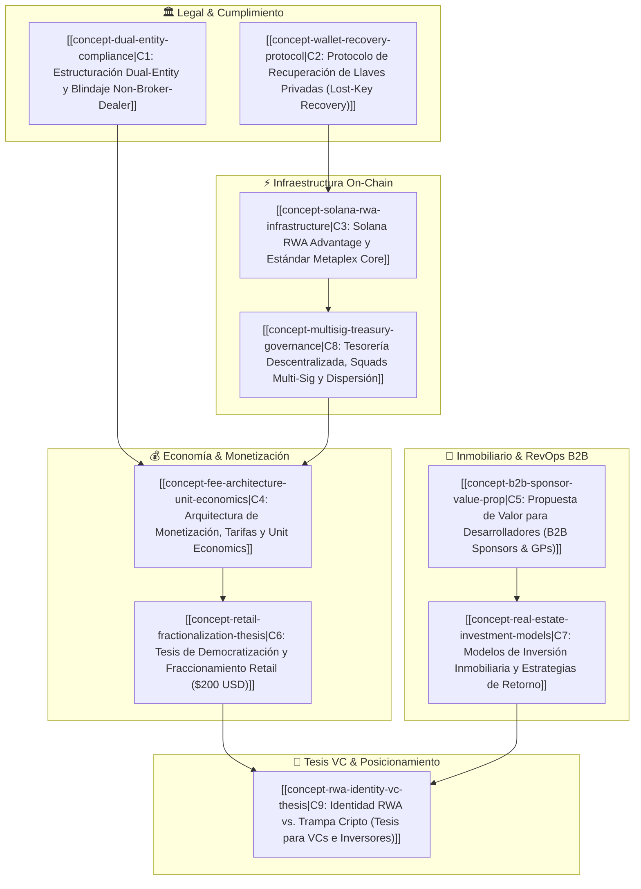

# Índice Maestro: Conceptos Clave del Negocio (Business Concepts Index)

> [!NOTE] Resumen Ejecutivo & Barrel Index
> Este documento funge como el **archivo barrel / índice central** de los 9 Conceptos Nucleares de Negocio de BRIDS.io. Cada concepto constituye una unidad atómica de doctrina estratégica, legal, tecnológica y financiera que sustenta la plataforma de tokenización y sindicación inmobiliaria en Solana. Estos conceptos rigen todas las comunicaciones institucionales, memos para Y Combinator, pitches a fondos de Venture Capital y material de venta B2B para desarrolladores inmobiliarios.

---

## 🗺️ Mapa de Arquitectura Conceptual (Mermaid)

---

## 📚 Directorio de Conceptos Nucleares (C1 – C9)

| ID | Concepto Maestro | Archivo Canónico | Sub-Agentes Custodios | One-Liner / Insight Clave |
|:---|:---|:---|:---|:---|
| **C1** | **Estructuración Dual-Entity y Blindaje Non-Broker-Dealer** | [[concept-dual-entity-compliance\|concept-dual-entity-compliance.md]] | `compliance-officer`, `business-consultant` | Desacoplamiento estricto entre BRIDS Inc. (Delaware C-Corp, puro SaaS) y Delaware Series LLCs (SPVs propietarias de inmuebles), blindando contra la Sec. 15(a) del Exchange Act. |
| **C2** | **Protocolo de Recuperación de Llaves Privadas (Lost-Key Recovery)** | [[concept-wallet-recovery-protocol\|concept-wallet-recovery-protocol.md]] | `compliance-officer`, `pitch-deck-architect` | Puente institucional Web2/Web3: re-emisión y congelamiento on-chain de títulos NFT respaldados por su SPV y verificación biométrica off-chain con Stripe Identity sin comprometer descentralización. |
| **C3** | **Solana RWA Advantage y Estándar Metaplex Core** | [[concept-solana-rwa-infrastructure\|concept-solana-rwa-infrastructure.md]] | `compliance-officer`, `pitch-deck-architect` | Aprovechamiento del estándar Metaplex Core de cuenta única (~0.0029 SOL rent exemption) y transacciones sub-céntricas (<$0.001) para viabilizar dispersiones y micro-fraccionamiento. |
| **C4** | **Arquitectura de Monetización, Estructura de Tarifas y Unit Economics** | [[concept-fee-architecture-unit-economics\|concept-fee-architecture-unit-economics.md]] | `business-consultant`, `pitch-deck-architect` | Monetización 100% transaccional SaaS: $4 USD por NFT de $200 emitido, setup fees escalonados ($1,000–$2,500) y fees de dispersión tecnológica sin cobro de comisiones porcentuales de corretaje. |
| **C5** | **Propuesta de Valor para Desarrolladores Inmobiliarios (B2B Sponsors & GPs)** | [[concept-b2b-sponsor-value-prop\|concept-b2b-sponsor-value-prop.md]] | `b2b-sponsor-lead`, `business-consultant` | Software de sindicación institucional que reduce los tiempos de colocación de meses a semanas, ahorra $30k–$60k en structuring legal y automatiza cap tables. |
| **C6** | **Tesis de Democratización y Fraccionamiento Retail ($200 USD)** | [[concept-retail-fractionalization-thesis\|concept-retail-fractionalization-thesis.md]] | `founder-ghostwriter`, `pitch-deck-architect` | Erradicación de la barrera histórica de $50k-$100k en real estate institucional; ticket accesible de $200 USD ($196 SPV / $4 Fee) en USDC sobre Solana para inversores globales. |
| **C7** | **Modelos de Inversión Inmobiliaria y Estrategias de Retorno** | [[concept-real-estate-investment-models\|concept-real-estate-investment-models.md]] | `business-consultant`, `b2b-sponsor-lead` | Tres arquetipos parametrizados operados con Blue Brick Capital: Fix & Flip (rotación 6–12m), Fix & Hold (rentas con dispersión trimestral) y Greenfield (desarrollo integral). |
| **C8** | **Tesorería Descentralizada, Squads Multi-Sig y Dispersión sin Custodia** | [[concept-multisig-treasury-governance\|concept-multisig-treasury-governance.md]] | `compliance-officer`, `founder-ghostwriter` | Eliminación de "cajas negras" promotoras mediante tesorerías multifirma con Squads Protocol; fondos liberados contra avance de obra y dividendos dispersados sin custodia discrecional de BRIDS. |
| **C9** | **Identidad RWA vs. Trampa Cripto (Tesis para VCs e Inversores)** | [[concept-rwa-identity-vc-thesis\|concept-rwa-identity-vc-thesis.md]] | `pitch-deck-architect`, `founder-ghostwriter`, `business-consultant` | Tesis institucional para Venture Capital: superación de las fallas de RWA 1.0 (RealT, Blocksquare), posicionamiento como infraestructura SaaS B2B y justificación de múltiplos de 15x–30x ARR. |

---

## 🎯 Síntesis Conceptual y Lineamientos de Uso

1. **Invarianza de Criterios:**
   - **Ticket de Fracción Retail:** Siempre **$200 USD** brutos ($196 USD para el SPV inmobiliario + $4 USD de fee de procesamiento tecnológico para BRIDS).
   - **Monetización:** Cobro exclusivo de **fees de infraestructura tecnológica fija**, nunca comisiones porcentuales de éxito o corretaje de valores.
   - **Dispersión:** Trimestral para proyectos *Fix & Hold*; al vencimiento y liquidación para *Fix & Flip* y *Greenfield*.
2. **Sub-Agentes Responsables:**
   - Para modelado financiero y unit economics: delegar en `business-consultant`.
   - Para estructuración regulatoria, SPVs y Metaplex Core: delegar en `compliance-officer`.
   - Para presentaciones a inversores, decks de YC y memos: delegar en `pitch-deck-architect`.
   - Para prospección B2B y acuerdos con desarrolladores: delegar en `b2b-sponsor-lead`.
   - Para narrativa fundadora, posicionamiento Web3 y thought leadership: delegar en `founder-ghostwriter`.

---

## 📜 Historial de Revisiones

| Fecha | Versión | Autor / Responsable | Resumen del Cambio |
|:---|:---|:---|:---|
| 2026-09-13 | 1.0.0 | BRIDS Core Architecture | Creación del archivo barrel e indexación exhaustiva de los conceptos C1 a C9 con nomenclatura canónica. |
