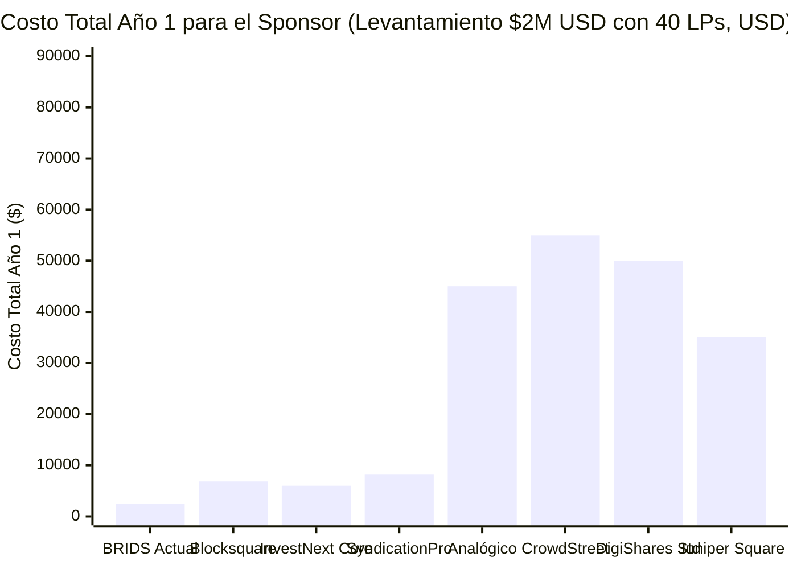

# B2B Sponsor Fee Benchmark: Comparativa de Tarifas a Promotores Inmobiliarios

> [!NOTE] Relación con la Investigación Maestra
> Este documento profundiza en la estructura comercial y de tarifas cobradas al **Sponsor / Promotor Inmobiliario / General Partner (GP)**. 
> Consulta el documento maestro de costos del proceso en:  
> 📄 [[01 Negocio/01 Estrategia & Modelo/market-research/research-costos-sindicacion-y-plataformas-benchmark.md|Market Research: Costos Reales de Sindicación Inmobiliaria & Benchmark de Plataformas]]

---

## 🧭 Índice
1. [Resumen Ejecutivo & El Vacío de Precios B2B](#1-resumen-ejecutivo--el-vacío-de-precios-b2b)
2. [Matriz Maestra de Tarifas B2B a Promotores (Todos los Competidores)](#2-matriz-maestra-de-tarifas-b2b-a-promotores-todos-los-competidores)
3. [Desglose por Categoría Competitiva](#3-desglose-por-categoría-competitiva)
   - 3.1. Software SaaS de Gestión de Inversionistas (Portales B2B Tradicionales)
   - 3.2. Marketplaces de Sindicación y Fondeo de Capital (Comisiones de Éxito)
   - 3.3. Plataformas de Sindicación Digital y Tokenización RWA (Web3)
   - 3.4. Vía Analógica Tradicional (Abogados de Valores + Contabilidad)
4. [Escenario Comparativo Año 1: Deal Típico de $2,000,000 USD (40 LPs)](#4-escenario-comparativo-año-1-deal-típico-de-2000000-usd-40-lps)
5. [Análisis Estratégico: Oportunidad de Reestructuración del Fee B2B en BRIDS](#5-análisis-estratégico-oportunidad-de-reestructuración-del-fee-b2b-en-brids)
6. [Enlaces Verificados de Fuentes y Pricing Oficial](#6-enlaces-verificados-de-fuentes-y-pricing-oficial)

---

## 1. Resumen Ejecutivo & El Vacío de Precios B2B

Al analizar qué le cobran las plataformas de sindicación al promotor inmobiliario (Sponsor / GP), se evidencian tres modelos económicos dominantes en el mercado global:

1. **SaaS Recurrente Obligatorio:** Plataformas como InvestNext, SyndicationPro y Juniper Square cobran entre **$4,800 y $100,000+ USD anuales** en licencias fijas, independientemente del éxito del levantamiento de capital, sin incluir el costo legal ($15k–$30k del PPM).
2. **Comisión sobre Capital Levantado (Success Fees):** Marketplaces como CrowdStreet cobran entre el **1.0% y 3.0% del capital total fondeado**, más fees no reembolsables de due diligence ($5,000–$15,000 USD), asumiendo alta exposición regulatoria de broker-dealer.
3. **Licenciamiento White-Label Web3:** Tokenizadoras como DigiShares y Blocksquare cobran entre **€5,000 y €50,000+ EUR de setup inicial**, más mensualidades de **€300 a €1,500 EUR/mes** o **$5,990 USD por propiedad**.

### 💡 El Hallazgo Clave: La "Zona Muerta" de Precios
Existe un **vacío absoluto de mercado entre $2,500 USD (modelo actual de BRIDS) y $5,988 USD (InvestNext Core anual)**:

```
[BRIDS Actual: $1k-$2.5k] -------- ZONA VACÍA --------> [InvestNext: $6k/año] ---> [Blocksquare: $6.8k] ---> [Juniper: $18k-$100k] ---> [DigiShares: €35k+]
```

Ningún competidor ofrece software institucional moderno en el rango de **$3,000 a $5,000 USD por proyecto**, lo que otorga a BRIDS un margen de maniobra significativo para ajustar su propuesta B2B sin perder su foso de precio ultra-competitivo.

---

## 2. Matriz Maestra de Tarifas B2B a Promotores (Todos los Competidores)

| Plataforma / Proveedor | Categoría | Setup Fee (Pago Único) | Suscripción Mensual | Costo Anual Recurrente | Comisiones Transaccionales / Add-Ons | ¿Cobra % sobre Capital? | Enlace Oficial |
| :--- | :---: | :---: | :---: | :---: | :--- | :---: | :--- |
| **InvestNext (Core)** | SaaS Portal | Incluido | **$499 USD/mes** | **$5,988 USD/año** | ACH: 0.03% + $0.25 (tope $25) | ❌ No | [investnext.com](https://investnext.com) |
| **InvestNext (Firm)** | SaaS Portal | Incluido | **$699 USD/mes** | **$8,388 USD/año** | ACH: 0.03% + $0.25 (tope $25) | ❌ No | [investnext.com](https://investnext.com) |
| **SyndicationPro** | SaaS Portal | — | **~$400–$600 USD/mes** | **~$4,800–$7,200 USD/año** | Acreditación: $500 setup + $59/inv; ACH: $50/mes; Wire: $0.49; Cheque: $5 | ❌ No | [syndicationpro.com](https://syndicationpro.com) |
| **Juniper Square (Core)** | Enterprise SaaS | Alto ($5k–$15k) | **~$1,500 USD/mes** | **Piso de ~$18,000 USD/año** | Módulos enterprise y soporte dedicado | ❌ No | [junipersquare.com](https://junipersquare.com) |
| **Juniper Square (Large Fund)** | Enterprise SaaS | Alto | Cotización a medida | **$30,000–$100,000+ USD/año** | Auditoría y back-office institucional | ❌ No | [junipersquare.com](https://junipersquare.com) |
| **Agora Real Estate** | SaaS Portal | Variable | **$200–$800+ USD/mes** | **$2,400–$9,600+ USD/año** | Preparación de K-1s y back-office contable como add-on | ❌ No | [agorareal.com](https://agorareal.com) |
| **Janover Connect (Groundbreaker)** | SaaS Portal | Variable | **~$250–$500 USD/mes** | **~$3,000–$6,000 USD/año** | E-signatures y data room escalonado | ❌ No | [janover.co](https://janover.co) |
| **Covercy** | SaaS + Banking | Variable | **~$300–$700 USD/mes** | **~$3,600–$8,400 USD/año** | Transacciones bancarias integradas CRE | ❌ No | [covercy.com](https://covercy.com) |
| **CrowdStreet** | Marketplace | — | — | — | **Success Fee: 1.0%–3.0% del capital** + Posting Fee: $5,000–$15,000 | ⚠️ **SÍ (1%–3%)** | [crowdstreet.com](https://crowdstreet.com) |
| **EquityMultiple** | Marketplace | — | — | — | **Originación: 1.0%–2.0%** + Carry/Promote sobre retornos | ⚠️ **SÍ (1%–2%)** | [equitymultiple.com](https://equitymultiple.com) |
| **DigiShares (Launch)** | Tokenización Web3 | **€5,000 EUR** | **€300 EUR/mes** | **€3,600 EUR/año** | 2 proyectos, 50 KYC checks; extra: €60–€200/mes c/u | ❌ No | [digishares.io](https://digishares.io/pricing) |
| **DigiShares (Standard)** | Tokenización Web3 | **€35,000 EUR** | **€950 EUR/mes** | **€11,400 EUR/año** | White-label completo, pasarelas de pago y contratos | ❌ No | [digishares.io](https://digishares.io/pricing) |
| **DigiShares (Advanced)** | Tokenización Web3 | **€50,000+ EUR** | **€1,500 EUR/mes** | **€18,000 EUR/año** | API personalizada y apps móviles | ❌ No | [digishares.io](https://digishares.io/pricing) |
| **Blocksquare** | Tokenización Web3 | Staking BST token | **$69 USD/mes por propiedad** | **$828 USD/año por propiedad** | **$5,990 USD por propiedad/oferta primaria** | ❌ No | [blocksquare.io](https://blocksquare.io) |
| **Securitize** | Tokenización Web3 | **$50,000–$150,000+** | Cotización institucional | Cotización institucional | Custodia calificada y administración de fondos | Variable | [securitize.io](https://securitize.io) |
| **Vía Analógica (Sin Plataforma)** | Legal Tradicional | **$23,500–$46,500** (PPM+SPV) | — | **$13,600–$27,200 USD/año** | K-1s: $150–$300/inv; Form 1065: $2,500–$5,000 | ❌ No | Firmas de valores |
| **BRIDS.io (Modelo Actual)** | **Infraestructura Solana** | **$1,000 – $2,500 USD** | **$0 USD/mes obligatorio** | **$0 USD/año obligatorio** | **$4 USD fijo por fracción emitida** ($200 USD) + fee dispersión Squads | ❌ **No (Tarifa fija)** | [brids.io](https://brids.io) |

---

## 3. Desglose por Categoría Competitiva

### 3.1. Software SaaS de Gestión de Inversionistas (Portales B2B Tradicionales)
* **Público Objetivo:** Sponsors que ya tienen su propia red de inversionistas y solo requieren un CRM, data room y portal de distribución.
* **Modelo de Negocio:** Suscripción mensual con compromiso de 12 meses.
* **Punto Débil:** **Cero flexibilidad para sponsors emergentes.** Un desarrollador que tarda 6 meses en conseguir su deal paga religiosamente $500–$1,500 USD mensuales sin haber levantado un centavo.
* **Costo Oculto:** Ninguno incluye el paquete legal (PPM de $15,000–$30,000 USD) ni la contabilidad fiscal de los K-1s ($150–$300 por inversionista).

### 3.2. Marketplaces de Sindicación y Fondeo de Capital (Comisiones de Éxito)
* **Público Objetivo:** Desarrolladores que buscan capital retail externo listo para invertir.
* **Modelo de Negocio:** Cobro porcentual sobre el volumen levantado (1% a 3%) + tarifas fijas de auditoría previa ($5k–$15k).
* **Punto Débil:** Costos astronómicos en levantamientos medianos (en un deal de $5M, un 2% equivale a **$100,000 USD** solo en comisiones de plataforma).
* **Riesgo Regulatorio:** Exposición a clasificación como *Broker-Dealer* bajo la Sección 15(a)(1) de la *Securities Exchange Act of 1934*.

### 3.3. Plataformas de Sindicación Digital y Tokenización RWA (Web3)
* **Público Objetivo:** Agencias y fondos que desean emitir security tokens sobre blockchain.
* **Modelo de Negocio:** Setup upfront muy elevado (€35,000 en DigiShares) o tarifa fija alta por propiedad ($5,990 USD en Blocksquare).
* **Punto Débil:** Construidas sobre redes EVM (Ethereum / Polygon), lo que traslada fees de gas impredecibles a los inversionistas para el reclamo de dividendos y adolece de un protocolo de recuperación ante pérdida de llaves privadas.

### 3.4. Vía Analógica Tradicional (Abogados de Valores + Contabilidad)
* **Modelo:** Sin tecnología de portal; todo se gestiona mediante PDFs escaneados, firmas físicas o DocuSign básico, transferencias bancarias y llamadas telefónicas.
* **Costo Upfront:** **$23,500 – $46,500 USD** (PPM $15k-$30k, Blue Sky $4k-$8k, SPVs $1.5k-$2.5k).
* **Costo Recurrente:** **$13,600 – $27,200 USD/año** (35 K-1s a $200 c/u + Form 1065 + reportes estatales).

---

## 4. Escenario Comparativo Año 1: Deal Típico de $2,000,000 USD (40 LPs)

A continuación se proyecta el desembolso total que realiza el sponsor en su primer año de operación al sindicar un proyecto residencial de **$2,000,000 USD** con **40 inversionistas**:



### Tabla de Desglose del Escenario

| Proveedor / Opción | Costo Plataforma / Software Año 1 | Costo Legal Tradicional (PPM) | Desembolso Total Año 1 | Comentario sobre el Modelo |
| :--- | :---: | :---: | :---: | :--- |
| **BRIDS.io (Modelo Actual)** | **$2,500 USD** (setup) + $4/fracción | Externo / Integrado | **$2,500 USD** *(+ legal)* | **La opción más económica del mercado global.** Sin mensualidad fija. |
| **InvestNext (Core)** | **$5,988 USD** ($499/mes × 12) | $15,000 – $30,000 | **$20,988 – $35,988 USD** | Requiere contrato obligatorio de 12 meses. |
| **Blocksquare** | **$6,818 USD** ($5,990 deal + $69/mo) | $15,000 – $30,000 | **$21,818 – $36,818 USD** | Requiere staking de token BST. |
| **SyndicationPro** | **$8,260 USD** ($5.4k subs + $500 accred + $59×40) | $15,000 – $30,000 | **$23,260 – $38,260 USD** | Cobro extra por verificar acreditación de cada LP. |
| **Vía Analógica Manual** | **$0 USD** (sin software) | $25,000 – $45,000 (PPM + Blue Sky) | **$37,100 – $73,700 USD** | Incluye contabilidad manual de 40 K-1s ($8,000). |
| **Juniper Square (Core)** | **~$18,000 – $35,000 USD** | $15,000 – $30,000 | **$33,000 – $65,000 USD** | Diseñado exclusivamente para fondos grandes. |
| **DigiShares (Standard)** | **~$50,000 USD** (€35k setup + €11.4k/año) | $15,000 – $30,000 | **$65,000 – $80,000 USD** | Elevadísima barrera de entrada para un solo deal. |
| **CrowdStreet (Marketplace)** | **~$55,000 USD** (2% de $2M + $15k posting) | $15,000 – $30,000 | **$70,000 – $85,000 USD** | Cobro porcentual sobre el capital levantado. |

---

## 5. Análisis Estratégico: Oportunidad de Reestructuración del Fee B2B en BRIDS

### Diagnóstico de Pricing
Actualmente, BRIDS cobra al promotor inmobiliario:
* **SaaS Setup & Integration Fee:** Tarifa fija de **$1,000 a $2,500 USD por SPV/proyecto**.
* **Software Transaction Fee:** Tarifa fija de **$4 USD por fracción de $200 USD** (cubierto por la emisión).
* **Suscripción Mensual:** **$0 USD**.

### El Problema de Sub-Monetización B2B
1. **Percepción de Valor:** Cobrar $1,000–$2,500 USD a un desarrollador que está acostumbrado a presupuestar $30,000–$60,000 USD en estructuración puede generar una percepción errónea de *"software experimental"* o *"demasiado barato para ser institucional"*.
2. **Margen sin Capturar:** Si InvestNext cobra $6,000/año y Blocksquare cobra $6,000 por oferta, BRIDS está dejando entre **$3,500 y $5,000 USD por proyecto** sobre la mesa.
3. **Flujo de Caja Recurrente:** Al no tener un componente recurrente (mensual o por dispersión), el ingreso B2B depende exclusivamente de nuevas emisiones de proyectos.

### 3 Alternativas de Reestructuración del Fee B2B para Discusión del Equipo

#### Alternativa 1: Incrementar el Setup Fee Fijo por Tier de Proyecto *(Recomendada - Cero Fricción Legal)*
* **Estructura Propuesta:**
  * **Tier 1 (Proyectos hasta $1,000,000 USD):** **$3,500 USD** de setup técnico.
  * **Tier 2 (Proyectos de $1M a $3,000,000 USD):** **$5,000 USD** de setup técnico.
  * **Tier 3 (Proyectos >$3,000,000 USD):** **$7,500 USD** de setup técnico.
* **Impacto:** Triplica el ingreso upfront por SPV, sigue siendo más barato que Blocksquare ($5,990) y DigiShares (€35,000), y **mantiene intacto el blindaje non-broker-dealer** al ser una tarifa plana de software.

#### Alternativa 2: Modelo Híbrido Setup + Mantenimiento Mensual Activo
* **Estructura Propuesta:**
  * **Setup Fee:** **$2,500 USD** por SPV.
  * **Monthly Maintenance Fee:** **$149 a $249 USD/mes** mientras el proyecto tenga fracciones activas y contratos desplegados.
* **Impacto:** Genera ARR predecible (10 proyectos activos = $1,500–$2,500/mes de ingreso recurrente garantizado), compitiendo a la mitad del costo de InvestNext ($499/mes).

#### Alternativa 3: Paquete Integral "Turnkey Structuring" (Tech + Partners Legales)
* **Estructura Propuesta:**
  * Cobrar **$15,000 a $20,000 USD All-In** donde BRIDS provee el software y canaliza la estructuración societaria con bufetes aliados (Moschetti / Crowdfunding Lawyers), ahorrándole al sponsor el dolor de cabeza de coordinar por separado.
* **Impacto:** Captura el mayor valor percibido, posicionando a BRIDS como la solución "llave en mano" definitiva para sindicación en EE.UU.

> 🚀 **Estrategia Comercial Oficial Aprobada:** Para el detalle operativo del programa de penetración de mercado con **\$0 USD de setup en el primer edificio** (absorción del SPV) y escala posterior, consulta la propuesta completa en:  
> 📄 [[01 Negocio/05 Sponsors B2B & Ventas/propuesta-lanzamiento-genesis-sponsor-pricing.md|Propuesta de Lanzamiento GTM: Genesis Sponsor Program & Estructura de Precios B2B]]

---

## 6. Enlaces Verificados de Fuentes y Pricing Oficial

### Portales de Inversionistas & SaaS B2B
* **InvestNext:** [https://investnext.com](https://investnext.com) | [Pricing en G2](https://www.g2.com/products/investnext/pricing) | [MotionCRE Review](https://motioncre.com/investnext-review/)
* **SyndicationPro:** [https://syndicationpro.com](https://syndicationpro.com) | [Matriz de Precios Oficial](https://syndicationpro.com/pricing/)
* **Juniper Square:** [https://junipersquare.com](https://junipersquare.com) | [Agora Benchmark de Alternativas a Juniper Square](https://agorareal.com/blog/juniper-square-alternatives-pricing/)
* **Agora Real Estate:** [https://agorareal.com](https://agorareal.com) | [Perfil en GetApp](https://www.getapp.com/finance-accounting-software/a/agora/)
* **Janover Connect (Groundbreaker):** [https://janover.co](https://janover.co) / [https://groundbreaker.co](https://groundbreaker.co)
* **Covercy:** [https://covercy.com](https://covercy.com)

### Marketplaces & Capital Raising
* **CrowdStreet:** [https://crowdstreet.com](https://crowdstreet.com) | [Portal de Sponsors de CrowdStreet](https://www.crowdstreet.com/sponsors/)
* **EquityMultiple:** [https://equitymultiple.com](https://equitymultiple.com)

### Tokenización Digital (Web3 RWA)
* **DigiShares:** [https://digishares.io](https://digishares.io) | [Página Oficial de Precios de DigiShares](https://digishares.io/pricing)
* **Blocksquare:** [https://blocksquare.io](https://blocksquare.io) | [Documentación de Tarifas de Blocksquare](https://docs.blocksquare.io/)
* **Securitize:** [https://securitize.io](https://securitize.io)

### Desglose Legal y Fiscal
* **Moschetti Law Group:** [https://moschettilaw.com/syndication-attorney-fees/](https://moschettilaw.com/syndication-attorney-fees/)
* **Syndication Attorneys PLLC:** [https://syndicationattorneys.com](https://syndicationattorneys.com)
* **Crowdfunding Lawyers:** [https://crowdfundinglawyers.net](https://crowdfundinglawyers.net)
* **Angel Investors Network (K-1s y Operación):** [https://angelinvestorsnetwork.com/real-estate-syndication-costs/](https://angelinvestorsnetwork.com/real-estate-syndication-costs/)
* **EisnerAmper (Tratamiento Fiscal IRS):** [https://www.eisneramper.com/insights/real-estate/real-estate-syndication-costs-0521/](https://www.eisneramper.com/insights/real-estate/real-estate-syndication-costs-0521/)
