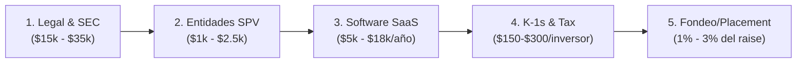

# Market Research: Costos Reales del Proceso de Sindicación Inmobiliaria & Benchmark de Plataformas

> [!NOTE] Propósito del Documento
> Investigación de mercado exhaustiva sobre los **costos reales y tarifas** que asume un promotor o desarrollador inmobiliario (Sponsor / GP) para sindicar capital en Estados Unidos, junto con un **benchmark comparativo de tarifas y plataformas** (software de gestión de inversionistas, marketplaces de capital y plataformas de tokenización digital), con enlaces y fuentes verificables a blogs legales y páginas comerciales.

---

## 🧭 Índice
1. [Resumen Ejecutivo & El Problema del Costo Analógico](#1-resumen-ejecutivo--el-problema-del-costo-analógico)
2. [Desglose Exhaustivo de Costos: ¿Cuánto Cuesta Sindicar un Proyecto?](#2-desglose-exhaustivo-de-costos-cuánto-cuesta-sindicar-un-proyecto)
   - 2.1. Honorarios Legales y Regulatorios SEC (PPM, Form D, Blue Sky)
   - 2.2. Constitución de Entidades Societarias (Dual-Entity LLCs)
   - 2.3. Contabilidad, Impuestos y Emisión Anual de Schedule K-1s
   - 2.4. Plataformas y Software de Sindicación (SaaS Investor Portals)
   - 2.5. Marketplaces de Fondeo & Broker-Dealer Placement Fees
3. [Presupuesto Total All-In de un Deal Tradicional ($2M - $5M USD)](#3-presupuesto-total-all-in-de-un-deal-tradicional-2m---5m-usd)
4. [Benchmark de Plataformas de Sindicación (Tarifas & Enlaces)](#4-benchmark-de-plataformas-de-sindicación-tarifas--enlaces)
   - 4.1. Software de Gestión de Inversionistas & Portales B2B (SaaS)
   - 4.2. Marketplaces de Sindicación y Fondeo de Capital
   - 4.3. Plataformas de Sindicación Digital y Tokenización RWA
5. [Matriz Comparativa Global frente a BRIDS.io](#5-matriz-comparativa-global-frente-a-bridsio)
6. [Directorio de Fuentes y Enlaces Verificables](#6-directorio-de-fuentes-y-enlaces-verificables)

---

## 1. Resumen Ejecutivo & El Problema del Costo Analógico

La sindicación inmobiliaria tradicional en EE.UU. (agrupación de capital privado para adquirir o desarrollar un inmueble bajo exenciones de la SEC como Regulation D 506(b) o 506(c)) presenta una **barrera de fricción y costos fijos prohibitivos**. 

Para estructurar un levantamiento típico de capital de entre **$1,000,000 y $5,000,000 USD**, un promotor (Sponsor / General Partner) debe desembolsar entre **$30,000 y $75,000 USD en costos de arranque** antes de recibir un solo dólar de los inversionistas, sumado a **$15,000 a $45,000 USD anuales en costos operativos** (principalmente software y preparación de K-1s fiscales).

Esta estructura de costos analógica es la causa raíz por la cual los desarrolladores fijan tickets mínimos de entrada elevados ($25,000 a $100,000 USD por cheque): gestionar a un inversor minorista con los sistemas tradicionales cuesta más de lo que rinde su capital.

---

## 2. Desglose Exhaustivo de Costos: ¿Cuánto Cuesta Sindicar un Proyecto?

El proceso de sindicación inmobiliaria comprende cinco rubros de costo esenciales:

### 2.1. Honorarios Legales y Regulatorios SEC
Constituye el rubro más costoso y crítico del proceso. Los documentos deben cumplir taxativamente con la *Securities Act of 1933*:

* **Private Placement Memorandum (PPM):** Documento de divulgación de riesgos de 60 a 120 páginas.
  * **Costo típico en firmas boutique especializadas:** **$10,000 a $25,000 USD** (flat-fee).
  * **Costo en firmas corporativas ("BigLaw"):** **$35,000 a $60,000+ USD** (facturación por hora a $450–$1,000/hr).
* **Documentos Operativos y de Suscripción:**
  * Operating Agreement (Acuerdo Operativo de la LLC del SPV que detalla el *waterfall*, comisiones y derechos de voto).
  * Subscription Agreement (Contrato de suscripción de cuotas sociales).
  * Investor Questionnaire (Cuestionario de verificación de acreditación bajo Reg D).
  * *Por lo general, estos documentos se cotizan dentro del paquete legal integral junto al PPM.*
* **Filing de Form D ante la SEC:** Notificación obligatoria dentro de los 15 días posteriores a la primera venta de participaciones. No tiene tarifa fiscal federal de la SEC, pero los honorarios del abogado por preparación y presentación oscilan entre **$500 y $1,500 USD**.
* **Blue Sky Filings (Notificaciones Estatales de Valores):** Cada estado donde reside un inversionista exige su propia notificación y tarifa de registro.
  * **Tarifas estatales:** Varían desde $100 (estados pequeños) hasta $1,200+ (ej. California cobra $300, Nueva York hasta $1,200).
  * **Honorarios de gestión legal:** $250 a $500 USD por estado.
  * **Total estimado para 8-12 estados:** **$3,500 a $9,000 USD**.
* **Fuentes Legales de Referencia:**
  * [Moschetti Law Group - Real Estate Syndication Legal Fees](https://moschettilaw.com/syndication-attorney-fees/)
  * [Syndication Attorneys PLLC - Legal Document Costs & Reimbursements](https://syndicationattorneys.com/how-much-do-real-estate-syndication-attorneys-charge/)
  * [Crowdfunding Lawyers - Regulation D 506(b) vs 506(c) Pricing](https://crowdfundinglawyers.net/regulation-d-offerings/)

### 2.2. Constitución de Entidades Societarias (Dual-Entity Structure)
La estructura estándar de la industria exige dos entidades independientes para aislar la responsabilidad patrimonial:
1. **Issuer LLC / SPV:** Dueña del activo físico en el estado donde se ubica el inmueble (o Delaware/Wyoming).
2. **Manager LLC:** Entidad del sponsor que administra el proyecto y cobra las comisiones de gestión.
* **Costo de constitución y tasas estatales:** **$1,000 a $2,500 USD** (incluye Registered Agent y tramitación de EIN con el IRS).

### 2.3. Contabilidad, Impuestos y Emisión Anual de Schedule K-1s
Al estructurarse como entidades de paso fiscal (*pass-through partnerships*), cada socio debe recibir un Formulario Schedule K-1 anual con su desglose de depreciación, ingresos y deducciones:
* **Costo por inversionista:** **$150 a $300 USD por cada K-1 generado anualmente**.
  * Un proyecto con **20 inversionistas**: $3,000 a $6,000 USD/año.
  * Un proyecto con **50 inversionistas**: **$7,500 a $15,000 USD/año**.
  * Si un proyecto abriera la puerta a 200 micro-inversionistas analógicos, el costo de K-1s alcanzaría los **$30,000 a $60,000 USD anuales**, volviéndolo inviable.
* **Preparación del Form 1065 (Declaración de impuestos de la sociedad):** **$2,500 a $5,000 USD anuales**.
* **Fuentes de Referencia:**
  * [Angel Investors Network - Cost Breakdown of Real Estate Syndication](https://angelinvestorsnetwork.com/real-estate-syndication-costs/)
  * [EisnerAmper - Tax and Accounting Treatment of Syndication Costs](https://www.eisneramper.com/insights/real-estate/real-estate-syndication-costs-0521/)
  * [BAM Capital - The Reality of K-1 Tax Reporting in Real Estate Funds](https://bamcapital.com/understanding-k1s-in-real-estate/)

### 2.4. Plataformas y Software de Sindicación (SaaS Investor Portals)
El sponsor requiere software para gestionar el pipeline, alojar el data room, firmar electrónicamente mediante DocuSign y automatizar la dispersión de dividendos:
* **Tarifa de Setup / Onboarding:** **$1,000 a $5,000 USD**.
* **Suscripción de Software (Mid-Market):** **$400 a $1,500 USD al mes** ($5,000 a $18,000 USD/año) para firmas gestionando hasta $50M en equity (InvestNext, SyndicationPro, Agora).
* **Suscripción Enterprise (Grandes Fondos):** **$18,000 a $100,000+ USD al año** (Juniper Square).
* **Costos por transacción y acreditación:**
  * Verificación de acreditación (506(c)): $50 a $80 USD por inversionista verificado.
  * Dispersión bancaria ACH: $0.25 a $0.50 por pago (o planes fijos de $50/mes).

### 2.5. Marketplaces de Fondeo & Broker-Dealer Placement Fees
Si el desarrollador no tiene su propia base de inversionistas y decide listar el proyecto en un marketplace de sindicación digital (como CrowdStreet o EquityMultiple):
* **Placement Fee / Success Fee:** **1.0% a 3.0% del capital levantado** (ej. $30,000 a $90,000 USD para un levantamiento de $3,000,000 USD).
* **Due Diligence & Posting Fee:** **$5,000 a $15,000 USD** no reembolsables para auditoría previa antes de publicar la oferta.
* **Fuente:**
  * [CrowdStreet Sponsor Fee Structures & Real Estate Platform Analysis](https://www.crowdstreet.com/sponsors/)

---

## 3. Presupuesto Total All-In de un Deal Tradicional ($2M - $5M USD)

A continuación se resume el gasto financiero que debe afrontar un desarrollador para sindicar un proyecto mediano bajo Regulation D:

| Concepto de Gasto | Costo Inicial (Upfront) | Costo Operativo Anual | Comentarios Clave |
| :--- | :---: | :---: | :--- |
| **Abogado de Valores (PPM, OA, Subscription)** | $15,000 – $30,000 | — | Paquete flat-fee con firma especializada. |
| **Blue Sky Filings (SEC + 8-10 estados)** | $4,000 – $8,000 | — | Varía según la residencia de los LPs. |
| **Constitución Societaria (Issuer + Manager LLCs)** | $1,500 – $2,500 | $600 – $1,200 | Registered agent e informes anuales en Delaware. |
| **Software de Sindicación (Investor Portal SaaS)** | $1,500 – $3,000 | $6,000 – $14,000 | Típicamente $500–$1,000/mes (InvestNext / Agora). |
| **Verificación de Inversores Acreditados (506c)** | $1,500 – $3,000 | — | ~30-50 LPs a $59/verificación. |
| **Contabilidad y K-1s Anuales (35 LPs)** | — | $7,000 – $12,000 | $200 por K-1 + Form 1065 anual. |
| **TOTAL TÍPICO DE ARRANQUE (Sin Marketplace)** | **$23,500 – $46,500 USD** | **$13,600 – $27,200 USD/año** | Gasto directo absorbido por el sponsor o el SPV. |
| **Si se usa Marketplace (CrowdStreet / Placement)** | **+$30,000 – $90,000 USD** | — | 1% a 3% adicional del capital levantado. |

---

## 4. Benchmark de Plataformas de Sindicación (Tarifas & Enlaces)

### 4.1. Software de Gestión de Inversionistas & Portales B2B (SaaS)

#### 1. InvestNext
* **Sitio Web Oficial:** [https://investnext.com](https://investnext.com)
* **Perfil de Usuario:** Sponsors medianos, fondos de sindicación emergentes ($5M a $100M AUM).
* **Estructura de Tarifas Verificada:**
  * **Core Tier:** Comienza en **$499 USD/mes** (contrato anual obligatorio de 12 meses) para firmas con menos de $10M en equity.
  * **Firm Tier:** Comienza en **$699 USD/mes** para carteras entre $10M y $500M en equity.
  * **Institution Tier:** Precios personalizados bajo cotización directa.
  * **Fundraising Starter:** Plan reducido de entrada reportado en **$99 USD/mes** tras el período de prueba.
  * **Tarifas de Procesamiento ACH:** 0.03% + $0.25 por transacción (tope máximo de $25 por giro).
* **Referencias y Reviews:**
  * [InvestNext Pricing on G2](https://www.g2.com/products/investnext/pricing)
  * [MotionCRE - InvestNext Platform Pricing Breakdown](https://motioncre.com/investnext-review/)

#### 2. SyndicationPro
* **Sitio Web Oficial:** [https://syndicationpro.com](https://syndicationpro.com)
* **Perfil de Usuario:** Sindicadores de real estate independientes y General Partners.
* **Estructura de Tarifas Verificada:**
  * **Modelo de Precios:** Escalonado según *Equity Under Management* (EUM), usualmente en el rango de **$400 a $600 USD/mes** para operadores medianos.
  * **Módulo de Acreditación (506c):** Cobro de **$500 USD de setup inicial** + **$59 USD por inversionista verificado**.
  * **Distribuciones ACH Automatizadas:** Add-on de **$50 USD/mes** para dispersiones ilimitadas.
  * **Costos por transacción:** $0.49 por wire bancario; $5.00 por emisión y envío postal de cheque físico.
* **Referencias:**
  * [SyndicationPro Pricing & Feature Matrix](https://syndicationpro.com/pricing/)
  * [Software Advice - SyndicationPro Cost Profile](https://www.softwareadvice.com/real-estate/syndicationpro-profile/)

#### 3. Juniper Square
* **Sitio Web Oficial:** [https://junipersquare.com](https://junipersquare.com)
* **Perfil de Usuario:** El líder enterprise institucional para grandes gestores inmobiliarios, fondos institucionales y REITs.
* **Estructura de Tarifas Verificada:**
  * **Modelo:** 100% bajo cotización privada (*quote-based*), contratos plurianuales.
  * **Tarifa de Entrada:** Estimada por el mercado en un piso de **$18,000 USD anuales** para configuraciones básicas (equivalente a $1,500/mes).
  * **Rango Enterprise / Institucional:** Escala típicamente de **$30,000 a más de $100,000 USD al año** según los activos bajo administración (AUM), número de entidades SPV y cantidad de cuentas de LPs.
  * **Tiempo de Onboarding:** 2 a 4 meses de implementación asistida con costos de setup técnico considerables.
* **Referencias:**
  * [Agora Real Estate - Juniper Square Pricing & Alternative Comparison](https://agorareal.com/blog/juniper-square-alternatives-pricing/)
  * [Pipeline Road - Juniper Square Review & Costs](https://pipelineroad.com/juniper-square-pricing-breakdown/)

#### 4. Agora Real Estate
* **Sitio Web Oficial:** [https://agorareal.com](https://agorareal.com)
* **Perfil de Usuario:** Desarrolladores inmobiliarios y gestores de inversión privada en EE.UU. e Israel.
* **Estructura de Tarifas Verificada:**
  * **Modelo:** Cotización a la medida según el número de inversionistas y AUM.
  * **Rango Estimado de Mercado:** **$200 a $800+ USD al mes** para el portal de inversionistas y data room.
  * **Servicios Integrados de Back-Office:** Cobro adicional por preparación y entrega directa de Formularios K-1 y administración contable de fondos.
* **Referencias:**
  * [Agora Investment Management Platform Overview](https://agorareal.com/platform/)
  * [GetApp - Agora Real Estate Reviews & Pricing](https://www.getapp.com/finance-accounting-software/a/agora/)

#### 5. Janover Connect (anteriormente Groundbreaker)
* **Sitio Web Oficial:** [https://janover.co](https://janover.co) / [https://groundbreaker.co](https://groundbreaker.co)
* **Perfil de Usuario:** Sindicadores pequeños y medianos que buscan sencillez operativa.
* **Estructura de Tarifas Verificada:**
  * Modelo basado en cotización según proyectos activos. Tarifas históricas de Groundbreaker oscilaban entre **$250 y $500 USD/mes** con módulos adicionales de firma digital.

---

### 4.2. Marketplaces de Sindicación y Fondeo de Capital

#### 1. CrowdStreet
* **Sitio Web Oficial:** [https://crowdstreet.com](https://crowdstreet.com)
* **Modelo para el Desarrollador (Sponsor):**
  * Para los inversionistas el acceso es gratuito, pero CrowdStreet cobra al sponsor:
  * **Listing & Success Fee:** Entre **1% y 3% del capital levantado** en la plataforma.
  * **Due Diligence Fee:** Tarifas de análisis técnico y financiero previas a la publicación ($5,000 a $15,000 USD).
  * **Filtro de Admisión:** Exigen que el sponsor tenga un track record comprobable de al menos $50M en transacciones históricas.
* **Referencias:**
  * [CrowdStreet Sponsor Portal](https://www.crowdstreet.com/sponsors/)
  * [The Real Estate Crowdfunding Review - CrowdStreet Fees](https://www.therealestatecrowdfundingreview.com/crowdstreet-review/)

#### 2. EquityMultiple
* **Sitio Web Oficial:** [https://equitymultiple.com](https://equitymultiple.com)
* **Modelo para el Desarrollador:**
  * Estructura basada en comisiones de originación (1% a 2% del monto fondeado) y porcentaje de participación (*carried interest* o promote) sobre los rendimientos excedentes del proyecto.

---

### 4.3. Plataformas de Sindicación Digital y Tokenización RWA

#### 1. DigiShares (Dinamarca / EE.UU.)
* **Sitio Web Oficial:** [https://digishares.io](https://digishares.io)
* **Perfil de Usuario:** Proveedor SaaS de software de tokenización white-label para Real Estate e infraestructura.
* **Estructura de Tarifas Verificada (Página Oficial):**
  * **Plan Launch:** **€5,000 EUR de Setup Fee** (pago único) + **€300 EUR/mes**. Incluye 2 proyectos y 50 verificaciones KYC.
  * **Plan Standard (White-Label completo):** **€35,000 EUR de Setup Fee** + **€950 EUR/mes**. Dashboards personalizables, pasarelas de pago y firma electrónica.
  * **Plan Advanced (Enterprise):** Desde **€50,000+ EUR de Setup Fee** + **€1,500 EUR/mes**. Acceso a API completa y aplicaciones móviles.
  * **Proyectos Adicionales:** €60 a €200 EUR/mes por cada inmueble adicional.
* **Referencias:**
  * [DigiShares Official Pricing](https://digishares.io/pricing)
  * [The Wealth Mosaic - DigiShares Solution Overview](https://www.thewealthmosaic.com/vendors/digishares/)

#### 2. Blocksquare (Eslovenia / Global)
* **Sitio Web Oficial:** [https://blocksquare.io](https://blocksquare.io)
* **Perfil de Usuario:** Infraestructura Web3 sobre Ethereum / Polygon para portales de inversión de agencias inmobiliarias.
* **Estructura de Tarifas Verificada:**
  * **Pay-per-use por Tokenización:** **$5,990 USD** por cada propiedad u oferta primaria tokenizada.
  * **Mantenimiento Mensual:** **$69 USD/mes por propiedad activa** en el sistema.
  * **Licencia de Software:** Requiere adquirir y bloquear tokens BST (Blocksquare Token) para acceder a descuentos en licencias tecnológicas.
* **Referencias:**
  * [Blocksquare Docs & Pricing Model](https://docs.blocksquare.io/)
  * [Chainwire - Blocksquare Tokenization Infrastructure](https://chainwire.org/2023/11/15/blocksquare-announces-real-estate-tokenization-framework/)

---

## 5. Matriz Comparativa Global frente a BRIDS.io

| Dimensión de Análisis | Sindicación Analógica Tradicional | SaaS Tradicional (InvestNext / Juniper Square) | Tokenización EVM (DigiShares / Blocksquare) | **BRIDS.io (Infraestructura Solana RWA)** |
| :--- | :---: | :---: | :---: | :---: |
| **Costo Inicial de Setup** | $25,000 – $60,000 USD (Legal + SPV) | $1,500 – $15,000 USD (+ Legal externo) | €5,000 a €35,000 EUR (Solo software) | **$1,000 – $2,500 USD** (Setup técnico y parametrización por SPV) |
| **Costo Recurrente Mensual** | $1,200 – $3,000 USD (K-1s prorrateados) | $499 – $1,500+ USD/mes ($18k/año Juniper) | €300 a €1,500 EUR/mes + $69/propiedad | **$0 suscripción mensual obligatoria** (Modelo puro por evento/volumen) |
| **Comisión por Fracción / Transacción** | N/A | Variable (0.03% ACH o $0.49/wire) | Fees de gas EVM ($5–$30 por tx) | **Tarifa fija de $4 USD por fracción de $200 USD** (Blindaje non-broker-dealer) |
| **Dispersión de Dividendos** | Manual vía cheque o ACH bancario ($5/cheque) | Automatizada ACH ($50/mes + transferencias) | On-chain EVM (Gas prohibitivo para micro-pagos) | **Bóvedas Squads v4 en Solana:** Costo gas sub-centavo (<$0.001) |
| **Ticket Mínimo por Inversionista** | $25,000 – $50,000 USD | $5,000 – $25,000 USD | $500 – $5,000 USD | **$200 USD** (Completamente retail) |
| **Pérdida de Claves Privadas** | No aplica | No aplica (Login Web2 tradicional) | Pérdida total e irreversible del activo | **Protocolo Asistido:** Stripe Identity + SPV Master File + Metaplex Core |
| **Riesgo Regulatorio Broker-Dealer** | Nulo si el GP emite directo | Nulo (Solo proveedor de software) | Alto si cobran porcentajes sobre el capital | **Nulo:** Facturación fija de software ($4 USD/unidad), Delaware C-Corp pura |

---

## 6. Directorio de Fuentes y Enlaces Verificables

### Firmas Legales y Blogs Especializados en Sindicación
1. **Moschetti Law Group:** Artículos sobre costos de abogados de sindicación, honorarios de PPM y estructuras Reg D.  
   🔗 [https://moschettilaw.com/syndication-attorney-fees/](https://moschettilaw.com/syndication-attorney-fees/)
2. **Syndication Attorneys PLLC:** Desglose de contratos societarios, tarifas de PPM y reembolso de gastos al sponsor.  
   🔗 [https://syndicationattorneys.com](https://syndicationattorneys.com)
3. **Crowdfunding Lawyers (Jillian Sidoti):** Comparativa de costos de estructuración bajo Reg D 506(b), 506(c) y Reg CF.  
   🔗 [https://crowdfundinglawyers.net](https://crowdfundinglawyers.net)
4. **Angel Investors Network:** Auditoría de costos operativos, K-1s anuales y tecnología de data room.  
   🔗 [https://angelinvestorsnetwork.com/real-estate-syndication-costs/](https://angelinvestorsnetwork.com/real-estate-syndication-costs/)
5. **EisnerAmper:** Tratamiento contable y fiscal (IRS) de los costos organizacionales y de sindicación.  
   🔗 [https://www.eisneramper.com](https://www.eisneramper.com)

### Plataformas de Software & Portales (Pricing Oficial & Reviews)
6. **InvestNext:** Página principal y análisis de planes Core ($499/mes) y Firm ($699/mes).  
   🔗 [https://investnext.com](https://investnext.com) | [MotionCRE Review](https://motioncre.com/investnext-review/)
7. **SyndicationPro:** Información de acreditación ($59/inv), módulo ACH ($50/mes) y cotización por EUM.  
   🔗 [https://syndicationpro.com](https://syndicationpro.com)
8. **Juniper Square:** Información de producto institucional para GPs y estimaciones de mercado ($18k-$100k+/año).  
   🔗 [https://junipersquare.com](https://junipersquare.com) | [Agora Comparison](https://agorareal.com/blog/juniper-square-alternatives-pricing/)
9. **Agora Real Estate:** Portales de inversión y servicios de back-office / K-1s.  
   🔗 [https://agorareal.com](https://agorareal.com)
10. **CrowdStreet:** Portal para sponsors y modelo de tarifas de marketplace (1% - 3%).  
    🔗 [https://www.crowdstreet.com/sponsors/](https://www.crowdstreet.com/sponsors/)

### Plataformas de Tokenización Digital (Web3 RWA)
11. **DigiShares:** Lista de precios oficiales para soluciones white-label (Launch €5k setup / Standard €35k setup).  
    🔗 [https://digishares.io/pricing](https://digishares.io/pricing)
12. **Blocksquare:** Documentación técnica, modelo de pay-per-use ($5,990 USD/oferta) y mantenimiento ($69/mes).  
    🔗 [https://blocksquare.io](https://blocksquare.io) | [Docs Blocksquare](https://docs.blocksquare.io/)
