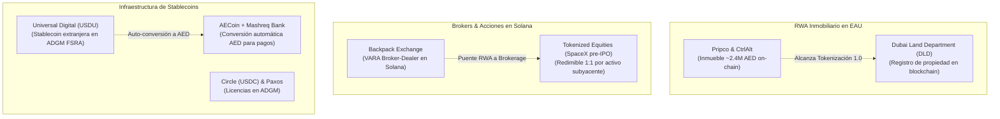
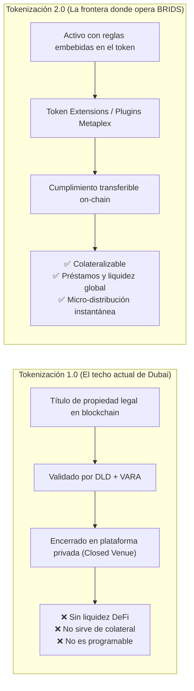

# Investigación de Mercado: Tokenización en Dubai, Regulación EAU y Ventaja de Solana

> [!NOTE] Resumen Ejecutivo de Inteligencia
> Este documento captura, cataloga y analiza los hallazgos del episodio de *Solana is Global* con **Harshil Agarwal** (Socio en TLP Advisors, ex-regulador en EAU). Analiza la realidad operativa de la tokenización inmobiliaria en Dubai, el mapa de los 5 reguladores de activos virtuales en los Emiratos Árabes Unidos, el régimen ARVA de VARA, y la ventaja estructural de **Solana (Token Extensions / Plugins)** para trasladar el cumplimiento normativo desde las plataformas cerradas hacia el propio activo digital (*asset-level programmable compliance*). Constituye material de benchmark competitivo de primer orden para la estrategia RWA y de expansión internacional de **BRIDS.io**.

---

## 📌 Índice de Contenidos
1. [Metadatos de la Fuente & Ficha Técnica](#1-metadatos-de-la-fuente--ficha-técnica)
2. [Radar de Productos y Proyectos RWA Identificados](#2-radar-de-productos-y-proyectos-rwa-identificados)
3. [Mapa de los 5 Reguladores de Cripto y Activos Virtuales en EAU](#3-mapa-de-los-5-reguladores-de-cripto-y-activos-virtuales-en-eau)
4. [Tesis Central: Tokenización 1.0 vs. Tokenización 2.0](#4-tesis-central-tokenización-10-vs-tokenización-20)
5. [Tokenización de Título de Propiedad vs. Tokenización Financiera (Bundle of Rights)](#5-tokenización-de-título-de-propiedad-vs-tokenización-financiera-bundle-of-rights)
6. [La Ventaja de Solana: Cumplimiento Programable en el Token](#6-la-ventaja-de-solana-cumplimiento-programable-en-el-token)
7. [Arquitectura de Stablecoins en EAU: Rieles AED vs. Dólar](#7-arquitectura-de-stablecoins-en-eau-rieles-aed-vs-dólar)
8. [Implicaciones Estratégicas y Oportunidades para BRIDS.io](#8-implicaciones-estratégicas-y-oportunidades-para-bridsio)
9. [Transcripción Relevante por Ejes Temáticos](#9-transcripción-relevante-por-ejes-temáticos)

---

## 1. Metadatos de la Fuente & Ficha Técnica

| Parámetro | Detalle |
| :--- | :--- |
| **Programa / Podcast** | *Solana is Global* |
| **Host** | Alex Scott |
| **Invitado** | Harshil Agarwal (Socio en TLP Advisors; redactó marcos regulatorios desde el sector público y ahora asesora proyectos institucionales) |
| **Episodio** | *The Future of Stablecoins in the UAE - TLP Advisors* |
| **Fecha de Publicación** | 25 de Agosto de 2026 |
| **Enlace Oficial** | [Apple Podcasts Link](https://podcasts.apple.com/co/podcast/the-future-of-stablecoins-in-the-uae-tlp-advisors/id1842084762?i=1000785783585&l=en-GB&r=30.36) |
| **Ejes Temáticos** | Tokenización RWA, Real Estate On-Chain, VARA, ADGM, CBUAE, Stablecoins AED/USD, Remesas, Token Extensions en Solana |

---

## 2. Radar de Productos y Proyectos RWA Identificados

### Fichas Técnicas de Productos Mencionados:

#### A. Pripco & CtrlAlt (ControlAlt)
* **Categoría:** Tokenización inmobiliaria residencial (RWA Inmobiliario).
* **Activo Piloto:** Propiedad residencial valuada en ~2.4 a 2.5 millones de AED (~$650,000 USD).
* **Autoridades involucradas:** Dubai Land Department (DLD), Virtual Assets Regulatory Authority (VARA), Central Bank of the UAE (CBUAE).
* **Alcance Actual (Tokenización 1.0):** Reconocimiento legal del título y verificación de propiedad on-chain bajo licencia de emisión de VARA.
* **Limitación / Cuello de Botella:** Mercado secundario confinado a entornos cerrados (*closed venues*). El activo no puede moverse a protocolos DeFi abiertos, ni utilizarse como colateral para préstamos (*lending/borrowing*).

#### B. Backpack (Solana Broker-Dealer)
* **Categoría:** Exchange y Broker-Dealer licenciado por VARA en la red de Solana.
* **Hito de Mercado:** Negociación de acciones privadas tokenizadas (e.g. acciones pre-IPO de SpaceX y otras equities) operables en Solana horas después de anuncios de colocación.
* **Mecánica de Redención:** Permite redimir la versión tokenizada en Solana directamente por el valor subyacente (*underlying security*) para negociarlo en cuentas de corretaje tradicionales. Demuestra el puente operativo entre activos tokenizados en Solana y mercados financieros tradicionales.

#### C. Universal Digital (USDU)
* **Categoría:** Stablecoin extranjera emitida en EAU.
* **Marco Regulatorio:** Licenciada por ADGM (FSRA) como la primera stablecoin denominada en moneda extranjera, con registro ante el CBUAE bajo el reglamento de *Payment Tokens*.

#### D. AECoin + Mashreq Bank
* **Categoría:** Rieles de pago y conversión automática de stablecoins en EAU.
* **Mecánica:** Alianza entre Mashreq Bank, AECoin y USDU que permite traer stablecoins denominadas en USD (USDU/USDC/USDT) y convertirlas automáticamente en tokens AED para cumplir con la ley de pagos locales de bienes y servicios.

#### E. Circle (USDC) & Paxos
* **Categoría:** Emisores institucionales de stablecoins.
* **Actividad:** Operaciones y permisos de emisión tramitados en la zona franca financiera de Abu Dhabi (ADGM - FSRA).

---

## 3. Mapa de los 5 Reguladores de Cripto y Activos Virtuales en EAU

Harshil Agarwal clarifica una de las mayores complejidades para empresas que ingresan al Golfo: la existencia de **cinco autoridades regulatorias** con competencias divididas:

| Regulador | Ámbito Jurisdiccional | Competencia Principal | Regulación Clave |
| :--- | :--- | :--- | :--- |
| **1. CBUAE** *(Central Bank of the UAE)* | Federal (Nacional) | Stablecoins, pagos minoristas, remesas, transferencias fiduciarias. | *Payment Token Regulations*; Licencias de Stored Value Facility (SVF). |
| **2. SCMA / CMA** *(Securities and Capital Markets Authority)* | Federal (Nacional) | Renta variable, derivados, Sukuk islámicos, bonos y activos financieros virtuales. | Resoluciones de Gabinete 111 y 112 (delegación en VARA). |
| **3. VARA** *(Virtual Asset Regulatory Authority)* | Dubai (Emirato) | Primer regulador dedicado exclusivamente a criptoactivos en el mundo. | *ARVA Regime* (Asset Reference Virtual Assets - Licencia de Emisión Cat. 1). |
| **4. FSRA / ADGM** *(Abu Dhabi Global Market)* | Zona Franca Financiera (Abu Dhabi) | Regulación basada en Common Law inglés, independiente del derecho federal civil. | Emisión de stablecoins internacionales (Circle, Paxos, USDU). |
| **5. DFSA / DIFC** *(Dubai International Financial Centre)* | Zona Franca Financiera (Dubai) | Centro financiero institucional off-shore bajo derecho consuetudinario. | Régimen propio de tokens de inversión y activos virtuales financieros. |

> [!WARNING] El Reto de la Doble Regulación en EAU
> Cualquier empresa que opere en Dubai bajo licencia de VARA para stablecoins o pagos necesita obtener adicionalmente un registro de **no-objeción (NOC)** del CBUAE. De igual forma, una entidad en ADGM que emita stablecoins en moneda extranjera requiere registro federal ante el CBUAE para pagos. Esto eleva los costos de cumplimiento y ralentiza el *time-to-market* a firmas con balances muy capitalizados.

---

## 4. Tesis Central: Tokenización 1.0 vs. Tokenización 2.0

Harshil Agarwal plantea una crítica de fondo a la narrativa triunfalista de Dubai:

* **Tokenización 1.0 (Logro de Dubai):** Logró la **validez jurídica** del título on-chain. El regulador y el catastro reconocen que el token representa la propiedad. Sin embargo, el token muere ahí: el usuario lo compra y lo guarda en una plataforma permisionada cerrada. No puede moverlo a mercados descentralizados, no puede pedir un préstamo contra él, ni usarlo como colateral.
* **Tokenización 2.0 (El mandato pendiente):** Los activos RWA deben comportarse como **instrumentos financieros programables**. Para que haya verdadera accesibilidad y eficiencia de capital, el activo debe ser interoperable y transferible entre sedes centralizadas y descentralizadas de manera segura.

---

## 5. Tokenización de Título de Propiedad vs. Tokenización Financiera (Bundle of Rights)

Uno de los aportes conceptuales más valiosos de la entrevista es la distinción jurídica entre dos tipos de tokenización inmobiliaria:

### A. Tokenizar el Título de Propiedad (*Title Deed Tokenization*)
* Representa el documento estático que acredita que una persona es dueña del ladrillo.
* En el mundo físico, los títulos no se transfieren cada semana; están sujetos a notarías y registros públicos.

### B. Tokenizar los Derechos Financieros y Rentas (*Financial Asset Tokenization*)
* En el derecho civil y anglosajón, la propiedad inmobiliaria no es una sola cosa: es un **haz de derechos (*bundle of rights*)**:
  1. *Derecho de propiedad directa (Ownership rights).*
  2. *Derecho de disfrute y beneficios (Beneficial rights).*
  3. *Derecho contractual sobre flujos de caja y rentas (Rental yield rights).*
  4. *Derecho a colateralizar / apalancar (Collateral & hypothecation rights).*
* El régimen **ARVA (Asset Reference Virtual Asset - Categoría 1)** de VARA permite desglosar estos derechos. El piloto del Dubai Land Department se enfocó en **derechos contractuales de rendimiento**: una administradora recauda el alquiler del inquilino y lo dispersa programáticamente a los tenedores del token.

---

## 6. La Ventaja de Solana: Cumplimiento Programable en el Token

Agarwal expone por qué la comparación clásica de blockchains por *"throughput de transacciones"* o *"volumen histórico"* es obsoleta para RWA institucional:

> *"La pregunta correcta no es qué blockchain tiene más activos tokenizados hoy, sino qué arquitectura permite que los activos regulados se conviertan en instrumentos financieros programables."*

### Por qué el modelo tradicional de cumplimiento es insostenible:
* En los sistemas tradicionales (y en Ethereum clásico), el cumplimiento recae enteramente en la **plataforma o exchange (*venue-level compliance*)**: la plataforma debe verificar quién entra, qué billeteras están en lista blanca y congelar cuentas manualmente.
* **El problema:** Cada vez que el activo se transfiere a otra plataforma, todo el proceso de cumplimiento debe replicarse desde cero, encareciendo y fragmentando la liquidez.

### La solución de Solana: Token Extensions & Plugins de Metaplex Core (*Asset-Level Compliance*):
* Solana permite que las reglas de cumplimiento formen parte de las **propiedades nativas del token**:
  * **Restricciones de transferencia (*Transfer Restrictions*):** El token solo se liquida si ambas partes cumplen criterios de whitelisting.
  * **Filtros de sanciones (*Sanction Filtering*):** Bloqueo automático de direcciones sancionadas.
  * **Autoridad de congelamiento y rescate (*Freeze & Authority Hooks*):** Permite al emisor congelar, pausar derechos o quemar/reemitir activos ante vulneraciones.
  * **Transferencias confidenciales (*Confidential Transfers*):** Oculta importes para cumplimiento institucional sin perder auditabilidad.
* **Conclusión regulatoria:** La tecnología no reemplaza la ley ni las licencias; hace que los activos sean más inteligentes y compartan la carga de ejecución de las reglas estatutarias.

---

## 7. Arquitectura de Stablecoins en EAU: Rieles AED vs. Dólar

El marco del CBUAE establece una clara bifurcación de rieles:

1. **Riel AED para Pagos Locales:** Toda compra de bienes o servicios dentro del territorio de los EAU (incluyendo honorarios profesionales y pagos comerciales) debe liquidarse en stablecoins respaldadas en dirhams (AED).
2. **Exención para el Riel USD en Trading y Mercados:** El Banco Central otorgó una exención expresa a stablecoins en dólares (USDT, USDC): pueden utilizarse libremente como pares de negociación y liquidación en exchanges de cripto y derivados.
3. **Mecanismo de Conversión Automática:** Modelos como el de Universal Digital + Mashreq Bank permiten que inversores globales ingresen con dólares digitales (USDC/USDU), los cuales se convierten de forma transparente a moneda local para interactuar con la economía real.

---

## 8. Implicaciones Estratégicas y Oportunidades para BRIDS.io

| Insight de Mercado en EAU | Situación en BRIDS.io | Ventaja Competitiva de BRIDS |
| :--- | :--- | :--- |
| **Tokenización 1.0 estancada:** Pripco y DLD tienen activos encerrados sin liquidez ni DeFi. | BRIDS utiliza Metaplex Core en Solana con arquitectura orientada a composabilidad secundaria y dispersión en USDC. | **Superamos Tokenización 1.0:** Conectamos el registro legal con liquidación de micro-dividendos en tiempo real. |
| **El dolor de la pérdida de claves:** El regulador teme que un hackeo deje al inversor sin propiedad. | BRIDS diseñó el **Protocolo de Recuperación** con Stripe Identity + Freeze/Authority Plugin. | **Respaldo legal directo:** La propiedad emana del *Master Securityholder File* del Delaware SPV; no dejamos a nadie desamparado por perder su clave. |
| **Costos regulatorios exorbitantes en EAU:** 5 reguladores, licencias SVF lentas y requisitos de capital masivos. | BRIDS opera bajo **Delaware C-Corp (Software SaaS)** + Delaware SPV (Series LLC) por propiedad bajo Reg D 506(c) / Reg S. | **Velocidad y eficiencia de capital:** Estructura dual-entity que evita licencias bancarias pesadas sin eludir el cumplimiento normativo. |
| **Validación de Solana para RWA institucional:** EAU valida que las Token Extensions de Solana son el estándar superior para *asset-level compliance*. | BRIDS escogió Solana y Metaplex Core precisamente por esta arquitectura de cuenta única y plugins de autoridad. | **Validación de terceros de primer nivel:** Corrobora la tesis fundacional de BRIDS ante VCs de que Solana es la red definitiva para RWA regulado. |
| **Atracción de Capital del Golfo (LPs de EAU hacia Real Estate en EE.UU.):** Inversores de Oriente Medio buscan dolarizar capital en inmuebles estadounidenses estructurados. | BRIDS permite participación desde $200 USD en bienes raíces de EE.UU. con onboarding KYC global vía Stripe Identity. | **Corredor de inversión natural:** Captar capital retail e institucional en EAU para fondear inmuebles en EE.UU. vía USDC en Solana. |

---

## 9. Citas Textuales Clave para Pitch Decks y Contenido (Ready-to-Cite)

### Cita 1: Sobre el límite de la Tokenización 1.0
> *"Dubai es el punto de referencia global de tokenización, pero debemos ser precisos en lo que realmente hemos logrado. Tenemos reconocimiento legal de activos en cadena respaldados por un marco normativo; ese es el logro de la Tokenización 1.0. Sin embargo, no tenemos proyectos donde estos activos puedan salir de sedes cerradas. Tu propiedad está confirmada, pero no puedes usarla: no puedes pedir prestado contra ella ni moverla a protocolos de préstamo globales. El propósito de emitir RWAs es que se comporten como instrumentos financieros programables."*  
> — **Harshil Agarwal**, Socio en TLP Advisors.

### Cita 2: Sobre la ventaja de Solana frente a otras blockchains
> *"Cuando los clientes eligen una blockchain, suelen hacer la pregunta equivocada: preguntan qué red tiene más volumen o más activos hoy. La pregunta crucial es: ¿cuál de estas blockchains tiene la arquitectura que permite a los activos regulados convertirse en instrumentos financieros programables? Con las Token Extensions en Solana, puedes incrustar funciones de cumplimiento dentro del propio token: restricciones de transferencia, sanciones y pausas de derechos por el emisor. En el futuro, los activos serán más inteligentes y llevarán los controles integrados en su código."*  
> — **Harshil Agarwal**, Socio en TLP Advisors.

### Cita 3: Sobre la tokenización del haz de derechos inmobiliarios (*Bundle of Rights*)
> *"En el marco legal, la propiedad es un haz de derechos: derechos de propiedad, derechos de usufructo o el derecho a recolectar rendimientos por alquiler. Tokenizar bienes raíces no se limita a poseer una porción del inmueble físico; permite desagregar estos derechos y vincular derechos de flujo de renta directamente al token."*  
> — **Harshil Agarwal**, Socio en TLP Advisors.

---

## Historial de Revisiones
- **v1.1 (2026-09-13):** Actualizar ticket mínimo de entrada retail a  USD

| Versión | Fecha | Autor / Agente | Resumen de Modificaciones |
| :--- | :--- | :--- | :--- |
| **1.0.0** | 2026-09-13 | `market-research-analyst` | Creación y categorización de inteligencia de mercado a partir de la entrevista a Harshil Agarwal (TLP Advisors / Solana is Global). |
