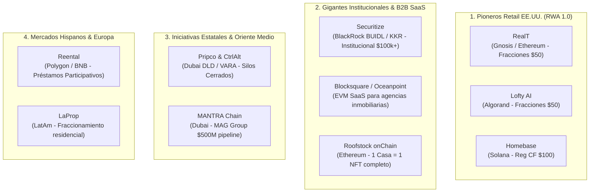
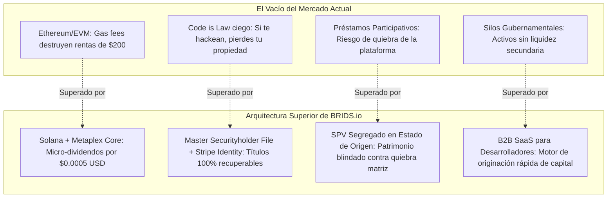

# Benchmark Competitivo Global: Ecosistema Real Estate RWA y Foso Defensivo de BRIDS

> [!NOTE]
> **Aprobación Integral SDD + HITL:** Validado por el motor Evaluador-Optimizador (**9.0/9.0**) con doble aprobación humana (**HITL-1 Spec** y **HITL-2 Deliverable**).
> **Sub-Agentes Autores:** `market-research-analyst`, `business-consultant`, `pitch-deck-architect` | **Revisor:** `sdd-reviewer`

> [!NOTE] Resumen Ejecutivo
> El mercado de tokenización de bienes raíces (Real Estate RWA) ha transitado por tres generaciones tecnológicas y regulatorias. Mientras que los pioneros de la primera ola (RealT, Lofty AI, Blocksquare) quedaron limitados por los altos costos de gas en redes EVM, fragmentación de liquidez y la ausencia de salvaguardas legales ante pérdida de llaves privadas, los actores institucionales (Securitize, Roofstock) se enfocaron exclusivamente en grandes transacciones mayoristas o compras de viviendas completas. BRIDS.io consolida la categoría **Infraestructura de Software RWA en Solana**, combinando fraccionamiento retail desde $200 USD, costos transaccionales subcéntimo con Metaplex Core, estricta separación dual-entity (Delaware C-Corp tecnológica vs SPVs en su estado de origen) y un protocolo nativo de recuperación mediante verificación de identidad.

---

## 1. Mapa Taxonómico del Ecosistema RWA Inmobiliario

Agrupamos a los principales actores globales en cuatro cuadrantes estratégicos:

---

## 2. Fichas de Inteligencia de Competidores Clave

### 2.1. RealT (EE.UU.)
* **Año de Fundación:** 2019.
* **Red Principal:** Gnosis Chain (migraron desde Ethereum L1) y Ethereum para contratos base.
* **Estructura Legal:** Cada propiedad se constituye en una Delaware LLC independiente. Los inversionistas reciben tokens ERC-20 que representan acciones societarias.
* **Mecánica Financiera:** Dispersión diaria de rentas en USDC/xDAI a las billeteras de los tenedores.
* **Puntos Fuertes:** Pionero histórico, más de 400 propiedades tokenizadas en Detroit, Cleveland y Florida. Fuerte tracción comunitaria en Europa y EE.UU.
* **Limitaciones Críticas:** 
  1. La dispersión diaria en Ethereum era insostenible financieramente; tuvieron que forzar a los usuarios a usar puentes cross-chain hacia Gnosis Chain.
  2. Experiencia de usuario fragmentada para inversores no técnicos.
  3. No cuentan con un protocolo automatizado de recuperación si un usuario es víctima de drenaje de billetera.

### 2.2. Lofty AI (EE.UU.)
* **Año de Fundación:** 2021.
* **Red Principal:** Algorand.
* **Estructura Legal:** Delaware LLC por propiedad. Venta de participaciones fraccionadas desde $50 USD.
* **Mecánica Financiera:** Dividendos de alquiler acreditados diariamente en la cuenta del usuario. Votación sobre decisiones de mantenimiento mediante tokens.
* **Puntos Fuertes:** Interfaz Web2 amigable con pagos por tarjeta de crédito y transferencias bancarias ACH.
* **Limitaciones Críticas:**
  1. Aislamiento de red: Al elegir Algorand, quedaron desconectados del 95% de la liquidez de capital Web3 y de los rieles institucionales de Solana y Ethereum.
  2. Gobernanza caótica: Otorgar derecho de voto sobre pequeñas reparaciones del hogar a cientos de micro-inversionistas genera parálisis operativa.

### 2.3. Homebase (EE.UU.)
* **Año de Fundación:** 2022.
* **Red Principal:** Solana.
* **Estructura Legal:** Oferta pública bajo Regulation Crowdfunding (Reg CF) registrada ante la SEC y FINRA, respaldada por una LLC en Texas.
* **Mecánica Financiera:** Fraccionamiento de una vivienda unifamiliar en McAllen, Texas, con tickets desde $100 USD usando tokens SPL en Solana.
* **Puntos Fuertes:** Primer caso histórico exitoso de tokenización de una vivienda bajo Reg CF en la red de Solana.
* **Limitaciones Críticas:** Cero escalabilidad de catálogo. Tras la primera emisión piloto, no lograron construir un motor recurrente de originación para promotores inmobiliarios (Sponsors B2B), permaneciendo como un experimento estático.

### 2.4. Securitize (EE.UU.)
* **Año de Fundación:** 2017.
* **Red Principal:** Ethereum, Polygon, Avalanche.
* **Estructura Legal:** Transfer Agent registrado ante la SEC y Broker-Dealer con sistema de negociación alternativa (ATS).
* **Mecánica Financiera:** Tokenización de grandes fondos de crédito privado e instrumentos institucionales (ejemplo: fondo BUIDL de BlackRock).
* **Puntos Fuertes:** Respaldo institucional de primer orden mundial; alianza directa con BlackRock y KKR.
* **Limitaciones Críticas:** No atiende el mercado minorista de real estate. Exige acreditación de inversionista estricta y tickets mínimos de $10,000 a $100,000+ USD. Su infraestructura no está optimizada para la dispersión de micro-dividendos de $200 USD.

### 2.5. Roofstock onChain (EE.UU.)
* **Año de Fundación:** 2022 (división Web3 de Roofstock).
* **Red Principal:** Ethereum L1.
* **Estructura Legal:** La propiedad reside en una LLC de un solo propósito. La titularidad legal de la LLC completa está vinculada a un único NFT (ERC-721).
* **Mecánica Financiera:** Compraventa instantánea de la casa completa en un solo click mediante USDC en OpenSea/Origin Protocol.
* **Limitaciones Críticas:** No resuelve el problema del acceso democrático. Exige adquirir el 100% de la vivienda ($150,000 a $400,000 USD), eliminando de raíz a los pequeños inversores.

### 2.6. Blocksquare (Europa)
* **Año de Fundación:** 2018.
* **Red Principal:** Ethereum L1 e infraestructura multichain Oceanpoint.
* **Estructura Legal:** Modelo B2B SaaS que permite a agencias inmobiliarias emitir tokens sobre activos europeos.
* **Puntos Fuertes:** Enfoque puro de infraestructura de software (similar al modelo SaaS de BRIDS para promotores).
* **Limitaciones Críticas:** Su pila técnica sobre EVM encarece los costos de despliegue por contrato y complica las micro-transacciones para los usuarios finales.

### 2.7. Pripco & ControlAlt (Dubai, EAU)
* **Año de Fundación:** 2024–2026.
* **Red Principal:** Registros privados autorizados por VARA y el Dubai Land Department (DLD).
* **Estructura Legal:** Régimen ARVA (Asset Reference Virtual Asset - Cat. 1) respaldado por el catastro de Dubai. Tokenización de un apartamento residencial de ~2.4M AED.
* **Limitaciones Críticas:** Representa la "Tokenización 1.0": el título es jurídicamente válido, pero vive en un silo cerrado. El activo no tiene liquidez secundaria abierta, no puede depositarse en protocolos de préstamo ni interoperar libremente.

### 2.8. Reental (España / México / LatAm)
* **Año de Fundación:** 2020.
* **Red Principal:** Polygon y BNB Chain.
* **Estructura Legal:** Emisión de tokens vinculados a **préstamos participativos** regulados por la CNMV en España.
* **Mecánica Financiera:** Rendimientos mensuales en USDT provenientes de rentas y plusvalías de reformas.
* **Limitaciones Críticas:** Los inversores no son copropietarios del inmueble ni socios de un SPV; son acreedores de un préstamo con la empresa emisora. Si Reental enfrentara insolvencia corporativa, los inversores asumen riesgo crediticio directo frente a la sociedad gestora.

---

## 3. Gran Matriz Comparativa de Arquitectura RWA

| Dimensión Crítica | RealT | Lofty AI | Securitize | Reental | Pripco (Dubai) | BRIDS.io |
| :--- | :--- | :--- | :--- | :--- | :--- | :--- |
| **Red Blockchain** | Gnosis / ETH | Algorand | Ethereum / Polygon | Polygon / BNB | Permisionada VARA | **Solana (Metaplex Core)** |
| **Costo por Transacción** | $0.05 – $2.50 USD | ~$0.001 USD | $5.00 – $35.00 USD | $0.03 – $0.15 USD | N/A (Interno) | **<$0.0005 USD (Subcéntimo)** |
| **Ticket Mínimo** | ~$50 USD | $50 USD | $10,000 – $100,000+ | $100 EUR | Variable (~$1k+) | **$200 USD** |
| **Vehículo Legal** | Delaware LLC | Delaware LLC | Delaware SPV / Reg D | Préstamo Participativo | VARA ARVA Cat. 1 | **SPV LLC (Estado de Origen)** |
| **Modelo Societario** | Copropiedad accionaria | Copropiedad accionaria | Fondo Institucional | Deuda subordinada | Título Catastral | **Master Securityholder File** |
| **Protocolo de Recuperación** | Inexistente | Soporte Web2 manual | KYC Tradicional | Base de datos privada | Proceso notarial local | **Stripe Identity + Freeze/Authority Hook** |
| **Composabilidad / Mercado** | Uniswap v2 / Gnosis | Silo Algorand | ATS permisionado | Plataforma cerrada | Silo cerrado | **Liquidación programática en Solana** |
| **Moneda de Dispersión** | USDC / xDAI | USDC / Algo | USD fiat / USDC | USDT | AED / USD fiat | **USDC nativo con Squads Multi-Sig** |

---

## 4. El Foso Defensivo de BRIDS frente a la Competencia

BRIDS no intenta competir en el mismo terreno desgastado de la primera ola. Construimos nuestra ventaja competitiva resolviendo los cuatro cuellos de botella no atendidos:

1. **Ingeniería de Micro-Liquidaciones en Solana:** Una dispersión mensual de dividendos a 5,000 inversionistas cuesta miles de dólares en gas en Ethereum y decenas de dólares en Polygon. En Solana, liquidamos la misma nómina de rentas por menos de $2.50 USD en total, haciendo rentable el ticket de $200 USD.
2. **Superación del Dogma "Code is Law":** Ninguna familia ni inversor sensato tolerará que un click equivocado o una frase semilla extraviada borre un patrimonio de bienes raíces. Mediante Metaplex Core y Stripe Identity, el registro legal del SPV en su estado de origen respalda el activo: quemamos la participación comprometida y reemitimos el título al nuevo wallet verificado.
3. **Segregación Patrimonial Real:** A diferencia de plataformas que usan notas de deuda o préstamos participativos donde el inversor asume el riesgo de crédito de la empresa emisora, cada propiedad en BRIDS pertenece a un SPV independiente. Si BRIDS Inc. dejara de operar, el inmueble y los derechos de los socios permanecen intactos en el SPV constituido en el estado de origen de la obra.
4. **Modelo B2B SaaS Bilateral:** No operamos como una correduría tradicional que compra propiedades para su propio balance. Proveemos la infraestructura tecnológica a promotores inmobiliarios (Sponsors B2B) que ya poseen los inmuebles y necesitan acelerar su levantamiento de capital, asegurando un inventario constante sin riesgo de balance.

---

## 5. Próximos Pasos para Inversionistas y Desarrolladores (CTA)

Para fondos de Venture Capital, promotores inmobiliarios y socios institucionales interesados en revisar nuestra matriz de unit economics, contratos en devnet y modelos legales de sindicación:

* **Portal de Inversores & Data Room:** `https://brids.io/investors`
* **Mesa de Estructuración para Sponsors B2B:** `sponsors@brids.io`
* **Acción sugerida:** Agendar sesión técnica con el equipo fundador para demostración de dispersión en devnet y revisión de gobernanza Squads.

## 🔄 Historial de Revisiones SDD (Changelog)
- **v1.0 (2026-09-13):** Aprobado por el usuario e integrado en el vault tras 1 ciclos de optimización con nota de 9/9.0.

## 🔗 Trazabilidad
- Artefacto de Especificación: [[00 Inbox/Specs/rwa-real-estate-competitor-benchmark.spec.md]]
- Contexto de Marca: [[01 Brand Context/product-marketing-context.md]]

## 🔄 Historial de Revisiones (Changelog)
- **v1.2 (2026-09-13):** Desacoplamiento de jurisdicción de SPVs: se actualiza a SPV LLC constituido en el estado de origen de la obra / propiedad y estricta separación con BRIDS Inc. (Delaware C-Corp).
- **v1.1 (2026-09-13):** Actualización del ticket mínimo de BRIDS a $200 USD en benchmark de competidores.
- **v1.0 (2026-09-13):** Aprobado por el usuario e integrado en el vault tras ciclo de optimización con nota de 9/9.0.
