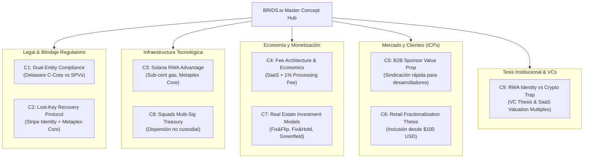

# Documento Maestro de Conceptos e Ideas Fundacionales: BRIDS.io

> [!NOTE] Resumen Ejecutivo
> Este documento constituye la **fuente de verdad unificada (Single Source of Truth)** de los grandes conceptos, tesis estratégicas, anclajes legales y principios tecnológicos que definen el negocio de BRIDS.io. Diseñado para ser consumido de manera modular y determinista por los subagentes del squad (`business-consultant`, `pitch-deck-architect`, `compliance-officer`, `b2b-sponsor-lead`, `founder-ghostwriter`, `market-research-analyst`), cada concepto cuenta con una nota atómica independiente en `BRIDS-Brain/01 Negocio/01 Estrategia & Modelo/Business Concepts/` optimizada para transclusión y citas directas en entregables finales.

---

## 📌 Índice y Mapa de los 9 Conceptos Maestros



---

## 1. Módulo Legal & Blindaje Institucional

### C1: Estructuración Dual-Entity y Blindaje Non-Broker-Dealer
- **Archivo Atómico:** [[01 Negocio/01 Estrategia & Modelo/Business Concepts/concept-dual-entity-compliance.md|concept-dual-entity-compliance]]
- **Custodio:** `compliance-officer`
- **One-Liner Canónico:**
  > *"BRIDS es el proveedor de software e infraestructura en Solana que digitaliza la sindicación inmobiliaria; no custodiamos fondos ni intermediamos valores, cada propiedad pertenece a un SPV legal independiente en Delaware."*
- **Tesis de Reutilización:** Permite justificar ante reguladores, inversores institucionales y socios por qué BRIDS Inc. opera como un proveedor de tecnología pura (Delaware C-Corp) protegido bajo la Sección 15(a)(1) del Exchange Act, delegando la titularidad de los inmuebles a Delaware Series LLCs independientes.

### C2: Protocolo Institucional de Recuperación de Llaves Privadas (Lost-Key Recovery)
- **Archivo Atómico:** [[01 Negocio/01 Estrategia & Modelo/Business Concepts/concept-wallet-recovery-protocol.md|concept-wallet-recovery-protocol]]
- **Custodio:** `compliance-officer`, `founder-ghostwriter`
- **One-Liner Canónico:**
  > *"En BRIDS, perder tu billetera no significa perder tu propiedad: tu derecho legal está respaldado en Delaware y recuperas tu título digital mediante verificación biométrica en Stripe Identity y Metaplex Core."*
- **Tesis de Reutilización:** Resuelve la mayor objeción del inversor tradicional y retail. Demuestra cómo la conciliación entre el *Master Securityholder File* y los plugins programáticos de Metaplex Core restaura el patrimonio del usuario sin romper la descentralización.

---

## 2. Módulo de Infraestructura Tecnológica

### C3: Infraestructura RWA en Solana y Estándar Metaplex Core
- **Archivo Atómico:** [[01 Negocio/01 Estrategia & Modelo/Business Concepts/concept-solana-rwa-infrastructure.md|concept-solana-rwa-infrastructure]]
- **Custodio:** `founder-ghostwriter`, `pitch-deck-architect`
- **One-Liner Canónico:**
  > *"BRIDS corre sobre Solana porque es la única red donde liquidar una inversión inmobiliaria de $100 USD o dispersar dividendos a miles de usuarios cuesta fracciones de centavo y toma menos de un segundo."*
- **Tesis de Reutilización:** Sustenta el análisis de "Why Solana?" en pitch decks de YC y whitepapers técnicos. Explica la reducción del 85% en costos de almacenamiento lograda por la arquitectura de cuenta única de Metaplex Core frente a estándares legacy.

### C8: Tesorería Descentralizada, Squads Multi-Sig y Dispersión sin Custodia
- **Archivo Atómico:** [[01 Negocio/01 Estrategia & Modelo/Business Concepts/concept-multisig-treasury-governance.md|concept-multisig-treasury-governance]]
- **Custodio:** `compliance-officer`, `founder-ghostwriter`
- **One-Liner Canónico:**
  > *"Gobernanza financiera transparente en Solana: utilizamos bóvedas multifirma de Squads Protocol para dispersar dividendos y liberar fondos de obra sin custodia discrecional ni riesgo de contraparte."*
- **Tesis de Reutilización:** Garantiza la confianza total de inversionistas y sponsors al eliminar el riesgo moral de desvío de capital o demoras injustificadas en la distribución de rentas.

---

## 3. Módulo de Negocio, Monetización y Producto

### C4: Arquitectura de Monetización, Estructura de Tarifas y Unit Economics
- **Archivo Atómico:** [[01 Negocio/01 Estrategia & Modelo/Business Concepts/concept-fee-architecture-unit-economics.md|concept-fee-architecture-unit-economics]]
- **Custodio:** `business-consultant`, `pitch-deck-architect`
- **One-Liner Canónico:**
  > *"Monetizamos como el Shopify de la sindicación inmobiliaria: cobramos una tarifa de software al desarrollador por desplegar su proyecto y una tasa de procesamiento tecnológico sobre el volumen liquidado en Solana."*
- **Tesis de Reutilización:** Desglosa el modelo de ingresos híbrido (SaaS Listing Fee de $5k–$25k + Processing Fee de 0.5%–1.5% + Recovery Fees + Royalties secundarias), proyectando márgenes brutos superiores al 80% y un ratio LTV/CAC > 12x en B2B.

### C7: Modelos de Inversión Inmobiliaria y Estrategias de Retorno
- **Archivo Atómico:** [[01 Negocio/01 Estrategia & Modelo/Business Concepts/concept-real-estate-investment-models.md|concept-real-estate-investment-models]]
- **Custodio:** `business-consultant`, `b2b-sponsor-lead`
- **One-Liner Canónico:**
  > *"Desde rentas pasivas mensuales en USDC hasta proyectos de remodelación rápida: BRIDS ofrece tres modelos de inversión estructurados para ajustarse al horizonte y perfil de cada inversor."*
- **Tesis de Reutilización:** Estandariza la oferta de producto para marketplaces y catálogo: Fix & Flip (6-12 meses), Fix & Hold (3-5+ años con dividendos mensuales) y Greenfield (18-36 meses), operados por el partner experto Blue Brick Capital.

---

## 4. Módulo de Mercado y Clientes Ideales (ICPs)

### C5: Propuesta de Valor para Desarrolladores Inmobiliarios (B2B Sponsors & GPs)
- **Archivo Atómico:** [[01 Negocio/01 Estrategia & Modelo/Business Concepts/concept-b2b-sponsor-value-prop.md|concept-b2b-sponsor-value-prop]]
- **Custodio:** `b2b-sponsor-lead`
- **One-Liner Canónico:**
  > *"BRIDS es la infraestructura de software que permite a los desarrolladores inmobiliarios sindicar capital hasta 5 veces más rápido, reduciendo sus costos de colocación y automatizando su cap table en Solana."*
- **Tesis de Reutilización:** Pilar del discurso de ventas outbound y prospección institucional B2B. Demuestra cómo el promotor ahorra hasta $55,000 USD en estructuración y reduce semanas de cobranza manual a transacciones con un click.

### C6: Tesis de Democratización y Fraccionamiento Retail ($100 USD)
- **Archivo Atómico:** [[01 Negocio/01 Estrategia & Modelo/Business Concepts/concept-retail-fractionalization-thesis.md|concept-retail-fractionalization-thesis]]
- **Custodio:** `founder-ghostwriter`, `pitch-deck-architect`
- **One-Liner Canónico:**
  > *"Infraestructura Web3 segura, accesible y trazable para invertir en bienes raíces estructurados en EE.UU. desde $100 USD."*
- **Tesis de Reutilización:** El núcleo de la narrativa del fundador y de captación de usuarios retail: dolarización de ahorros protegida contra la inflación, colateral físico verificable y desvinculación total de memecoins especulativas.

---

## 5. Módulo Institucional & Tesis para VCs

### C9: Identidad RWA vs. Trampa Cripto (Tesis para VCs e Inversores)
- **Archivo Atómico:** [[01 Negocio/01 Estrategia & Modelo/Business Concepts/concept-rwa-identity-vc-thesis.md|concept-rwa-identity-vc-thesis]]
- **Custodio:** `pitch-deck-architect`, `founder-ghostwriter`, `business-consultant`
- **One-Liner Canónico:**
  > *"BRIDS es el Stripe + Carta para Real World Assets: la infraestructura de software sobre Solana que permite a desarrolladores sindicar capital y a inversores retail adquirir participaciones inmobiliarias en EE.UU. desde $100 USD con títulos recuperables y respaldo legal en Delaware."*
- **Tesis de Reutilización:** Pilar de pitch decks para Y Combinator y firmas de Venture Capital. Desmonta la trampa de valoración de "gestora inmobiliaria" (1x–3x EBITDA) frente a "infraestructura SaaS" (15x–30x ARR), fundamenta el modelo asset-light con 80%+ de margen bruto, y explica por qué superamos las tres fallas de RWA 1.0 (gas fees de Ethereum, dogma de code-is-law y limbo regulatorio).

---

## 6. Protocolo de Consumo para Sub-Agentes en Nuevas Tareas

Cuando inicialices cualquier tarea o generes un nuevo spec con `bash BRIDS-Engine/scripts/task-init.sh <slug>`, sigue este protocolo para garantizar la coherencia absoluta:

1. **Declaración en el Spec:** En la sección de referencias del spec, incluye el enlace al concepto:
   ```markdown
   reusable_concepts:
     - "[[01 Negocio/01 Estrategia & Modelo/Business Concepts/concept-dual-entity-compliance.md]]"
     - "[[01 Negocio/01 Estrategia & Modelo/Business Concepts/concept-rwa-identity-vc-thesis.md]]"
   ```
2. **Cita Directa:** Utiliza los One-Liners o los Snippets autorizados de la sección 5 de cada archivo conceptual.
3. **Auditoría Anti-Drift:** El agente revisor (`sdd-reviewer`) comprobará que las afirmaciones legales, métricas financieras y detalles de contratos coincidan exactamente con estas notas canónicas.

---

## Historial de Revisiones

| Versión | Fecha | Autor / Agente | Resumen de Modificaciones |
| :--- | :--- | :--- | :--- |
| **1.1.0** | 2026-09-13 | `pitch-deck-architect`, `founder-ghostwriter` | Integración del Concepto C9: Identidad RWA vs Trampa Cripto (Tesis VCs & Múltiplos SaaS). |
| **1.0.0** | 2026-09-11 | Squad de Arquitectura de Negocio & SDD Loop | Creación del Documento Maestro de Conceptos e Ideas Fundacionales de BRIDS.io. |
