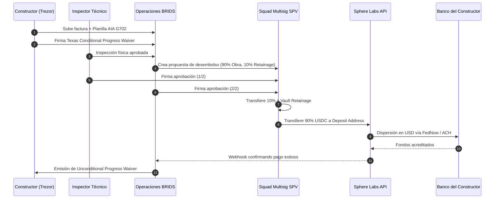

# Arquitectura de Desembolsos por Hitos RWA: Squads v4, Retainage Estatutario y Rieles Fiduciarios Sphere

> [!NOTE]
> **Especificación de Operaciones e Infraestructura Financiera (Validación SDD + HITL)**  
> **Aprobación Integral:** Validado por el motor Evaluador-Optimizador (**9.0/9.0**) con doble aprobación humana (**HITL-1 Spec** y **HITL-2 Deliverable**).  
> **Sub-Agentes Autores:** `compliance-officer`, `business-consultant` | **Revisor:** `sdd-reviewer`.  
> **Destinatarios:** Inversores Institucionales, General Contractors y Desarrolladores RWA.  
> **Alcance:** Define el estándar de segregación patrimonial on-chain, gobernanza multifirma en Solana con Squads v4, cumplimiento del estatuto de Texas Chapter 53 (Mechanic's Liens & Statutory Retainage) y liquidación fiduciaria directa en USD mediante la API de Sphere Labs.

---

## 1. Problema de Mercado y Fricción Operativa

La tokenización de proyectos inmobiliarios en fase de construcción fracasa sistemáticamente cuando intenta forzar al sector de la construcción tradicional a operar con criptomonedas o cuando descuida las leyes de retención y gravámenes del mundo real:

1. **Riesgo de Mezcla de Fondos (*Commingling*):** Cuando las plataformas agrupan el capital de múltiples obras en una tesorería común, exponen a los inversores a la consolidación sustancial (*substantive consolidation*). Si una obra enfrenta demandas laborales, un juez mercantil puede congelar los activos de los demás proyectos.
2. **Amenaza de Gravámenes Prioritarios (*Mechanic's Liens*):** En jurisdicciones como Texas, cualquier contratista o proveedor no remunerado puede registrar un gravamen sobre el título del inmueble, subordinando la garantía hipotecaria y el valor accionario de los inversores.
3. **Fricción Tecnológica para el Constructor:** Los constructores generales (*General Contractors*) no asumen volatilidad de tokens, custodias complejas de claves privadas ni reportes fiscales derivados de swaps en exchanges descentralizados.

En BRIDS resolvemos esta fricción integrando una capa de software que conecta contratos inteligentes auditables en Solana con rieles bancarios fiduciarios automatizados y protocolos legales estatales.

---

## 2. Segregación Criptográfica y Dualidad Corporativa (1 SPV = 1 Squad Multisig)

BRIDS opera bajo un modelo de separación corporativa dual estricta:
* **Entidad Tecnológica:** Delaware C-Corp como proveedora de software SaaS no custodial.
* **Entidades Emisoras:** Series LLC / SPVs independientes por cada desarrollo inmobiliario, titulares del activo subyacente. El onboarding de inversores y validación KYC/AML se procesa mediante Stripe Identity.

```
┌─────────────────────────────────────────────────────────────────────────────┐
│                 ARQUITECTURA DE AISLAMIENTO POR PROYECTO                    │
└─────────────────────────────────────────────────────────────────────────────┘

       [ SPV Obra Alpha - Austin ]                 [ SPV Obra Beta - Dallas ]
      (Delaware/Texas Series LLC)                 (Delaware/Texas Series LLC)
                   │                                           │
                   ▼                                           ▼
       [ Squad Multisig Dedicado ]                 [ Squad Multisig Dedicado ]
           (Instancia Solana)                          (Instancia Solana)
         Umbral 2-de-3 Exclusivo                     Umbral 2-de-3 Exclusivo
         ┌─────────┴─────────┐                       ┌─────────┴─────────┐
         ▼                   ▼                       ▼                   ▼
    Vault 0: Obra       Vault 1: Retainage      Vault 0: Obra       Vault 1: Retainage
      (90% Hito)          (10% Reserva)           (90% Hito)          (10% Reserva)
```

### Principio de Aislamiento de Quiebras (*Bankruptcy-Remote*)
En lugar de compartir un único multisig con subcuentas para todas las obras del ecosistema, **cada SPV despliega su propia instancia de Squad Multisig en Solana**:
* **Costo Marginal:** El despliegue de una cuenta multisig en Solana requiere únicamente la renta de almacenamiento de cuentas (~0.02 SOL, equivalente a \$3 - \$5 USD de pago único).
* **Partes Firmantes Específicas:** Cada proyecto cuenta con su propio comité de firmas (2-de-3):
  1. **Firma 1 (Operaciones BRIDS):** Valida documentación de cumplimiento y facturas.
  2. **Firma 2 (Inspector Técnico Independiente):** Certifica el avance físico de obra según planilla estándar AIA Document G702/G703.
  3. **Firma 3 (Patrocinador / Desarrollador Inmobiliario):** Valida requerimientos del proyecto.
* **Blindaje:** Ningún inspector o patrocinador de la Obra Alpha tiene permisos ni visibilidad de voto sobre la Obra Beta.

---

## 3. Cumplimiento de Texas Chapter 53: Doble Paso de Lien Waivers y 10% Retainage

El sistema parametriza la lógica contractual según la jurisdicción del inmueble. Para proyectos en Texas, el protocolo aplica de forma no negociable el Capítulo 53 del Código de Propiedad de Texas (*Texas Property Code*).

### A. Protocolo de Renuncia de Gravamen en Doble Paso (§ 53.284)
* **Paso 1 - Conditional Waiver and Release on Progress Payment:**  
  Antes de iniciar la propuesta on-chain en Squads, el constructor firma digitalmente la renuncia condicional estatutaria. Esta renuncia estipula por ley que solo adquiere validez jurídica en el instante exacto en que los fondos se acreditan efectivamente en su banco.
* **Paso 2 - Unconditional Waiver and Release on Progress Payment:**  
  Cuando el riel bancario confirma la liquidación fiduciaria, el sistema genera la renuncia incondicional definitiva, archivando en auditoría el hash de la transacción y el comprobante bancario.

### B. Fondo de Retención Estatutario del 10% (*Statutory Retainage*, § 53.101)
La legislación de Texas exige al propietario retener el 10% del monto total de cada factura durante toda la ejecución de la obra para responder ante posibles impagos a subcontratistas.

Por cada hito de \$100,000 USD aprobado:
* **\$90,000 USDC** se programan para desembolso directo al riel fiduciario del constructor.
* **\$10,000 USDC** se transfieren al `Vault Index 1` (Subcuenta de Retainage) del mismo Squad, quedando bajo custodia programada hasta 30 días posteriores a la terminación sustancial del edificio y recepción de la declaración jurada final libre de gravámenes (*Affidavit of Completion*).

---

## 4. Onboarding de Customer Success y Dispositivos de Firma

Para eliminar el riesgo operativo en empresas constructoras tradicionales, BRIDS implementa un acompañamiento técnico personalizado liderado por un agente de Customer Success:

```
[ Contratista General / GC ]
           │
           ├── 1. Sesión de Onboarding con Customer Success BRIDS
           │      • Suministro y configuración de Hardware Wallet (Trezor Safe 3 / Safe 5)
           │      • Instrucción de uso como dispositivo de firma digital (Signature Token)
           │
           ├── 2. Verificación KYB Institucional en Sphere Labs
           │      • Carga de documentación societaria y asignación de cuenta bancaria
           │      • Vinculación de dirección de depósito automatizada en Solana
           │
           └── 3. Ejecución de Cobros por Hito
                  • Firma de la solicitud con Trezor (cero custodia cripto)
                  • Liquidación automática: USDC → USD vía FedNow / ACH Same-Day
```

* **Hardware Wallets Seguras:** Se implementan dispositivos como **Trezor Safe 3 o Trezor Safe 5** equipados con elemento seguro de hardware (*Secure Element*). El constructor no gestiona exchanges ni realiza transferencias manuales; utiliza el dispositivo exclusivamente como token criptográfico de autorización corporativa.
* **Direcciones de Depósito Exclusivas:** En la configuración de Squads se registra como destino autorizado únicamente la dirección de depósito provista por Sphere Labs vinculada a la cuenta bancaria del constructor.

---

## 5. Rieles Fiduciarios y Liquidación Automatizada con Sphere Labs

Sphere Labs proporciona la infraestructura de liquidación fiduciaria programática:

1. **Dirección de Depósito Dedicada:** Cada constructor verificado tiene asignada una dirección SPL en Solana conectada a su cuenta bancaria comercial (Chase, Wells Fargo, Bank of America, etc.).
2. **Conversión Instantánea:** En cuanto la transacción multifirma 2-de-3 de Squads transfiere los USDC del hito (ej. \$90,000 USDC), Sphere convierte los activos a USD fiduciarios sin deslizamiento de mercado.
3. **Dispersión Inmediata:** Los fondos se envían a través de **FedNow**, **Wire** o **ACH Same-Day** directamente a la cuenta corporativa del contratista.
4. **Registro Inmutable:** La transacción en Solana incorpora una instrucción en el `Memo Program v2` que vincula el hash de la certificación de obra AIA G702, el identificador del hito y el ID de compensación bancaria.

---

## 6. Diagrama de Secuencia de un Desembolso



---

## 7. Próximos Pasos y Llamado a la Acción (CTA)

Esta arquitectura combina la transparencia y auditabilidad de Solana con la seguridad jurídica y bancaria que exigen los inversores institucionales y patrocinadores de activos del mundo real.

Para estructurar un desarrollo inmobiliario bajo este estándar operativo o solicitar acceso a nuestro Data Room y especificaciones de integración:
* **Acción Inmediata:** Agendar sesión técnica de estructuración con nuestro equipo de cumplimiento y producto.
* **Contacto:** `partners@brids.io` | Equipo de Estructuración RWA.


## 🔄 Historial de Revisiones SDD (Changelog)
- **v1.0 (2026-09-16):** Aprobado por el usuario e integrado en el vault tras 1 ciclos de optimización con nota de 9/9.0.

## 🔗 Trazabilidad
- Artefacto de Especificación: [[00 Inbox/Specs/rwa-milestone-disbursement-rail.spec.md]]
- Contexto de Marca: [[01 Brand Context/product-marketing-context.md]]
