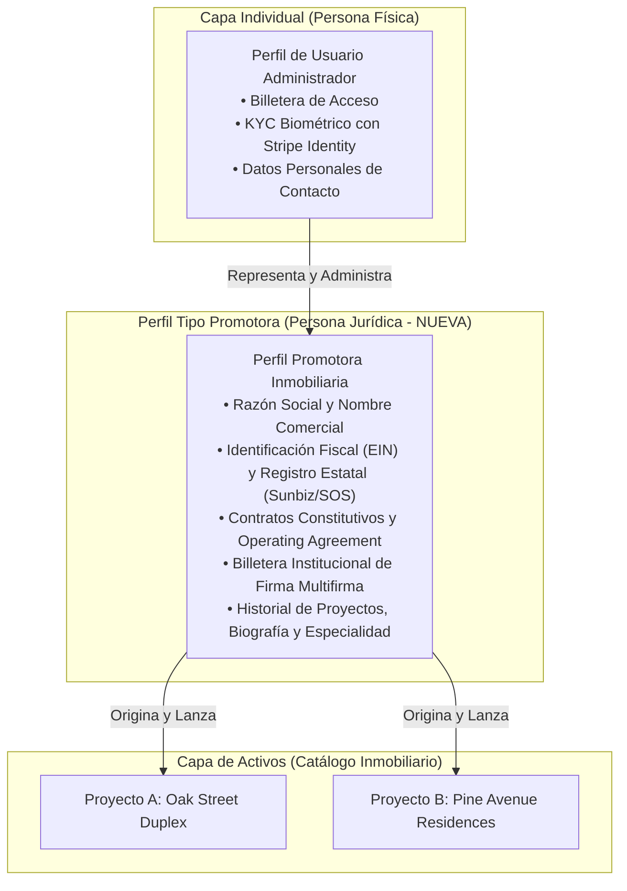
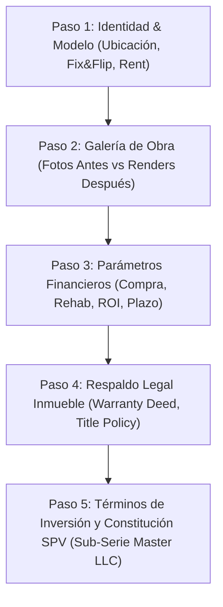
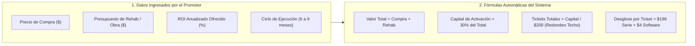
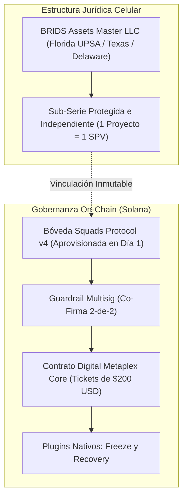
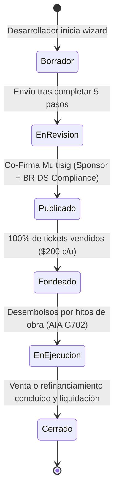

# Módulo del Desarrollador Inmobiliario y SPV Engine

> [!NOTE]
> **Aprobación Integral SDD + HITL:** Validado por el motor Evaluador-Optimizador (**9/9.0**) y con doble aprobación humana (**HITL-1 Spec** y **HITL-2 Deliverable**).
> **Sub-Agentes Autores:** `business-consultant`, `b2b-sponsor-lead`, `compliance-officer` | **Revisor:** `sdd-reviewer`

# Módulo del Desarrollador Inmobiliario y SPV Engine

> [!NOTE]
> **Arquitectura Funcional y Estratégica de Originación B2B (Explicación de Alto Nivel)**  
> **Subagentes Autores:** `business-consultant`, `b2b-sponsor-lead`, `compliance-officer` | **Revisión:** `sdd-reviewer`  
> **Destinatarios:** Real Estate Sponsors, Developers Inmobiliarios, General Partners (GPs) y Operadores de Capital.  
> **Alcance:** Modela la integración integral entre el onboarding societario (KYB Concierge), la creación del Perfil Tipo Promotora, el control de acceso RBAC, la ingesta ágil de proyectos (wizard de 5 pasos sincronizado al marketplace con tickets de $200 USD), la estructuración celular sobre Master Series LLC y la gobernanza on-chain con Bóvedas Squads Protocol v4 y guardrail multisig de co-firma para minting en Metaplex Core.

---

## 1. Visión de Producto: La Capa de Distribución y Sindicación para Desarrolladores

Para los promotores y desarrolladores inmobiliarios (Sponsors y General Partners), levantar capital privado mediante métodos analógicos tradicionales implica una fricción estructural severa:
- Honorarios legales de $40,000 a $80,000 USD por cada sindicación individual.
- Tiempos muertos de 90 a 180 días persiguiendo compromisos de capital uno a uno.
- Gestión manual y caótica de cap tables con decenas de hojas de cálculo, dispersión bancaria individual de rentas y reportes manuales.

En BRIDS resolvemos este cuello de botella consolidando la infraestructura de software que opera como el **Stripe + Carta + AngelList** de los bienes raíces sobre Solana. Nuestra plataforma permite al desarrollador convertir un inmueble o lote de construcción en un vehículo de sindicación digital estructurado, con segregación patrimonial estatutaria y acceso inmediato a liquidez retail global, recortando los tiempos de estructuración de meses a menos de dos semanas.

---

## 2. Módulo 1: Creación del Perfil Tipo Promotora (Developer Corporate Profile & KYB Concierge)

Actualmente, el sistema de BRIDS dispone de perfiles individuales de usuario enfocados en inversionistas y autenticación personal vía wallet o email con verificación de identidad individual. **La pieza estratégica que debemos crear en la plataforma es la entidad corporativa de la Promotora Inmobiliaria.**

Este nuevo perfil desacopla a la persona física (Manager, Representante Legal o CFO) de la persona jurídica (empresa constructora o promotora) y centraliza toda la gobernanza B2B.

### A. Los 5 Bloques Funcionales del Perfil Promotora

| Bloque Funcional | Descripción de Negocio | Propósito Operativo | Nivel de Visibilidad |
| :--- | :--- | :--- | :--- |
| **1. Identidad Mercantil** | Razón social legal, nombre comercial de marca, estado de incorporación (Florida, Texas, Delaware) y número EIN. | Valida la existencia legal de la empresa promotora y su idoneidad tributaria ante el IRS. | Nombre público en marketplace; EIN y registros sensibles bajo estricta privacidad. |
| **2. Representación Legal** | Nombre del Administrador General, correo corporativo, estatutos constitutivos y certificado de vigencia (*Good Standing*). | Vincula a la persona física autorizada para obligar a la empresa y firmar contratos de sindicación. | Datos del manager visibles; documentos corporativos auditados solo por BRIDS. |
| **3. Credencial Institucional On-Chain** | Clave pública institucional de la promotora para co-firmas de tesorería y gobernanza en Squads Protocol. | Permite a la empresa autorizar transacciones de desembolso de obra y dispersión de rentas con firma segura. | Registro técnico auditable en exploradores de Solana. |
| **4. Reputación y Track Record** | Logotipo de empresa, biografía institucional, años de experiencia, especialidad (*Fix & Flip, Multifamily*) y volumen histórico de obra. | Construye credibilidad ante los inversionistas retail mostrando experiencia real y obras previas concluidas. | Público en la pestaña de desarrollador de cada ficha de propiedad. |
| **5. Validación KYB & Badges** | Estado de aprobación (*En Revisión*, *Verificado*, *Suspendido*), fecha de certificación y oficial de cumplimiento asignado. | Otorga los sellos oficiales de verificación que certifican que la empresa superó la auditoría de BRIDS. | Badges públicos visibles en el marketplace (*"Promotora Verificada por BRIDS"*). |

### B. Doble Superficie Operativa del Perfil Promotora

#### 1. Panel de Backoffice (Customer Success & Compliance)
- Superficie administrativa operada exclusivamente por el equipo interno de BRIDS.
- Permite dar de alta a una nueva promotora, auditar su documentación mercantil en registros estatales (Sunbiz, SOS), verificar antecedentes legales y aprobar su estado KYB.
- Asigna formalmente los privilegios de desarrollador a la cuenta del representante legal y emite la invitación de acceso al portal.

#### 2. Portal del Desarrollador (Sponsor Dashboard)
- Interfaz de autoservicio para el equipo de la promotora.
- Permite gestionar la presencia de marca pública (logotipo, descripción de la firma, proyectos terminados destacados).
- Muestra los certificados legales verificados en modo de solo lectura (inmutables una vez validados por cumplimiento).
- Centraliza la visión global de todos los proyectos activos de la promotora y los balances de sus tesorerías.

### C. Protocolo de Incorporación Asistida (Concierge KYB & Setup de Billetera)
Los promotores inmobiliarios tradicionales son expertos en construcción y finanzas, no en tecnología criptográfica. Para evitar errores operativos o pérdida de claves, Customer Success brinda un acompañamiento personalizado:
1. **Configuración de Custodia Institucional:** Guía paso a paso para configurar un entorno de firma segura institucional o dispositivo físico de hardware.
2. **Vinculación Oficial de Firma:** Registro formal de la dirección pública de la empresa en su perfil corporativo.
3. **Simulación de Firma de Prueba:** Práctica asistida en entorno de pruebas donde el promotor aprueba una transacción simulada para familiarizarse con la gobernanza multifirma.

### D. Control de Acceso RBAC y Variables de Estado de Alto Nivel
El perfil de promotora habilita un control de acceso estricto basado en roles (RBAC):
- **Rol Especializado:** Rol dedicado para promotores inmobiliarios verificados.
- **Variables de Estado en Sesión:** El sistema comprueba en cada solicitud que el usuario cuente con el rol activo de desarrollador y con la verificación corporativa aprobada.
- **Protección Multicapa:**
  - **Filtro de Borde:** Las rutas del portal del desarrollador impiden el acceso a usuarios no autorizados o sin verificación previa de Customer Success.
  - **Validación en Servidor:** Las pantallas de creación de proyectos confirman que la promotora vinculada se encuentre en estado activo antes de permitir cualquier operación.

---

## 3. Módulo 2: Portal del Desarrollador e Ingesta de Proyectos (Wizard de 5 Pasos)

Una vez habilitada la promotora, el desarrollador accede a su panel para originar oportunidades de inversión. Toda la información corporativa de su empresa queda completamente excluida de la carga manual recurrente, inyectándose automáticamente desde su perfil verificado.

El proceso de ingesta se organiza en **5 pasos secuenciales orientados exclusivamente al activo inmobiliario**:

### Paso 1: Identidad del Inmueble y Modelo de Negocio
- Nombre comercial del desarrollo.
- Dirección física completa (calle, ciudad, estado, código postal).
- Clasificación de la propiedad: Residencial (vivienda unifamiliar, multifamiliar, dúplex, cuatro apartamentos) o Comercial.
- Modelo operativo: Compra, remodelación y venta rápida (*Fix & Flip*), Construcción nueva (*New Construction*), Remodelación y alquiler (*Fix & Hold*), o Renta estabilizada (*Rent*).

### Paso 2: Galería de Obra (Trazabilidad Visual)
- Fotografías del estado inicial: lote de terreno o inmueble deteriorado previo a los trabajos de obra (*Antes*).
- Renders arquitectónicos profesionales: visualización terminada de la propiedad una vez concluida la remodelación o construcción (*Después*).

### Paso 3: Parámetros Financieros y Motor de Cálculo Automático
El promotor introduce únicamente cuatro variables financieras básicas. La plataforma calcula y fija de forma automática la estructura de capital, el fondo de activación y la cantidad de tickets fraccionales de **$200 USD**:

#### Regla de Redondeo Canónica
Para asegurar que cada participación tenga un valor exacto de $200 USD, si el 30% del valor total no resulta en un múltiplo exacto, el sistema redondea la cantidad de tickets hacia arriba al siguiente entero:
$$\text{Cantidad de Tickets} = \left\lceil \frac{\text{Valor Total del Proyecto} \times 0.30}{200} \right\rceil$$
$$\text{Capital Real Recaudado} = \text{Cantidad de Tickets} \times 200$$

*Ejemplo Operativo:*
- Precio de compra: $185,000 USD.
- Presupuesto de rehabilitación: $95,000 USD.
- Valor total del proyecto: $280,000 USD.
- Capital de activación requerido (30%): $84,000 USD.
- Precio por ticket: $200 USD.
- Emisión total de participaciones: 420 tickets ($196 USD para la obra y adquisición / $4 USD de tarifa de infraestructura tecnológica BRIDS).

### Paso 4: Respaldo Legal de la Propiedad
- Escritura pública o contrato vinculante de compraventa (*Warranty Deed* o *Purchase Agreement*).
- Compromiso de póliza de título emitido por una compañía de títulos autorizada (*Title Insurance Commitment*).
- Licencias municipales y permisos de construcción vigentes.

### Paso 5: Términos de Inversión y Constitución del SPV
- Confirmación de las condiciones de retorno y calendario estimado de liquidación.
- Generación automática del paquete de contratos de sindicación: Acuerdo de Co-inversión (*Joint Venture Agreement*), Pagaré (*Promissory Note*), Resumen de Proyecto y Memorando de Sindicación.
- Firma electrónica del desarrollador como Administrador Operativo de la sub-serie.

---

## 4. Módulo 3: La Máquina de SPVs y Gobernanza On-Chain (Solana & Squads v4)

La estructuración jurídica y la tesorería digital operan de forma sincronizada sin intermediarios bancarios tradicionales ni riesgos de mezcla de fondos.

### A. Despliegue de Sub-Series bajo Master Series LLC
En lugar de constituir una entidad jurídica independiente desde cero con semanas de burocracia, el motor societario de BRIDS crea una nueva **Serie Protegida** bajo nuestra estructura paraguas (*Master Series LLC*), aprovechando legislaciones modernas como la Ley Uniforme de Series Protegidas de Florida (CS/SB 316), Texas o Delaware:
- **Blindaje de Pasivos:** Cada sub-serie posee personalidad operativa y aislamiento de responsabilidad. Cualquier litigio o reclamación que afecte a un proyecto no puede alcanzar los activos de otros proyectos ni de la matriz.
- **Eficiencia de Costes:** Generación formal en minutos, reduciendo los costes legales en más de un 80%.

### B. Aprovisionamiento de Bóveda Squads v4 en Día 1
Desde el momento en que el promotor crea el borrador del proyecto, la plataforma aprovisiona una **Bóveda multifirma dedicada en Squads Protocol v4** en la red de Solana:
- La dirección pública de la bóveda queda asentada formalmente en los contratos de la serie como la cuenta oficial de tesorería del proyecto.
- **Estructura Interna de Tres Sub-Cuentas:**
  1. *Sub-cuenta de Construcción y Adquisición:* Custodia los fondos destinados a compra y obra, liberados por hitos certificados.
  2. *Sub-cuenta de Retención Legal (Statutory Retainage):* Reserva el 10% obligatorio por ley de obra hasta la recepción final de finiquito de gravámenes (*Final Lien Waiver*).
  3. *Sub-cuenta de Dispersión de Rentas:* Recibe los flujos generados por alquiler o venta para reparto directo a los titulares de tickets.

### C. Guardrail Multisig de Co-Firma para Minting (Gate de Seguridad)
La autorización para habilitar la compra de tickets en el marketplace no depende de una decisión unilateral:
1. **Control en la Bóveda:** La autoridad de emisión reside en la Bóveda Squads del proyecto.
2. **Co-Firma Obligatoria:** Para pasar del estado de revisión a venta pública, se requiere una propuesta de co-firma multifirma en Squads:
   - **Firma del Desarrollador:** Confirma la exactitud del presupuesto y calendario de obra.
   - **Firma de BRIDS Compliance:** Certifica que los títulos de propiedad, seguros de título y permisos están limpios y en orden.
3. **Plugins de Metaplex Core:**
   - **Plugin de Congelamiento (Freeze):** Habilita la retención judicial de activos ante sospechas fundadas de fraude o revocación de KYC.
   - **Plugin de Recuperación (Recovery):** Permite reasignar el título digital a un inversionista legítimo que haya extraviado el acceso a su billetera, previa verificación biométrica con Stripe Identity.

---

## 5. Módulo 4: Trazabilidad y Reglas de Visibilidad en el Marketplace

Cada dato ingresado a lo largo del proceso alimenta una sección específica de la experiencia del inversionista:

### A. Elementos Públicos de Libre Consulta
- **Tarjeta de Listado (Grid):** Render de portada, nombre del proyecto, ciudad/estado, modelo de negocio, valor total, ROI anualizado ofrecido, plazo estimado en meses, ticket fijo de $200 USD y barra de porcentaje fondeado.
- **Pestaña Resumen (Ficha de Proyecto):** Galería interactiva con comparador de imágenes *Antes vs. Después*, desglose financiero de compra frente a rehabilitación, y disponibilidad de tickets en tiempo real.
- **Pestaña Desarrollador (Ficha de Empresa):** Nombre de la promotora, estado de registro, trayectoria, y **sellos oficiales de verificación** (*Registro Estatal Verificado*, *Manager Aprobado con Stripe Identity*). Por seguridad y privacidad corporativa, no se exponen al público general documentos personales ni números fiscales completos.

### B. Elementos de Acceso Protegido y Post-Inversión
- **Pestaña Propiedad:** Sellos de respaldo legal (*Título Registrado*, *Póliza de Título Vigente*). Los contratos completos se habilitan para consulta del inversionista una vez registrado.
- **Pestaña Documentación de Inversión:** Antes de invertir funciona como lista informativa explicativa de los contratos que respaldan la inversión; una vez completada la compra de tickets y validado el KYC, se desbloquea la descarga de los documentos ejecutados y personalizados.

---

## 6. Módulo 5: Operación Diaria Post-Fondeo

El valor de largo plazo para el desarrollador radica en la simplificación de la gestión operativa continua:

1. **Cap Table Automatizado en Tiempo Real:** Supervisión transparente de la nómina de inversionistas, cantidad de tickets por titular, porcentaje de participación pasiva en la serie y estado de cumplimiento.
2. **Solicitudes de Desembolso de Obra (*Draw Requests*):**
   - El promotor presenta los certificados de avance físico avalados por el arquitecto inspector (formularios estándar AIA G702 / G703) junto con facturas de contratistas y renuncias de gravámenes.
   - El sistema formula la propuesta de desembolso en la Bóveda Squads.
   - Tras la aprobación del comité supervisor, los fondos se transfieren en stablecoins hacia la cuenta operativa de obra.
3. **Dispersión de Rendimientos en 1 Clic:**
   - El promotor deposita el flujo neto a distribuir en la sub-cuenta de rentas.
   - Mediante una única confirmación en Squads, los fondos se dispersan simultánea y proporcionalmente a todas las billeteras titulares registradas en Solana.
4. **Reportes Contables y Fiscales (K-1 Ready):** Generación de balances periódicos estandarizados del SPV para facilitar a los contadores la emisión de los formularios fiscales IRS Schedule K-1 para los socios.

---

## 7. Arquitectura de Integración y Ciclo de Estados

### A. Integración Conceptual con los Componentes Existentes de la Plataforma

| Componente de Plataforma | Rol en el Flujo del Desarrollador | Estado de Integración |
| :--- | :--- | :--- |
| **Perfil de Usuario (`user_profiles`)** | Administrador físico que inicia sesión, completa KYC individual y representa a la promotora. | Componente existente en la plataforma. |
| **Perfil Tipo Promotora (`developer_entities`)** | Entidad jurídica que agrupa el historial corporativo, verificación mercantil y wallet institucional. | **Nueva entidad que se crea para este módulo.** |
| **Catálogo de Activos (`marketplace_entries`)** | Registro central donde se publican las oportunidades inmobiliarias tras la ingesta. | Componente existente que se vincula a la promotora. |
| **Gobernanza On-Chain (Squads v4)** | Tesorería multifirma y custodia descentralizada por proyecto desde el día uno. | Infraestructura estándar de gobernanza en Solana. |
| **Emisión Digital (Metaplex Core)** | Contratos inteligentes que emiten las participaciones fraccionales en tickets de $200 USD. | Estándar de emisión y recuperación digital. |

### B. Ciclo de Vida y Estados del Proyecto

1. **Borrador:** El desarrollador completa las etapas del proyecto; la Bóveda Squads se despliega tempranamente en la red.
2. **En Revisión:** La información y documentos se envían al equipo de BRIDS Compliance para auditoría de títulos, seguros y presupuestos.
3. **Publicado:** Se activa el guardrail de co-firma multifirma en Squads; el proyecto abre su ronda en el marketplace y habilita la adquisición de tickets.
4. **Fondeado:** Se alcanza el 100% de colocación del capital de activación; cierre formal de la ronda y conciliación de fondos.
5. **En Ejecución:** Se ejecutan los trabajos de construcción; desembolsos escalonados contra avance de obra certificado.
6. **Cerrado:** Se vende o refinancia el inmueble; retorno del capital y beneficios a los inversionistas, liquidación de la serie y reporte fiscal.

---

## 8. Próximos Pasos y Llamado a la Acción

La implementación de este módulo dota a BRIDS de una ventaja competitiva decisiva en el ecosistema inmobiliario institucional. Transformamos semanas de trámites analógicos costosos en un flujo estructurado, seguro y transparente sobre la red de Solana.

Invitamos a los actores del sector a sumarse a nuestra infraestructura:
- **Desarrolladores y Promotores Inmobiliarios:** Agenda una sesión técnica de estructuración para evaluar tu próximo desarrollo, configurar tu perfil corporativo de promotora y acelerar tu captación de capital privado.
- **Inversionistas y Fondos Institucionales:** Solicita acceso a nuestro Data Room técnico para examinar el marco legal de Master Series LLC, la gobernanza de Bóvedas Squads Protocol v4 y los modelos de contratos inteligentes sobre Metaplex Core.

## 🔄 Historial de Revisiones SDD (Changelog)
- **v1.0 (2026-09-19):** Aprobado por el usuario e integrado en el vault tras 4 ciclos de optimización con nota de 9/9.0.

## 🔗 Trazabilidad
- Artefacto de Especificación: [[00 Inbox/Specs/modulo-desarrollador-spv-engine.spec.md]]
- Contexto de Marca: [[01 Brand Context/product-marketing-context.md]]
