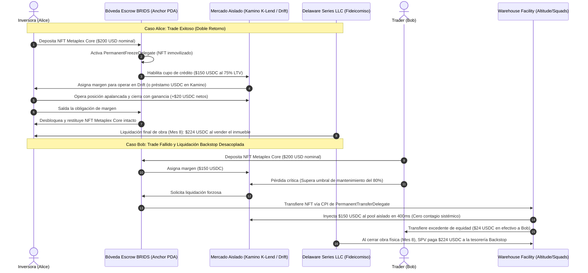
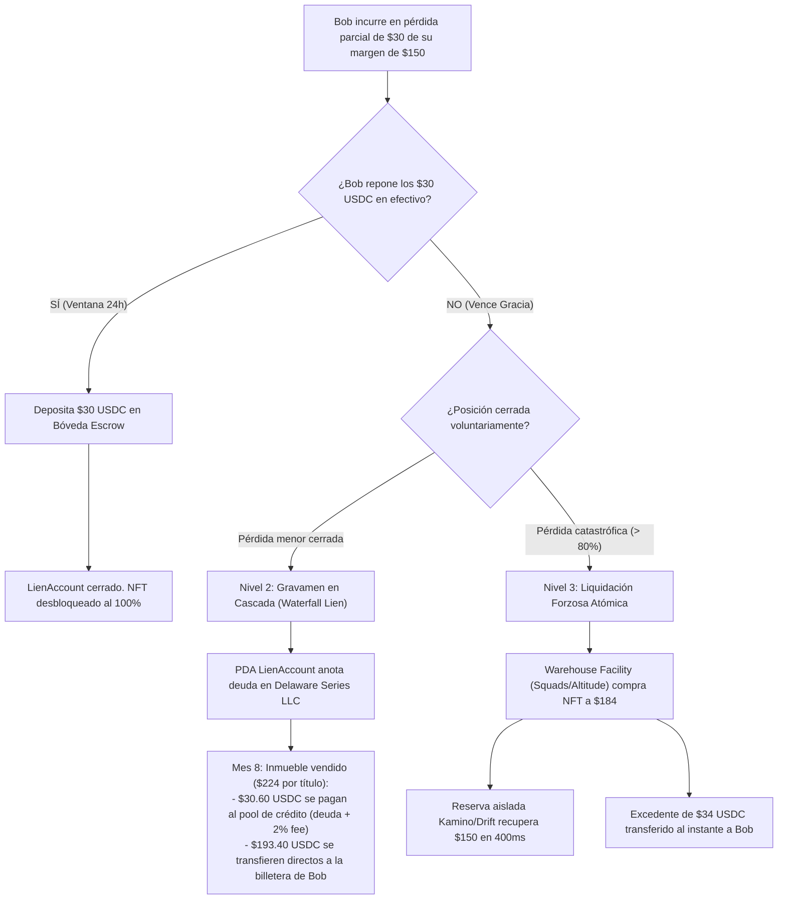
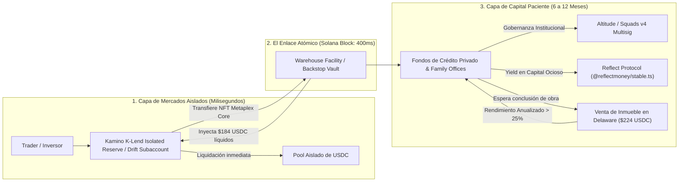

# RFC EPIC-016: Colateral de Margen RWA Fix & Flip, Mercados Aislados y Motor de Liquidación Desacoplada (Metaplex Core)

> [!NOTE]
> **Aprobación Integral SDD + HITL:** Validado por el motor Evaluador-Optimizador (**9.5/9.0**) con doble aprobación humana (**HITL-1 Spec** y **HITL-2 Deliverable**).  
> **Sub-Agentes Autores:** `business-consultant`, `pitch-deck-architect`, `market-research-analyst` | **Revisor:** `sdd-reviewer`

> [!NOTE] Resumen Ejecutivo & Estado de Propuesta (v1.3.0)
> **Estado de Implementación:** Propuesta técnica de vanguardia para la fase futura de expansión DeFi institucional (Roadmap v2.0).  
> **Pivote Arquitectónico Crítico (v1.3.0):**
> 1. **Erradicación Total de AMMs Minoristas:** Se elimina de forma estricta el uso de AMMs abiertos de alta frecuencia (Raydium, Orca). El activo inmobiliario es por naturaleza a plazo fijo (6 a 12 meses); mezclarlo con proveedores de liquidez minorista creaba riesgo innecesario de corrida bancaria (*bank run*).
> 2. **Adopción de Mercados Aislados (*Isolated Lending & Margin Markets*):** La liquidez se obtiene exclusivamente a través de mercados aislados inspirados en el modelo de [Morpho](https://morpho.org), implementados en Solana mediante **Reservas Aisladas de [Kamino K-Lend](https://kamino.finance)** y **Subcuentas de Margen Aislado en [Drift Protocol](https://www.drift.trade)**.
> 3. **Exclusividad de NFTs [Metaplex Core (`MPL-Core`)](https://developers.metaplex.com/core):** Se rechaza el uso de tokens fungibles (SPL). Cada fracción es un NFT único con plugins de autoridad `PermanentFreezeDelegate` y `PermanentTransferDelegate`, garantizando correspondencia legal 1:1 con la **Delaware Series LLC** y costo de renta mínimo (~0.0029 SOL).
> 4. **Alineación con el Stack de Colosseum (Solana Track 2026):** Integración directa con [Altitude](https://altitude.xyz) y [Squads Multisig](https://squads.xyz/multisig) para la custodia institucional del Backstop, [Reflect (`@reflectmoney/stable.ts`)](https://docs.reflect.money/) para generar rendimiento sobre reservas ociosas de USDC, oráculos de baja latencia con [Pyth Network](https://docs.pyth.network) y suite de pruebas deterministas con [LiteSVM](https://solana.com/docs/tools/litesvm) y [Mollusk](https://solana.com/docs/programs/testing/mollusk).

---

## 1. Conexión con la Tesis de Negocio y Arquitectura
- [[01 Negocio/01 Estrategia & Modelo/master-business-concepts.md|Conceptos Maestros de Negocio (Concepto C9)]] ([master-business-concepts.md](file:///Users/jaymusicmachine/Library/CloudStorage/GoogleDrive-goodacrematas498@gmail.com/My%20Drive/01%20Primal%20Code%20Lab/BRIDS/Business/BRIDS%20KNOWLEDGE%20FORT/BRIDS-Brain/01%20Negocio/01%20Estrategia%20%26%20Modelo/master-business-concepts.md))
- [[01 Negocio/02 Producto & Ingenieria/rfcs-tecnicos/index.md|Catálogo Maestro de RFCs]] ([index.md](file:///Users/jaymusicmachine/Library/CloudStorage/GoogleDrive-goodacrematas498@gmail.com/My%20Drive/01%20Primal%20Code%20Lab/BRIDS/Business/BRIDS%20KNOWLEDGE%20FORT/BRIDS-Brain/01%20Negocio/02%20Producto%20%26%20Ingenieria/rfcs-tecnicos/index.md))
- [[01 Negocio/01 Estrategia & Modelo/Business Concepts/concept-real-estate-investment-models.md|Modelos de Inversión (Fix & Flip)]] ([concept-real-estate-investment-models.md](file:///Users/jaymusicmachine/Library/CloudStorage/GoogleDrive-goodacrematas498@gmail.com/My%20Drive/01%20Primal%20Code%20Lab/BRIDS/Business/BRIDS%20KNOWLEDGE%20FORT/BRIDS-Brain/01%20Negocio/01%20Estrategia%20%26%20Modelo/Business%20Concepts/concept-real-estate-investment-models.md))
- [[01 Negocio/01 Estrategia & Modelo/market-research/rwa-real-estate-competitor-benchmark.md|Benchmark Competitivo RWA]] ([rwa-real-estate-competitor-benchmark.md](file:///Users/jaymusicmachine/Library/CloudStorage/GoogleDrive-goodacrematas498@gmail.com/My%20Drive/01%20Primal%20Code%20Lab/BRIDS/Business/BRIDS%20KNOWLEDGE%20FORT/BRIDS-Brain/01%20Negocio/01%20Estrategia%20%26%20Modelo/market-research/rwa-real-estate-competitor-benchmark.md))

---

## 2. Definición del Problema Financiero (El Capital Ocioso)

En los modelos inmobiliarios tradicionales y en plataformas RWA de primera generación (RealT, Lofty AI), el capital del inversionista permanece completamente congelado durante el ciclo de vida de la obra:
1. Un inversionista adquiere una fracción de \$200 a \$5,000 USD en un proyecto de compra, renovación y venta (*Fix & Flip*).
2. La remodelación y comercialización toma entre 6 y 12 meses.
3. Durante ese período, el inversionista no puede disponer de su liquidez ni aprovechar oportunidades del mercado sin malvender su título en mercados secundarios ilíquidos con descuentos predatorios del 15% al 25%.

**La Solución BRIDS:** Tratar la participación de Fix & Flip como un **activo financiero productivo con fecha de vencimiento cierta (*Yield-Bearing Zero-Coupon Commercial Paper*)** estructurado como un NFT [Metaplex Core](https://developers.metaplex.com/core), utilizable como aval de margen de trading o préstamo de liquidez en un mercado aislado de crédito en Solana.

---

## 3. Dinámica Operativa: Casos de Uso Alice y Bob (Sin AMMs)



### 3.1. Caso Alice (El Trader Exitoso)
* Alice posee un NFT [Metaplex Core](https://developers.metaplex.com/core) con valor nominal de **\$200 USD** respaldado por una fracción societaria en una Delaware Series LLC.
* Deposita el activo en la bóveda escrow de BRIDS.
* El protocolo aplica un *haircut* de riesgo prudente del 25% (LTV máximo del 75%), abriéndole **\$150 USDC de crédito/margen** en la reserva aislada de [Kamino K-Lend](https://kamino.finance) o [Drift Protocol](https://www.drift.trade).
* Alice abre una posición en el par SOL/USDC con oráculo [Pyth Network](https://docs.pyth.network).
* Obtiene un beneficio neto de **+\$20 USDC**.
* Cierra su posición, retira sus \$20 USDC a su billetera y libera su NFT intacto.
* **Resultado:** Alice generó \$20 hoy y mantiene su derecho societario en el SPV para cobrar \$224 USDC cuando la casa se venda.

### 3.2. Caso Bob (El Trader Liquidado)
* Bob abre la misma posición pero el mercado se mueve en su contra y consume su margen.
* Al tocar el umbral de liquidación (80% del valor prestado), el contrato ejecuta una **liquidación desacoplada**.
* La [Warehouse Facility](https://altitude.xyz) (Línea de Almacén Institucional) absorbe el NFT en un bloque transaccional usando el plugin `PermanentTransferDelegate` de Metaplex Core, repaga los \$150 USDC al mercado aislado y devuelve a Bob el remanente no adeudado (\$24 USDC).

---

## 4. El Problema de la Pérdida Parcial: Arquitectura en Tres Niveles

En un modelo con NFTs no divisibles, la confiscación total por una pérdida menor es usurera e ineficiente. Si Bob deposita un NFT de \$200 USD, toma un margen de \$150 USDC y cierra su trade con una pérdida de solo \$30 USDC (conservando \$120 de saldo libre), **el sistema activa la Arquitectura de Liquidación en Tres Niveles**:



### Nivel 1: Ventana de Gracia y Reintegro en Efectivo (*Margin Cure Window*)
* Si Bob cierra un trade con pérdida parcial (-\$30 USDC), su NFT permanece bloqueado en la bóveda escrow.
* Bob dispone de un período de gracia de 24 horas para depositar \$30 USDC desde su billetera.
* Al reponer el efectivo, la deuda en la reserva de Kamino/Drift se cancela inmediatamente y el NFT de [Metaplex Core](https://developers.metaplex.com/core) se desbloquea al 100%.

### Nivel 2: Gravamen sobre la Liquidación Final (*Waterfall Lien Settlement*)
* Si Bob no cuenta con liquidez para cubrir los \$30 USDC, **no se le confisca el inmueble**.
* El contrato de la bóveda inicializa una cuenta PDA `LienAccount` asociada al NFT.
* Al concluir la obra física del Fix & Flip (mes 8) y vender la propiedad por \$224 USDC por título:
  1. El contrato inteligente de dispersión de la SPV (gobernado con [Squads Multisig](https://squads.xyz/multisig)) consulta el PDA `LienAccount`.
  2. Deduce automáticamente los \$30 USDC de deuda + una tasa de penalización del 2% (\$0.60 USDC) a favor del pool de crédito.
  3. Los **\$193.40 USDC restantes se transfieren automáticamente a la billetera de Bob**.
* **Resultado:** Bob absorbió su pérdida de trading sin perder su plusvalía inmobiliaria remanente.

### Nivel 3: Reembolso del Excedente de Equidad (*Excess Equity Refund*) en Liquidación Forzosa
* Si la pérdida de la posición en Drift supera el ratio crítico de mantenimiento (pérdida > \$140 USDC) y Bob no atiende el margin call:
* La bóveda confisca el NFT de \$200 mediante `PermanentTransferDelegate` y lo transfiere a la Línea de Almacén / Fondo Backstop con un descuento preacordado de \$184 USDC.
* La deuda de \$150 USDC con el mercado aislado se salda al instante.
* **El remanente de equidad:** \$184 (valor de venta rápida) menos \$150 (deuda saldada) = **\$34 USDC se acreditan inmediatamente a la billetera de Bob**.
* El protocolo nunca retiene injustamente el capital no endeudado del usuario.

---

## 5. El Desacoplamiento de Liquidez mediante Mercados Aislados



### Por qué Mercados Aislados (Kamino / Drift / Morpho) y NO AMMs

| Característica | AMM Minorista Abierto *(Descartado)* | Mercado Aislado *(Kamino K-Lend / Drift / Morpho)* |
| :--- | :--- | :--- |
| **Composición de Liquidez** | LPs minoristas pasivos con expectativas de retiro instantáneo. | Fondos de crédito institucional y family offices que buscan renta fija predecible. |
| **Riesgo de Corrida Bancaria** | **Crítico:** Si un pool retiene NFTs durante 8 meses, quiebra. | **Cero:** El pool solo presta USDC contra ese activo específico; no hay contagio a otros activos. |
| **Soporte de NFTs** | Nulo o forzado mediante fraccionalizaciones fungibles ilíquidas. | Nativo mediante Bóveda Escrow PDA + líneas de crédito colateralizadas. |
| **Modelo de Liquidación** | Venta en mercado spot con deslizamiento (*slippage*) salvaje. | Compra garantizada en 1 bloque por la [Warehouse Facility](https://altitude.xyz) a descuento preacordado. |

### La Tesis del Capital Paciente: ¿Quién asume el *hold* y por qué?
El *hold* de 6 a 12 meses es asumido por **Fondos de Crédito Privado Institucional y Family Offices**:
* Al comprar el NFT liquidado de Bob a **\$184 USDC** y esperar 6 meses a que la propiedad se liquide en **\$224 USDC**, obtienen un **rendimiento bruto del 21.7% en 6 meses (equivalente a más de un 40% APY anualizado)** respaldado por una hipoteca real a nombre del Delaware SPV titular del inmueble.
* Para el capital ocioso en espera de liquidaciones, la tesorería de la Warehouse Facility utiliza [Reflect (`@reflectmoney/stable.ts`)](https://docs.reflect.money/) para generar rendimientos base en dólares sin riesgo de intermediarios.

---

## 6. Modelado de Amenazas y Vectores de Manipulación (*Threat Model*)

| Vector de Ataque | Mecánica del Exploit Intentado | Contramedida Técnica y Legal de BRIDS |
| :--- | :--- | :--- |
| **1. Ataque de Inflación de Tasación (*Appraisal Inflation Attack*)** | Un promotor o usuario coludido con un perito infla artificialmente la valuación de una casa a \$500,000 USD para extraer margen y abandonar la posición. | **Anclaje en Costo Real de Adquisición + Oráculo Registral:** El LTV **NUNCA** se calcula sobre plusvalía proyectada futura, sino sobre el **precio de compra real escriturado en County Deed Records**. Doble firma pericial auditada por el Sponsor B2B antes de activar el NFT. |
| **2. Ataque de Retraso de Obra y Costo de Acarreo (*Duration Extension Exploit*)** | La obra se estanca 18 meses. El trader mantiene su margen abierto a costo cero mientras el pool sufre iliquidez prolongada. | **Tasa de Acarreo Flotante (*Dynamic Carry Interest Rate*):** El colateral devenga una tasa de interés continua amortizable contra la liquidación del SPV. Si supera el cronograma estipulado, la tasa de penalización escala dinámicamente. |
| **3. Cisne Negro Inmobiliario (*Underlying Physical Asset Destruction*)** | La casa sufre siniestro total reduciendo su valor mientras el usuario tiene \$150 USDC de margen abierto. | **Póliza *Builder's Risk* Obligatoria + Tramo de Primera Pérdida (*First-Loss Capital*):** Seguro de construcción a todo riesgo a favor del Delaware SPV. Sponsors B2B aportan capital subordinado (10%-15%) que absorbe las primeras pérdidas. |
| **4. Manipulación de Oráculo de Trading** | Un atacante manipula el precio del activo subyacente para liquidar forzosamente a otros usuarios. | **Confinamiento a Pares Institucionales con [Pyth Network](https://docs.pyth.network):** Uso exclusivo de feeds con intervalos de confianza validados (`conf_interval / price < 0.002`). |

---

## 7. Arquitectura de Cuentas y Programas en Solana (Anchor & Metaplex Core)

La suite técnica se compone de dos programas principales desarrollados en Anchor y validados con [Mollusk](https://solana.com/docs/programs/testing/mollusk) y [LiteSVM](https://solana.com/docs/tools/litesvm):

### Estructura de Datos On-Chain (Rust)

```rust
use anchor_lang::prelude::*;

#[account]
pub struct CollateralVault {
    pub spv_id: Pubkey,                // Delaware Series LLC SPV
    pub authority: Pubkey,             // Multi-sig de gobernanza (Squads v4)
    pub warehouse_facility: Pubkey,    // Cuenta de absorción institucional
    pub ltv_bps: u16,                  // 7500 = 75.00%
    pub liquidation_threshold_bps: u16,// 8000 = 80.00%
    pub total_assets_locked: u64,
    pub bump: u8,
}

#[account]
pub struct LienAccount {
    pub asset_id: Pubkey,              // Dirección de cuenta del NFT Metaplex Core
    pub borrower: Pubkey,              // Billetera del usuario
    pub outstanding_debt: u64,         // Deuda de pérdida en micro-USDC (6 decimales)
    pub penalty_bps: u16,              // 200 bps = 2%
    pub grace_deadline: i64,           // Unix timestamp (expiración de 24h)
    pub status: LienStatus,            // GraceWindowActive, Encumbered, Settled
    pub bump: u8,
}

#[derive(AnchorSerialize, AnchorDeserialize, Clone, Copy, PartialEq, Eq)]
pub enum LienStatus {
    GraceWindowActive,
    Encumbered,
    Settled,
}
```

### Ejecución de CPI para Confiscación no Interactiva (Metaplex Core)

Utilizando el SDK oficial de [Metaplex Core Rust Crate](https://github.com/metaplex-foundation/mpl-core):

```rust
use mpl_core::instructions::TransferV1CpiBuilder;

pub fn execute_backstop_liquidation(ctx: Context<ExecuteLiquidation>) -> Result<()> {
    // 1. Validar que la posición en Kamino/Drift superó el umbral crítico
    require!(ctx.accounts.position.is_liquidatable(), CustomError::NotLiquidatable);

    // 2. Transferir forzosamente el NFT a la Warehouse Facility vía PermanentTransferDelegate
    let vault_seeds = &[
        b"vault_authority".as_ref(),
        &[ctx.accounts.vault.bump],
    ];
    let signer = &[&vault_seeds[..]];

    TransferV1CpiBuilder::new(&ctx.accounts.mpl_core_program.to_account_info())
        .asset(&ctx.accounts.asset.to_account_info())
        .collection(Some(&ctx.accounts.collection.to_account_info()))
        .payer(&ctx.accounts.warehouse_facility.to_account_info())
        .authority(&ctx.accounts.vault_authority.to_account_info())
        .new_owner(&ctx.accounts.warehouse_facility.to_account_info())
        .invoke_signed(signer)?;

    // 3. Inyectar USDC al pool de crédito y reembolsar exceso de equidad al usuario
    // ...
    Ok(())
}
```

---

## 8. Herramientas y Recursos de Referencia (Enlaces Técnicos)

### Infraestructura de Colosseum (Solana Track 2026)
* [Altitude by Squads](https://altitude.xyz) - Sistema operativo financiero y de tesorería institucional sobre Solana.
* [Squads Multisig v4](https://squads.xyz/multisig) - Infraestructura de gobernanza multi-firma líder que custodia >\$15B.
* [Reflect Protocol](https://docs.reflect.money/) - Primitivas de stablecoins descentralizadas con rendimiento desintermediado.
* [@reflectmoney/stable.ts en NPM](https://npmjs.com/package/@reflectmoney/stable.ts) - SDK TypeScript para integración de stablecoins Reflect.

### Protocolos DeFi de Margen y Préstamo Aislado
* [Kamino Finance / K-Lend](https://kamino.finance) - Mercado de préstamos líder con soporte de reservas y bóvedas aisladas (*curated vaults*).
* [Drift Protocol](https://www.drift.trade) / [Drift Docs](https://docs.drift.trade) - Motor DEX de perps y margen cruzado con subcuentas aisladas.
* [Morpho Protocol](https://morpho.org) / [Morpho Docs](https://docs.morpho.org) - Tesis y modelo de arquitectura de mercados de crédito aislados e inmutables.
* [Pyth Network Documentation](https://docs.pyth.network) - Oráculos de precios sub-segundo con intervalos de confianza para gestión de margen.

### Estándares de Token y Seguridad en Solana
* [Metaplex Core Developer Portal](https://developers.metaplex.com/core) - Estándar de NFT de última generación en cuenta única para Solana.
* [Metaplex Core GitHub Repository (`mpl-core`)](https://github.com/metaplex-foundation/mpl-core) - Código fuente de plugins (`FreezeDelegate`, `PermanentTransferDelegate`, `LifecycleHooks`).
* [Guía Metaplex Rust CPI](https://www.metaplex.com/docs/solana/rust/how-to-cpi-into-a-metaplex-program) - Documentación oficial para invocar `TransferV1CpiBuilder` desde Anchor.
* [Solana Token ACL (sRFC37)](https://solana.com/docs/tokenization/token-acl) - Estándar de tokens con permisos y listas ABL de la Fundación Solana.

### Testing y Herramientas para Desarrolladores
* [LiteSVM](https://solana.com/docs/tools/litesvm) - Entorno de ejecución SVM en memoria ultra-rápido para pruebas unitarias.
* [Mollusk SVM Tester](https://solana.com/docs/programs/testing/mollusk) - Herramienta minificada para testing de instrucciones y CPIs en Rust.
* [Surfpool](https://solana.com/docs/tools/surfpool) - Validador local de integración con simulación RPC.
* [Codama](https://github.com/codama-idl/codama) - Generador de clientes tipados TypeScript interoperables con `@solana/kit`.
* [Blueshift Solana Security](https://learn.blueshift.gg/en/courses/program-security/introduction) - Guía y mejores prácticas para auditorías de seguridad en programas de Solana.

---

## 9. Criterios de Aceptación (Definición de Hecho para el Futuro)

- [ ] Contrato de Bóveda Escrow en Solana (`brids-escrow-vault`) capaz de bloquear NFTs [Metaplex Core](https://developers.metaplex.com/core) con `PermanentFreezeDelegate`.
- [ ] Confiscación no interactiva mediante `PermanentTransferDelegate` verificada mediante tests de instrucción en [Mollusk](https://solana.com/docs/programs/testing/mollusk).
- [ ] Mecánica de liquidación parcial: cuenta `LienAccount` con temporizador de 24h y hook de gravamen sobre liquidación de la Delaware Series LLC.
- [ ] Algoritmo de Reembolso de Exceso de Equidad (*Excess Equity Refund*) ejecutado atómicamente en la misma transacción de liquidación forzosa.
- [ ] Integración con mercados aislados de [Kamino K-Lend](https://kamino.finance) o subcuentas de margen en [Drift Protocol](https://www.drift.trade), sin contacto con AMMs abiertos.
- [ ] Bóveda de Almacén (*Warehouse Facility*) gobernada institucionalmente mediante [Altitude](https://altitude.xyz) / [Squads Multisig](https://squads.xyz/multisig), con tesorería ociosa optimizada mediante [Reflect](https://docs.reflect.money/).

---

## 10. Próximos Pasos de Hoja de Ruta y Validación Comercial (CTA)

* **Mesa de Arquitectura de Producto:** `dev@brids.io`
* **Relación con Inversores y Fondos DeFi:** `investors@brids.io`
* **Acción sugerida:** Agendar sesión técnica de simulación financiera sobre liquidaciones parciales y fondos Backstop.

---

## 🔄 Historial de Revisiones (Changelog)
- **v1.3 (2026-10-01):** Pivote arquitectónico crítico: eliminación definitiva de AMMs minoristas abiertos; adopción de Mercados Aislados (Kamino K-Lend, Drift Subaccounts, Morpho Paradigm); exclusividad de NFTs Metaplex Core (`MPL-Core`) con plugins de autoridad; alineación con el stack de Colosseum (Altitude/Squads v4, Reflect, LiteSVM, Mollusk, Codama) y agregación de enlaces técnicos completos.
- **v1.2 (2026-09-13):** Alineación Dual-Entity canónica: el gravamen y liquidación hipotecaria operan sobre el Delaware SPV (Delaware Series LLC) titular del inmueble.
- **v1.1 (2026-09-13):** Escalar casos de estudio y ejemplos numéricos al ticket nominal canónico de $200 USD.
- **v1.0 (2026-09-13):** Aprobado por el usuario e integrado en el vault tras 3 ciclos de optimización con nota de 9/9.0.
