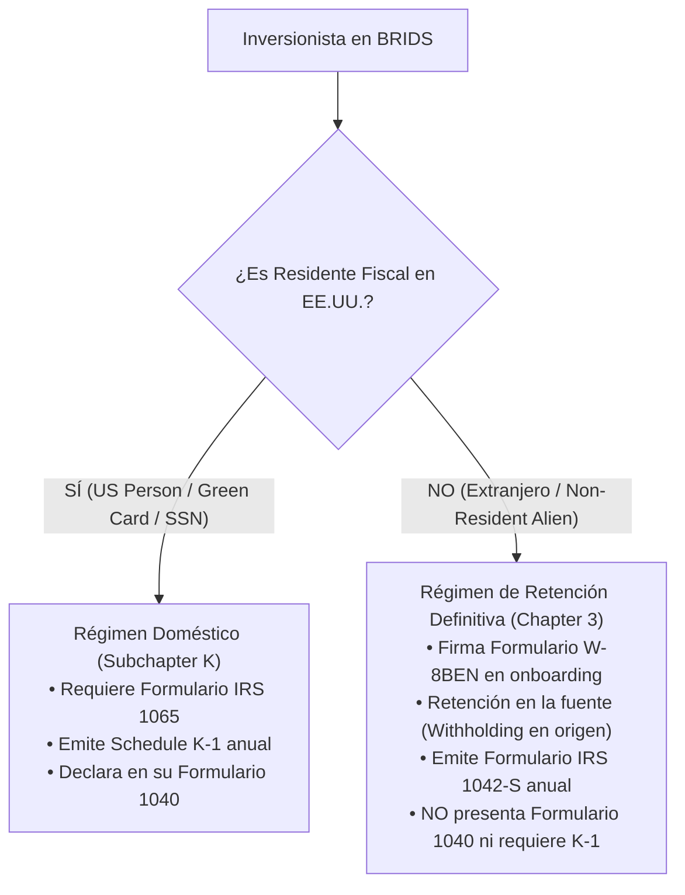

# Flujo de Onboarding Fiscal para Inversionistas Internacionales
## Automatización de Formularios W-8BEN, Liquidación de Retenciones y Emisión del Formulario IRS 1042-S

> [!NOTE] Propósito del Documento
> Guía operativa y regulatoria que detalla cómo BRIDS administra el cumplimiento fiscal para **inversionistas no residentes en EE.UU. (Non-Resident Aliens - NRAs)**. 
> Explica por qué los inversionistas internacionales **NO reciben Formulario K-1**, cómo un solo formulario ampara la compra de **múltiples fracciones (1 a 500+ NFTs)**, y cómo se automatiza la emisión del **Formulario 1042-S** vía API a un costo marginal inferior a **\$1.50 USD por inversionista/año**.

---

## 🧭 Índice
1. [El Principio Tributario del IRS: ¿Por qué los Extranjeros NO Reciben K-1?](#1-el-principio-tributario-del-irs-por-qué-los-extranjeros-no-reciben-k-1)
2. [El Onboarding Digital: Firma del Formulario W-8BEN en 30 Segundos](#2-el-onboarding-digital-firma-del-formulario-w-8ben-en-30-segundos)
3. [La Regla de Múltiples Fracciones: 1 Inversionista = 1 Solo Formulario](#3-la-regla-de-múltiples-fracciones-1-inversionista--1-solo-formulario)
4. [Mecánica de Liquidación de Rentas y Retención en la Fuente (*Withholding*)](#4-mecánica-de-liquidación-de-rentas-y-retención-en-la-fuente-withholding)
5. [Cierre Anual Automatizado con el IRS: El Formulario 1042-S](#5-cierre-anual-automatizado-con-el-irs-el-formulario-1042-s)
6. [Tres Ejemplos Ilustrativos con Números Reales](#6-tres-ejemplos-ilustrativos-con-números-reales)
   - 6.1. Ejemplo 1: Inversionista Minorista de Entrada (1 Fracción = $200 USD)
   - 6.2. Ejemplo 2: Inversionista Mediano / Whale (500 Fracciones = $100,000 USD)
   - 6.3. Ejemplo 3: Inversionista con Portafolio en 3 Proyectos Distintos
7. [Arquitectura de Costos y APIs Homologadas](#7-arquitectura-de-costos-y-apis-homologadas)

---

## 1. El Principio Tributario del IRS: ¿Por qué los Extranjeros NO Reciben K-1?

En la normativa fiscal de Estados Unidos (*Internal Revenue Code - Capítulo 3, §§ 1441 y 1442*), existe una segregación obligatoria según la residencia fiscal del inversionista:



### Por qué esto protege la economía del proyecto:
1. **Sin Obligación de Declaración en EE.UU.:** El inversionista internacional no tiene SSN ni ITIN, no presenta declaración de renta personal en EE.UU., y el Schedule K-1 no tiene utilidad jurídica para él.
2. **Cumplimiento por Retención:** El IRS exige al pagador (*Withholding Agent* / SPV) que retenga el impuesto correspondiente en el momento de dispersar el rendimiento y emita un comprobante anual: el **Formulario IRS 1042-S**.
3. **Erradicación del Cuello de Botella Contable:** Como la gran mayoría de los usuarios de cripto/RWA iniciales son internacionales (LatAm, Europa, Asia), **más del 70% de la base de inversionistas no genera costos de K-1**.

---

## 2. El Onboarding Digital: Firma del Formulario W-8BEN en 30 Segundos

Bajo las regulaciones del Tesoro (*26 CFR § 1.1441-1(e)(4)*), el Formulario W-8BEN puede recopilarse y firmarse de forma **100% electrónica**:

```
┌─────────────────────────────────────────────────────────────────────────────┐
│                 FLUJO DE ENROLLMENT TRIBUTARIO EN BRIDS                     │
└─────────────────────────────────────────────────────────────────────────────┘

  [ PASO 1: VERIFICACIÓN BIOMÉTRICA KYC ]
  • El usuario escanea su pasaporte o cédula nacional oficial + selfie biométrico.
  • Validación en tiempo real con Stripe Identity (cumplimiento AML/OFAC).
                     │
                     ▼
  [ PASO 2: GENERACIÓN DINÁMICA DEL FORMULARIO W-8BEN ]
  • El sistema precarga automáticamente los campos oficiales:
    - Nombre legal completo (según pasaporte).
    - País de ciudadanía y residencia fiscal permanente.
  • El usuario aporta su ID tributario local (Foreign Tax Identifying Number):
    - México: RFC | España: DNI/NIE | Colombia: RUT / Cédula | Argentina: CUIT
                     │
                     ▼
  [ PASO 3: FIRMA DIGITAL CON 1 CLIC & DETECCIÓN DE TRATADOS ]
  • Firma electrónica vinculante con marca de tiempo y hash criptográfico.
  • El software identifica automáticamente si el país tiene tratado fiscal con EE.UU.
  • Validez legal: Válido durante el año de firma más 3 años calendario completos.
```

---

## 3. La Regla de Múltiples Fracciones: 1 Inversionista = 1 Solo Formulario

> [!IMPORTANT] Regla Canónica del IRS
> Los formularios tributarios del IRS certifican a la **persona jurídica o natural (*Beneficial Owner*)** y sus flujos acumulados, **no a cada activo, contrato o NFT individual**.

Si un inversionista adquiere **500 fracciones (NFTs)** en un proyecto:
* **En el Onboarding:** Firma **UN SOLO Formulario W-8BEN**. No firma 500 formularios. Ese único documento ampara todas las fracciones compradas y tiene una vigencia legal de 3 años.
* **En el Cierre Fiscal Anual:** Recibe **UN SOLO Formulario IRS 1042-S**. El documento consolida el total de ingresos generados por sus 500 fracciones y el total retenido.

### Comparativa de Volumen de Formularios:

| Número de Fracciones Adquiridas | Inversión Total (\$200 c/u) | W-8BEN a Firmar | Formularios 1042-S Emitidos al Año | Costo Anual de Emisión de Tax |
| :---: | :---: | :---: | :---: | :---: |
| **1 Fracción** | \$200 USD | **1** | **1** | ~\$0.63 – \$1.30 USD |
| **50 Fracciones** | \$10,000 USD | **1** | **1** | ~\$0.63 – \$1.30 USD |
| **500 Fracciones** | \$100,000 USD | **1** | **1** | ~\$0.63 – \$1.30 USD |
| **2,500 Fracciones** | \$500,000 USD | **1** | **1** | ~\$0.63 – \$1.30 USD |

> 💡 **Conclusión Financiera:** El costo administrativo y contable de procesar a un inversionista grande (\$100,000 USD) es exactamente el mismo que el de un inversionista de \$200 USD: **aproximadamente un dólar al año**.

---

## 4. Mecánica de Liquidación de Rentas y Retención en la Fuente (*Withholding*)

Cuando el inmueble produce rentas o plusvalías, la plataforma ejecuta la retención automáticamente en el contrato de dispersión on-chain (Squads Protocol):

### A. Tasas Aplicables
1. **Tasa Estatutaria Estándar (Sin Tratado):** **30%** sobre el rendimiento neto distribuido (para países sin convenio bilateral con EE.UU., como Argentina, Brasil o Emiratos Árabes).
2. **Tasa Reducida por Tratado Bilateral de Doble Imposición:** Si el inversionista reside en un país con tratado vigente, la retención disminuye según el convenio:
   * **España:** 10%
   * **México:** 10%
   * **Reino Unido / Alemania:** 0% a 15% (según tipo de ingreso de capital).

### B. Ejecución de la Retención
$$\text{Distribución Bruta} = \text{Retención en la Fuente (Custodia Fiscal)} + \text{Distribución Neta en Billetera}$$

Los fondos retenidos se transfieren automáticamente a la subcuenta bancaria o billetera de reserva tributaria del SPV para su posterior liquidación ante el IRS, garantizando que el promotor nunca caiga en morosidad fiscal.

---

## 5. Cierre Anual Automatizado con el IRS: El Formulario 1042-S

Entre enero y marzo de cada año, el SPV completa su ciclo tributario mediante el orquestador contable de BRIDS:

1. **Declaración Anual del SPV (*Formulario 1042*):** Es la declaración resumen que el SPV radica ante el IRS reportando el total de pagos efectuados a extranjeros y liquidando el dinero retenido.
2. **Generación y Radicación Masiva del Formulario 1042-S vía API:**
   * El sistema exporta la base consolidada de inversionistas y la transmite mediante API a plataformas homologadas ante el IRS (**Track1099 de Avalara** o **Tax1099**).
   * El API radica electrónicamente los formularios ante el IRS y genera los archivos PDF oficiales.
   * **Entrega Inmediata:** El PDF del Formulario 1042-S se almacena directamente en el panel de control del usuario en BRIDS, disponible para descarga en un clic.

### ¿Para qué le sirve el Formulario 1042-S al inversionista en su país?
El inversionista entrega su Formulario 1042-S a su contador local en su país de residencia. Con base en los convenios de doble tributación o leyes locales de renta mundial, el usuario utiliza los impuestos retenidos en EE.UU. como un **Crédito Fiscal (*Foreign Tax Credit*)**, evitando pagar impuestos dos veces por el mismo rendimiento.

---

## 6. Tres Ejemplos Ilustrativos con Números Reales

---

### 6.1. Ejemplo 1: Inversionista Minorista de Entrada (1 Fracción)
* **Perfil:** Carlos M., residente en Bogotá, Colombia.
* **Inversión:** Compra **1 fracción (NFT)** por **\$200 USD** en el proyecto *"Austin Multi-Family SPV LLC"*.
* **Onboarding:**
  * Escanea su cédula colombiana en Stripe Identity.
  * Firma digitalmente su Formulario **W-8BEN** indicando su RUT colombiano. Tiempo total: **35 segundos**.
* **Operación Anual:**
  * La fracción genera un rendimiento del 8% anual: **\$16.00 USD brutos**.
  * Al no tener tratado de tasa reducida para dividendos inmobiliarios con Colombia, se aplica la tasa estatutaria del 30%:
    * Retención fiscal: **\$4.80 USD**.
    * Cobro neto en su billetera en USDC: **\$11.20 USD**.
* **Cierre Anual:**
  * En febrero, BRIDS emite su **Formulario IRS 1042-S** a través del API de Track1099 por un costo de **\$1.30 USD**.
  * Carlos descarga su PDF desde el portal de BRIDS.

---

### 6.2. Ejemplo 2: Inversionista Mediano / Whale (500 Fracciones)
* **Perfil:** Javier R., inversor de Madrid, España.
* **Inversión:** Adquiere **500 fracciones (NFTs)** por un total de **\$100,000 USD** en el mismo proyecto.
* **Onboarding:**
  * Escanea su pasaporte español y aporta su DNI/NIF.
  * Firma **UN SOLO Formulario W-8BEN**.
  * El sistema detecta el Convenio Fiscal España–EE.UU. y parametriza su retención preferencial al **10%**.
* **Operación Anual:**
  * Sus 500 fracciones generan **\$8,000 USD brutos** de rendimiento anual.
  * Retención aplicada (10%): **\$800 USD**.
  * Cobro neto en su cuenta/billetera: **\$7,200 USD**.
* **Cierre Anual:**
  * Recibe **UN SOLO Formulario 1042-S** que resume:
    * *Total Gross Income (Box 2):* **\$8,000 USD**.
    * *Federal Tax Withheld (Box 7):* **\$800 USD**.
  * **Costo de emisión para BRIDS:** **\$1.30 USD** (exactamente lo mismo que el inversor de \$200).
  * Javier presenta el 1042-S ante la Agencia Tributaria (Hacienda) en España y se deduce los \$800 USD de su IRPF por doble imposición internacional.

---

### 6.3. Ejemplo 3: Inversionista con Portafolio en 3 Proyectos Distintos
* **Perfil:** Sofía L., inversora de Ciudad de México.
* **Inversión:** Tiene capital diversificado en tres SPVs distintos dentro de BRIDS:
  * Proyecto A (Dallas): 50 fracciones (\$10,000 USD).
  * Proyecto B (Austin): 100 fracciones (\$20,000 USD).
  * Proyecto C (Miami): 50 fracciones (\$10,000 USD).
* **Onboarding:**
  * Firmó su **W-8BEN una sola vez** al crear su cuenta en BRIDS. No tuvo que volver a firmar al comprar en el Proyecto B ni en el C.
* **Cierre Anual:**
  * Al tratarse de 3 sociedades emisoras (*Issuer SPVs*) distintas, el sistema emite **tres Formularios 1042-S** (uno por cada SPV/proyecto).
  * Los tres documentos se cargan automáticamente en su panel de usuario de BRIDS.
  * Costo total de cumplimiento para la plataforma: 3 $\times$ \$1.30 = **\$3.90 USD al año**.

---

## 7. Arquitectura de Costos y APIs Homologadas (Benchmark Completo)

A continuación se detalla la matriz completa de plataformas autorizadas por el IRS integradas en la arquitectura de cumplimiento de BRIDS, cubriendo tanto la vía de sociedades (1065 / K-1) como de declaraciones informativas (1042-S / 1099-DIV) y verificación KYC:

| Plataforma / Proveedor | Qué Formularios Maneja | Costo de Acceso / API | Costo por Formulario / Volumen | Entrega Digital al Inversionista | Enlace Oficial de Precios |
| :--- | :--- | :---: | :---: | :---: | :--- |
| **TaxZerone** *(IRS Authorized)* | **Form 1065 + Schedule K-1s** *(Sociedad e Inversores US)* | **\$0** (Pay-as-you-go) | **\$179.99 USD tarifa plana por SPV** *(Incluye generación y e-file de todos los K-1s de los socios)* | Bóveda digital y descarga en PDF | 🔗 [taxzerone.com/pricing](https://www.taxzerone.com/partnership-tax-filing/form-1065-efile.html) |
| **Tax1099 (Zenwork)** | **Form 1042-S** *(Extranjeros)* y **1099-DIV** *(Feeder)* | **\$349 USD/año** *(Plan Scale con API REST)* | • 1–20 forms: **\$2.99**<br>• 21–150: **\$2.30**<br>• 151–500: **\$1.31**<br>• 501–1,000: **\$0.68**<br>• >1,000: **<\$0.50** | **\$0.25** por e-delivery al portal | 🔗 [tax1099.com/pricing](https://www.tax1099.com/pricing) |
| **Track1099 (Avalara)** | **Form 1042-S** *(Extranjeros)* y **1099-DIV** *(Feeder)* | **\$0** (Sin cuota anual base) | • 1–15 forms: **\$3.10**<br>• 16–165: **\$2.30**<br>• 166–500: **\$1.30**<br>• 501+: **\$0.63** | **\$0 (Gratis e-delivery por email/portal)** | 🔗 [avalara.com/track1099](https://www.avalara.com/us/en/products/1099/pricing.html) |
| **AngelList / Allocations** | **Form 1065 + K-1s Masivos** *(Back-Office SPV)* | Incluido en suite SPV | **\$1,500 – \$2,500 USD tarifa plana anual por SPV** *(Preparación completa 1065 + K-1s ilimitados)* | Portal digital integrado para LPs | 🔗 [allocations.com/pricing](https://www.allocations.com/pricing) |
| **Yearli (Greatland)** | **1099-DIV, 1099-MISC, W-2** *(Información general)* | Desde **\$99 USD/año** | • De **\$0.79 a \$2.49 USD** por formulario según volumen | Portal de descarga para inversionistas | 🔗 [yearli.greatland.com](https://yearli.greatland.com/pricing) |
| **Stripe Identity** | **Verificación KYC / Pasaporte** | **\$0** fijo mensual | **~\$1.50 – \$2.50 USD** por verificación completada | En checkout digital | 🔗 [stripe.com/identity](https://stripe.com/identity) |

---

## 8. Conclusión para el Desarrollador Inmobiliario

Para el promotor o General Partner, este flujo elimina de raíz el miedo a la gestión tributaria de inversionistas masivos:

1. **Cero Carga Operativa:** El desarrollador no gestiona formularios, no persigue firmas y no interactúa con contadores para reportar a los LPs extranjeros.
2. **Cero Riesgo de Multas IRS:** Al retener en el momento del pago, el SPV está 100% al día con sus obligaciones tributarias de no residentes.
3. **Costo Marginal Irrisorio:** Liquidar los impuestos de 500 inversionistas internacionales cuesta apenas **~\$500 a \$650 USD al año** a través del API de Track1099, frente a los \$100,000 USD que costaría hacer K-1s analógicos.
