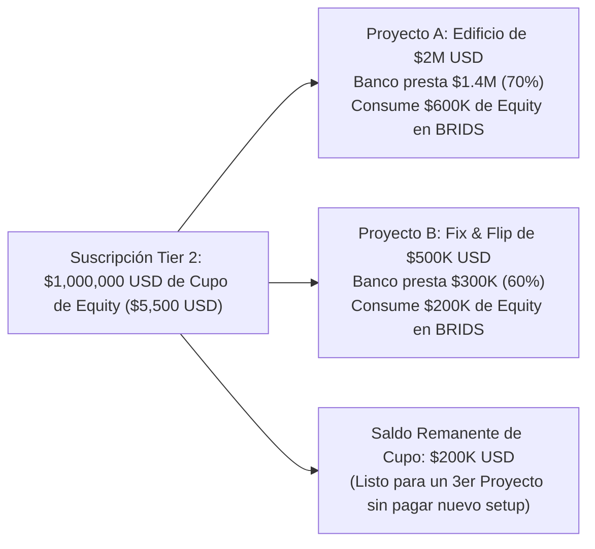

# Estrategia de Pricing B2B: Modelo por Cupo de Recaudo de Equity
## La Arquitectura Comercial Oficial para Desarrolladores Inmobiliarios

> 📌 **Propósito de este Documento:**  
> Alinear con el socio desarrollador el **modelo comercial definitivo de BRIDS**.  
> Tras analizar cómo opera el financiamiento inmobiliario real, **descartamos el cobro por "edificio individual"** (que castiga al promotor apalancado con bancos) y adoptamos como modelo oficial la **Suscripción por Capacidad Acumulada de Recaudo de Equity (Capital Stack)**.

---

## 1. Por Qué Descartamos Cobrar "Por Edificio Fijo"

En una primera aproximación, se evaluó cobrar una tarifa fija cada vez que un desarrollador sube un edificio a la plataforma. Sin embargo, cualquier desarrollador profesional nota de inmediato dos fallas graves:

1. **Castiga el Apalancamiento Bancario (El Capital Stack Real):**  
   Si un promotor adquiere un inmueble de **\$2,000,000 USD**, casi nunca levanta \$2M de equity. El banco financia el 70% (**\$1,400,000 USD** en crédito hipotecario/constructor). El capital que el sponsor realmente necesita sindicar en BRIDS son solo **\$600,000 USD**. Cobrarle una tarifa como si el proyecto fuera de \$2M es absurdo e injusto.
2. **Bloquea los Proyectos Pequeños y Medianos:**  
   Un promotor de *Fix & Flip* o vivienda unifamiliar puede tener dos o tres proyectos en marcha de \$150k a \$250k de equity cada uno. Exigirle pagar un setup completo por cada casa lo ahuyenta de inmediato hacia métodos informales.

Por estas razones, **nuestro modelo se basa en lo que realmente aporta la plataforma: la colocación de capital propio (Equity).**

---

## 2. La Base de Nuestros Costos Internos: Crear el SPV nos cuesta \$350 USD

Antes de fijar los precios, la regla de oro es tener claridad absoluta de lo que **nos cuesta a nosotros en dinero real** habilitar un proyecto:

| Concepto de Costo Directo | Proveedor / Riel | Costo Real Neto para BRIDS | Qué nos Entregan |
| :--- | :--- | :---: | :--- |
| **Constitución de LLC en EE.UU. (SPV)** | Stablecorp (Xelio Tech) | **\$299 – \$350 USD** | Registro de estatutos, Registered Agent por 1 año y Operating Agreement. |
| **EIN Remoto con el IRS** | IRS vía Stablecorp | **\$0 USD** | Tramitación remota sin SSN/ITIN para socios extranjeros. |
| **Cuenta Bancaria Comercial en EE.UU.** | Stablecorp / Bridge | **\$0 USD** | Cuenta corporativa en USD con rieles de liquidación fiat y USDC. |
| **Bóveda Multifirma (Squads Protocol)** | Solana Network | **~\$4 USD** (~0.02 SOL) | Cuenta de tesorería 2-de-3 para dispersión transparente de obra y rentas. |
| **Smart Contracts (Metaplex Core)** | Solana Network | **~\$10 USD** (~0.05 SOL) | Títulos digitales livianos con plugins de congelamiento y recuperación. |
| **COSTO TOTAL DIRECTO DE CREAR EL SPV** | — | **~\$350 USD** | **Este es nuestro costo real por cada nueva entidad.** |

*(Nota: Si operamos bajo la figura de **Series LLCs** en Delaware, Texas o Florida CS/SB 316, crear una nueva serie celular bajo la Master LLC nos cuesta apenas entre **\$0 y \$75 USD**).*

---

## 3. El Gancho de Entrada: El "Genesis Sponsor Program" (\$0 Setup Piloto)

Para que el desarrollador pruebe el sistema con **riesgo financiero CERO**:

> 🎯 **La Oferta Génesis:**  
> **\$0 USD de costo de software en su primer cupo de hasta \$500,000 USD de equity sindicado.**  
> Nosotros absorbemos los **\$350 USD** del costo del SPV y la tecnología en el primer proyecto.

### ¿Cómo recuperamos nosotros ese dinero?
BRIDS cobra una **tarifa fija de software de \$4 USD por cada fracción de \$200 USD emitida**:
* Para cubrir los **\$350 USD del SPV**, solo necesitamos que el proyecto venda **88 fracciones (\$17,600 USD)**.
* Al fondear el cupo de **\$500,000 USD** (2,500 fracciones), cobramos **\$10,000 USD** en tarifas de software. Menos los \$350 del SPV, nos quedan **\$9,650 USD de ganancia neta (96.5% de margen bruto)**.
* **El promotor no arriesgó capital de entrada, y BRIDS capturó casi \$10,000 USD en margen de software.**

---

## 4. El Modelo Definitivo: Suscripción por Capacidad Acumulada de Recaudo

El promotor compra una **Capacidad de Recaudo de Equity (Equity Allowance)** que puede consumir en **un solo proyecto grande o repartir en varios proyectos simultáneos**:

### Tabla Maestra de Precios y Márgenes de BRIDS

| Nivel de Suscripción | Cupo de Recaudo de Equity | Proyectos Típicos | Cuota de Suscripción (Fee) | Costo SPVs (BRIDS) | **Margen Neto Upfront** | Fracciones de \$200 USD | Ingreso por Fracciones (\$4) | **Ingreso Total BRIDS** |
| :--- | :---: | :---: | :---: | :---: | :---: | :---: | :---: | :---: |
| **Tier 1 (Piloto Génesis)** | **Hasta \$500,000 USD** | 1 a 2 proyectos | **\$0 USD** *(Bonificado)* | ~\$350 USD | *(Repago con 88 tickets)* | Hasta 2,500 | Hasta \$10,000 USD | **Hasta \$9,650 USD** |
| **Tier 1 (Renovación)** | **Hasta \$500,000 USD** | 1 a 2 proyectos | **\$3,500 USD** | ~\$350 USD | **\$3,150 USD (90.0%)** | Hasta 2,500 | Hasta \$10,000 USD | **Hasta \$13,150 USD** |
| **Tier 2** | **Hasta \$1,000,000 USD** | 1 a 3 proyectos | **\$5,500 USD** | ~\$350–\$700 USD | **\$4,800 USD (87.2%)** | Hasta 5,000 | Hasta \$20,000 USD | **Hasta \$24,800 USD** |
| **Tier 3** | **\$1M a \$3,000,000 USD** | 2 a 5 proyectos | **\$8,500 USD** | ~\$700–\$1,050 USD | **\$7,450 USD (87.6%)** | Hasta 15,000 | Hasta \$60,000 USD | **Hasta \$67,450 USD** |
| **Tier 4 (Institucional)** | **Más de \$3,000,000 USD** | Cartera Ilimitada | **\$12,500 USD** | Variable | **>\$11,000 USD (88%)** | > 15,000 | > \$60,000 USD | **> \$71,000 USD** |

---

## 5. Manejo de Múltiples SPVs dentro del Cupo

Cada propiedad física requiere una entidad jurídica independiente para aislar pasivos frente a contratistas o hipotecas (*bankruptcy-remote*):

1. **Primer SPV del Cupo:** 100% cubierto dentro del fee de la suscripción (o bonificado en el Piloto).
2. **Proyectos Adicionales dentro del Mismo Cupo:**
   * **Vía Series LLC (Delaware / Texas / Florida CS/SB 316):** Desplegar una nueva serie celular bajo la Master LLC nos cuesta apenas **\$15 a \$75 USD**. Incluimos **hasta 2 series gratis por tier**.
   * **Vía LLC Independiente Standalone:** Si el banco hipotecario exige una LLC tradicional independiente, se le factura el costo de radicación directo de Stablecorp (**\$350 USD al costo, con total transparencia**).

---

## 6. Ejemplos Ilustrativos con Números Reales de Real Estate

### 🏢 Ejemplo 1: El Edificio con Crédito Bancario (El Capital Stack Clásico)
* **El Negocio:** El promotor adquiere un edificio multifamiliar en Dallas por **\$2,000,000 USD**.
* **La Estructura de Capital:**
  * Banco local financia el 70%: **\$1,400,000 USD** de deuda senior.
  * Brecha de capital a sindicar en BRIDS: **\$600,000 USD de equity (30%)**.
* **Cómo Aplica el Modelo:**
  * El promotor no paga por los \$2,000,000 USD de la propiedad.
  * Contrata el **Tier 2 (\$5,500 USD por \$1,000,000 USD de cupo)**.
  * Consume \$600,000 USD de equity para este edificio.
  * **Le quedan \$400,000 USD de saldo en su cupo** para sindicar su siguiente proyecto sin pagar un solo dólar más de setup de software.
* **Resultado Financiero para BRIDS:**
  * Fee de suscripción: \$5,500 USD - \$350 (SPV) = **\$5,150 USD netos**.
  * Fracciones de \$200 USD emitidas (\$600k $\div$ \$200 = 3,000 fracciones $\times$ \$4): **\$12,000 USD**.
  * **Ingreso Total para BRIDS: \$17,150 USD** (y el sponsor tiene saldo pendiente para traernos el siguiente deal).

---

### 🏡 Ejemplo 2: Dos Casas de Remodelación Simultáneas (Multi-Project Bundle)
* **El Negocio:** Un promotor de Fix & Flip en Florida tiene dos adquisiciones simultáneas:
  * Casa 1 (Orlando): Valor \$400k. Crédito puente \$250k. **Equity a sindicar: \$150,000 USD**.
  * Casa 2 (Tampa): Valor \$550k. Crédito puente \$300k. **Equity a sindicar: \$250,000 USD**.
  * **Total Equity Combinado: \$400,000 USD**.
* **Cómo Aplica la Oferta Génesis:**
  * Ambos proyectos suman \$400k de equity $\rightarrow$ **Caben 100% dentro del Piloto Génesis (\$0 USD de setup)**.
  * Casa 1 usa el SPV 1 (bonificado al 100%).
  * Casa 2 usa una sub-serie celular bajo nuestra Master LLC de Florida (costo on-chain ~\$15 USD que absorbemos).
* **Resultado para BRIDS:**
  * Cobramos \$4 USD por cada fracción emitida (\$400k $\div$ \$200 = 2,000 fracciones $\times$ \$4 USD): **\$8,000 USD de revenue**.
  * Menos \$365 USD de costo de SPVs = **\$7,635 USD de ganancia neta en el "piloto gratis"**.
  * El promotor financió 2 propiedades por \$950k de valor combinado sin pagar un dólar de software. Cuando salga su 3er proyecto, renueva en Tier 1 (\$3,500 USD).

---

## 7. La Solución al Cuello de Botella Fiscal: Taxes, W-8BEN y Múltiples Fracciones (1 vs. 500 NFTs)

Una de las preguntas más frecuentes de cualquier desarrollador o contador es:  
> *"¿Qué pasa con los K-1s si entran cientos de inversionistas retail? ¿Y si un usuario compra 500 fracciones, tengo que hacerle 500 formularios?"*

La respuesta es **NO**:

### A. Los Extranjeros NO Usan K-1: Usan Formulario W-8BEN + Formulario 1042-S
* La mayoría de los inversionistas retail en la plataforma son internacionales (LatAm, Europa, Asia).
* El IRS **no les exige declaración anual Form 1040 ni emite Schedule K-1**.
* Firman su **Formulario W-8BEN digital en 30 segundos** durante el onboarding en BRIDS.
* Se les retiene el impuesto directamente en cada pago de renta (*withholding tax* del 10% al 30%) y a final de año se les emite un **Formulario IRS 1042-S** vía API (**Track1099** o **Tax1099**) por un costo de apenas **\$0.63 a \$1.30 USD por inversionista**.

### B. La Regla de Múltiples Fracciones: 1 Inversionista = 1 Solo Formulario
* El IRS reporta a la **persona**, no al token o fracción:
  * Si un inversionista compra **1 fracción (\$200 USD)**, firma **1 solo W-8BEN** y recibe **1 solo Formulario 1042-S** a fin de año.
  * Si un inversionista grande compra **500 fracciones (\$100,000 USD)**, firma **EXACTAMENTE 1 SOLO W-8BEN** (válido por 3 años) y recibe **EXACTAMENTE 1 SOLO Formulario 1042-S anual** que consolida el total de sus rendimientos (\$8,000 USD) y retenciones (\$800 USD).
* **Impacto Financiero:** Procesar contablemente a un inversionista de \$100,000 USD cuesta exactamente lo mismo que a uno de \$200 USD: **aproximadamente un dólar al año**.

> 📄 *Para el detalle técnico y legal completo, consulta:*  
> [[01 Negocio/03 Legal & Cumplimiento/flujo-onboarding-fiscal-inversores-internacionales-w8ben-1042s.md|Flujo de Onboarding Fiscal para Inversionistas Internacionales: Formulario W-8BEN y Formulario IRS 1042-S]]

---

## 8. Por Qué este Modelo Gana Siempre Frente a la Competencia

| Lo que Exige el Mercado | InvestNext / SyndicationPro | Blocksquare / DigiShares | **BRIDS.io (Cupo de Equity)** |
| :--- | :---: | :---: | :---: |
| **Barrera de Entrada (Día 1)** | \$5,988 USD (anual obligatorio) | \$5,990 USD / €35,000 EUR | **\$0 USD (Piloto hasta \$500k)** |
| **Cobra por Edificio o por Equity?** | Cobro mensual ciego | Cobro rígido por propiedad | **Por Equity Sindicado (Capital Stack)** |
| **¿Crea la Entidad Legal SPV?** | ❌ No (solo software) | ❌ No | ✅ **SÍ (Stablecorp)** |
| **¿Abre Cuenta Bancaria en EE.UU.?** | ❌ No | ❌ No | ✅ **SÍ (USD + USDC Bridge)** |
| **Incentivo para Traer Más Deals** | Ninguno (misma mensualidad) | Castigo: pagar \$6k por cada uno | **Incentivo: agotar el saldo de su cupo** |

---

## 9. Conclusión para la Reunión de Partners

Este modelo nos permite sentarnos con cualquier promotor inmobiliario y decirle:
> *"Entendemos tu negocio. Sabemos que el banco te presta el 70% y que lo que necesitas es resolver el 30% de equity. No te cobramos por edificio ni te metemos mensualidades ciegas. Te damos un cupo de capital sindicado, te entregamos la LLC y la cuenta bancaria listas, y tu primer proyecto de hasta \$500k de equity es gratis de software. Si no levantas, tu riesgo es cero."*

Es una propuesta que ningún abogado ni ninguna plataforma de software en EE.UU. puede igualar.
