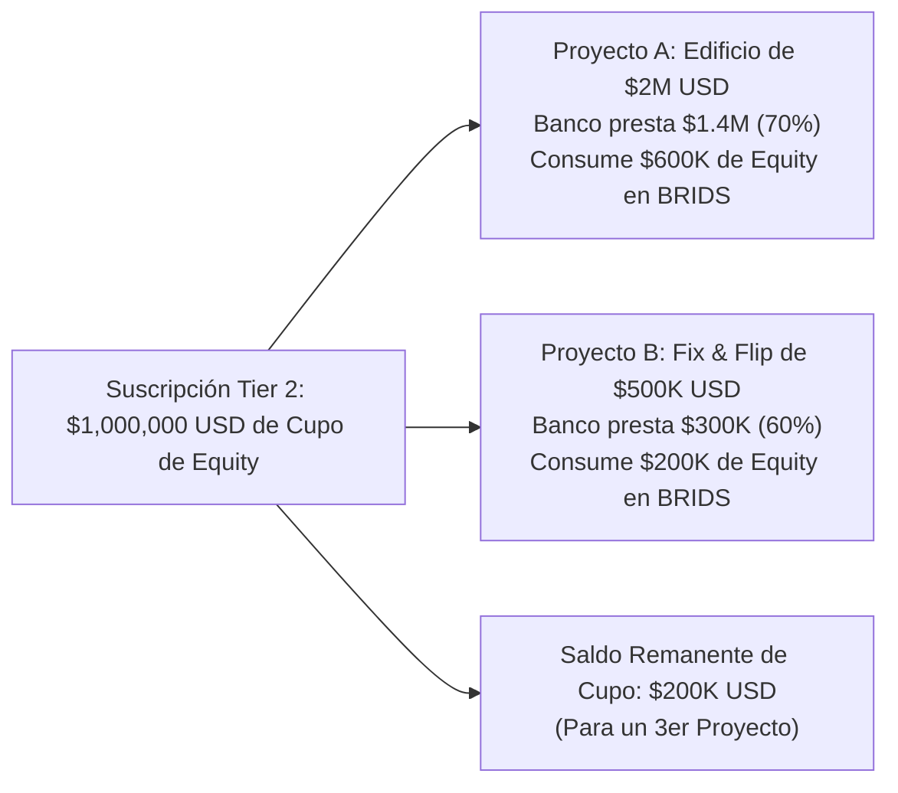

# Propuesta de Lanzamiento GTM: Genesis Sponsor Program & Comparativa de Modelos B2B

> [!NOTE] Propósito del Documento para Decisión del Equipo
> Este documento presenta la estrategia comercial Go-To-Market (GTM) para captar a los primeros **3 a 5 promotores inmobiliarios (Sponsors / GPs)** mediante una oferta de lanzamiento agresiva con **\$0 USD de costo de setup en su primer proyecto (SPV cubierto por BRIDS)**.
> 
> Para definir la estructura comercial definitiva, se detallan **dos modelos alternativos de pricing** con sus respectivas tablas de márgenes, tratamiento de SPVs y **ejemplos ilustrativos paso a paso basados en operaciones reales de Real Estate**.

---

## 🧭 Índice
1. [Fundamentos Financieros Comunes: El Costo Real del SPV](#1-fundamentos-financieros-comunes-el-costo-real-del-spv)
2. [El Gancho de Entrada: Oferta Génesis ($0 Setup Piloto)](#2-el-gancho-de-entrada-oferta-génesis-0-setup-piloto)
3. [POSIBILIDAD 1 — Modelo A: Setup Fijo por Edificio / Proyecto Individual](#3-posibilidad-1--modelo-a-setup-fijo-por-edificio--proyecto-individual)
   - 3.1. Estructura de Tiers por Tamaño de Proyecto
   - 3.2. Ejemplos Ilustrativos del Modelo A
4. [POSIBILIDAD 2 — Modelo B: Suscripción por Capacidad Acumulada de Recaudo (Equity Allowance)](#4-posibilidad-2--modelo-b-suscripción-por-capacidad-acumulada-de-recaudo-equity-allowance)
   - 4.1. La Realidad del Capital Stack Inmobiliario (Deuda Bancaria vs. Equity)
   - 4.2. Estructura de Tiers por Cupo de Equity Sindicado
   - 4.3. Tratamiento de Múltiples SPVs dentro del Cupo
   - 4.4. Ejemplos Ilustrativos del Modelo B
5. [Matriz Comparativa Cara a Cara: Modelo A vs. Modelo B](#5-matriz-comparativa-cara-a-cara-modelo-a-vs-modelo-b)
6. [Filtros de Seguridad y Candados Anti-Free-Riders](#6-filtros-de-seguridad-y-candados-anti-free-riders)
7. [Guía de Discusión y Votación para el Equipo](#7-guía-de-discusión-y-votación-para-el-equipo)
8. [Referencias y Documentos Vinculados](#8-referencias-y-documentos-vinculados)

---

## 1. Fundamentos Financieros Comunes: El Costo Real del SPV

Independientemente del modelo que elija el equipo, los costos directos que asume BRIDS para habilitar legal y técnicamente un proyecto son fijos gracias a los acuerdos con **Stablecorp** y la red **Solana**:

| Rubro Directo de Creación | Proveedor / Riel | Costo Real Neto para BRIDS | Detalle Operativo |
| :--- | :--- | :---: | :--- |
| **Constitución Societaria SPV (LLC)** | Stablecorp (Delaware / Wyoming) | **\$299 – \$350 USD** | Radicación de estatutos, Registered Agent (1 año) y Operating Agreement. |
| **EIN Remoto ante el IRS** | Form SS-4 vía Stablecorp | **\$0 USD** | Tramitación remota sin SSN/ITIN para fundadores/sponsors extranjeros. |
| **Banca Comercial en EE.UU. & Rampa** | Stablecorp / Bridge | **\$0 USD** | Cuenta bancaria corporativa en USD + rieles de liquidación fiat/USDC. |
| **Bóveda Multifirma Squads v4** | Solana Network | **~\$4 USD** (~0.02 SOL) | Exención de renta única on-chain (gobernanza 2-de-3 para obras y rentas). |
| **Colección de Smart Contracts** | Metaplex Core (Solana) | **~\$10 USD** (~0.05 SOL) | Títulos digitales livianos con plugins de Freeze y Recovery. |
| **Verificación KYC del Sponsor** | Stripe Identity | **~\$3 USD** | Verificación biométrica del representante del proyecto. |
| **COSTO TOTAL DIRECTO POR SPV** | — | **~\$316 – \$367 USD** | **Costo de Adquisición de Cliente (CAC) en efectivo.** |

*(Nota: En estructuras de **Series LLCs** como Texas TBOC o Florida CS/SB 316, crear una sub-serie celular adicional bajo la Master LLC cuesta solo **\$0 a \$75 USD**).*

---

## 2. El Gancho de Entrada: Oferta Génesis ($0 Setup Piloto)

Para derribar la resistencia del desarrollador en su primer contacto, ambos modelos comparten el mismo **anzuelo comercial de entrada**:

> 🎯 **La Promesa al Sponsor:**  
> *"Lanza tu primer proyecto sindicado con costo de software de \$0 USD. Nosotros absorbemos la creación de la entidad SPV en EE.UU. y el despliegue tecnológico completo en Solana. Tu riesgo financiero de prueba es CERO."*

### La Matemática del Repago del Piloto:
* BRIDS cobra su tarifa fija de software de **\$4 USD por cada fracción emitida de \$200 USD** (deducida en la dispersión on-chain o sumada al checkout).
* **Umbral de Break-Even:**  
  $$\text{Fracciones para recuperar el SPV} = \frac{\$350 \text{ USD}}{\$4 \text{ USD}} = \mathbf{88 \text{ fracciones}} \ (\approx \$17,600 \text{ USD fundados})$$
* Con solo fondear el **1.7%** de un proyecto de \$1,000,000 USD (o el 3.5% de uno de \$500k), los \$350 USD del SPV quedan 100% repagados. Todo lo demás es margen neto para BRIDS (>95%).

---

## 3. POSIBILIDAD 1 — Modelo A: Setup Fijo por Edificio / Proyecto Individual

En este modelo, el cobro B2B se asocia directamente a **cada propiedad o edificio que el promotor sube a la plataforma**. 

### 3.1. Estructura de Tiers por Tamaño de Proyecto

| Nivel de Proyecto | Tamaño Total del Proyecto | Setup Fee al Sponsor | Costo Real SPV para BRIDS | Margen Neto Upfront de BRIDS | Tarifa de Software por Fracción |
| :--- | :---: | :---: | :---: | :---: | :---: |
| **Proyecto #1 (Piloto)** | Hasta \$500,000 USD | **\$0 USD** *(Bonificado)* | ~\$350 USD | *(Repago con 88 fracciones)* | \$4 USD / fracción |
| **Tier 1 (Proyecto #2+)** | Hasta \$500,000 USD | **\$3,000 USD** | ~\$350 USD | **\$2,650 USD (88.3%)** | \$4 USD / fracción |
| **Tier 2** | \$500,000 – \$1,000,000 USD | **\$5,000 USD** | ~\$350 USD | **\$4,650 USD (93.0%)** | \$4 USD / fracción |
| **Tier 3** | \$1,000,000 – \$3,000,000 USD | **\$7,500 USD** | ~\$350 USD | **\$7,150 USD (95.3%)** | \$4 USD / fracción |
| **Tier 4** | Superior a \$3,000,000 USD | **\$10,000 USD** | ~\$350 USD | **\$9,650 USD (96.5%)** | \$4 USD / fracción |

---

### 3.2. Ejemplos Ilustrativos del Modelo A

#### 🏢 Ejemplo A.1: Edificio Boutique Mediano (Sponsor "Urban Heights LLC")
* **El Proyecto:** Edificio residencial de 8 apartamentos en Austin, Texas. Valuación de desarrollo: **\$850,000 USD**.
* **Aplicación del Modelo:** Entra en **Tier 2** (\$500k a \$1M USD).
* **Flujo Financiero para el Sponsor:**
  * Paga a BRIDS un Setup Fee de **\$5,000 USD**.
  * Recibe su Delaware/Texas LLC constituida, cuenta bancaria en USD/USDC, smart contracts y portal de venta.
  * Frente a los \$30,000 USD que le cotizaba su abogado tradicional de valores por redactar un PPM analógico, el sponsor **se ahorra \$25,000 USD de arranque**.
* **Flujo Financiero para BRIDS:**
  * Ingreso Upfront: \$5,000 USD - \$350 USD (costo SPV) = **\$4,650 USD netos**.
  * Ingreso por Fracciones: \$850,000 USD $\div$ \$200 USD = 4,250 fracciones $\times$ \$4 USD = **\$17,000 USD**.
  * **Ganancia Total para BRIDS en este Deal: \$21,650 USD.**

#### 🏡 Ejemplo A.2: Dos Remodelaciones Pequeñas Consecutivas (Sponsor "QuickFlip Capital")
* **El Escenario:** Un promotor especializado en Fix & Flip tiene dos casas para remodelar:
  * Casa 1 (Oak St): Valuación **\$300,000 USD**.
  * Casa 2 (Pine Ave): Valuación **\$400,000 USD**.
* **Aplicación del Modelo:**
  * **Casa 1 (Piloto Génesis):** Entra con **\$0 USD de Setup Fee**. BRIDS absorbe los \$350 del SPV y gana \$6,000 USD en fees de fracciones (1,500 fractions $\times$ \$4).
  * **Casa 2 (Segundo Proyecto):** Ya validó el sistema; entra bajo **Tier 1 (\$3,000 USD de setup)**.
* **Resultado:** El promotor pagó \$3,000 USD de setup en total por 2 casas. BRIDS capturó \$3,000 USD de setup + \$14,000 USD de fracciones = **\$17,000 USD brutos** con apenas \$700 USD de costo directo de SPVs.

---

## 4. POSIBILIDAD 2 — Modelo B: Suscripción por Capacidad Acumulada de Recaudo (Equity Allowance)

Este modelo se adapta a la realidad financiera del Real Estate: **los promotores no sindican el 100% del costo de una obra porque se apalancan en créditos bancarios**.

### 4.1. La Realidad del Capital Stack Inmobiliario
En cualquier desarrollo inmobiliario típico:
* **65% a 75% es Deuda Senior Bancaria** (crédito hipotecario o de construcción con bancos comerciales).
* **25% a 35% es el Equity Gap** (el capital que el sponsor realmente sale a sindicar a través de BRIDS).

Cobrar por el "valor total del inmueble" castiga al promotor apalancado. El Modelo B le vende una **Capacidad de Recaudo de Equity** que el sponsor puede consumir en **uno o en varios proyectos simultáneos**.

---

### 4.2. Estructura de Tiers por Cupo de Equity Sindicado

| Nivel de Suscripción | Cupo de Recaudo de Equity | Proyectos Típicos Sindicables | Fee de Capacidad (Suscripción) | Costo SPVs para BRIDS | Fracciones Máximas (\$200 USD) | Ingreso por Fracciones (\$4 c/u) | **Ingreso Total para BRIDS** |
| :--- | :---: | :---: | :---: | :---: | :---: | :---: | :---: |
| **Tier 1 (Piloto Génesis)** | **Hasta \$500,000 USD** | 1 a 2 proyectos | **\$0 USD** *(Bonificado)* | ~\$350 USD *(1er SPV gratis)* | Hasta 2,500 | Hasta \$10,000 USD | **Hasta \$9,650 USD** |
| **Tier 1 (Renovación)** | **Hasta \$500,000 USD** | 1 a 2 proyectos | **\$3,500 USD** | ~\$350 USD | Hasta 2,500 | Hasta \$10,000 USD | **Hasta \$13,150 USD** |
| **Tier 2** | **Hasta \$1,000,000 USD** | 1 a 3 proyectos | **\$5,500 USD** | ~\$350–\$700 USD | Hasta 5,000 | Hasta \$20,000 USD | **Hasta \$24,800 USD** |
| **Tier 3** | **\$1M a \$3,000,000 USD** | 2 a 5 proyectos | **\$8,500 USD** | ~\$700–\$1,050 USD | Hasta 15,000 | Hasta \$60,000 USD | **Hasta \$67,450 USD** |
| **Tier 4 (Institucional)** | **Más de \$3,000,000 USD** | Cartera Ilimitada | **\$12,500 USD** *(o custom)* | Variable | > 15,000 | > \$60,000 USD | **> \$71,000 USD** |

---

### 4.3. Tratamiento de Múltiples SPVs dentro del Cupo
Dado que cada propiedad física necesita su propia entidad jurídica para aislar riesgos (*bankruptcy-remote*):
* **Primer SPV del Cupo:** Incluido sin costo adicional dentro del fee de la suscripción (o bonificado al 100% en el Piloto Génesis).
* **SPVs Adicionales para Proyectos Subsiguientes dentro del Mismo Cupo:**
  * **Vía Series LLC (Delaware / Texas / Florida CS/SB 316):** Desplegar una nueva serie celular cuesta entre **\$0 y \$75 USD**. BRIDS puede **incluir hasta 2 series gratis por tier**.
  * **Vía LLC Independiente Standalone:** Si el banco exige una LLC independiente tradicional, se factura un pass-through transparente al costo de radicación de Stablecorp (**\$350 USD por entidad adicional**).

---

### 4.4. Ejemplos Ilustrativos del Modelo B

#### 🏢 Ejemplo B.1: El Edificio con Apalancamiento Bancario (Sponsor "Lone Star Capital")
* **El Negocio:** El sponsor adquiere un complejo de apartamentos de **\$2,000,000 USD**.
* **El Capital Stack:**
  * Banco Regional de Texas otorga un crédito senior del 70%: **\$1,400,000 USD**.
  * Brecha de capital a sindicar entre inversionistas retail: **\$600,000 USD (30%)**.
* **Comparativa de Cobro:**
  * En el **Modelo A**, este proyecto pagaría **Tier 3 (\$7,500 USD)** porque el inmueble vale \$2M.
  * En el **Modelo B**, el sponsor solo recauda \$600k de equity $\rightarrow$ Contrata el **Tier 2 (\$1M de cupo por \$5,500 USD)**.
  * Además, al sponsor le sobran **\$400,000 USD de cupo** en su suscripción para sindicar su siguiente proyecto sin pagar una nueva cuota de software.
* **Percepción del Promotor:** Siente que BRIDS no le cobra comisiones ocultas sobre el dinero que le prestó el banco.

#### 🏘️ Ejemplo B.2: Cartera de Remodelaciones Simultáneas (Sponsor "Miami Fix & Hold Group")
* **El Escenario:** Un promotor adquiere 2 propiedades residenciales bajo apalancamiento:
  * Propiedad A (Condo Brickell): Valor \$600k. Deuda banco \$450k. **Equity a recaudar: \$150,000 USD**.
  * Propiedad B (Duplex Coral Gables): Valor \$800k. Deuda banco \$550k. **Equity a recaudar: \$250,000 USD**.
  * **Total Equity Acumulado: \$400,000 USD**.
* **Aplicación de la Oferta Génesis de BRIDS:**
  * Ambas propiedades suman \$400k de equity $\rightarrow$ **Caben 100% dentro del Piloto Génesis de \$500k USD**.
  * **Costo de Suscripción para el Promotor: \$0 USD.**
  * Propiedad A se aloja en el SPV 1 (bonificado 100%).
  * Propiedad B se aloja en la Serie 2 bajo la Master LLC de Florida de BRIDS (costo on-chain ~\$15 USD).
* **Resultado:** El promotor financió 2 propiedades por \$1.4M de valor combinado sin pagar un solo dólar de software. BRIDS cobró \$4 USD por cada fracción emitida (2,000 fractions $\times$ \$4 = **\$8,000 USD de revenue**), recuperando los \$350 USD del SPV con margen del 95%.

---

## 5. Matriz Comparativa Cara a Cara: Modelo A vs. Modelo B

| Criterio de Decisión | Modelo A: Fijo por Edificio Individual | Modelo B: Suscripción por Cupo de Equity |
| :--- | :--- | :--- |
| **Unidad de Medida del Cobro** | Cada propiedad física independiente. | Volumen acumulado de capital sindicado (Equity). |
| **Alineación con Créditos Bancarios** | Desfavorable (cobra sobre el valor total del activo). | **Perfecta (solo cobra sobre el capital propio sindicado).** |
| **Manejo de Proyectos Chicos** | Rígido (cada proyecto paga un setup completo). | **Flexible (permite agrupar varios proyectos bajo un cupo).** |
| **Retención del Cliente (LTV)** | El cliente evalúa si paga cada vez que sale un deal. | **Automática: el saldo de cupo incentiva a traer más deals.** |
| **Facilidad de Venta / Pitch** | Muy simple de explicar: *"x dólares por edificio"*. | Requiere explicar el concepto de cupo y *capital stack*. |
| **Predictibilidad de Ingresos Upfront** | Alta en deals grandes individuales. | Alta y recurrente al agotarse y renovarse las bolsas de cupo. |
| **Ventaja Competitiva vs. Competencia** | Gana en precio frente a Blocksquare (\$6k/deal). | **Destruye a toda la competencia (nadie ofrece cupo de equity flexible).** |

---

## 6. Filtros de Seguridad y Candados Anti-Free-Riders

Para cualquiera de los dos modelos que apruebe el equipo, la bonificación del **Piloto Génesis (\$0 USD de entrada)** está protegida por 3 condiciones contractuales:

1. **Activo Tangible Verificado:** Promesa de compraventa con arras consignadas o título de propiedad libre de gravámenes no revelados.
2. **Exclusividad de Sindicación (90 Días):** Ventana de 90 días naturales para colocar el equity en BRIDS.
3. **Cláusula de Reembolso Administrativo:** Si el promotor retira o cancela unilateralmente el proyecto antes de salir a sindicación en la plataforma, **deberá reembolsar a BRIDS Inc. los \$350 USD del costo de creación del SPV**. Si el proyecto sale a la plataforma, queda **100% bonificado**.

---

## 7. Guía de Discusión y Votación para el Equipo

Para la reunión de decisión entre los cofundadores, estas son las preguntas clave a votar:

1. **¿Qué valoran más nuestros primeros sponsors?**  
   * Si buscan **simplicidad absoluta de cotización** $\rightarrow$ Elegir **Modelo A** (por edificio).  
   * Si son desarrolladores sofisticados que **trabajan apalancados con bancos** $\rightarrow$ Elegir **Modelo B** (por cupo de equity).
2. **¿Queremos incentivar que un sponsor traiga varios proyectos pequeños de entrada?**  
   * Si la respuesta es sí, el **Modelo B** es superior porque les permite consumir los \$500k del piloto en 2 o 3 deals rápidos.
3. **¿Cuál es la recomendación del Lead B2B?**  
   * **Recomendación:** El **Modelo B (Cupo de Equity)** es más sofisticado, tiene mayor retención (*land and expand*) y nos permite presentarnos como una plataforma que realmente entiende de finanzas inmobiliarias y apalancamiento bancario.

---

## 8. Referencias y Documentos Vinculados

- 📄 [[01 Negocio/01 Estrategia & Modelo/market-research/b2b-sponsor-fee-benchmark.md|B2B Sponsor Fee Benchmark: Comparativa de Tarifas a Promotores Inmobiliarios]]
- 📄 [[01 Negocio/01 Estrategia & Modelo/market-research/research-costos-sindicacion-y-plataformas-benchmark.md|Market Research: Costos Reales de Sindicación Inmobiliaria & Benchmark de Plataformas]]
- 📄 [[01 Negocio/03 Legal & Cumplimiento/proveedor-oficial-incorporacion-banca-stablecorp.md|Ficha Institucional: Stablecorp para Incorporación, Banca y Compliance]]
- 📄 [[01 Negocio/01 Estrategia & Modelo/Business Concepts/concept-fee-architecture-unit-economics.md|C4: Arquitectura de Monetización y Unit Economics]]
- 📄 [[01 Negocio/01 Estrategia & Modelo/rwa-series-llc-squads-model.md|Modelo de Negocio: Delaware C-Corp, Series LLCs y Bóvedas Squads]]
