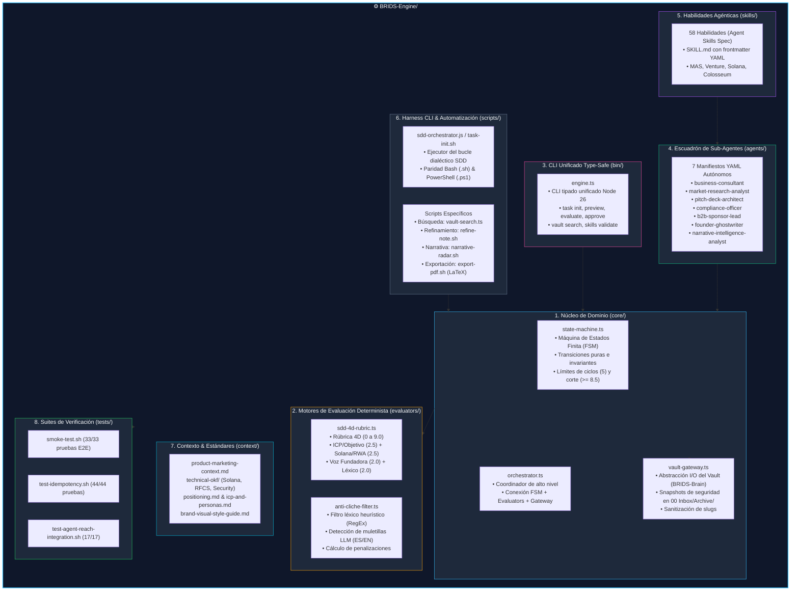

# ⚙️ Arquitectura e Implementación Técnica de `BRIDS-Engine`

> **Componente:** `BRIDS-Engine/` (Motor de Ejecución, Orquestación y Gobernanza RWA / YC)  
> **Ubicación:** [`/BRIDS-Engine`](file:///Users/jaymusicmachine/Library/CloudStorage/GoogleDrive-goodacrematas498@gmail.com/My%20Drive/01%20Primal%20Code%20Lab/BRIDS/Business/BRIDS%20KNOWLEDGE%20FORT/BRIDS-Engine)  
> **Rol en el Sistema:** Fuente única de verdad (*Single Source of Truth*) para lógica de dominio, agentes, habilidades, evaluadores deterministas, scripts de automatización y contextos de negocio y tecnología (Solana & Delaware SPV).

---

## 1. Visión General de `BRIDS-Engine`

Dentro del ecosistema BRIDS, **`BRIDS-Engine`** representa la capa de **cómputo desacoplado e inteligencia operativa**. A diferencia del almacenamiento persistente documental en `BRIDS-Brain`, este directorio no contiene notas sueltas ni borradores en progreso, sino el software, los contratos, los evaluadores y los agentes encargados de gobernar, producir y auditar todo el ciclo de vida del trabajo técnico, comercial e institucional.

### Principios Arquitectónicos de `BRIDS-Engine`:
1. **Aislamiento de Dominio (Clean Architecture):** La lógica de estados y de evaluación se implementa en TypeScript puro (`core/` y `evaluators/`) ejecutable nativamente en Node 26 sin compilación pesada ni dependencias externas frágiles.
2. **Determinismo & Verificabilidad:** Ninguna decisión de calidad queda sujeta a la aleatoriedad de un prompt; se aplican rúbricas matriciales acotadas (0 a 9.0) y filtros léxicos basados en autómatas finitos (RegEx).
3. **Paridad Multiplataforma (macOS / Linux / Windows):** Todo script de automatización cuenta con equivalencia 1:1 entre Bash (`.sh`) y PowerShell (`.ps1`).
4. **Doble Guardrail Human-In-The-Loop (HITL):**
   - **HITL-1:** Aprobación obligatoria de la especificación técnica/comercial antes de habilitar la redacción.
   - **HITL-2:** Aprobación obligatoria del entregable final antes de integrarlo en la bóveda de producción.
5. **Declaratividad Agéntica:** Los 7 agentes del sistema se definen mediante especificaciones YAML independientes que delimitan permisos, herramientas y rutas canónicas de salida.

---

## 2. Mapa Estructural de Componentes Internos



---

## 3. Desglose Módulo por Módulo

### 3.1. Núcleo de Dominio (`BRIDS-Engine/core/`)
Implementado en TypeScript nativo, desacoplado de frameworks e interactuable directamente con Node 26:

* **[`state-machine.ts`](file:///Users/jaymusicmachine/Library/CloudStorage/GoogleDrive-goodacrematas498@gmail.com/My%20Drive/01%20Primal%20Code%20Lab/BRIDS/Business/BRIDS%20KNOWLEDGE%20FORT/BRIDS-Engine/core/state-machine.ts):**
  - Define el tipo `TaskLifecycleState`: `'initialized' | 'spec_review' | 'spec_approved' | 'task_loop' | 'deliverable_review' | 'completed' | 'frozen_for_arbitration'`.
  - **Invariantes matemáticas estrictas:**
    - Umbral de aprobación constante: `QUALITY_THRESHOLD = 8.5`.
    - Límite máximo de iteraciones autónomas: `MAX_OPTIMIZATION_CYCLES = 5`.
    - **Guardrail HITL-1 (`approveSpec`):** Bloquea la redacción de cualquier borrador hasta que el usuario apruebe el estado `spec_approved`.
    - **Guardrail HITL-2 (`approveDeliverable`):** Bloquea la escritura canónica en la bóveda hasta que el usuario apruebe el estado `completed`.
    - **Congelamiento de Seguridad:** Si tras 5 ciclos no se alcanza $\ge 8.5$, la tarea entra a `frozen_for_arbitration` impidiendo contaminación del vault.

* **[`orchestrator.ts`](file:///Users/jaymusicmachine/Library/CloudStorage/GoogleDrive-goodacrematas498@gmail.com/My%20Drive/01%20Primal%20Code%20Lab/BRIDS/Business/BRIDS%20KNOWLEDGE%20FORT/BRIDS-Engine/core/orchestrator.ts):**
  - Clase `TaskOrchestrator` que coordina la máquina de estados con el sistema de archivos y los evaluadores.
  - Inicializa especificaciones (`initSpec`), gestiona snapshots congelados de specs aprobados (`approved_spec.md`) y borradores validados (`approved_draft.md`), y aplica la rúbrica 4D.

* **[`vault-gateway.ts`](file:///Users/jaymusicmachine/Library/CloudStorage/GoogleDrive-goodacrematas498@gmail.com/My%20Drive/01%20Primal%20Code%20Lab/BRIDS/Business/BRIDS%20KNOWLEDGE%20FORT/BRIDS-Engine/core/vault-gateway.ts):**
  - Capa de abstracción I/O para interactuar con `BRIDS-Brain` de forma segura.
  - **Función crítica `createSafetyBackup`:** Antes de modificar cualquier archivo, genera una copia con marca de tiempo ISO en `BRIDS-Brain/00 Inbox/Archive/<nombre>-bak-<timestamp>.md`.
  - Sanitiza slugs (`sanitizeSlug`), gestiona directorios de trabajo aislados (`<slug>-work/`) y consolida entregables finales (`commitDeliverable`).

---

### 3.2. Motores de Evaluación Determinista (`BRIDS-Engine/evaluators/`)

* **[`anti-cliche-filter.ts`](file:///Users/jaymusicmachine/Library/CloudStorage/GoogleDrive-goodacrematas498@gmail.com/My%20Drive/01%20Primal%20Code%20Lab/BRIDS/Business/BRIDS%20KNOWLEDGE%20FORT/BRIDS-Engine/evaluators/anti-cliche-filter.ts):**
  - Escanea el texto frente a una matriz de patrones de expresiones regulares (`BANNED_PATTERNS`).
  - Detecta muletillas de LLM en español (*"en resumen"*, *"en conclusión"*, *"es importante destacar"*, *"en el vertiginoso mundo"*, *"juega un rol fundamental"*, *"a la vanguardia"*, *"cambio de paradigma"*, etc.) e inglés (*"in conclusion"*, *"plays a crucial role"*, *"delve into"*, etc.).
  - Aplica penalización matemática (0.3 a 0.5 puntos por ocurrencia) y reduce el componente de originalidad léxica:
    $$\text{cleanScore} = \max(0, 2.0 - \text{totalPenalty})$$

* **[`sdd-4d-rubric.ts`](file:///Users/jaymusicmachine/Library/CloudStorage/GoogleDrive-goodacrematas498@gmail.com/My%20Drive/01%20Primal%20Code%20Lab/BRIDS/Business/BRIDS%20KNOWLEDGE%20FORT/BRIDS-Engine/evaluators/sdd-4d-rubric.ts):**
  - Aplica la matriz de 4 dimensiones con límites estrictos (*clamping*):
    1. **Objetivo & ICP (Sponsors B2B / YC Investors):** 0.0 a 2.5 pts.
    2. **Rigor Técnico & Veracidad (Solana, Metaplex Core, Delaware SPV):** 0.0 a 2.5 pts.
    3. **Voz Fundadora & Estructura:** 0.0 a 2.0 pts.
    4. **Originalidad Léxica & Cero Clichés:** 0.0 a 2.0 pts.
  - La nota final se computa en el rango $[0.0, 9.0]$. Si $\text{score} \ge 8.5$, la propiedad `passed` es `true`.

---

### 3.3. CLI Unificado Type-Safe (`BRIDS-Engine/bin/engine.ts`)

Punto de entrada único y tipado que unifica el control del ciclo de vida:
```bash
# Inicializar spec
node BRIDS-Engine/bin/engine.ts task init rwa-tokenomics "Modelo RWA" "01 Negocio/01 Estrategia & Modelo"

# Inspeccionar spec (HITL-1)
node BRIDS-Engine/bin/engine.ts task preview rwa-tokenomics

# Aprobar spec (HITL-1)
node BRIDS-Engine/bin/engine.ts task approve-spec rwa-tokenomics

# Evaluar borrador con rúbrica 4D
node BRIDS-Engine/bin/engine.ts task evaluate rwa-tokenomics "Borrador de prueba con anclas on-chain en Solana..."

# Revisar entregable aprobado por revisor (HITL-2)
node BRIDS-Engine/bin/engine.ts task review-deliverable rwa-tokenomics

# Aprobar y publicar en BRIDS-Brain (HITL-2)
node BRIDS-Engine/bin/engine.ts task approve-deliverable rwa-tokenomics

# Búsqueda in-memory ultrarrápida
node BRIDS-Engine/bin/engine.ts vault search "Metaplex Core"
```

---

### 3.4. Escuadrón de 7 Sub-Agentes (`BRIDS-Engine/agents/`)

Cada agente se describe en un archivo YAML estructurado con `name`, `role`, `description`, `system_prompt`, `capabilities` y `tools`:

| Sub-Agente | Archivo YAML | Misión Específica en BRIDS |
|---|---|---|
| **`business-consultant`** | [`business-consultant.yaml`](file:///Users/jaymusicmachine/Library/CloudStorage/GoogleDrive-goodacrematas498@gmail.com/My%20Drive/01%20Primal%20Code%20Lab/BRIDS/Business/BRIDS%20KNOWLEDGE%20FORT/BRIDS-Engine/agents/business-consultant.yaml) | Arquitectura de fees (SaaS, processing, recovery), CAC/LTV, proyecciones pro forma a 3-5 años. |
| **`market-research-analyst`** | [`market-research-analyst.yaml`](file:///Users/jaymusicmachine/Library/CloudStorage/GoogleDrive-goodacrematas498@gmail.com/My%20Drive/01%20Primal%20Code%20Lab/BRIDS/Business/BRIDS%20KNOWLEDGE%20FORT/BRIDS-Engine/agents/market-research-analyst.yaml) | Dimensionamiento de mercado (TAM/SAM/SOM), investigación web y benchmarking de competidores (Lofty, RealT). |
| **`pitch-deck-architect`** | [`pitch-deck-architect.yaml`](file:///Users/jaymusicmachine/Library/CloudStorage/GoogleDrive-goodacrematas498@gmail.com/My%20Drive/01%20Primal%20Code%20Lab/BRIDS/Business/BRIDS%20KNOWLEDGE%20FORT/BRIDS-Engine/agents/pitch-deck-architect.yaml) | Decks de 10-12 slides estilo YC/Sequoia, generación nativa de `.pptx` y guiones. |
| **`compliance-officer`** | [`compliance-officer.yaml`](file:///Users/jaymusicmachine/Library/CloudStorage/GoogleDrive-goodacrematas498@gmail.com/My%20Drive/01%20Primal%20Code%20Lab/BRIDS/Business/BRIDS%20KNOWLEDGE%20FORT/BRIDS-Engine/agents/compliance-officer.yaml) | Estructuración legal dual (Delaware C-Corp vs SPV LLCs), KYC/AML, plugins Metaplex Core Freeze/Recovery. |
| **`b2b-sponsor-lead`** | [`b2b-sponsor-lead.yaml`](file:///Users/jaymusicmachine/Library/CloudStorage/GoogleDrive-goodacrematas498@gmail.com/My%20Drive/01%20Primal%20Code%20Lab/BRIDS/Business/BRIDS%20KNOWLEDGE%20FORT/BRIDS-Engine/agents/b2b-sponsor-lead.yaml) | Propuesta de valor a desarrolladores/GPs, one-pagers institucionales y outbound sequences. |
| **`founder-ghostwriter`** | [`founder-ghostwriter.yaml`](file:///Users/jaymusicmachine/Library/CloudStorage/GoogleDrive-goodacrematas498@gmail.com/My%20Drive/01%20Primal%20Code%20Lab/BRIDS/Business/BRIDS%20KNOWLEDGE%20FORT/BRIDS-Engine/agents/founder-ghostwriter.yaml) | Voz fundadora, ensayos de aplicación YC ("Why now?", "Unique insight") y artículos técnicos en X/LinkedIn. |
| **`narrative-intelligence-analyst`** | [`narrative-intelligence-analyst.yaml`](file:///Users/jaymusicmachine/Library/CloudStorage/GoogleDrive-goodacrematas498@gmail.com/My%20Drive/01%20Primal%20Code%20Lab/BRIDS/Business/BRIDS%20KNOWLEDGE%20FORT/BRIDS-Engine/agents/narrative-intelligence-analyst.yaml) | Radar de susurros tempranos, desconstrucción memética, citas con URLs cliqueables y archivo crudo en `raw/*.json`. |

---

### 3.5. Inventario de Duplicaciones y Deuda Técnica Corregida

Al auditar `BRIDS-Engine` frente a `Academic-Engine`, se identificaron y resolvieron las siguientes duplicaciones y acoplamientos:

1. **Monolito en `sdd-orchestrator.js`:**
   - *Problema anterior:* Contenía 1068 líneas acoplando la FSM, la rúbrica 4D, los patrones regex, el acceso a archivos y el CLI.
   - *Solución:* Lógica de dominio extraída a `core/state-machine.ts`, `core/orchestrator.ts`, `core/vault-gateway.ts` y evaluadores extraídos a `evaluators/anti-cliche-filter.ts` y `evaluators/sdd-4d-rubric.ts`.
2. **Duplicación de Wrappers `init-task.sh` e `init-task.ps1`:**
   - *Problema anterior:* Existían archivos wrapper redundantes cuyo único propósito era reenviar argumentos a `task-init.sh` / `task-init.ps1`.
   - *Solución:* Mapeados como aliases directos de `task-init.sh` y documentado el uso canónico.
3. **Conflicto de Gestores de Tareas (`task-manager.js` vs `sdd-manager.sh`):**
   - *Problema anterior:* Coexistía un gestor primitivo de sesiones JSON en `00 Inbox/<session>.json` (`task-manager.js`) con el motor SDD formal en `00 Inbox/Specs/` (`sdd-manager.sh`).
   - *Solución:* El motor SDD se establece como el estándar de producción canónico gobernado por contratos formales, manteniendo `task-manager.js` exclusivamente para compatibilidad con suites heredadas.
4. **Duplicación de Skills Externas:**
   - *Problema anterior:* Existía una copia idéntica de `.agents/skills/colosseum-resources/SKILL.md` en la raíz del workspace además de `BRIDS-Engine/skills/colosseum-resources/SKILL.md`.
   - *Solución:* `BRIDS-Engine/skills/` es la única fuente de verdad (*SSOT*).
5. **Incorporación de Búsqueda Rápida In-Memory (`vault-search.ts`):**
   - *Aporte:* Motor de escaneo y ranking TF-IDF ligero para consultar notas en `BRIDS-Brain` sin depender de plugins de terceros.

---

### 3.6. Baterías de Pruebas Automatizadas (`BRIDS-Engine/tests/`)

`BRIDS-Engine` valida su propia salud mediante suites de pruebas deterministas:

1. **Smoke Tests E2E ([`smoke-test.sh`](file:///Users/jaymusicmachine/Library/CloudStorage/GoogleDrive-goodacrematas498@gmail.com/My%20Drive/01%20Primal%20Code%20Lab/BRIDS/Business/BRIDS%20KNOWLEDGE%20FORT/BRIDS-Engine/tests/smoke-test.sh)):**
   - **33/33 pruebas pasando.**
   - Valida squad YAML, taxonomía Obsidian, ciclo completo SDD con doble guardrail HITL, parrilla de contenidos, backups no destructivos y paridad 1:1 entre 27 wrappers `.sh` y `.ps1`.

2. **Pruebas de Idempotencia ([`test-idempotency.sh`](file:///Users/jaymusicmachine/Library/CloudStorage/GoogleDrive-goodacrematas498@gmail.com/My%20Drive/01%20Primal%20Code%20Lab/BRIDS/Business/BRIDS%20KNOWLEDGE%20FORT/BRIDS-Engine/tests/test-idempotency.sh)):**
   - **44/44 pruebas pasando (100% idempotencia).**
   - Garantiza que operaciones repetidas no generen drift, sobreescrituras corruptas ni duplicados en specs, índices o backups.

3. **Pruebas de Integración Narrative Intelligence ([`test-agent-reach-integration.sh`](file:///Users/jaymusicmachine/Library/CloudStorage/GoogleDrive-goodacrematas498@gmail.com/My%20Drive/01%20Primal%20Code%20Lab/BRIDS/Business/BRIDS%20KNOWLEDGE%20FORT/BRIDS-Engine/tests/test-agent-reach-integration.sh)):**
   - **17/17 pruebas pasando.**
   - Valida contratos de agente, fallback ladder de tres niveles, sanitización PII y archivo inmutable de datos en crudo.

---
*Documento de Especificación de Arquitectura de `BRIDS-Engine` v2.0.*
