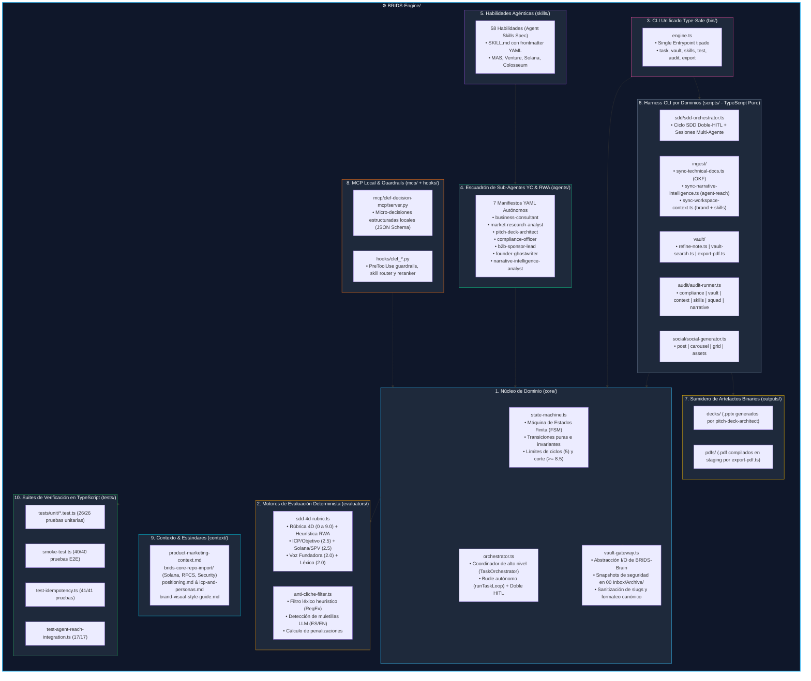

# ⚙️ Arquitectura e Implementación Técnica de `BRIDS-Engine`

> **Componente:** `BRIDS-Engine/` (Motor de Ejecución, Orquestación y Gobernanza RWA / YC)  
> **Ubicación:** [`/BRIDS-Engine`](file:///Users/jaymusicmachine/Library/CloudStorage/GoogleDrive-goodacrematas498@gmail.com/My%20Drive/01%20Primal%20Code%20Lab/BRIDS/Business/BRIDS%20KNOWLEDGE%20FORT/BRIDS-Engine)  
> **Rol en el Sistema:** Fuente única de verdad (*Single Source of Truth*) para lógica de dominio, agentes, habilidades, evaluadores deterministas, servidor MCP local de decisiones, artefactos binarios de salida, scripts de automatización y contextos de negocio y tecnología (Solana Metaplex Core & Delaware Series LLC).

---

## 1. Visión General de `BRIDS-Engine`

Dentro del ecosistema **BRIDS Knowledge Fort**, **`BRIDS-Engine`** representa la capa de **cómputo desacoplado e inteligencia operativa**. A diferencia del almacenamiento persistente documental en `BRIDS-Brain`, este directorio no contiene notas sueltas ni borradores definitivos, sino el software, los contratos, los evaluadores y los agentes encargados de gobernar, producir y auditar todo el ciclo de vida del trabajo técnico, comercial e institucional para tokenización inmobiliaria (RWA) y preparación para Y Combinator.

### Principios Arquitectónicos de `BRIDS-Engine`:
1. **Aislamiento de Dominio (Clean Architecture):** La lógica de estados y de evaluación se implementa en TypeScript puro (`core/` y `evaluators/`) ejecutable nativamente en Node.js sin compilación pesada ni dependencias externas frágiles.
2. **Determinismo & Verificabilidad:** Ninguna decisión de calidad queda sujeta a la aleatoriedad de un prompt; se aplican rúbricas matriciales acotadas (0 a 9.0) con verificación de anclas técnicas (Solana, Metaplex Core, Delaware SPV, Stripe Identity) y filtros léxicos basados en autómatas finitos (RegEx).
3. **Paridad Multiplataforma (macOS / Linux / Windows):** Todo script de automatización cuenta con equivalencia 1:1 entre Bash (`.sh`) y PowerShell (`.ps1`).
4. **Doble Guardrail Human-In-The-Loop (HITL):**
   - **HITL-1:** Aprobación obligatoria de la especificación técnica/comercial antes de habilitar la redacción.
   - **HITL-2:** Aprobación obligatoria del entregable final antes de integrarlo en la bóveda de producción (`BRIDS-Brain/`).
5. **Declaratividad Agéntica:** Los 7 agentes del escuadrón fundador y YC se definen mediante especificaciones YAML independientes que delimitan permisos, herramientas y rutas canónicas de salida.

---

## 2. Mapa Estructural de Componentes Internos (10 Capas)



---

## 3. Desglose Módulo por Módulo

### 3.1. Núcleo de Dominio (`BRIDS-Engine/core/`)
Implementado en TypeScript nativo, desacoplado de frameworks:

* **[`state-machine.ts`](file:///Users/jaymusicmachine/Library/CloudStorage/GoogleDrive-goodacrematas498@gmail.com/My%20Drive/01%20Primal%20Code%20Lab/BRIDS/Business/BRIDS%20KNOWLEDGE%20FORT/BRIDS-Engine/core/state-machine.ts):**
  - Define el tipo `TaskLifecycleState`: `'initialized' | 'spec_review' | 'spec_approved' | 'task_loop' | 'draft_optimizing' | 'deliverable_review' | 'deliverable_refining' | 'completed' | 'frozen_for_arbitration'`.
  - **Invariantes matemáticas estrictas:**
    - Umbral de aprobación constante: `QUALITY_THRESHOLD = 8.5`.
    - Límite máximo de iteraciones autónomas: `MAX_OPTIMIZATION_CYCLES = 5`.
    - **Guardrail HITL-1 (`approveSpec`):** Bloquea la redacción o evaluación de cualquier borrador hasta que el usuario apruebe el estado `spec_approved`.
    - **Guardrail HITL-2 (`approveDeliverable`):** Bloquea la escritura canónica en `BRIDS-Brain/` hasta que el usuario apruebe el estado `completed`.
    - **Congelamiento de Seguridad:** Si tras 5 ciclos no se alcanza $\ge 8.5$, la tarea entra a `frozen_for_arbitration` impidiendo contaminación del vault.

* **[`orchestrator.ts`](file:///Users/jaymusicmachine/Library/CloudStorage/GoogleDrive-goodacrematas498@gmail.com/My%20Drive/01%20Primal%20Code%20Lab/BRIDS/Business/BRIDS%20KNOWLEDGE%20FORT/BRIDS-Engine/core/orchestrator.ts):**
  - Clase `TaskOrchestrator` que coordina la máquina de estados con `VaultGateway` y los evaluadores 4D.
  - Inicializa especificaciones (`initSpec`), gestiona snapshots congelados de specs aprobados (`approved_spec.md`) y borradores validados (`approved_draft.md`), ejecuta el bucle autónomo (`runTaskLoop`) y promueve entregables aprobados.

* **[`vault-gateway.ts`](file:///Users/jaymusicmachine/Library/CloudStorage/GoogleDrive-goodacrematas498@gmail.com/My%20Drive/01%20Primal%20Code%20Lab/BRIDS/Business/BRIDS%20KNOWLEDGE%20FORT/BRIDS-Engine/core/vault-gateway.ts):**
  - Capa de abstracción I/O para interactuar con `BRIDS-Brain` de forma segura.
  - **Función crítica `createSafetyBackup`:** Antes de modificar cualquier archivo existente, genera una copia con marca de tiempo ISO en `BRIDS-Brain/00 Inbox/Archive/<nombre>-bak-<timestamp>.md`.
  - Sanitiza slugs (`sanitizeSlug`), gestiona directorios de trabajo aislados (`<slug>-work/`), formatea notas canónicas (`formatFinalVaultNote`) y consolida entregables finales (`commitDeliverable`).

---

### 3.2. Motores de Evaluación Determinista (`BRIDS-Engine/evaluators/`)

* **[`anti-cliche-filter.ts`](file:///Users/jaymusicmachine/Library/CloudStorage/GoogleDrive-goodacrematas498@gmail.com/My%20Drive/01%20Primal%20Code%20Lab/BRIDS/Business/BRIDS%20KNOWLEDGE%20FORT/BRIDS-Engine/evaluators/anti-cliche-filter.ts):**
  - Escanea el texto frente a una matriz de patrones de expresiones regulares (`BANNED_PATTERNS`) y ejecuta auto-remediación determinista (`autoRemediateDraft`).
  - Detecta muletillas de LLM en español e inglés y calcula la puntuación limpia de originalidad:
    $$\text{cleanScore} = \max(0, 2.0 - \text{totalPenalty})$$

* **[`sdd-4d-rubric.ts`](file:///Users/jaymusicmachine/Library/CloudStorage/GoogleDrive-goodacrematas498@gmail.com/My%20Drive/01%20Primal%20Code%20Lab/BRIDS/Business/BRIDS%20KNOWLEDGE%20FORT/BRIDS-Engine/evaluators/sdd-4d-rubric.ts):**
  - Implementa `evaluateDeliverable()` y el motor heurístico `auditDeliverableText(text, specData)` en 4 dimensiones acotadas:
    1. **Objetivo & ICP (Sponsors B2B / YC Investors):** 0.0 a 2.5 pts.
    2. **Rigor Técnico & Veracidad (Solana, Metaplex Core, Delaware SPV, cero falsas promesas de mainnet):** 0.0 a 2.5 pts.
    3. **Voz Fundadora & Estructura:** 0.0 a 2.0 pts.
    4. **Originalidad Léxica & Cero Clichés:** 0.0 a 2.0 pts.
  - La nota final se computa en el rango $[0.0, 9.0]$. Si $\text{score} \ge 8.5$, `passed` es `true`.

---

### 3.3. CLI Unificado Type-Safe (`BRIDS-Engine/bin/engine.ts`)

Punto de entrada único y tipado que unifica los 5 dominios (`sdd`, `ingest`, `vault`, `audit`, `social`) y las pruebas:
```bash
# 1. Ciclo de vida SDD y sesiones
node BRIDS-Engine/bin/engine.ts sdd init rwa-tokenomics "Modelo RWA" "01 Negocio/01 Estrategia & Modelo"
node BRIDS-Engine/bin/engine.ts sdd preview rwa-tokenomics
node BRIDS-Engine/bin/engine.ts sdd approve-spec rwa-tokenomics
node BRIDS-Engine/bin/engine.ts sdd loop-task rwa-tokenomics
node BRIDS-Engine/bin/engine.ts sdd review-deliverable rwa-tokenomics
node BRIDS-Engine/bin/engine.ts sdd approve-deliverable rwa-tokenomics

# 2. Operaciones de bóveda y exportación
node BRIDS-Engine/bin/engine.ts vault search "Metaplex Core"
node BRIDS-Engine/bin/engine.ts vault specs
node BRIDS-Engine/bin/engine.ts export pdf "BRIDS-Brain/01 Negocio/01 Estrategia & Modelo/concept-rwa-identity-vc-thesis.md" --staging

# 3. Suites de pruebas y auditoría
node BRIDS-Engine/bin/engine.ts audit compliance
node BRIDS-Engine/bin/engine.ts test all
```

---

### 3.4. Artefactos Binarios (`BRIDS-Engine/outputs/`) y MCP Local (`BRIDS-Engine/mcp/`)

* **[`BRIDS-Engine/outputs/`](file:///Users/jaymusicmachine/Library/CloudStorage/GoogleDrive-goodacrematas498@gmail.com/My%20Drive/01%20Primal%20Code%20Lab/BRIDS/Business/BRIDS%20KNOWLEDGE%20FORT/BRIDS-Engine/outputs/README.md):**
  - Almacena artefactos binarios compilados (`outputs/decks/*.pptx` y `outputs/pdfs/*.pdf`) manteniendo `BRIDS-Brain/` libre de binarios pesados en estado borrador.
* **[`BRIDS-Engine/mcp/clef-decision-mcp/`](file:///Users/jaymusicmachine/Library/CloudStorage/GoogleDrive-goodacrematas498@gmail.com/My%20Drive/01%20Primal%20Code%20Lab/BRIDS/Business/BRIDS%20KNOWLEDGE%20FORT/BRIDS-Engine/mcp/clef-decision-mcp/README.md) & [`BRIDS-Engine/hooks/`](file:///Users/jaymusicmachine/Library/CloudStorage/GoogleDrive-goodacrematas498@gmail.com/My%20Drive/01%20Primal%20Code%20Lab/BRIDS/Business/BRIDS%20KNOWLEDGE%20FORT/BRIDS-Engine/hooks):**
  - Servidor MCP local (`clef_decide_choice`, `clef_guardrail_check`, `clef_score_rubric`, `clef_batch_decision`) para micro-decisiones deterministas con esquemas JSON estrictos.

---

### 3.5. Baterías de Pruebas Automatizadas en TypeScript (`BRIDS-Engine/tests/`)

1. **Unit Tests de Dominio ([`tests/unit/*.test.ts`](file:///Users/jaymusicmachine/Library/CloudStorage/GoogleDrive-goodacrematas498@gmail.com/My%20Drive/01%20Primal%20Code%20Lab/BRIDS/Business/BRIDS%20KNOWLEDGE%20FORT/BRIDS-Engine/tests/unit)):**
   - **26/26 pruebas unitarias pasando.** Valida `TaskStateMachine`, `VaultGateway`, `Evaluators`, `TaskOrchestrator` y los 5 dominios de `scripts/` (`SPEC-SCRIPTS-005`).
2. **Smoke Tests E2E ([`smoke-test.ts`](file:///Users/jaymusicmachine/Library/CloudStorage/GoogleDrive-goodacrematas498@gmail.com/My%20Drive/01%20Primal%20Code%20Lab/BRIDS/Business/BRIDS%20KNOWLEDGE%20FORT/BRIDS-Engine/tests/smoke-test.ts)):**
   - **40/40 pruebas pasando.** Valida squad YAML, taxonomía Obsidian, higiene de carpetas, ciclo completo SDD con doble guardrail HITL, parrilla de 15 contenidos RWA, backups no destructivos y arquitectura de 5 dominios en TypeScript sin wrappers.
3. **Pruebas de Idempotencia ([`test-idempotency.ts`](file:///Users/jaymusicmachine/Library/CloudStorage/GoogleDrive-goodacrematas498@gmail.com/My%20Drive/01%20Primal%20Code%20Lab/BRIDS/Business/BRIDS%20KNOWLEDGE%20FORT/BRIDS-Engine/tests/test-idempotency.ts)):**
   - **41/41 pruebas pasando (100% idempotencia).**
4. **Pruebas de Integración Narrative Intelligence ([`test-agent-reach-integration.ts`](file:///Users/jaymusicmachine/Library/CloudStorage/GoogleDrive-goodacrematas498@gmail.com/My%20Drive/01%20Primal%20Code%20Lab/BRIDS/Business/BRIDS%20KNOWLEDGE%20FORT/BRIDS-Engine/tests/test-agent-reach-integration.ts)):**
   - **17/17 pruebas pasando.**

---
*Documento de Especificación de Arquitectura de `BRIDS-Engine` v3.0 (TypeScript Domain Architecture).*
