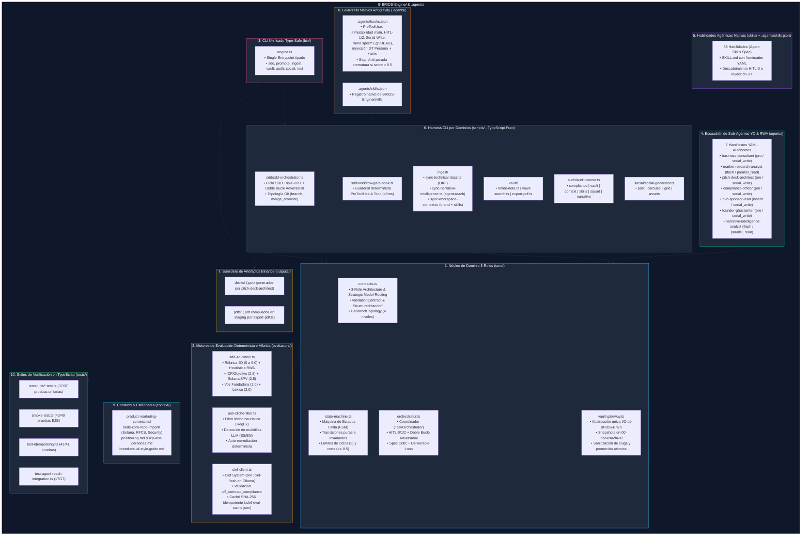

# ⚙️ Arquitectura e Implementación Técnica de `BRIDS-Engine`

> **Componente:** `BRIDS-Engine/` (Motor de Ejecución, Orquestación y Gobernanza RWA / YC)  
> **Ubicación:** [`/BRIDS-Engine`](file:///Users/jaymusicmachine/Library/CloudStorage/GoogleDrive-goodacrematas498@gmail.com/My%20Drive/01%20Primal%20Code%20Lab/BRIDS/Business/BRIDS%20KNOWLEDGE%20FORT/BRIDS-Engine)  
> **Rol en el Sistema:** Fuente única de verdad (*Single Source of Truth*) para lógica de dominio, arquitectura multi-agente de 3 roles, habilidades nativas, evaluadores deterministas e híbridos (`Clef System One`), guardrails nativos de Antigravity, artefactos binarios de salida, scripts de automatización y contextos de negocio y tecnología (Solana Metaplex Core & Delaware Series LLC).

---

## 1. Visión General de `BRIDS-Engine`

Dentro del ecosistema **BRIDS Knowledge Fort**, **`BRIDS-Engine`** representa la capa de **cómputo desacoplado e inteligencia operativa**. A diferencia del almacenamiento persistente documental en `BRIDS-Brain`, este directorio no contiene notas sueltas ni borradores definitivos, sino el software, los contratos, los evaluadores y los agentes encargados de gobernar, producir y auditar todo el ciclo de vida del trabajo técnico, comercial e institucional para tokenización inmobiliaria (RWA) y preparación para Y Combinator.

### Principios Arquitectónicos de `BRIDS-Engine`:
1. **Aislamiento de Dominio & Clean Architecture de 3 Roles:** La lógica de contratos, estados y evaluación se implementa en TypeScript puro (`core/` y `evaluators/`) ejecutable nativamente en Node.js (`node <archivo>.ts`) sin compilación pesada ni wrappers `.sh`/`.ps1`/`.py`. Separa estrictamente las responsabilidades en:
   - **Rol 1 — Orchestrator (`TaskOrchestrator`):** Planificación, definición del `ValidationContract` y enrutamiento estratégico de modelos (`STRATEGIC_MODEL_ROUTING`).
   - **Rol 2 — Workers (Contexto Fresco):** Separados en *Parallel Read Gatherers* (`flash`) y *Serial Write Workers* (`pro`/`inherit`) con traspaso estructurado (`StructuredHandoff`) e inyección JIT de personas YAML y skills.
   - **Rol 3 — Adversarial Validators (`sdd-reviewer` + `Clef System One`):** Auditoría sin sesgo de creador tanto sobre el Spec como sobre el entregable final.
2. **Determinismo & Verificabilidad (Doble Bucle Adversarial):** Ninguna decisión de calidad queda sujeta a la aleatoriedad de un prompt; tanto el Spec como el entregable se auditan con rúbricas matriciales acotadas ($0.0$ a $9.0$, exigiendo $\ge 8.5 / 9.0$), verificación de anclas técnicas (Solana, Metaplex Core, Delaware SPV, Stripe Identity), filtros léxicos basados en autómatas finitos (RegEx) y evaluación híbrida local con `Clef System One` (`clef-flash` vía Ollama con caché SHA-256 idempotente).
3. **Triple Guardrail Human-In-The-Loop (`HITL-0`, `HITL-1`, `HITL-2`):**
   - **HITL-0 (Descubrimiento de Skills & Subagentes):** Descubrimiento determinista (`discover`) y aprobación humana de las skills candidatas antes de inicializar el Spec.
   - **HITL-1 (Aprobación del Spec Auditado):** Bloqueo que exige que el Spec supere primero el Crítico Adversarial (`audit-spec` $\ge 8.5 / 9.0$ y `0` defectos) y reciba aprobación humana (`approve-spec`) antes de habilitar cualquier redacción.
   - **HITL-2 (Aprobación del Entregable Pulido):** Bloqueo que exige superar el Bucle Evaluador-Optimizador ($\ge 8.5 / 9.0$) y aprobación humana (`approve-deliverable`) antes de escribir en las carpetas de producción de `BRIDS-Brain/`.
4. **Guardrails Físicos Nativos en Antigravity (`PreToolUse` & `Stop`):** Configurados en [`.agents/hooks.json`](file:///Users/jaymusicmachine/Library/CloudStorage/GoogleDrive-goodacrematas498@gmail.com/My%20Drive/01%20Primal%20Code%20Lab/BRIDS/Business/BRIDS%20KNOWLEDGE%20FORT/.agents/hooks.json) y ejecutados en $< 5\text{ ms}$ por [`workflow-gate-hook.ts`](file:///Users/jaymusicmachine/Library/CloudStorage/GoogleDrive-goodacrematas498@gmail.com/My%20Drive/01%20Primal%20Code%20Lab/BRIDS/Business/BRIDS%20KNOWLEDGE%20FORT/BRIDS-Engine/scripts/sdd/workflow-gate-hook.ts).
5. **Topología Git Jerárquica de 4 Niveles (`spec/*` $\rightarrow$ `feat/*` $\rightarrow$ `develop` $\rightarrow$ `main`):** Inmutabilidad física de `main`, troncal de trabajo en `develop`, ramas de feature `feat/<feature>` y ramas hijas por entregable `spec/<feature>/<slug>` verificadas vía `.git/HEAD` en $< 0.05\text{ ms}$.
6. **Declaratividad Agéntica:** Los 7 agentes del escuadrón fundador y YC se definen mediante especificaciones YAML independientes en `BRIDS-Engine/agents/*.yaml` y las 58 skills se registran nativamente mediante [`.agents/skills.json`](file:///Users/jaymusicmachine/Library/CloudStorage/GoogleDrive-goodacrematas498@gmail.com/My%20Drive/01%20Primal%20Code%20Lab/BRIDS/Business/BRIDS%20KNOWLEDGE%20FORT/.agents/skills.json).

---

## 2. Mapa Estructural de Componentes Internos (10 Capas)



---

## 3. Desglose Módulo por Módulo

### 3.1. Núcleo de Dominio (`BRIDS-Engine/core/`)
Implementado en TypeScript nativo, desacoplado de frameworks y sin duplicación de estado (*Zero Split-Brain*):

* **[`contracts.ts`](file:///Users/jaymusicmachine/Library/CloudStorage/GoogleDrive-goodacrematas498@gmail.com/My%20Drive/01%20Primal%20Code%20Lab/BRIDS/Business/BRIDS%20KNOWLEDGE%20FORT/BRIDS-Engine/core/contracts.ts):**
  - Define la arquitectura de 3 roles (`orchestrator`, `worker`, `validator`), el catálogo `STRATEGIC_MODEL_ROUTING` (`pro` para razonamiento profundo y escritura serial; `flash` para recolectores de lectura paralela) y el planificador `buildExecutionTopology()`.
  - Define `ValidationContract` (assertions verificables, anclas RWA requeridas, umbral de puntaje), `StructuredHandoff` (artefacto de continuidad entre workers), `SpecCritiqueResult` (evaluación adversarial del Spec en 4 dimensiones sobre $9.0$) y `GitBranchTopology` (jerarquía de ramas Git).

* **[`state-machine.ts`](file:///Users/jaymusicmachine/Library/CloudStorage/GoogleDrive-goodacrematas498@gmail.com/My%20Drive/01%20Primal%20Code%20Lab/BRIDS/Business/BRIDS%20KNOWLEDGE%20FORT/BRIDS-Engine/core/state-machine.ts):**
  - Define el tipo `TaskLifecycleState`: `'initialized' | 'spec_review' | 'spec_approved' | 'task_loop' | 'draft_optimizing' | 'deliverable_review' | 'deliverable_refining' | 'completed' | 'frozen_for_arbitration'`.
  - **Invariantes matemáticas estrictas:**
    - Umbral de aprobación constante: `QUALITY_THRESHOLD = 8.5`.
    - Límite máximo de iteraciones autónomas: `MAX_OPTIMIZATION_CYCLES = 5`.
    - **Guardrail HITL-1 (`approveSpec`):** Bloquea la redacción o evaluación de cualquier borrador hasta que el Spec haya sido auditado ($\ge 8.5 / 9.0$) y aprobado por el usuario (`spec_approved`).
    - **Guardrail HITL-2 (`approveDeliverable`):** Bloquea la escritura canónica en `BRIDS-Brain/` hasta que el usuario apruebe el estado `completed`.
    - **Congelamiento de Seguridad:** Si tras 5 ciclos no se alcanza $\ge 8.5$, la tarea entra a `frozen_for_arbitration` impidiendo contaminación del vault.

* **[`orchestrator.ts`](file:///Users/jaymusicmachine/Library/CloudStorage/GoogleDrive-goodacrematas498@gmail.com/My%20Drive/01%20Primal%20Code%20Lab/BRIDS/Business/BRIDS%20KNOWLEDGE%20FORT/BRIDS-Engine/core/orchestrator.ts):**
  - Clase `TaskOrchestrator` que coordina la máquina de estados con `VaultGateway` y los dos bucles adversariales:
    1. **Descubrimiento `HITL-0` (`discoverSkillsForRequest`):** Cruza la solicitud del usuario contra las 58 skills de `BRIDS-Engine/skills/` y los 7 subagentes para presentar candidatos antes de crear el Spec.
    2. **Bucle Adversarial del Spec (`auditSpec`):** Evalúa el Spec en 4 dimensiones sobre $9.0$ (`skillIntegration` $2.5$, `vaultGrounding` $2.5$, `contractSpecificity` $2.0$, `workerHandoffClarity` $2.0$). Exige $\ge 8.5 / 9.0$ y `0` defectos antes de habilitar `approveSpec`.
    3. **Bucle Evaluador-Optimizador del Entregable (`runTaskLoop` / `evaluateDraft`):** Gestiona snapshots congelados (`approved_spec.md`, `approved_draft.md`), valida `StructuredHandoff` y promueve entregables aprobados.

* **[`vault-gateway.ts`](file:///Users/jaymusicmachine/Library/CloudStorage/GoogleDrive-goodacrematas498@gmail.com/My%20Drive/01%20Primal%20Code%20Lab/BRIDS/Business/BRIDS%20KNOWLEDGE%20FORT/BRIDS-Engine/core/vault-gateway.ts):**
  - Única capa autorizada de abstracción I/O para interactuar con `BRIDS-Brain`.
  - **Función crítica `createSafetyBackup`:** Antes de modificar cualquier archivo existente, genera una copia con marca de tiempo ISO en `BRIDS-Brain/00 Inbox/Archive/<nombre>.<timestamp>.bak.md`.
  - Sanitiza slugs (`sanitizeSlug`), normaliza alias de especificaciones (`loadSpec`), gestiona directorios de trabajo aislados (`<slug>-work/`), formatea notas canónicas (`formatFinalVaultNote`) y consolida entregables finales (`commitDeliverable`).

---

### 3.2. Motores de Evaluación Determinista e Híbrida (`BRIDS-Engine/evaluators/`)

* **[`anti-cliche-filter.ts`](file:///Users/jaymusicmachine/Library/CloudStorage/GoogleDrive-goodacrematas498@gmail.com/My%20Drive/01%20Primal%20Code%20Lab/BRIDS/Business/BRIDS%20KNOWLEDGE%20FORT/BRIDS-Engine/evaluators/anti-cliche-filter.ts):**
  - Escanea el texto frente a una matriz de patrones de expresiones regulares (`BANNED_PATTERNS`) y ejecuta auto-remediación determinista (`autoRemediateDraft`).
  - Detecta muletillas de LLM en español e inglés y calcula la puntuación limpia de originalidad:
    $$\text{cleanScore} = \max(0, 2.0 - \text{totalPenalty})$$

* **[`sdd-4d-rubric.ts`](file:///Users/jaymusicmachine/Library/CloudStorage/GoogleDrive-goodacrematas498@gmail.com/My%20Drive/01%20Primal%20Code%20Lab/BRIDS/Business/BRIDS%20KNOWLEDGE%20FORT/BRIDS-Engine/evaluators/sdd-4d-rubric.ts):**
  - Implementa `evaluateDeliverable()` y el motor `auditDeliverableText(text, specData)` en 4 dimensiones acotadas:
    1. **Objetivo & ICP (Sponsors B2B / YC Investors):** $0.0$ a $2.5\text{ pts}$.
    2. **Rigor Técnico & Veracidad (Solana, Metaplex Core, Delaware SPV, cero falsas promesas de mainnet):** $0.0$ a $2.5\text{ pts}$.
    3. **Voz Fundadora & Estructura:** $0.0$ a $2.0\text{ pts}$.
    4. **Originalidad Léxica & Cero Clichés:** $0.0$ a $2.0\text{ pts}$.
  - La nota final se computa en el rango $[0.0, 9.0]$. Si $\text{score} \ge 8.5$, `passed` es `true`.

* **[`clef-client.ts`](file:///Users/jaymusicmachine/Library/CloudStorage/GoogleDrive-goodacrematas498@gmail.com/My%20Drive/01%20Primal%20Code%20Lab/BRIDS/Business/BRIDS%20KNOWLEDGE%20FORT/BRIDS-Engine/evaluators/clef-client.ts):**
  - Cliente TypeScript puro para **Clef System One** (`clef-flash` en Ollama local con `keep_alive: "30m"` y fast-fail de $250\text{ ms}$ si el daemon está apagado).
  - Evalúa 5 preguntas binarias deterministas (`temperature: 0`), incluyendo `q5_contract_compliance` contra el `ValidationContract` del Spec, y persiste resultados por hash SHA-256 en `BRIDS-Engine/context/.clef-eval-cache.json` para garantizar $100\%$ de idempotencia.

---

### 3.3. Guardrails Nativos de Antigravity y Topología Git de 4 Niveles

* **[`.agents/hooks.json`](file:///Users/jaymusicmachine/Library/CloudStorage/GoogleDrive-goodacrematas498@gmail.com/My%20Drive/01%20Primal%20Code%20Lab/BRIDS/Business/BRIDS%20KNOWLEDGE%20FORT/.agents/hooks.json) & [`workflow-gate-hook.ts`](file:///Users/jaymusicmachine/Library/CloudStorage/GoogleDrive-goodacrematas498@gmail.com/My%20Drive/01%20Primal%20Code%20Lab/BRIDS/Business/BRIDS%20KNOWLEDGE%20FORT/BRIDS-Engine/scripts/sdd/workflow-gate-hook.ts):**
  - **Gate `PreToolUse` ($< 5\text{ ms}$):**
    1. **Inmutabilidad de `main`:** Bloquea físicamente cualquier edición de archivos o `git commit`/`merge`/`push` directo sobre la rama `main`.
    2. **Anti-Auto-Proceed:** Fuerza `RequestFeedback: false` (vía *shallow overwrite*) en artefactos de Antigravity para impedir auto-aprobaciones sin confirmación explícita del usuario.
    3. **Guardrail `HITL-1` & Rama `spec/*`:** Antes de permitir escribir `draft_cycle_N.md`, verifica que el Spec esté en estado `spec_approved`, tenga `ValidationContract` válido y que `.git/HEAD` apunte a la rama hija `spec/<feature>/<slug>` (lectura directa en $< 0.05\text{ ms}$, sin subprocesos).
    4. **Guardrail `HITL-2`:** Bloquea escrituras directas (tanto con herramientas de edición como mediante redirecciones de shell en `run_command`) hacia `BRIDS-Brain/01 Negocio/` o `BRIDS-Brain/02 Marketing/` si la tarea no ha sido promovida por los scripts autorizados tras `HITL-2`.
    5. **Orquestación de Subagentes (`invoke_subagent`):** Impide lanzar múltiples *Serial Write Workers* en paralelo, verifica la existencia de `StructuredHandoff` previos, asigna el modelo óptimo según `STRATEGIC_MODEL_ROUTING` e inyecta automáticamente `[AGENT_PERSONA]` (desde `BRIDS-Engine/agents/*.yaml`) y `[APPROVED_SKILLS]` (desde el Spec).
  - **Gate `Stop`:**
    - Si existe un borrador activo en `task_loop` o `draft_optimizing` que aún no alcanza $\ge 8.5 / 9.0$, devuelve `decision: "continue"` con la lista exacta de defectos del Crítico Adversarial para que el agente complete la remediación antes de detenerse (incluyendo protección anti-bucle cuando `fullyIdle` o `executionNum >= 5`).

* **Topología Git de 4 Niveles (`spec/*` $\rightarrow$ `feat/*` $\rightarrow$ `develop` $\rightarrow$ `main`):**
  1. `spec/<feature>/<slug>`: Rama hija por entregable SDD (`sdd-orchestrator.ts branch <slug>`). Al aprobarse en `HITL-2` (`completed`), se fusiona (`--no-ff`) a `feat/<feature>` mediante `sdd-orchestrator.ts merge <slug>`.
  2. `feat/<feature>`: Rama de integración de funcionalidad. Se promueve (`--no-ff`) hacia `develop` con `node BRIDS-Engine/bin/engine.ts promote feature`.
  3. `develop`: Troncal activa de trabajo por defecto.
  4. `main`: Rama inmutable de producción. Solo recibe código mediante `node BRIDS-Engine/bin/engine.ts promote main [--push]`, el cual verifica árbol limpio, ejecuta la batería completa de tests y la auditoría de compliance, fusiona `--no-ff` en `main` y devuelve automáticamente `HEAD` a `develop`.

---

### 3.4. CLI Unificado Type-Safe (`BRIDS-Engine/bin/engine.ts`)

Punto de entrada único y tipado que unifica los dominios (`sdd`, `promote`, `ingest`, `vault`, `audit`, `social`, `test`):
```bash
# 1. Ciclo de vida SDD con Triple Guardrail (HITL-0 / HITL-1 / HITL-2) y soporte /teamwork-preview
node BRIDS-Engine/bin/engine.ts sdd discover "estructurar SPV Series LLC" "01 Negocio/03 Legal & Cumplimiento"
node BRIDS-Engine/bin/engine.ts sdd init spv-llc "Modelo Series LLC" "01 Negocio/03 Legal & Cumplimiento" "compliance-officer" --skills investor-due-diligence [--teamwork small|full|review|proof]
node BRIDS-Engine/bin/engine.ts sdd teamwork-prompt spv-llc
node BRIDS-Engine/bin/engine.ts sdd audit-spec spv-llc
node BRIDS-Engine/bin/engine.ts sdd preview spv-llc
node BRIDS-Engine/bin/engine.ts sdd approve-spec spv-llc
node BRIDS-Engine/bin/engine.ts sdd loop-task spv-llc
node BRIDS-Engine/bin/engine.ts sdd review-deliverable spv-llc
node BRIDS-Engine/bin/engine.ts sdd approve-deliverable spv-llc
node BRIDS-Engine/bin/engine.ts sdd merge spv-llc

# 2. Promoción Git de 4 niveles (feat/* -> develop -> main)
node BRIDS-Engine/bin/engine.ts promote feature --push
node BRIDS-Engine/bin/engine.ts promote main --push

# 3. Operaciones de bóveda y exportación
node BRIDS-Engine/bin/engine.ts vault search "Metaplex Core"
node BRIDS-Engine/bin/engine.ts vault specs
node BRIDS-Engine/bin/engine.ts export pdf "BRIDS-Brain/01 Negocio/01 Estrategia & Modelo/rwa-series-llc-squads-model.md" --staging

# 4. Suites de pruebas y auditoría
node BRIDS-Engine/bin/engine.ts audit compliance
node BRIDS-Engine/bin/engine.ts test all
```

---

### 3.5. Baterías de Pruebas Automatizadas en TypeScript (`BRIDS-Engine/tests/`)

1. **Unit Tests de Dominio & Guardrails ([`tests/unit/*.test.ts`](file:///Users/jaymusicmachine/Library/CloudStorage/GoogleDrive-goodacrematas498@gmail.com/My%20Drive/01%20Primal%20Code%20Lab/BRIDS/Business/BRIDS%20KNOWLEDGE%20FORT/BRIDS-Engine/tests/unit)):**
   - **39/39 pruebas unitarias pasando (6 suites).** Valida `TaskStateMachine`, `VaultGateway`, `Evaluators` (incluyendo `Clef System One`), `TaskOrchestrator` (3-Role Architecture, `HITL-0`, Crítico Adversarial del Spec e integración `/teamwork-preview` con `ForcingFunctionClarity`), los 5 dominios de `scripts/` (`SPEC-SCRIPTS-005`) y los guardrails deterministas `PreToolUse`/`Stop` (`SPEC-HOOK-004`, incluyendo inmutabilidad de `main`, topología Git de 4 niveles y gate de `teamwork_preview`).
2. **Smoke Tests E2E ([`smoke-test.ts`](file:///Users/jaymusicmachine/Library/CloudStorage/GoogleDrive-goodacrematas498@gmail.com/My%20Drive/01%20Primal%20Code%20Lab/BRIDS/Business/BRIDS%20KNOWLEDGE%20FORT/BRIDS-Engine/tests/smoke-test.ts)):**
   - **40/40 pruebas pasando.** Valida squad YAML, taxonomía Obsidian, higiene de carpetas, ciclo completo SDD, parrilla de 15 contenidos RWA, backups no destructivos y arquitectura de 5 dominios en TypeScript sin wrappers.
3. **Pruebas de Idempotencia ([`test-idempotency.ts`](file:///Users/jaymusicmachine/Library/CloudStorage/GoogleDrive-goodacrematas498@gmail.com/My%20Drive/01%20Primal%20Code%20Lab/BRIDS/Business/BRIDS%20KNOWLEDGE%20FORT/BRIDS-Engine/tests/test-idempotency.ts)):**
   - **41/41 pruebas pasando (100% idempotencia).**
4. **Pruebas de Integración Narrative Intelligence ([`test-agent-reach-integration.ts`](file:///Users/jaymusicmachine/Library/CloudStorage/GoogleDrive-goodacrematas498@gmail.com/My%20Drive/01%20Primal%20Code%20Lab/BRIDS/Business/BRIDS%20KNOWLEDGE%20FORT/BRIDS-Engine/tests/test-agent-reach-integration.ts)):**
   - **17/17 pruebas pasando.**

---
*Documento de Especificación de Arquitectura de `BRIDS-Engine` v4.0 (3-Role Multi-Agent Clean Architecture, Triple Guardrail HITL-0/1/2, Dual Adversarial Loop & 4-Tier Git Topology).*
