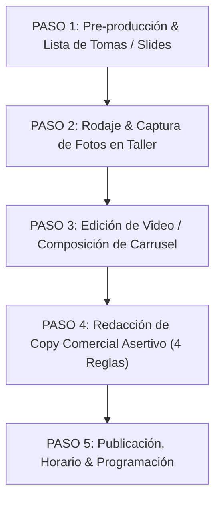

# Guía Técnica & Manual de Producción de Contenido (SOP)

*Manual Técnico Paso a Paso para la Grabación, Edición, Carruseles y Publicación de Contenido Digital*  
*Location: 07 Paid, Social & Community / Social Content*  
*Last updated: 2026-08-09*

> 🛡️ **Eslogan Oficial de Marca:** *"Sé tu propio héroe"*

---

## 📌 Índice del Manual Técnico

- [1. Especificaciones Técnicas de Grabación (Cámara & Audio)](#1-especificaciones-técnicas-de-grabación-cámara--audio)
- [2. Protocolo de Producción en 5 Pasos (Flujo Ordenado)](#2-protocolo-de-producción-en-5-pasos-flujo-ordenado)
- [3. Guía Directorial de Rodaje & Requerimientos Técnicos por Escena](#3-guía-directorial-de-rodaje--requerimientos-técnicos-por-escena)
  - [Escena 1: El Gancho Visual & Auditivo (Hook 00:00 - 00:03)](#escena-1-el-gancho-visual--auditivo-hook-0000---0003)
  - [Escena 2: Desarrollo Técnico & Artesanía (00:03 - 00:10)](#escena-2-desarrollo-técnico--artesanía-0003---0010)
  - [Escena 3: Demostración de Densidad & Confort PAS (00:10 - 00:18)](#escena-3-demostración-de-densidad--confort-pas-0010---0018)
  - [Escena 4: Cierre Comercial & Actitud Heroica (00:18 - 00:25)](#escena-4-cierre-comercial--actitud-heroica-0018---0025)
- [4. Matriz de Tomas Requeridas por Tipo de Contenido](#4-matriz-de-tomas-requeridas-por-tipo-de-contenido)
- [5. Estructura de Edición de Video (Reels & TikTok)](#5-estructura-de-edición-de-video-reels--tiktok)
- [6. Manual de Producción de Carruseles Visuales (4 Slides 4:5)](#6-manual-de-producción-de-carruseles-visuales-4-slides-45)
  - [Anatomía de los 4 Slides de Alta Conversión](#anatomía-de-los-4-slides-de-alta-conversión)
  - [Pipeline de Generación de Activos & Organización en Obsidian](#pipeline-de-generación-de-activos--organización-en-obsidian)
- [7. Checklist Técnico de Verificación](#7-checklist-técnico-de-verificación)
- [8. Historial de Revisiones (Changelog)](#8-historial-de-revisiones-changelog)

---

## 1. ESPECIFICACIONES TÉCNICAS DE GRABACIÓN (CÁMARA & AUDIO)

| Parámetro | Configuración Recomendada | Razón Técnica |
|---|---|---|
| **Relación de Aspecto (Video)** | 9:16 (Vertical) | Formato nativo obligatorio para Reels, TikTok y Shorts. |
| **Relación de Aspecto (Carruseles)** | 4:5 Vertical (1080x1350 px) | Máximo espacio visual en feed de Instagram sin recortes. |
| **Resolución de Video** | 1080p a 60 fps (ó 4K a 60 fps) | Permite hacer tomas en cámara lenta (slow-motion) fluidas sin tirones. |
| **Iluminación** | Luz natural frontal o luz de taller a 45° | Evita sombras duras en telas oscuras (negros y azules profundos). |
| **Lente** | Limpieza obligatoria previa con paño | Los residuos de grasa del celular arruinan el contraste del textil. |
| **Audio** | Captura directa a 10-15 cm de la acción | Maximiza el sonido ASMR de tijeras, tiza y máquinas. |

---

## 2. PROTOCOLO DE PRODUCCIÓN EN 5 PASOS (FLUJO ORDENADO)



---

### PASO 1: PRE-PRODUCCIÓN & PREPARACIÓN (Antes de grabar)
1. **Definir el objetivo del post:** ¿Es para mostrar estilismo urbano, moldería XS-XL, proceso de confección o un encargo personalizado?
2. **Revisar la lista de tomas necesarias:** (Ver Guía Directorial en Sección 3 o Guía de Carruseles en Sección 6).
3. **Alistar el equipo:** Limpiar lente del celular, verificar espacio en memoria y batería llena.

---

### PASO 2: RODAJE & CAPTURA EN TALLER (Durante la grabación)
1. **Grabar plano recurso (B-roll) de 3 a 5 segundos por toma o tomar fotografías en alta resolución.**
2. **Capturar las 4 escenas obligatorias:**
   - *Escena 1 (Hook):* Macro a la tiza o tijera cortando en seco (ASMR) / Foto Hero.
   - *Escena 2 (Cenital):* Trazado de patrones y pliegues en la mesa / Figurín en líneas.
   - *Escena 3 (Densidad PAS):* Caída en slow-mo y marquilla estampada suave / Planos macro detalle.
   - *Escena 4 (Cierre Contrapicado):* Prenda en movimiento y llamado a la compra / Slide CTA.

---

### PASO 3: EDICIÓN & POST-PRODUCCIÓN (Montaje de video / Carrusel)
1. **Duración óptima de video:** Entre 12 y 30 segundos máximo.
2. **Ritmo de corte de video:** Cambiar de toma cada **1.5 a 2.5 segundos** para mantener la atención visual.
3. **Carruseles:** 4 slides verticales en formato 4:5 (`1080x1350 px`), tipografía legible y limpia.
4. **Subtítulos / Micro-copys:** Texto dinámico en la zona central segura.
5. **Música/Audio:** Usar audio en tendencia o audio ambiente ASMR limpio.

---

### PASO 4: REDACCIÓN DE COPY COMERCIAL ASERTIVO (Aplicar Voz Andreart)
Escribir el texto de la publicación aplicando las **4 Reglas de Oro**:
1. *Simplicidad:* Frases cortas, cero textos largos.
2. *Asertividad:* Voz firme, sin palabras blandas (*"tal vez"*, *"podrías"*).
3. *Cierre Comercial:* Pedir la compra directamente (*"Pide el tuyo hoy en el enlace de la bio"*).
4. *Referencia Cultural:* Guiño directo a series/anime de culto (*Jujutsu Kaisen*, *Star Wars*, *Dune*, *Cyberpunk*).

---

### PASO 5: PUBLICACIÓN & DISTRIBUCIÓN
1. **Seleccionar Portada:** Elegir un fotograma de alta calidad con la prenda o el corte de tela en primer plano.
2. **Horario Estratégico de Publicación:** Publicar en ventanas de alto tráfico (6:00 PM – 9:00 PM o 12:00 PM – 2:00 PM).
3. **Interacción Inmediata:** Responder asertivamente a todos los comentarios en los primeros 30 minutos.

---

## 3. GUÍA DIRECTORIAL DE RODAJE & REQUERIMIENTOS TÉCNICOS POR ESCENA

---

### 🎬 ESCENA 1: EL GANCHO VISUAL & AUDITIVO (HOOK - 00:00 A 00:03)
- **¿Qué se graba exactamente?:** El instante más magnético e imposible de ignorar del proceso: el raspado en seco de la tiza o las tijeras penetrando la tela pesada de alto gramaje.
- **Requerimientos de Producción:**
  - **Ángulo de Cámara:** *Plano Macro / Super Close-up* (celular posicionado a 10-15 cm de la tijera o tiza, en ángulo diagonal de 45° con profundidad de campo reducida).
  - **Por qué este ángulo:** El plano macro elimina cualquier distracción visual del taller y fuerza la mirada del usuario a concentrarse en la precisión del corte y la textura del textil.
  - **Iluminación:** Luz lateral direccional a 45° que resalte la textura tridimensional de las fibras y el polvo de la tiza.
  - **Captura de Audio:** *Micrófono a 10 cm.* Cero música ambiental durante el rodaje para capturar el sonido crujiente y orgánico (ASMR puro).
  - **Justificación Técnica:** Los primeros 3 segundos determinan la tasa de retención (Completion Rate) del algoritmo. Un gancho macro ASMR incrementa la retención inicial en más de un 65%.

---

### 🎬 ESCENA 2: DESARROLLO TÉCNICO & ARTESANÍA (00:03 A 00:10)
- **¿Qué se graba exactamente?:** El trazado de la silueta con regla y tiza, la alineación de los paneles rectangulares del Hakama/Haori y el plegado manual por la diseñadora Andrea.
- **Requerimientos de Producción:**
  - **Ángulo de Cámara:** *Plano Cenital / Top-Down* (cámara posicionada arriba a 90° mirando verticalmente hacia el mesón de corte).
  - **Por qué este ángulo:** El plano cenital transmite pulcritud técnica, orden arquitectónico y maestría en el patronaje, reforzando la narrativa de *"Diseño de Autor hecho en Bogotá"*.
  - **Iluminación:** Luz difusa uniforme sobre todo el mesón de corte sin sombras arrojadas del cuerpo de la persona.
  - **Captura de Audio:** Audio rítmico o música en tendencia entrando suavemente a volumen moderado sobre el sonido ambiente.
  - **Justificación Técnica:** Demuestra al cliente de clase media/media-alta que la prenda no es una confección masiva o disfraz sintético chino, sino una pieza de arquitectura textil confeccionada con rigor.

---

### 🎬 ESCENA 3: DEMOSTRACIÓN DE DENSIDAD & CONFORT PAS (00:10 A 00:18)
- **¿Qué se graba exactamente?:**
  1. *Test de Caída:* Levantar la pieza cortada y dejarla caer sobre el mesón o maniquí.
  2. *Cuidado PAS:* Acercamiento a la marquilla estampada imperceptible (cero etiquetas que pican).
- **Requerimientos de Producción:**
  - **Ángulo de Cámara:** *Plano Medio en Cámara Lenta (Slow-Motion a 60fps)* para la caída de la tela. *Plano Macro de Enfoque Fijo* para la marquilla estampada.
  - **Por qué este ángulo:** La cámara lenta resalta el peso dramático y el gramaje denso del textil frente al poliéster ligero y transparente del fast-fashion. El plano macro en la marquilla valida visualmente la promesa *"cero roce táctil"*.
  - **Iluminación:** Luz frontal de 45° que haga resaltar el contraste y la solidez del color oscuro del textil.
  - **Captura de Audio:** Música en ascenso que genera expectativa previa al producto final.
  - **Justificación Técnica:** Resuelve de inmediato las 2 principales objeciones de compra: *"¿La tela se verá delgada o transparente?"* y *"¿Tendrá etiquetas picantes que me molesten?"*.

---

### 🎬 ESCENA 4: EL CIERRE COMERCIAL & ACTITUD HEROICA (00:18 A 00:25)
- **¿Qué se graba exactamente?:** Prenda luciendo en movimiento completo (paso firme del usuario) o prenda colgada terminada con el eslogan *"Sé tu propio héroe"*.
- **Requerimientos de Producción:**
  - **Ángulo de Cámara:** *Plano Entero con Contrapicado Leve* (cámara a la altura de la cintura apuntando ligeramente hacia arriba a 15°).
  - **Por qué este ángulo:** El contrapicado leve otorga porte, presencia, grandeza y autoridad estelar a la persona o prenda, conectando con el arquetipo del héroe contemporáneo.
  - **Iluminación:** Luz de contraste de fondo (backlight) que recorte la silueta de la prenda en el entorno urbano o de taller.
  - **Captura de Audio:** Remate del audio musical acompañado del texto dinámico asertivo en pantalla (*"Pide el tuyo en el link de la bio. Sé tu propio héroe. 🛡️"*).
  - **Justificación Técnica:** Asume la venta con firmeza comercial, guiando al usuario directo al enlace de la biografía o al chat de WhatsApp sin vacilaciones.

---

## 4. MATRIZ DE TOMAS REQUERIDAS POR TIPO DE CONTENIDO

| Tipo de Video | Escena 1 (Hook Macro) | Escena 2 (Cenital) | Escena 3 (Slow-Mo PAS) | Escena 4 (Contrapicado CTA) |
|---|---|---|---|---|
| ✂️ **Corte de Tela / Confección** | Tijera cortando tela a 10 cm | Mesón de corte a 90° | Caída pesada de tela | Prenda apilada / Link web |
| 👔 **Estilismo Urbano / Outfit** | Botín dando paso firme | Combinación con prenda básica | Ajuste de pretina XS-XL | Caminata heroica / Link web |
| 🛡️ **Encargos / Sagas (Capa/Haori)** | Despliegue de tela pesada | Trazado de patrones | Cero etiqueta estampada | Pose con porte / Link WhatsApp |
| 🏛️ **Montaje Stand SOFA** | Ensamble de estructura | Plano del stand en mesa | Detalle de pintura/portal | POV cruzando la entrada |

---

## 5. ESTRUCTURA DE EDICIÓN DE VIDEO (REELS & TIKTOK)

```
[00:00 - 00:03] HOOK VISUAL (Escena 1): Toma macro de impacto (corte de tela / tiza).
[00:03 - 00:10] DESARROLLO TÉCNICO (Escena 2): 3 tomas cenitales rápidas mostrando artesanía en Bogotá.
[00:10 - 00:18] DEMOSTRACIÓN (Escena 3): Caída pesada en slow-motion + marquilla estampada PAS.
[00:18 - 00:25] CTA HEROICO (Escena 4): Contrapicado con actitud + Texto "Pide el tuyo en la bio. Sé tu propio héroe".
```

---

## 6. MANUAL DE PRODUCCIÓN DE CARRUSELES VISUALES (4 SLIDES 4:5)

### 📐 Anatomía de los 4 Slides de Alta Conversión

```
┌────────────────────────────────────────────────────────────────────────────────────────┐
│                        ESTRUCTURA DE LOS 4 SLIDES DE CARRUSEL                          │
├────────────────────────────────────────────────────────────────────────────────────────┤
│ SLIDE 1: PORTADA HERO (Atracción Visual Inmediata)                                     │
│ • Fotografía de la prenda en modelo o maniquí con iluminación de contraste.           │
│ • Titular gancho integrado: "No naciste para vestir ropa aburrida."                    │
├────────────────────────────────────────────────────────────────────────────────────────┤
│ SLIDE 2: FIGURÍN TÉCNICO EN LÍNEAS (Diseño de Autor & Moldería)                        │
│ • Ilustración técnica estilo croquis arquitectónico en líneas finas sobre fondo neutro │
│ • Cotas y anotaciones de autor: Moldería inteligente XS a XL, silueta deconstruida.    │
├────────────────────────────────────────────────────────────────────────────────────────┤
│ SLIDE 3: PLANOS DETALLE & CONFORT PAS (Prueba de Calidad Textil)                       │
│ • Close-ups a la textura de alto gramaje y marquilla estampada (cero picazón táctil).  │
│ • Micro-copy: "Telas de caída pesada. Marquilla estampada sin roce (Confort PAS)."     │
├────────────────────────────────────────────────────────────────────────────────────────┤
│ SLIDE 4: CIERRE COMERCIAL CTA (Conversión & Actitud Heroica)                           │
│ • Composición gráfica con la prenda, badges de confección en Bogotá y botón directo.   │
│ • Copy de cierre: "Pide el tuyo hoy en la bio. Sé tu propio héroe. 🛡️"                 │
└────────────────────────────────────────────────────────────────────────────────────────┘
```

### 📁 Pipeline de Generación de Activos & Organización en Obsidian
Cada carrusel se almacena con sus activos en una subcarpeta dedicada:
- **Carpeta de Activos:** `BRIDS-Brain/07 Paid, Social & Community/Social Content/Assets/YYYY-MM-DD-carrusel-<idea>/`
  - `01-portada-hero.png` (Imagen principal)
  - `02-figurin-lineas-tecnico.png` (Croquis en líneas finas)
  - `03-plano-detalle-pas.png` (Macro detalle y confort)
  - `04-conversion-cta.png` (Slide de llamada a la acción)
- **Nota Entregable en Obsidian:** `BRIDS-Brain/07 Paid, Social & Community/Social Content/YYYY-MM-DD-instagram-carrusel-<idea>.md`

---

## 7. CHECKLIST TÉCNICO DE VERIFICACIÓN

### 📋 Antes de Salir a Grabar / Fotografiar:
- [ ] Lente de la cámara limpio con paño de microfibra.
- [ ] Celular en modo 1080p 60fps o 4K 60fps (Vertical 9:16) y fotos en alta resolución (4:5).
- [ ] Lista de tomas por escena revisada (Escenas 1, 2, 3 y 4 o Slides 1 a 4).

### 📋 Durante el Rodaje:
- [ ] Grabada la Escena 1 (Plano Macro a 10-15 cm con audio de corte nítido / Foto Hero).
- [ ] Grabada la Escena 2 (Plano Cenital a 90° del mesón de corte / Croquis técnico).
- [ ] Grabada la Escena 3 (Caída de tela en slow-motion + marquilla PAS / Macro detalle).
- [ ] Grabada la Escena 4 (Plano entero en contrapicado leve / Slide CTA).

### 📋 Antes de Dar "Publicar":
- [ ] Subtítulos centrados (no tapados por la interfaz de Instagram/TikTok).
- [ ] Copy incluye llamado directo a compra y eslogan *"Sé tu propio héroe"*.
- [ ] Portada seleccionada manualmente con fotograma de alto contraste.

---

## 8. Historial de Revisiones (Changelog)

- **v1.2 (2026-08-09):** Incorporación del Manual Técnico de Carruseles Visuales de 4 Slides (Hero, Figurín en Líneas, Macro Detalle PAS y Conversión CTA) y arquitectura de activos para Obsidian.
- **v1.1 (2026-08-08):** Incorporación de la Guía Directorial de Rodaje y Requerimientos Técnicos por Escena (Ángulos, iluminación, audio y justificación técnica del por qué de cada toma).
- **v1.0 (2026-08-08):** Creación y formalización de la Guía Técnica y Manual de Producción de Contenido (SOP) de Andreart Vestuario.

---

## 🔗 Referencias Cruzadas
- Estrategia Maestra de Contenidos: [[02 Strategy & Research/Content Strategy/Master Content Strategy.md]]
- Contexto de Marca: [[01 Brand Context/product-marketing-context.md]]
