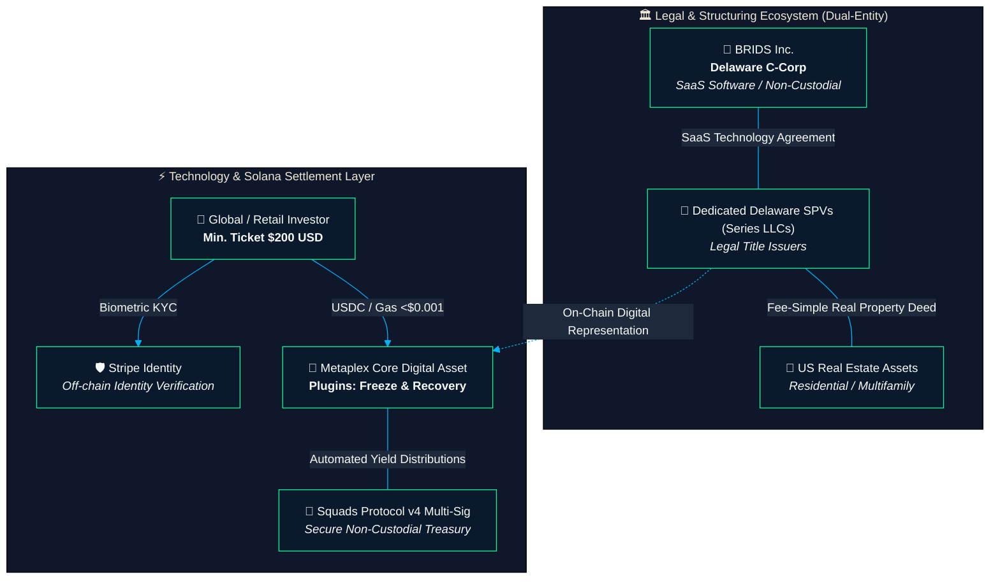
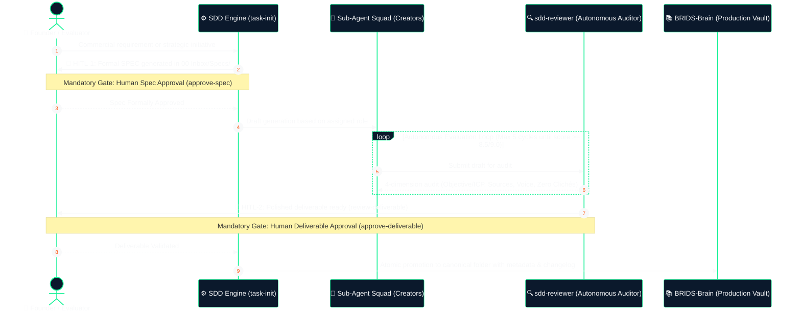

<p align="center">
  <picture>
    <source media="(prefers-color-scheme: dark)" srcset="BRIDS-Engine/brand/brids-logo.svg">
    <source media="(prefers-color-scheme: light)" srcset="BRIDS-Engine/brand/brids-logo-dark.svg">
    
  </picture>
</p>

<p align="center">
  <b>The Official Business Intelligence, Due Diligence Data Room & Autonomous Operations Engine for <a href="https://brids.io">BRIDS.io</a></b>
</p>

<p align="center">
  <i>"Secure, accessible, and traceable Web3 infrastructure for investing in structured real estate from $200 USD."</i>
</p>

<p align="center">
  <a href="https://solana.com"></a>
  <a href="https://www.metaplex.com"></a>
  <a href="file:///Users/jaymusicmachine/Library/CloudStorage/GoogleDrive-goodacrematas498@gmail.com/My%20Drive/01%20Primal%20Code%20Lab/BRIDS/Business/BRIDS%20KNOWLEDGE%20FORT/BRIDS-Brain/01%20Negocio/03%20Legal%20%26%20Cumplimiento/"></a>
  <a href="file:///Users/jaymusicmachine/Library/CloudStorage/GoogleDrive-goodacrematas498@gmail.com/My%20Drive/01%20Primal%20Code%20Lab/BRIDS/Business/BRIDS%20KNOWLEDGE%20FORT/BRIDS-Brain/01%20Negocio/04%20Finanzas%20%26%20YC%20Investors/"></a>
  
  
</p>

<p align="center">
  <a href="#-executive-summary"><b>Executive Summary</b></a> •
  <a href="#-fast-track-due-diligence-index-3-minute-evaluation"><b>Due Diligence Index</b></a> •
  <a href="#️-business--technology-pillars"><b>Business & Tech Pillars</b></a> •
  <a href="#️-official-vault-taxonomy-brids-brain"><b>Knowledge Vault</b></a> •
  <a href="#-autonomous-sdd-engine--sub-agent-squad-brids-engine"><b>Autonomous Engine</b></a> •
  <a href="#-founding-team--institutional-contact"><b>Founders & Contact</b></a>
</p>

---

### 📊 Quick Facts & Core Unit Economics

| 🏷️ Minimum Investment | ⚡ Network Transaction Cost | 🛡️ Corporate Legal Moat | 📈 Software Gross Margin |
| :---: | :---: | :---: | :---: |
| **\$200 USD**<br><sub>Global Retail Access</sub> | **< \$0.001 USD**<br><sub>Automated monthly yield in USDC</sub> | **Dual-Entity Delaware**<br><sub>Non-Broker-Dealer (Sec. 15a1)</sub> | **> 85% SaaS**<br><sub>Flat fee \$4 USD/fraction</sub> |

---

## 🌐 Executive Summary

> [!NOTE]
> **One-Liner:** **"Shopify + Carta for Real Estate Syndication on Solana."**  
> **Sector:** PropTech / Real World Assets (RWA) / Web3 FinTech Infrastructure.  
> **Official Website:** [https://brids.io](https://brids.io)  
> BRIDS.io develops institutional SaaS software and decentralized infrastructure on the **Solana** network. We empower real estate developers (GPs/Sponsors) to syndicate residential properties directly to global retail and crypto-native investors with fractional tickets starting at **$200 USD**, legally anchored by dedicated **Delaware SPVs (Series LLCs)**, and protected against private key loss via **Stripe Identity** and **Metaplex Core plugins**.

---

### The Problem

> [!WARNING]
> **The 4 Structural Traps of Traditional & First-Generation Web3 Syndication:**
> 1. **Capital Illiquidity & High Interest Rates (~7%):** Mid-sized real estate developers face prolonged funding cycles (6–12 months) and heavy debt costs. Traditional syndication costs between \$30,000 and \$50,000 USD in legal overhead alone, requiring minimum tickets of \$25,000–\$50,000 USD that exclude 90%+ of retail investors.
> 2. **The "Seed Phrase Trap" in Web3:** Traditional ERC-20/ERC-3643 tokens cause complete asset forfeiture if a retail user loses their private keys or seed phrase, creating unacceptable fiduciary friction for real estate equity.
> 3. **Prohibitive Ethereum Gas Fees:** Executing dividend payouts and fractional transfers on EVM chains costs \$10–\$50 USD per transaction, mathematically destroying the unit economics of a \$200 USD micro-investment.
> 4. **Regulatory Risk (Illegal Broker-Dealer Status):** Many first-generation RWA platforms charged percentage-based take-rates on raised capital without a FINRA/SEC broker-dealer license, exposing their platforms to regulatory shutdown.

---

### The Solution: BRIDS.io Architecture

> [!TIP]
> **The BRIDS Asymmetric Advantage:**
> - **Sub-Cent Transactions on Solana:** Transaction finality under 400ms with gas fees under \$0.001 USD, enabling high-frequency, automated monthly rental yield distributions in USDC.
> - **Lost-Key Recovery Protocol:** Proprietary architectural integration combining **Stripe Identity biometric verification** with **Metaplex Core Permanent Delegates and Freeze Plugins**. If an investor loses access to their Solana wallet, the SPV administrator can verify biometric identity off-chain, freeze the orphan NFT, and re-issue the fractional title to a verified new wallet without altering the corporate cap table.
> - **Dual-Entity Corporate Moat:** Strict structural decoupling:
>   - **BRIDS Inc. (Delaware C-Corp):** Technology & software vendor operating strictly under Section 15(a)(1) Exchange Act safe harbors. Never custodies client funds or holds real estate titles.
>   - **Independent Delaware SPVs (Series LLCs):** Separate legal vehicles holding fee-simple deed titles to each specific property, issuing investment contracts to verified investors.
> - **Pure SaaS Unit Economics:** Flat technology fee of **\$4 USD per minted fraction** + project setup fees (\$1,000–\$3,500 USD), eliminating percentage-based brokerage commissions and delivering >85% software gross margins.

---

### Market Opportunity & Macro Tailwinds

- **$16 Trillion RWA Opportunity:** Boston Consulting Group projects the tokenized asset market to surpass \$16T USD by 2030, with institutional validation evidenced by BlackRock’s BUIDL fund.
- **Retail Demand for Inflation-Hedged Dollar Yields:** Global individuals seek stable, dollar-denominated rental yields (8%–14% projected IRR) backed by tangible US residential real estate.
- **Pipeline:** \$2,000,000 USD in initial residential inventory structured via real estate operating partner ([Blue Brick Capital](file:///Users/jaymusicmachine/Library/CloudStorage/GoogleDrive-goodacrematas498@gmail.com/My%20Drive/01%20Primal%20Code%20Lab/BRIDS/Business/BRIDS%20KNOWLEDGE%20FORT/BRIDS-Brain/01%20Negocio/05%20Sponsors%20B2B%20%26%20Ventas/)) and an active B2B sponsor evaluation pipeline.

---

## ⚡ Fast-Track Due Diligence Index (3-Minute Evaluation)

For Venture Capital analysts, hackathon judges (Colosseum, Solana Foundation), accelerator selection committees (Y Combinator, Techstars), and institutional real estate sponsors, this repository serves as the **Institutional Data Room** and single source of truth for BRIDS.io.

Click the links below to navigate directly to the canonical source documents inside the persistent vault [`BRIDS-Brain/`](file:///Users/jaymusicmachine/Library/CloudStorage/GoogleDrive-goodacrematas498@gmail.com/My%20Drive/01%20Primal%20Code%20Lab/BRIDS/Business/BRIDS%20KNOWLEDGE%20FORT/BRIDS-Brain/):

| Due Diligence Axis | Evaluator Core Question | Canonical Verification Document | Vault Destination |
| :--- | :--- | :--- | :--- |
|  | *What is the RWA thesis, asymmetric moat, and scalability vision of BRIDS?* | 📄 [Master Business Concepts (C1–C10)](file:///Users/jaymusicmachine/Library/CloudStorage/GoogleDrive-goodacrematas498@gmail.com/My%20Drive/01%20Primal%20Code%20Lab/BRIDS/Business/BRIDS%20KNOWLEDGE%20FORT/BRIDS-Brain/01%20Negocio/01%20Estrategia%20%26%20Modelo/master-business-concepts.md)<br>• [YC Master Application Brief](file:///Users/jaymusicmachine/Library/CloudStorage/GoogleDrive-goodacrematas498@gmail.com/My%20Drive/01%20Primal%20Code%20Lab/BRIDS/Business/BRIDS%20KNOWLEDGE%20FORT/BRIDS-Brain/00%20Inbox/Specs/yc-application-master-template-2025.spec.md)<br>• [Syndication Thesis & Milestone Disbursement Rails](file:///Users/jaymusicmachine/Library/CloudStorage/GoogleDrive-goodacrematas498@gmail.com/My%20Drive/01%20Primal%20Code%20Lab/BRIDS/Business/BRIDS%20KNOWLEDGE%20FORT/BRIDS-Brain/01%20Negocio/01%20Estrategia%20%26%20Modelo/rwa-milestone-disbursement-rail.md) | `01 Negocio/01 Estrategia & Modelo/` |
|  | *How does BRIDS generate revenue, what are the unit economics, and how is the Cap Table structured?* | 📄 [SaaS Fee Architecture ($4/fraction)](file:///Users/jaymusicmachine/Library/CloudStorage/GoogleDrive-goodacrematas498@gmail.com/My%20Drive/01%20Primal%20Code%20Lab/BRIDS/Business/BRIDS%20KNOWLEDGE%20FORT/BRIDS-Brain/01%20Negocio/01%20Estrategia%20%26%20Modelo/master-business-concepts.md#concepto-5--arquitectura-de-tarifas-fijas-y-economía-unitaria-saas-c5)<br>• [Fundraising Guide: SAFE, QSBS & Cap Table](file:///Users/jaymusicmachine/Library/CloudStorage/GoogleDrive-goodacrematas498@gmail.com/My%20Drive/01%20Primal%20Code%20Lab/BRIDS/Business/BRIDS%20KNOWLEDGE%20FORT/BRIDS-Brain/01%20Negocio/04%20Finanzas%20%26%20YC%20Investors/guia-fundraising-safe-qsbs-cap-table.md)<br>• [YC Use of Funds & Capital Plan](file:///Users/jaymusicmachine/Library/CloudStorage/GoogleDrive-goodacrematas498@gmail.com/My%20Drive/01%20Primal%20Code%20Lab/BRIDS/Business/BRIDS%20KNOWLEDGE%20FORT/BRIDS-Brain/00%20Inbox/Specs/yc-use-of-funds-capital-plan.spec.md) | `01 Negocio/04 Finanzas & YC Investors/` |
|  | *Why is BRIDS protected from Broker-Dealer status, and how does tax/KYC compliance work?* | 📄 [3-Phase Regulatory Roadmap: SEC & ATS](file:///Users/jaymusicmachine/Library/CloudStorage/GoogleDrive-goodacrematas498@gmail.com/My%20Drive/01%20Primal%20Code%20Lab/BRIDS/Business/BRIDS%20KNOWLEDGE%20FORT/BRIDS-Brain/01%20Negocio/03%20Legal%20%26%20Cumplimiento/hoja-ruta-regulatoria-3-fases-broker-dealer-ats.md)<br>• [Comparative Analysis: LLC vs Delaware C-Corp](file:///Users/jaymusicmachine/Library/CloudStorage/GoogleDrive-goodacrematas498@gmail.com/My%20Drive/01%20Primal%20Code%20Lab/BRIDS/Business/BRIDS%20KNOWLEDGE%20FORT/BRIDS-Brain/01%20Negocio/03%20Legal%20%26%20Cumplimiento/comparativa-llc-vs-c-corp-estrategia-bootstrap.md)<br>• [IRS Tax Compliance Manual & Fiscal Calendar](file:///Users/jaymusicmachine/Library/CloudStorage/GoogleDrive-goodacrematas498@gmail.com/My%20Drive/01%20Primal%20Code%20Lab/BRIDS/Business/BRIDS%20KNOWLEDGE%20FORT/BRIDS-Brain/01%20Negocio/03%20Legal%20%26%20Cumplimiento/manual-cumplimiento-tributario-irs-calendario-fiscal.md)<br>• [Official Banking & Incorporation Partner (Stablecorp)](file:///Users/jaymusicmachine/Library/CloudStorage/GoogleDrive-goodacrematas498@gmail.com/My%20Drive/01%20Primal%20Code%20Lab/BRIDS/Business/BRIDS%20KNOWLEDGE%20FORT/BRIDS-Brain/01%20Negocio/03%20Legal%20%26%20Cumplimiento/proveedor-oficial-incorporacion-banca-stablecorp.md) | `01 Negocio/03 Legal & Cumplimiento/` |
|  | *How do Metaplex Core contracts, Squads distributions, and the Devnet MVP work?* | 📄 [App Technical Roadmap & Investor Brief](file:///Users/jaymusicmachine/Library/CloudStorage/GoogleDrive-goodacrematas498@gmail.com/My%20Drive/01%20Primal%20Code%20Lab/BRIDS/Business/BRIDS%20KNOWLEDGE%20FORT/BRIDS-Brain/01%20Negocio/02%20Producto%20%26%20Ingenieria/app-technical-roadmap-investor-brief.md)<br>• [Current Product Status Matrix](file:///Users/jaymusicmachine/Library/CloudStorage/GoogleDrive-goodacrematas498@gmail.com/My%20Drive/01%20Primal%20Code%20Lab/BRIDS/Business/BRIDS%20KNOWLEDGE%20FORT/BRIDS-Brain/01%20Negocio/02%20Producto%20%26%20Ingenieria/current-product-status-matrix.md)<br>• [Developer Module & SPV Engine](file:///Users/jaymusicmachine/Library/CloudStorage/GoogleDrive-goodacrematas498@gmail.com/My%20Drive/01%20Primal%20Code%20Lab/BRIDS/Business/BRIDS%20KNOWLEDGE%20FORT/BRIDS-Brain/01%20Negocio/02%20Producto%20%26%20Ingenieria/modulo-desarrollador-spv-engine.md) | `01 Negocio/02 Producto & Ingenieria/` |
|  | *How does BRIDS acquire developers and execute distribution and content strategy?* | 📄 [Master Editorial Content Grid (15 RWA Posts)](file:///Users/jaymusicmachine/Library/CloudStorage/GoogleDrive-goodacrematas498@gmail.com/My%20Drive/01%20Primal%20Code%20Lab/BRIDS/Business/BRIDS%20KNOWLEDGE%20FORT/BRIDS-Brain/02%20Marketing/02%20Estrategia%20%26%20Parrilla/parrilla-publicaciones-redes-sociales.md)<br>• [Master Product & Marketing Context](file:///Users/jaymusicmachine/Library/CloudStorage/GoogleDrive-goodacrematas498@gmail.com/My%20Drive/01%20Primal%20Code%20Lab/BRIDS/Business/BRIDS%20KNOWLEDGE%20FORT/BRIDS-Brain/02%20Marketing/01%20Contexto%20de%20Marca/product-marketing-context.md)<br>• [Multichannel Posts & 4-Slide Educational Carousels](file:///Users/jaymusicmachine/Library/CloudStorage/GoogleDrive-goodacrematas498@gmail.com/My%20Drive/01%20Primal%20Code%20Lab/BRIDS/Business/BRIDS%20KNOWLEDGE%20FORT/BRIDS-Brain/02%20Marketing/03%20Redes%20Sociales%20%26%20Contenido/) | `02 Marketing/` |

---

## 🏛️ Business & Technology Pillars



### 1. Dual-Entity Structural Decoupling
- **BRIDS Inc. (Delaware C-Corp):** Exclusively a software and technology vendor. It never exercises discretionary custody over client funds or holds real property titles, operating strictly within the safe-harbor parameters of Section 15(a)(1) of the Securities Exchange Act of 1934.
- **Dedicated Issuer SPVs (Delaware Series LLCs):** Each physical property is ring-fenced inside an independent Delaware SPV subsidiary holding fee-simple legal deed title and maintaining the official *Master Securityholder File*.

### 2. Assisted Title Recovery Protocol (Lost-Key Recovery)
Representative fractional titles are issued using the **Metaplex Core** standard equipped with permanent delegation plugins managed by the SPV. In the event of a lost private key or compromised wallet:
1. The investor undergoes identity re-verification via **Stripe Identity**.
2. Upon confirmed off-chain identity verification against the SPV's records, the administrator triggers the on-chain **Freeze Plugin** on the orphaned NFT.
3. The asset is burned or transferred technically, and a new fractional title is reissued to the investor's verified replacement wallet, ensuring zero loss of equity without altering the company's cap table.

### 3. Pure SaaS Flat-Fee Monetization Model
- **Flat Minting Fee:** \$4 USD fixed fee per \$200 USD fraction minted (no percentage take-rates on raised capital, shielding BRIDS from broker-dealer classification).
- **SaaS Setup Fee:** \$1,000 to \$3,500 USD per syndicated project for smart contract deployment, project dashboards, and investor onboarding infrastructure.
- **Batch Disbursement Processing Fee:** Fixed tech fee per automated monthly dividend distribution run executed via Squads v4.

---

## 🗂️ Official Vault Taxonomy (`BRIDS-Brain/`)

The persistent knowledge base resides in `BRIDS-Brain/`, organized into two primary macro-domains:

```text
BRIDS KNOWLEDGE FORT/
├── README.md                                 # Institutional overview & Due Diligence Data Room
├── AGENTS.md                                 # Agent execution protocols, CLI scripts & HITL guardrails
├── BRIDS-Engine/                             # Execution engine, squad definitions, scripts & prompt templates
└── BRIDS-Brain/                              # Persistent Knowledge Vault (Obsidian Vault)
    ├── 00 Inbox/                             # Quick captures, drafts, SDD sessions & safety snapshots
    │   ├── Specs/                            # Active formal specifications under the SDD engine
    │   └── Archive/                          # Immutable safety snapshots and past version backups
    ├── 01 Negocio/                           # Corporate, Technical, Legal & Financial Domain
    │   ├── 01 Estrategia & Modelo/           # Master Business Concepts (C1-C10), models & syndication rails
    │   ├── 02 Producto & Ingenieria/         # Solana architecture, Metaplex Core specs, matrices & roadmap
    │   ├── 03 Legal & Cumplimiento/          # Dual-Entity, Data Room, SEC Safe Harbors & IRS tax manuals
    │   ├── 04 Finanzas & YC Investors/       # Pro forma models, Cap Table, SAFE, QSBS & YC application briefs
    │   ├── 05 Sponsors B2B & Ventas/         # Real Estate Sponsor collateral, battlecards & onboarding kits
    │   └── 06 Operaciones & Gobernanza/      # Standard Operating Procedures (SOPs), board minutes & agreements
    └── 02 Marketing/                         # Brand, Demand Generation, Content & Growth Domain
        ├── 01 Contexto de Marca/             # Persistent Brand Context (product-marketing-context.md)
        ├── 02 Estrategia & Parrilla/         # Master 15-Day Editorial Content Grid & RWA launch plans
        ├── 03 Redes Sociales & Contenido/    # Multi-channel posts (LinkedIn/X), 4-slide carousels & social cards
        ├── 04 Copywriting & Web/             # High-conversion landing page copy, micro-copy & CRO
        ├── 05 Email Marketing/               # Outbound cold sequences (B2B sponsors) & retail nurture flows
        ├── 06 SEO & Descubrimiento/          # Generative Engine Optimization (GEO/AI SEO) & search matrix
        └── 07 Analitica & Crecimiento/       # On-chain / off-chain measurement plans, funnels & retention loops
```

---

## 🤖 Autonomous SDD Engine & Sub-Agent Squad (`BRIDS-Engine/`)

To guarantee technical accuracy, eliminate AI clichés, and maintain strict legal fidelity, every strategic deliverable is generated through the **Spec-Driven Development (SDD)** protocol featuring a **Double Human-in-the-Loop Guardrail (HITL)**:



### The Specialized YC & RWA Agent Squad
Autonomous sub-agents are defined in `BRIDS-Engine/agents/*.yaml`:

| Agent Identifier | Assigned Role | Core Business Mission |
| :--- | :--- | :--- |
| `business-consultant` | Unit Economics & Fee Architect | Models unit economics, \$4 USD fee structures, 3-5 year pro forma projections, and CAC/LTV dynamics. |
| `market-research-analyst` | TAM/SAM/SOM & Competitive Intelligence | Performs quantitative RWA market sizing and competitive benchmarks (Lofty, RealT, Blocksquare). |
| `pitch-deck-architect` | Investor Decks Architect | Structures institutional 10-12 slide pitch presentations (Sequoia/YC style) and slide scripts. |
| `compliance-officer` | Legal Structuring & Regulatory Moat | Audits Dual-Entity separation, Non-Broker-Dealer legal memos, Stripe KYC workflows, and Data Room assets. |
| `b2b-sponsor-lead` | Real Estate Sponsor Acquisition | Crafts institutional value propositions for real estate developers (GPs) and cold outbound campaigns. |
| `founder-ghostwriter` | Founder Voice & Thought Leadership | Authors YC application essays ("Why now?", "The Seed Phrase Trap"), thought leadership, and multiformat content. |

---

## 🛠️ Automation Tools & CLI Scripts

The `BRIDS-Engine/scripts/` directory provides atomic CLI commands to operate the workspace:

| Script Command | Purpose & Description |
| :--- | :--- |
| `bash BRIDS-Engine/scripts/task-init.sh <slug> [args]` | **Task Init & SDD Engine:** Initializes formal specifications enforced with Double HITL guardrails. |
| `bash BRIDS-Engine/scripts/sdd-manager.sh <cmd>` | **SDD Lifecycle Manager:** Commands `preview`, `approve-spec`, `refine-spec`, `review-deliverable`, and `approve-deliverable`. |
| `bash BRIDS-Engine/scripts/refine-note.sh <inspect\|backup\|refine\|rollback>` | **Non-Destructive Content Refinement:** Updates existing notes with version bumping and safety snapshots. |
| `bash BRIDS-Engine/scripts/create-social-carousel.sh "<idea>" [img]` | **Social Carousel Pipeline:** Generates 4-slide 4:5 educational carousels with dedicated assets. |
| `bash BRIDS-Engine/scripts/create-social-post.sh <red> "<idea>"` | **Social Post Generator:** Instantiates production-ready social media posts following canonical SOPs. |
| `bash BRIDS-Engine/scripts/sync-technical-docs.sh [--force]` | **Technical OKF Sync:** Incrementally synchronizes technical architecture from `jeisonsosablockdev/brids:knowledge`. |
| `bash BRIDS-Engine/tests/smoke-test.sh` | **End-to-End System Smoke Test:** Audits taxonomy compliance, agent squad validity, and idempotency suites. |
| `bash BRIDS-Engine/scripts/enforce-compliance.sh` | **Anti-Drift Compliance Audit:** Executes full checks across brand context, vault linters, and skill sets. |

---

## 👥 Founding Team & Institutional Contact

BRIDS.io is led by a multidisciplinary team combining native Solana infrastructure development, US real estate structuring, and enterprise operations:

- **CTO & Solana Architect:** **Jeison Sosa** ([@jeisonsosablockdev](https://github.com/jeisonsosablockdev)) — Smart contract architecture on Solana, Metaplex Core integration, and biometric identity rails.
  - 📩 **Direct Email:** `jeisonsosablockdev@gmail.com`
- **Head of Real Estate & Sponsor Operations:** Co-founder and partner at [Blue Brick Capital](file:///Users/jaymusicmachine/Library/CloudStorage/GoogleDrive-goodacrematas498@gmail.com/My%20Drive/01%20Primal%20Code%20Lab/BRIDS/Business/BRIDS%20KNOWLEDGE%20FORT/BRIDS-Brain/01%20Negocio/05%20Sponsors%20B2B%20%26%20Ventas/) — Residential asset origination, rehab development management, and Delaware SPV administration.
- **CEO & Corporate Operations Lead:** Investor relations, Due Diligence coordination, and US securities legal oversight.

### Institutional Channels & Due Diligence Requests
- 🌐 **Official Website:** [https://brids.io](https://brids.io)
- 🏢 **Data Room & Inquiries:** `founders@brids.io`
- 💬 **Investor & Committee Meetings:** To request full Data Room access, a technical demonstration on Solana Devnet, or an institutional real estate sponsor structuring session, contact the founders directly via email or through the official portal.
