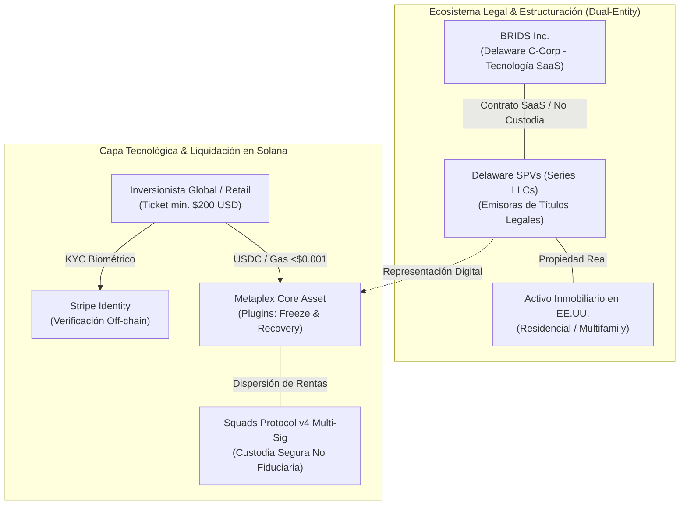
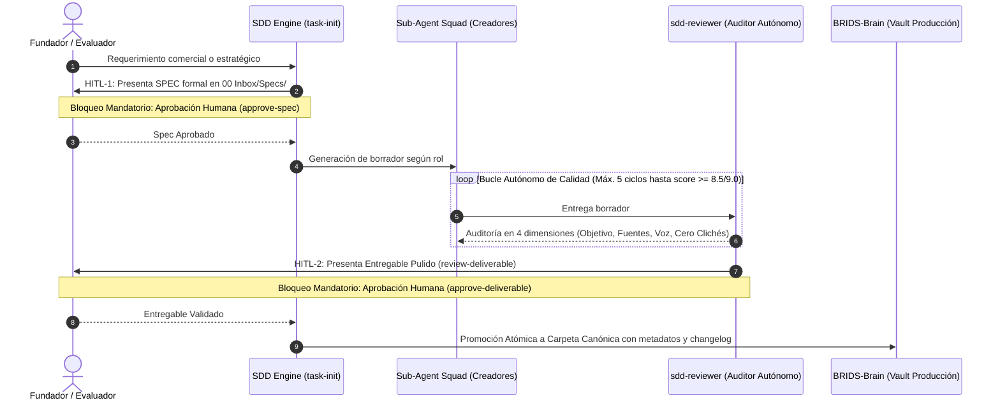

# BRIDS KNOWLEDGE FORT

> **The Official Business Intelligence, Institutional Due Diligence Data Room & Autonomous Operations Engine for [BRIDS.io](https://brids.io)**

[](https://solana.com)
[](https://www.metaplex.com/)
[](file:///Users/jaymusicmachine/Library/CloudStorage/GoogleDrive-goodacrematas498@gmail.com/My%20Drive/01%20Primal%20Code%20Lab/BRIDS/Business/BRIDS%20KNOWLEDGE%20FORT/BRIDS-Brain/01%20Negocio/03%20Legal%20%26%20Cumplimiento/)
[](file:///Users/jaymusicmachine/Library/CloudStorage/GoogleDrive-goodacrematas498@gmail.com/My%20Drive/01%20Primal%20Code%20Lab/BRIDS/Business/BRIDS%20KNOWLEDGE%20FORT/BRIDS-Brain/01%20Negocio/04%20Finanzas%20%26%20YC%20Investors/)

---

## 🌐 Executive Summary (English)

### Company Overview & Brand Slogan
- **Official Brand Slogan:** *"Secure, accessible, and traceable Web3 infrastructure for investing in structured real estate from $200 USD."*
- **One-Liner:** **"Shopify + Carta for Real Estate Syndication on Solana."**
- **Website:** [https://brids.io](https://brids.io)
- **Sector:** PropTech / Real World Assets (RWA) / Web3 FinTech Infrastructure.

BRIDS.io develops institutional SaaS software and decentralized infrastructure on the **Solana** network. We empower real estate developers (GPs/Sponsors) to syndicate residential properties directly to global retail and crypto-native investors with fractional tickets starting at **$200 USD**, legally anchored by dedicated **Delaware SPVs (Series LLCs)**, and protected against private key loss via **Stripe Identity** and **Metaplex Core plugins**.

---

### The Problem
1. **Capital Illiquidity & High Interest Rates (~7%):** Mid-sized real estate developers face prolonged funding cycles (6–12 months) and high debt costs. Traditional syndication costs between \$30,000 and \$50,000 USD in legal overhead alone, requiring minimum tickets of \$25,000–\$50,000 USD that exclude 90%+ of retail investors.
2. **The "Seed Phrase Trap" in Web3:** Traditional ERC-20/ERC-3643 tokens cause complete asset forfeiture if a retail user loses their private keys or seed phrase, creating unacceptable fiduciary friction for real estate equity.
3. **Prohibitive Ethereum Gas Fees:** Executing dividend payouts and fractional transfers on EVM chains costs \$10–\$50 USD per transaction, mathematically destroying the unit economics of a \$200 USD micro-investment.
4. **Regulatory Risk (Illegal Broker-Dealer Status):** Many first-generation RWA platforms charged percentage-based take-rates on raised capital without a FINRA/SEC broker-dealer license, exposing their platforms to regulatory shutdown.

---

### The Solution: BRIDS.io Architecture
- **Sub-Cent Transactions on Solana:** Transaction finality under 400ms with gas fees under \$0.001 USD, enabling high-frequency, automated monthly rental yield distributions in USDC.
- **Lost-Key Recovery Protocol:** Proprietary architectural integration combining **Stripe Identity biometric verification** with **Metaplex Core Permanent Delegates and Freeze Plugins**. If an investor loses access to their Solana wallet, the SPV administrator can verify biometric identity off-chain, freeze the orphan NFT, and re-issue the fractional title to a verified new wallet without altering the corporate cap table.
- **Dual-Entity Corporate Moat:** Strict structural decoupling:
  - **BRIDS Inc. (Delaware C-Corp):** Technology & software vendor operating strictly under Section 15(a)(1) Exchange Act safe harbors. Never custodies client funds or holds real estate titles.
  - **Independent Delaware SPVs (Series LLCs):** Separate legal vehicles holding fee-simple deed titles to each specific property, issuing investment contracts to verified investors.
- **Pure SaaS Unit Economics:** Flat technology fee of **\$4 USD per minted fraction** + project setup fees (\$1,000–\$3,500 USD), eliminating percentage-based brokerage commissions and delivering >85% software gross margins.

---

### Market Opportunity & Macro Tailwinds
- **$16 Trillion RWA Opportunity:** Boston Consulting Group projects the tokenized asset market to surpass \$16T USD by 2030, with institutional validation evidenced by BlackRock’s BUIDL fund.
- **Retail Demand for Inflation-Hedged Dollar Yields:** Global individuals seek stable, dollar-denominated rental yields (8%–14% projected IRR) backed by tangible US residential real estate.
- **Pipeline:** \$2,000,000 USD in initial residential inventory structured via real estate operating partner ([Blue Brick Capital](file:///Users/jaymusicmachine/Library/CloudStorage/GoogleDrive-goodacrematas498@gmail.com/My%20Drive/01%20Primal%20Code%20Lab/BRIDS/Business/BRIDS%20KNOWLEDGE%20FORT/BRIDS-Brain/01%20Negocio/05%20Sponsors%20B2B%20%26%20Ventas/)) and an active B2B sponsor evaluation pipeline.

---

## ⚡ Fast-Track Due Diligence Index (3-Minute Evaluation)

Para analistas de Venture Capital, jurados de hackathons (Colosseum, Solana Foundation), comités de aceleradoras (Y Combinator, Techstars) y promotores inmobiliarios, este repositorio constituye el **Data Room Institucional** y fuente de verdad de BRIDS.io. 

Haz clic en los enlaces para acceder directamente a la documentación viva en la bóveda [`BRIDS-Brain/`](file:///Users/jaymusicmachine/Library/CloudStorage/GoogleDrive-goodacrematas498@gmail.com/My%20Drive/01%20Primal%20Code%20Lab/BRIDS/Business/BRIDS%20KNOWLEDGE%20FORT/BRIDS-Brain/):

| Eje de Due Diligence | Pregunta Clave del Evaluador | Documento de Verificación Canónico | Ubicación en Bóveda |
| :--- | :--- | :--- | :--- |
| **1. Tesis & Pitch** | *¿Cuál es la tesis RWA, la ventaja asimétrica y la visión de escala de BRIDS?* | [Master Business Concepts (C1–C10)](file:///Users/jaymusicmachine/Library/CloudStorage/GoogleDrive-goodacrematas498@gmail.com/My%20Drive/01%20Primal%20Code%20Lab/BRIDS/Business/BRIDS%20KNOWLEDGE%20FORT/BRIDS-Brain/01%20Negocio/01%20Estrategia%20%26%20Modelo/master-business-concepts.md)<br>• [YC Master Application Brief](file:///Users/jaymusicmachine/Library/CloudStorage/GoogleDrive-goodacrematas498@gmail.com/My%20Drive/01%20Primal%20Code%20Lab/BRIDS/Business/BRIDS%20KNOWLEDGE%20FORT/BRIDS-Brain/00%20Inbox/Specs/yc-application-master-template-2025.spec.md)<br>• [Tesis de Sindicación y Rieles de Hitos](file:///Users/jaymusicmachine/Library/CloudStorage/GoogleDrive-goodacrematas498@gmail.com/My%20Drive/01%20Primal%20Code%20Lab/BRIDS/Business/BRIDS%20KNOWLEDGE%20FORT/BRIDS-Brain/01%20Negocio/01%20Estrategia%20%26%20Modelo/rwa-milestone-disbursement-rail.md) | `01 Negocio/01 Estrategia & Modelo/` |
| **2. Modelo de Negocio & Finanzas** | *¿Cómo genera ingresos BRIDS, cuáles son los unit economics y cómo se estructura el Cap Table?* | [Estructura de Tarifas SaaS ($4/fracción)](file:///Users/jaymusicmachine/Library/CloudStorage/GoogleDrive-goodacrematas498@gmail.com/My%20Drive/01%20Primal%20Code%20Lab/BRIDS/Business/BRIDS%20KNOWLEDGE%20FORT/BRIDS-Brain/01%20Negocio/01%20Estrategia%20%26%20Modelo/master-business-concepts.md#concepto-5--arquitectura-de-tarifas-fijas-y-economía-unitaria-saas-c5)<br>• [Guía Fundraising SAFE, QSBS & Cap Table](file:///Users/jaymusicmachine/Library/CloudStorage/GoogleDrive-goodacrematas498@gmail.com/My%20Drive/01%20Primal%20Code%20Lab/BRIDS/Business/BRIDS%20KNOWLEDGE%20FORT/BRIDS-Brain/01%20Negocio/04%20Finanzas%20%26%20YC%20Investors/guia-fundraising-safe-qsbs-cap-table.md)<br>• [YC Use of Funds & Capital Plan](file:///Users/jaymusicmachine/Library/CloudStorage/GoogleDrive-goodacrematas498@gmail.com/My%20Drive/01%20Primal%20Code%20Lab/BRIDS/Business/BRIDS%20KNOWLEDGE%20FORT/BRIDS-Brain/00%20Inbox/Specs/yc-use-of-funds-capital-plan.spec.md) | `01 Negocio/04 Finanzas & YC Investors/` |
| **3. Blindaje Legal & Cumplimiento** | *¿Por qué BRIDS no es un Broker-Dealer no regulado y cómo opera el marco tributario/KYC?* | [Hoja de Ruta Regulatoria 3 Fases SEC/ATS](file:///Users/jaymusicmachine/Library/CloudStorage/GoogleDrive-goodacrematas498@gmail.com/My%20Drive/01%20Primal%20Code%20Lab/BRIDS/Business/BRIDS%20KNOWLEDGE%20FORT/BRIDS-Brain/01%20Negocio/03%20Legal%20%26%20Cumplimiento/hoja-ruta-regulatoria-3-fases-broker-dealer-ats.md)<br>• [Comparativa LLC vs Delaware C-Corp](file:///Users/jaymusicmachine/Library/CloudStorage/GoogleDrive-goodacrematas498@gmail.com/My%20Drive/01%20Primal%20Code%20Lab/BRIDS/Business/BRIDS%20KNOWLEDGE%20FORT/BRIDS-Brain/01%20Negocio/03%20Legal%20%26%20Cumplimiento/comparativa-llc-vs-c-corp-estrategia-bootstrap.md)<br>• [Manual Fiscal IRS & Calendario Tributario](file:///Users/jaymusicmachine/Library/CloudStorage/GoogleDrive-goodacrematas498@gmail.com/My%20Drive/01%20Primal%20Code%20Lab/BRIDS/Business/BRIDS%20KNOWLEDGE%20FORT/BRIDS-Brain/01%20Negocio/03%20Legal%20%26%20Cumplimiento/manual-cumplimiento-tributario-irs-calendario-fiscal.md)<br>• [Partner Bancario & Societario (Stablecorp)](file:///Users/jaymusicmachine/Library/CloudStorage/GoogleDrive-goodacrematas498@gmail.com/My%20Drive/01%20Primal%20Code%20Lab/BRIDS/Business/BRIDS%20KNOWLEDGE%20FORT/BRIDS-Brain/01%20Negocio/03%20Legal%20%26%20Cumplimiento/proveedor-oficial-incorporacion-banca-stablecorp.md) | `01 Negocio/03 Legal & Cumplimiento/` |
| **4. Arquitectura Tecnológica Solana** | *¿Cómo funcionan los contratos Metaplex Core, la dispersión con Squads y el status del MVP?* | [App Technical Roadmap & Investor Brief](file:///Users/jaymusicmachine/Library/CloudStorage/GoogleDrive-goodacrematas498@gmail.com/My%20Drive/01%20Primal%20Code%20Lab/BRIDS/Business/BRIDS%20KNOWLEDGE%20FORT/BRIDS-Brain/01%20Negocio/02%20Producto%20%26%20Ingenieria/app-technical-roadmap-investor-brief.md)<br>• [Current Product Status Matrix](file:///Users/jaymusicmachine/Library/CloudStorage/GoogleDrive-goodacrematas498@gmail.com/My%20Drive/01%20Primal%20Code%20Lab/BRIDS/Business/BRIDS%20KNOWLEDGE%20FORT/BRIDS-Brain/01%20Negocio/02%20Producto%20%26%20Ingenieria/current-product-status-matrix.md)<br>• [Módulo Desarrollador & SPV Engine](file:///Users/jaymusicmachine/Library/CloudStorage/GoogleDrive-goodacrematas498@gmail.com/My%20Drive/01%20Primal%20Code%20Lab/BRIDS/Business/BRIDS%20KNOWLEDGE%20FORT/BRIDS-Brain/01%20Negocio/02%20Producto%20%26%20Ingenieria/modulo-desarrollador-spv-engine.md) | `01 Negocio/02 Producto & Ingenieria/` |
| **5. Tracción & Estrategia GTM** | *¿Cómo atrae BRIDS a los promotores y cuál es la estrategia de marketing y distribución?* | [Parrilla Editorial Maestra RWA (15 Posts)](file:///Users/jaymusicmachine/Library/CloudStorage/GoogleDrive-goodacrematas498@gmail.com/My%20Drive/01%20Primal%20Code%20Lab/BRIDS/Business/BRIDS%20KNOWLEDGE%20FORT/BRIDS-Brain/02%20Marketing/02%20Estrategia%20%26%20Parrilla/parrilla-publicaciones-redes-sociales.md)<br>• [Contexto Maestro de Producto & Marketing](file:///Users/jaymusicmachine/Library/CloudStorage/GoogleDrive-goodacrematas498@gmail.com/My%20Drive/01%20Primal%20Code%20Lab/BRIDS/Business/BRIDS%20KNOWLEDGE%20FORT/BRIDS-Brain/02%20Marketing/01%20Contexto%20de%20Marca/product-marketing-context.md)<br>• [Publicaciones Multicanal & Carruseles Educativos](file:///Users/jaymusicmachine/Library/CloudStorage/GoogleDrive-goodacrematas498@gmail.com/My%20Drive/01%20Primal%20Code%20Lab/BRIDS/Business/BRIDS%20KNOWLEDGE%20FORT/BRIDS-Brain/02%20Marketing/03%20Redes%20Sociales%20%26%20Contenido/) | `02 Marketing/` |

---

## 🏛️ Pilares de Negocio & Arquitectura BRIDS.io



### 1. Desacoplamiento Dual-Entity
- **BRIDS Inc. (Delaware C-Corp):** Exclusivamente proveedora de software. No custodia fondos fiduciarios ni activos físicos, amparada en los criterios de exención bajo la Sección 15(a)(1) del Securities Exchange Act de 1934.
- **SPV Emisora (Delaware Series LLC):** Cada propiedad se aísla jurídicamente en una subsidiaria SPV independiente que ostenta el título de propiedad (*fee-simple*) y mantiene el *Master Securityholder File* oficial.

### 2. Recuperación Asistida de Títulos (Lost-Key Recovery)
Los tokens NFT representativos se emiten bajo el estándar **Metaplex Core** con plugins de delegación permanente gestionados por la SPV. Ante el extravío o robo de llaves privadas:
1. El usuario realiza una re-verificación biométrica y documental a través de **Stripe Identity**.
2. Al validarse la coincidencia con el registro original de la SPV, el administrador ejecuta el plugin de **Freeze** sobre el NFT extraviado.
3. Se quema o transfiere técnicamente el activo y se reemite una nueva fracción a la nueva wallet del titular legítimo, garantizando cero pérdida de capital sin alterar el libro oficial de socios.

### 3. Modelo de Monetización SaaS
- **Tarifa plana de emisión:** \$4 USD fijos por cada fracción de \$200 USD emitida (sin cobro porcentual sobre el capital levantado).
- **Setup de software:** \$1,000 a \$3,500 USD por proyecto para despliegue de dashboards, contratos e infraestructura.
- **Fee de dispersión tecnológica:** Tarifa por corrida batch de dispersión mensual de dividendos vía Squads v4.

---

## 🗂️ Taxonomía Oficial de la Bóveda (`BRIDS-Brain/`)

La base de conocimiento persistente reside en `BRIDS-Brain/`, dividida en dos macrodominios funcionales:

```text
BRIDS KNOWLEDGE FORT/
├── README.md                                 # Portada institucional & Data Room de Due Diligence
├── AGENTS.md                                 # Protocolos de agentes, scripts y guardrails HITL
├── BRIDS-Engine/                             # Motor de ejecución, agentes, scripts y prompts
└── BRIDS-Brain/                              # Bóveda de conocimiento persistente (Obsidian Vault)
    ├── 00 Inbox/                             # Capturas rápidas, borradores, sesiones SDD y backups
    │   ├── Specs/                            # Especificaciones formales activas bajo protocolo SDD
    │   └── Archive/                          # Snapshots inmutables de versiones previas
    ├── 01 Negocio/                           # Dominio Corporativo, Técnico, Legal y Financiero
    │   ├── 01 Estrategia & Modelo/           # Conceptos Maestros (C1-C10), modelos de inversión y tesis
    │   ├── 02 Producto & Ingenieria/         # Arquitectura Solana, Metaplex Core, matrices y roadmap
    │   ├── 03 Legal & Cumplimiento/          # Dual-Entity, Data Room, Safe Harbors SEC y manual fiscal IRS
    │   ├── 04 Finanzas & YC Investors/       # Modelos pro forma, Cap Table, SAFE, QSBS y material YC
    │   ├── 05 Sponsors B2B & Ventas/         # Colateral para promotores, battlecards y onboarding
    │   └── 06 Operaciones & Gobernanza/      # SOPs operativos, gobernanza de junta y acuerdos
    └── 02 Marketing/                         # Dominio de Marca, Adquisición, Redes y Crecimiento
        ├── 01 Contexto de Marca/             # Contexto persistente (product-marketing-context.md)
        ├── 02 Estrategia & Parrilla/         # Parrilla maestra de 15 días y lanzamientos RWA
        ├── 03 Redes Sociales & Contenido/    # Publicaciones LinkedIn/X, carruseles 4:5 y social cards
        ├── 04 Copywriting & Web/             # Textos de landing page, micro-copy y CRO
        ├── 05 Email Marketing/               # Secuencias outbound B2B y nutrición retail
        ├── 06 SEO & Descubrimiento/          # GEO (AI SEO), arquitectura de búsqueda y comparativas
        └── 07 Analitica & Crecimiento/       # Planes de medición on/off-chain, embudos y retención
```

---

## 🤖 Motor Autónomo SDD & Squad de Sub-Agentes (`BRIDS-Engine/`)

Para asegurar rigor técnico, cero clichés de IA y exactitud jurídica, cada documento de negocio o activo de marketing se produce bajo el protocolo **Spec-Driven Development (SDD)** con **Doble Guardrail Humano (HITL)**:



### El Squad Especializado YC & RWA
Los agentes autónomos están configurados en `BRIDS-Engine/agents/*.yaml`:

| Identificador | Rol Principal | Misión en el Negocio |
| :--- | :--- | :--- |
| `business-consultant` | Unit Economics & Fee Architect | Modela la economía unitaria, fees de \$4 USD, proyecciones pro forma a 3-5 años y análisis CAC/LTV. |
| `market-research-analyst` | TAM/SAM/SOM & Competitive Intelligence | Investiga el mercado RWA, dimensionamiento cuantitativo y benchmarks (Lofty, RealT, Blocksquare). |
| `pitch-deck-architect` | Investor Decks Architect | Estructura presentaciones institucionales de 10-12 diapositivas (estilo Sequoia/YC) y guiones de pitch. |
| `compliance-officer` | Legal Structuring & Regulatory Moat | Supervisa la separación Dual-Entity, opiniones de No-Broker-Dealer, Stripe KYC y Data Room. |
| `b2b-sponsor-lead` | Real Estate Sponsor Acquisition | Redacta propuestas de valor institucionales para desarrolladores inmobiliarios (GPs) y secuencias outbound. |
| `founder-ghostwriter` | Founder Voice & Thought Leadership | Redacta aplicaciones YC, ensayos estratégicos ("Why now?", "The Seed Phrase Trap") y contenido multicanal. |

---

## 🛠️ Herramientas de Automatización & Scripts CLI

El directorio `BRIDS-Engine/scripts/` ofrece comandos atómicos para operar la infraestructura:

| Comando | Función y Propósito |
| :--- | :--- |
| `bash BRIDS-Engine/scripts/task-init.sh <slug> [args]` | **Task Init & SDD Engine:** Inicializa especificaciones formales con Doble Guardrail HITL. |
| `bash BRIDS-Engine/scripts/sdd-manager.sh <cmd>` | **Gestor de Ciclo SDD:** Comandos `preview`, `approve-spec`, `refine-spec`, `review-deliverable` y `approve-deliverable`. |
| `bash BRIDS-Engine/scripts/refine-note.sh <inspect\|backup\|refine\|rollback>` | **Refinamiento No Destructivo:** Actualiza notas existentes con versionado y changelog sin sobrescritura ciega. |
| `bash BRIDS-Engine/scripts/create-social-carousel.sh "<idea>" [img]` | **Pipeline de Carruseles:** Genera carruseles educativos 4:5 con assets dedicados. |
| `bash BRIDS-Engine/scripts/create-social-post.sh <red> "<idea>"` | **Generador de Publicaciones:** Instancia notas de contenido social listas para producción. |
| `bash BRIDS-Engine/scripts/sync-technical-docs.sh [--force]` | **Sync Técnico OKF:** Sincroniza la arquitectura técnica desde el repositorio `jeisonsosablockdev/brids:knowledge`. |
| `bash BRIDS-Engine/tests/smoke-test.sh` | **End-to-End System Smoke Test:** Valida la taxonomía, squad de agentes y suites de idempotencia. |
| `bash BRIDS-Engine/scripts/enforce-compliance.sh` | **Auditoría Anti-Drift:** Ejecuta validaciones completas de contexto de marca, linters y skills. |

---

## 👥 Equipo Fundador & Contacto Institucional

BRIDS.io está liderado por un equipo multidisciplinario que combina desarrollo de infraestructura en Solana, estructuración inmobiliaria en EE.UU. y operaciones corporativas:

- **CTO & Solana Architect:** **Jeison Sosa** ([@jeisonsosablockdev](https://github.com/jeisonsosablockdev)) — Arquitectura de contratos en Solana, integración Metaplex Core y protocolos de identidad.
  - 📩 **Email:** `jeisonsosablockdev@gmail.com`
- **Head of Real Estate & Sponsor Operations:** Co-fundador y socio en [Blue Brick Capital](file:///Users/jaymusicmachine/Library/CloudStorage/GoogleDrive-goodacrematas498@gmail.com/My%20Drive/01%20Primal%20Code%20Lab/BRIDS/Business/BRIDS%20KNOWLEDGE%20FORT/BRIDS-Brain/01%20Negocio/05%20Sponsors%20B2B%20%26%20Ventas/) — Originación de activos residenciales, estructuración de obra y gestión de SPVs.
- **CEO & Corporate Operations Lead:** Relación con inversionistas, coordinación de Due Diligence y asesoría legal externa en EE.UU.

### Canales Institucionales & Due Diligence Requests
- 🌐 **Sitio Web Oficial:** [https://brids.io](https://brids.io)
- 🏢 **Data Room & Inquiries:** `founders@brids.io`
- 💬 **Reuniones con Inversionistas / Comités:** Para solicitar acceso al Data Room completo, demostración técnica en Solana Devnet o sesión de estructuración con promotores inmobiliarios, contactar directamente vía correo o a través del portal institucional.
