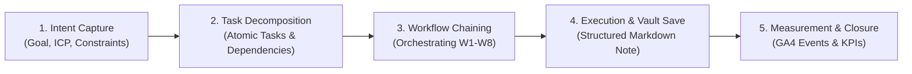

# Marketing Agent Studio

Marketing workspace for creating, organizing, and refining brand content with AI agents, while keeping logic separate from the Obsidian vault.

## Origin

This project is based on the idea and skill library from [coreyhaines31/marketingskills](https://github.com/coreyhaines31/marketingskills), a repository of agent skills for marketing tasks such as copywriting, SEO, CRO, analytics, growth, and sales enablement.

## What We Implemented

This workspace adds a project structure around that idea:

- `BRIDS-Engine/`
  - imported upstream skills
  - local skill adaptations
  - persistent brand context
  - project docs
  - cross-platform skill activation scripts for Codex
- `BRIDS-Brain/`
  - Obsidian vault
  - folders for each major marketing content category
  - final Markdown deliverables
  - installed `Agent Client` plugin configured for Codex

## Project Structure

```text
BRIDS KNOWLEDGE FORT/
├── AGENTS.md
├── README.md
├── BRIDS-Engine/
│   ├── agents/
│   ├── context/
│   ├── docs/
│   ├── scripts/
│   ├── skills/
│   └── templates/
└── BRIDS-Brain/
    ├── 00 Inbox/
    ├── 01 Brand Context/
    ├── 02 Strategy & Research/
    ├── 03 Website & Copy/
    ├── 04 Email & Lifecycle/
    ├── 05 SEO & Discoverability/
    ├── 06 CRO & Funnel/
    ├── 07 Paid, Social & Community/
    ├── 08 Analytics & Measurement/
    ├── 09 Retention & Growth/
    ├── 10 RevOps & Sales/
    ├── 11 Legal & Compliance/
    ├── 12 Finance & Treasury/
    ├── 13 Product & Engineering/
    ├── 14 Investor Relations & YC/
    └── 15 Operations & Governance/
```

## Brand Context

The persistent context file lives at:

- `BRIDS-Engine/context/product-marketing-context.md`

It is also exposed inside the vault through:

- `BRIDS-Brain/01 Brand Context/product-marketing-context.md`

Use that file to keep product, audience, positioning, proof points, tone, and goals available for all future work.

## How To Use

1. Fill or refine the brand context file.
2. Choose the marketing task or skill family you want to work on.
3. Use imported skills as reference and adapt local skills only when needed.
4. Save final outputs as Markdown in the matching folder inside `BRIDS-Brain/`.
5. Review and iterate inside Obsidian without mixing business content with core logic.
6. Follow `BRIDS-Engine/docs/document-organization.md` when a new folder or document structure is needed.
7. If you want Codex to use the project-local skills, run `bash BRIDS-Engine/scripts/enable-project-skills.sh`.
8. Open Obsidian, enable `Agent Client` if it is not already active, and use Codex as the default agent inside the vault.

On Windows PowerShell, use:

```powershell
powershell -ExecutionPolicy Bypass -File .\BRIDS-Engine\scripts\enable-project-skills.ps1
```

## Folder Purpose

### Marketing, GTM & Growth (00-10)
- `00 Inbox`: rough captures, ideas, quick drafts, and SDD task sessions
- `01 Brand Context`: persistent brand and product context (`product-marketing-context.md`)
- `02 Strategy & Research`: corporate strategy, master business concepts (`Business Concepts/`), market research
- `03 Website & Copy`: page copy, website rewrites, lead magnets
- `04 Email & Lifecycle`: cold email and email sequence work
- `05 SEO & Discoverability`: SEO, AI SEO (GEO), schema, site structure, ASO
- `06 CRO & Funnel`: page optimization and funnel conversion work
- `07 Paid, Social & Community`: ads, creative, social posts, carousels, and content grids
- `08 Analytics & Measurement`: tracking plans (GA4/Mixpanel) and KPI dashboards
- `09 Retention & Growth`: churn reduction, referrals, and growth loops
- `10 RevOps & Sales`: B2B sponsor acquisition and sales enablement

### Administrative & Corporate (11-15)
- `11 Legal & Compliance`: Delaware C-Corp governance, SPVs (Series LLC), Data Room, KYC/AML
- `12 Finance & Treasury`: 3-5y pro forma financial models, Cap Table, runway, Squads Multi-Sig
- `13 Product & Engineering`: Solana architecture, Metaplex Core plugins, smart contract audits
- `14 Investor Relations & YC`: Y Combinator application, pitch decks, investor updates
- `15 Operations & Governance`: operational SOPs, team hiring, advisor agreements, board resolutions

## Project Scripts & Automation

This project includes a suite of utility and automation scripts located in `BRIDS-Engine/scripts/`:

| Script | Command | Purpose |
| :--- | :--- | :--- |
| **`task-init.sh`** | `bash BRIDS-Engine/scripts/task-init.sh <slug> [args]` | **Atomic Task Init & SDD Engine:** Inicializador unificado para tareas y SDD con Doble Guardrail HITL. Crea la especificación formal, bloquea la ejecución hasta la aprobación humana (HITL-1) y coordina el bucle evaluador-optimizador hasta HITL-2. |
| **`sdd-manager.sh`** | `bash BRIDS-Engine/scripts/sdd-manager.sh <cmd>` | **Spec-Driven Development & Quality Optimizer con Doble HITL:** Gestiona specs y bucle Creador vs Revisor ($\ge 8.5/9.0$, máx 5 ciclos). Guardrails humanos: HITL-1 (`approve-spec`, `refine-spec`) e HITL-2 (`review-deliverable`, `approve-deliverable`, `refine-deliverable`). |
| **`create-social-carousel.sh`** | `bash BRIDS-Engine/scripts/create-social-carousel.sh "<idea>" [img] [prenda] [ref]` | **4-Slide Social Carousel Pipeline:** Generates 4:5 carousels (Hero, Line-Art Figurine, PAS Details, Conversion CTA) with dedicated Obsidian asset folders. |
| **`create-social-post.sh`** | `bash BRIDS-Engine/scripts/create-social-post.sh <red> "<idea>" [tipo] [ref] [prenda]` | **Social Content Extractor & Generator:** Instantiates production-ready social media posts from the protected SOP with automatic `YYYY-MM-DD-redsocial-idea.md` naming. |
| **`test-idempotency.sh`** | `bash BRIDS-Engine/tests/test-idempotency.sh` | **Automated Idempotency Test Suite:** Verifies deterministic behavior across task initialization, state transitions, context sync, note refinement, rollback, SDD lifecycle, and skill symlinks. |
| **`enforce-compliance.sh`** | `bash BRIDS-Engine/scripts/enforce-compliance.sh` | **Master Anti-Drift Compliance Suite:** Runs end-to-end audit of Brand Context Gate, Vault Linter, Task Sessions, and Skills. |
| **`validate-context.sh`** | `bash BRIDS-Engine/scripts/validate-context.sh` | Audits `product-marketing-context.md` to ensure value proposition, ICP, and pain points are ready before drafting. |
| **`validate-vault.sh`** | `bash BRIDS-Engine/scripts/validate-vault.sh` | Lints `BRIDS-Brain/` deliverables for kebab-case naming, valid taxonomy folders (00-15), YAML properties, and changelogs. |
| **`task-manager.sh`** | `bash BRIDS-Engine/scripts/task-manager.sh <cmd>` | **Full Task Lifecycle Manager:** `init`, `list`, `add`, `update`, `show`, and `close` task sessions with dependency tracking and progress dashboards. |
| **`refine-note.sh`** | `bash BRIDS-Engine/scripts/refine-note.sh <cmd>` | **Non-Destructive Content Refinement:** `inspect`, `backup`, `refine`, `branch`, and `rollback` notes with safety snapshots, version bumping, and changelog tracking. |
| **`check-obsidian-api.sh`** | `bash BRIDS-Engine/scripts/check-obsidian-api.sh` | Healthcheck and smoketest for **Obsidian Local REST API** (HTTPS port `27124`). Tests Bearer token authentication and queries vault status. |
| **`init-task.sh`** | `bash BRIDS-Engine/scripts/init-task.sh <session-name> "<goal>" "<icp>"` | Alias / retrocompatibilidad hacia `task-init.sh`. Inicializa sesiones de tarea con guardrails estructurados. |
| **`sync-brand-context.sh`** | `bash BRIDS-Engine/scripts/sync-brand-context.sh` | Syncs `product-marketing-context.md` from `BRIDS-Engine/context/` directly into `BRIDS-Brain/01 Brand Context/`. |
| **`validate-skills.sh`** | `bash BRIDS-Engine/scripts/validate-skills.sh` | Audits and validates marketing skills against the formal Agent Skills Specification (YAML frontmatter, naming, trigger phrases, <500 lines). |

For Windows PowerShell users:
- `powershell -ExecutionPolicy Bypass -File .\BRIDS-Engine\scripts\task-init.ps1 <args>`
- `powershell -ExecutionPolicy Bypass -File .\BRIDS-Engine\scripts\sdd-manager.ps1 <args>`
- `powershell -ExecutionPolicy Bypass -File .\BRIDS-Engine\scripts\create-social-carousel.ps1 <args>`
- `powershell -ExecutionPolicy Bypass -File .\BRIDS-Engine\scripts\create-social-post.ps1 <args>`
- `powershell -ExecutionPolicy Bypass -File .\BRIDS-Engine\tests\test-idempotency.ps1`
- `powershell -ExecutionPolicy Bypass -File .\BRIDS-Engine\scripts\enforce-compliance.ps1`
- `powershell -ExecutionPolicy Bypass -File .\BRIDS-Engine\scripts\validate-context.ps1`
- `powershell -ExecutionPolicy Bypass -File .\BRIDS-Engine\scripts\validate-vault.ps1`
- `powershell -ExecutionPolicy Bypass -File .\BRIDS-Engine\scripts\task-manager.ps1 <cmd>`
- `powershell -ExecutionPolicy Bypass -File .\BRIDS-Engine\scripts\refine-note.ps1 <cmd>`
- `powershell -ExecutionPolicy Bypass -File .\BRIDS-Engine\scripts\enable-project-skills.ps1`
- `powershell -ExecutionPolicy Bypass -File .\BRIDS-Engine\scripts\sync-brand-context.ps1`

---

## Marketing Task Lifecycle & Harness (5-Step Protocol)

Every marketing initiative follows an automated 5-step lifecycle:



1. **Intent Capture:** Captures the raw prompt, measurable business goal, target ICP, and constraints while verifying `product-marketing-context.md`.
2. **Atomic Task Decomposition:** Breaks down the high-level objective into sequential, manageable tasks (`TASK-001`, `TASK-002`, etc.) with explicit `depends_on` relations.
3. **Workflow Chaining:** Maps each atomic task to one of the 8 specialized workflows and selects relevant skills from the 36 available modules.
4. **Execution & Vault Save:** Drafts structured Markdown deliverables using `note-template.md` (Obsidian Properties, `> [!NOTE]` callouts, and wikilinks) and writes to `BRIDS-Brain/` via Local REST API or filesystem.
5. **Measurement & Closure:** Assigns tracking events and KPIs to measure impact, updating `status: completed` in the tracking JSON.

---

## The 8 Marketing Workflows

| Workflow | Focus | Core Skills | Vault Destination | Typical Deliverables |
| :--- | :--- | :--- | :--- | :--- |
| **W1: Brand Strategy** | Brand identity, ICP & value prop | `mas-product-marketing-context`, `mas-customer-research` | `01 Brand Context/`, `02 Strategy & Research/` | `product-marketing-context.md`, `brand-positioning-framework.md` |
| **W2: Landing Pages & Copy** | High-conversion copy & page architecture | `mas-copywriting`, `mas-copy-editing`, `mas-page-cro` | `03 Website & Copy/`, `06 CRO & Funnel/` | `homepage-copy-v1.md`, `lead-magnet-landing-page.md` |
| **W3: SEO & AI SEO (GEO)** | Search engines & LLM citation optimization | `mas-seo-audit`, `mas-ai-seo`, `mas-schema-markup` | `05 SEO & Discoverability/` | `ai-seo-strategy.md`, `competitor-vs-matrix.md` |
| **W4: Email Lifecycle** | Cold outbound, onboarding & nurture sequences | `mas-cold-email`, `mas-email-sequence`, `mas-copy-editing`| `04 Email & Lifecycle/` | `cold-outreach-sequence-b2b.md`, `welcome-nurture-flow.md` |
| **W5: Content & Social** | Demand generation, LinkedIn/X & lead magnets | `mas-content-strategy`, `mas-social-content`, `mas-lead-magnets` | `07 Paid, Social & Community/`, `02 Strategy/` | `linkedin-editorial-calendar.md`, `lead-magnet-guide.md` |
| **W6: CRO & Funnel** | Registration flow, forms & A/B testing | `mas-signup-flow-cro`, `mas-onboarding-cro`, `mas-ab-test-setup` | `06 CRO & Funnel/` | `ab-test-plan-signup.md`, `paywall-pricing-audit.md` |
| **W7: Sales & Retention** | Battlecards, objection handling & churn reduction | `mas-sales-enablement`, `mas-churn-prevention`, `mas-revops` | `10 RevOps & Sales/`, `09 Retention & Growth/` | `sales-battlecard-vs-competitors.md`, `churn-playbook.md` |
| **W8: Analytics & Metrics** | GA4/Mixpanel tracking plans, scorecards & ROI | `mas-analytics-tracking`, `mas-ab-test-setup`, `mas-revops` | `08 Analytics & Measurement/` | `ga4-tracking-plan.md`, `monthly-performance-scorecard.md` |

---

## Working Rules

- Keep the logic, scripts, templates, and adapted skills in `BRIDS-Engine/`
- Keep final readable text deliverables and persistent knowledge in `BRIDS-Brain/`
- Use `BRIDS-Engine/templates/task-tracking-template.json` to monitor multi-step campaigns and dependencies
- Use `BRIDS-Engine/templates/note-template.md` for consistent Obsidian Markdown formatting
- Use the PowerShell scripts on Windows when symlinks or Bash are inconvenient

